### Question 1: Question #1 Topic 1

Your company has serval departments. Each department has a number of virtual machines (VMs).
The company has an Azure subscription that contains a resource group named RG1.
All VMs are located in RG1.
You want to associate each VM with its respective department.
What should you do?

- A. Create Azure Management Groups for each department.
- B. Create a resource group for each department.
- ✅ C. Assign tags to the virtual machines.
- D. Modify the settings of the virtual machines.

**Correct Answer:** C

---

### Question 2: Question #2 Topic 1

Note: The question is included in a number of questions that depicts the identical set-up. However, every question has a distinctive result. Establish if the solution satisfies the requirements.
Your company has an Azure Active Directory (Azure AD) subscription.
You want to implement an Azure AD conditional access policy.
The policy must be configured to require members of the Global Administrators group to use Multi-Factor Authentication and an Azure AD-joined device when they connect to Azure AD from untrusted locations.
Solution: You access the multi-factor authentication page to alter the user settings.
Does the solution meet the goal?

- A. Yes
- ✅ B. No

**Correct Answer:** B

---

### Question 3: Question #3 Topic 1

Note: The question is included in a number of questions that depicts the identical set-up. However, every question has a distinctive result. Establish if the solution satisfies the requirements.
Your company has an Azure Active Directory (Azure AD) subscription.
You want to implement an Azure AD conditional access policy.
The policy must be configured to require members of the Global Administrators group to use Multi-Factor Authentication and an Azure AD-joined device when they connect to Azure AD from untrusted locations.
Solution: You access the Azure portal to alter the session control of the Azure AD conditional access policy.
Does the solution meet the goal?

- A. Yes
- ✅ B. No

**Correct Answer:** B

---

### Question 4: Question #4 Topic 1

Note: The question is included in a number of questions that depicts the identical set-up. However, every question has a distinctive result. Establish if the solution satisfies the requirements.
Your company has an Azure Active Directory (Azure AD) subscription.
You want to implement an Azure AD conditional access policy.
The policy must be configured to require members of the Global Administrators group to use Multi-Factor Authentication and an Azure AD-joined device when they connect to Azure AD from untrusted locations.
Solution: You access the Azure portal to alter the grant control of the Azure AD conditional access policy.
Does the solution meet the goal?

- ✅ A. Yes
- B. No

**Correct Answer:** A

---

### Question 5: Question #5 Topic 1

You are planning to deploy an Ubuntu Server virtual machine to your company's Azure subscription.
You are required to implement a custom deployment that includes adding a particular trusted root certification authority (CA).
Which of the following should you use to create the virtual machine?

- A. The New-AzureRmVm cmdlet.
- B. The New-AzVM cmdlet.
- C. The Create-AzVM cmdlet.
- D. The az vm create command.

**Correct Answer:** D

---

### Question 6: Question #6 Topic 1

Note: The question is included in a number of questions that depicts the identical set-up. However, every question has a distinctive result. Establish if the solution satisfies the requirements.
Your company makes use of Multi-Factor Authentication for when users are not in the office. The Per Authentication option has been configured as the usage model.
After the acquisition of a smaller business and the addition of the new staff to Azure Active Directory (Azure AD) obtains a different company and adding the new employees to Azure Active Directory (Azure AD), you are informed that these employees should also make use of Multi-Factor Authentication.
To achieve this, the Per Enabled User setting must be set for the usage model.
Solution: You reconfigure the existing usage model via the Azure portal.
Does the solution meet the goal?

- A. Yes
- B. No

**Correct Answer:** B

---

### Question 7: Question #7 Topic 1

Note: The question is included in a number of questions that depicts the identical set-up. However, every question has a distinctive result. Establish if the solution satisfies the requirements.
Your company's Azure solution makes use of Multi-Factor Authentication for when users are not in the office. The Per Authentication option has been configured as the usage model.
After the acquisition of a smaller business and the addition of the new staff to Azure Active Directory (Azure AD) obtains a different company and adding the new employees to Azure Active Directory (Azure AD), you are informed that these employees should also make use of Multi-Factor Authentication.
To achieve this, the Per Enabled User setting must be set for the usage model.
Solution: You reconfigure the existing usage model via the Azure CLI.
Does the solution meet the goal?

- A. Yes
- B. No

**Correct Answer:** B

---

### Question 8: Question #8 Topic 1

Note: The question is included in a number of questions that depicts the identical set-up. However, every question has a distinctive result. Establish if the solution satisfies the requirements.
Your company's Azure solution makes use of Multi-Factor Authentication for when users are not in the office. The Per Authentication option has been configured as the usage model.
After the acquisition of a smaller business and the addition of the new staff to Azure Active Directory (Azure AD) obtains a different company and adding the new employees to Azure Active Directory (Azure AD), you are informed that these employees should also make use of Multi-Factor Authentication.
To achieve this, the Per Enabled User setting must be set for the usage model.
Solution: You create a new Multi-Factor Authentication provider with a backup from the existing Multi-Factor Authentication provider data.
Does the solution meet the goal?

- A. Yes
- B. No

**Correct Answer:** B

---

### Question 9: Question #9 Topic 1

Note: The question is included in a number of questions that depicts the identical set-up. However, every question has a distinctive result. Establish if the solution satisfies the requirements.
Your company has an Azure Active Directory (Azure AD) tenant named weyland.com that is configured for hybrid coexistence with the on-premises Active
Directory domain.
You have a server named DirSync1 that is configured as a DirSync server.
You create a new user account in the on-premise Active Directory. You now need to replicate the user information to Azure AD immediately.
Solution: You run the Start-ADSyncSyncCycle -PolicyType Initial PowerShell cmdlet.
Does the solution meet the goal?

- A. Yes
- B. No

**Correct Answer:** B

---

### Question 10: Question #10 Topic 1

Note: The question is included in a number of questions that depicts the identical set-up. However, every question has a distinctive result. Establish if the solution satisfies the requirements.
Your company has an Azure Active Directory (Azure AD) tenant named weyland.com that is configured for hybrid coexistence with the on-premises Active
Directory domain.
You have a server named DirSync1 that is configured as a DirSync server.
You create a new user account in the on-premise Active Directory. You now need to replicate the user information to Azure AD immediately.
Solution: You use Active Directory Sites and Services to force replication of the Global Catalog on a domain controller.
Does the solution meet the goal?

- A. Yes
- B. No

**Correct Answer:** B

---

### Question 11: Question #11 Topic 1

Note: The question is included in a number of questions that depicts the identical set-up. However, every question has a distinctive result. Establish if the solution satisfies the requirements.
Your company has an Azure Active Directory (Azure AD) tenant named weyland.com that is configured for hybrid coexistence with the on-premises Active
Directory domain.
You have a server named DirSync1 that is configured as a DirSync server.
You create a new user account in the on-premise Active Directory. You now need to replicate the user information to Azure AD immediately.
Solution: You restart the NetLogon service on a domain controller.
Does the solution meet the goal?

- A. Yes
- B. No

**Correct Answer:** B

---

### Question 12: Question #12 Topic 1

Your company has a Microsoft Azure subscription.
The company has datacenters in Los Angeles and New York.
You are configuring the two datacenters as geo-clustered sites for site resiliency.
You need to recommend an Azure storage redundancy option.
You have the following data storage requirements:
✑ Data must be stored on multiple nodes.
✑ Data must be stored on nodes in separate geographic locations.
✑ Data can be read from the secondary location as well as from the primary location.
Which of the following Azure stored redundancy options should you recommend?

- A. Geo-redundant storage
- B. Read-only geo-redundant storage
- C. Zone-redundant storage
- D. Locally redundant storage

**Correct Answer:** B

---

### Question 13: Question #13 Topic 1

Note: The question is included in a number of questions that depicts the identical set-up. However, every question has a distinctive result. Establish if the solution satisfies the requirements.
Your company has an azure subscription that includes a storage account, a resource group, a blob container and a file share.
A colleague named Jon Ross makes use of a solitary Azure Resource Manager (ARM) template to deploy a virtual machine and an additional Azure Storage account.
You want to review the ARM template that was used by Jon Ross.
Solution: You access the Virtual Machine blade.
Does the solution meet the goal?

- A. Yes
- B. No

**Correct Answer:** B

---

### Question 14: Question #14 Topic 1

Note: The question is included in a number of questions that depicts the identical set-up. However, every question has a distinctive result. Establish if the solution satisfies the requirements.
Your company has an azure subscription that includes a storage account, a resource group, a blob container and a file share.
A colleague named Jon Ross makes use of a solitary Azure Resource Manager (ARM) template to deploy a virtual machine and an additional Azure Storage account.
You want to review the ARM template that was used by Jon Ross.
Solution: You access the Resource Group blade.
Does the solution meet the goal?

- A. Yes
- B. No

**Correct Answer:** A

---

### Question 15: Question #15 Topic 1

Note: The question is included in a number of questions that depicts the identical set-up. However, every question has a distinctive result. Establish if the solution satisfies the requirements.
Your company has an azure subscription that includes a storage account, a resource group, a blob container and a file share.
A colleague named Jon Ross makes use of a solitary Azure Resource Manager (ARM) template to deploy a virtual machine and an additional Azure Storage account.
You want to review the ARM template that was used by Jon Ross.
Solution: You access the Container blade.
Does the solution meet the goal?

- A. Yes
- B. No

**Correct Answer:** B

---

### Question 16: Question #16 Topic 1

Your company has three virtual machines (VMs) that are included in an availability set.
You try to resize one of the VMs, which returns an allocation failure message.
It is imperative that the VM is resized.
Which of the following actions should you take?

- A. You should only stop one of the VMs.
- B. You should stop two of the VMs.
- C. You should stop all three VMs.
- D. You should remove the necessary VM from the availability set.

**Correct Answer:** C

---

### Question 17: Question #17 Topic 1

You have an Azure virtual machine (VM) that has a single data disk. You have been tasked with attaching this data disk to another Azure VM.
You need to make sure that your strategy allows for the virtual machines to be offline for the least amount of time possible.
Which of the following is the action you should take FIRST?

- A. Stop the VM that includes the data disk.
- B. Stop the VM that the data disk must be attached to.
- C. Detach the data disk.
- D. Delete the VM that includes the data disk.

**Correct Answer:** C

---

### Question 18: Question #18 Topic 1

Your company has an Azure subscription.
You need to deploy a number of Azure virtual machines (VMs) using Azure Resource Manager (ARM) templates. You have been informed that the VMs will be included in a single availability set.
You are required to make sure that the ARM template you configure allows for as many VMs as possible to remain accessible in the event of fabric failure or maintenance.
Which of the following is the value that you should configure for the platformFaultDomainCount property?

- A. 10
- B. 30
- C. Min Value
- D. Max Value

**Correct Answer:** D

---

### Question 19: Question #19 Topic 1

Your company has an Azure subscription.
You need to deploy a number of Azure virtual machines (VMs) using Azure Resource Manager (ARM) templates. You have been informed that the VMs will be included in a single availability set.
You are required to make sure that the ARM template you configure allows for as many VMs as possible to remain accessible in the event of fabric failure or maintenance.
Which of the following is the value that you should configure for the platformUpdateDomainCount property?

- A. 10
- B. 20
- C. 30
- D. 40

**Correct Answer:** B

---

### Question 20: Question #20 Topic 1

DRAG DROP -
You have downloaded an Azure Resource Manager (ARM) template to deploy numerous virtual machines (VMs). The ARM template is based on a current VM, but must be adapted to reference an administrative password.
You need to make sure that the password cannot be stored in plain text.
You are preparing to create the necessary components to achieve your goal.
Which of the following should you create to achieve your goal? Answer by dragging the correct option from the list to the answer area.
Select and Place:
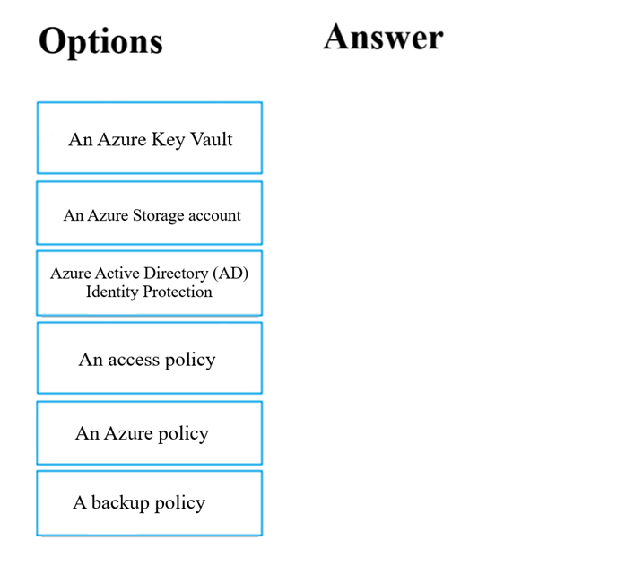

**Correct Answer:** 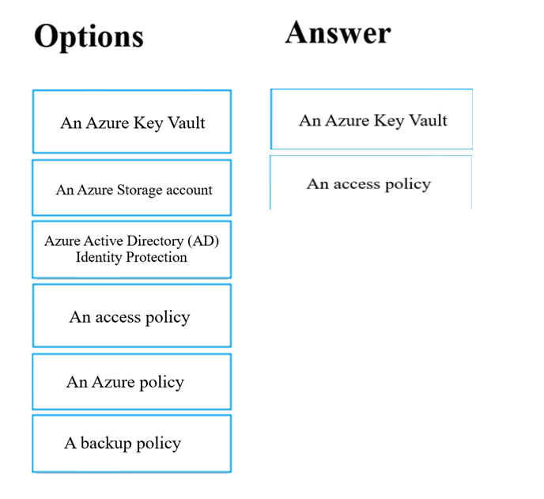

_Explanation:_
You can use a template that allows you to deploy a simple Windows VM by retrieving the password that is stored in a Key Vault. Therefore, the password is never put in plain text in the template parameter file.

---

### Question 21: Question #21 Topic 1

Your company has an Azure Active Directory (Azure AD) tenant that is configured for hybrid coexistence with the on-premises Active Directory domain.
The on-premise virtual environment consists of virtual machines (VMs) running on Windows Server 2012 R2 Hyper-V host servers.
You have created some PowerShell scripts to automate the configuration of newly created VMs. You plan to create several new VMs.
You need a solution that ensures the scripts are run on the new VMs.
Which of the following is the best solution?

- A. Configure a SetupComplete.cmd batch file in the %windir%\setup\scripts directory.
- B. Configure a Group Policy Object (GPO) to run the scripts as logon scripts.
- C. Configure a Group Policy Object (GPO) to run the scripts as startup scripts.
- D. Place the scripts in a new virtual hard disk (VHD).

**Correct Answer:** A

---

### Question 22: Question #22 Topic 1

Your company has an Azure Active Directory (Azure AD) tenant that is configured for hybrid coexistence with the on-premises Active Directory domain.
You plan to deploy several new virtual machines (VMs) in Azure. The VMs will have the same operating system and custom software requirements.
You configure a reference VM in the on-premise virtual environment. You then generalize the VM to create an image.
You need to upload the image to Azure to ensure that it is available for selection when you create the new Azure VMs.
Which PowerShell cmdlets should you use?

- A. Add-AzVM
- B. Add-AzVhd
- C. Add-AzImage
- D. Add-AzImageDataDisk

**Correct Answer:** B

---

### Question 23: Question #23 Topic 1

DRAG DROP -
Your company has an Azure subscription that includes a number of Azure virtual machines (VMs), which are all part of the same virtual network.
Your company also has an on-premises Hyper-V server that hosts a VM, named VM1, which must be replicated to Azure.
Which of the following objects that must be created to achieve this goal? Answer by dragging the correct option from the list to the answer area.
Select and Place:
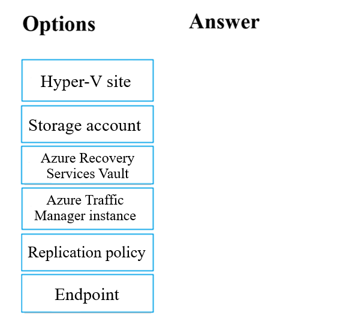

**Correct Answer:** 

---

### Question 24: Question #24 Topic 1

Note: The question is included in a number of questions that depicts the identical set-up. However, every question has a distinctive result. Establish if the solution satisfies the requirements.
Your company's Azure subscription includes two Azure networks named VirtualNetworkA and VirtualNetworkB.
VirtualNetworkA includes a VPN gateway that is configured to make use of static routing. Also, a site-to-site VPN connection exists between your company's on- premises network and VirtualNetworkA.
You have configured a point-to-site VPN connection to VirtualNetworkA from a workstation running Windows 10. After configuring virtual network peering between
VirtualNetworkA and VirtualNetworkB, you confirm that you are able to access VirtualNetworkB from the company's on-premises network. However, you find that you cannot establish a connection to VirtualNetworkB from the Windows 10 workstation.
You have to make sure that a connection to VirtualNetworkB can be established from the Windows 10 workstation.
Solution: You choose the Allow gateway transit setting on VirtualNetworkA.
Does the solution meet the goal?

- A. Yes
- B. No

**Correct Answer:** B

---

### Question 25: Question #25 Topic 1

Note: The question is included in a number of questions that depicts the identical set-up. However, every question has a distinctive result. Establish if the solution satisfies the requirements.
Your company's Azure subscription includes two Azure networks named VirtualNetworkA and VirtualNetworkB.
VirtualNetworkA includes a VPN gateway that is configured to make use of static routing. Also, a site-to-site VPN connection exists between your company's on- premises network and VirtualNetworkA.
You have configured a point-to-site VPN connection to VirtualNetworkA from a workstation running Windows 10. After configuring virtual network peering between
VirtualNetworkA and VirtualNetworkB, you confirm that you are able to access VirtualNetworkB from the company's on-premises network. However, you find that you cannot establish a connection to VirtualNetworkB from the Windows 10 workstation.
You have to make sure that a connection to VirtualNetworkB can be established from the Windows 10 workstation.
Solution: You choose the Allow gateway transit setting on VirtualNetworkB.
Does the solution meet the goal?

- A. Yes
- B. No

**Correct Answer:** B

---

### Question 26: Question #26 Topic 1

Note: The question is included in a number of questions that depicts the identical set-up. However, every question has a distinctive result. Establish if the solution satisfies the requirements.
Your company's Azure subscription includes two Azure networks named VirtualNetworkA and VirtualNetworkB.
VirtualNetworkA includes a VPN gateway that is configured to make use of static routing. Also, a site-to-site VPN connection exists between your company's on- premises network and VirtualNetworkA.
You have configured a point-to-site VPN connection to VirtualNetworkA from a workstation running Windows 10. After configuring virtual network peering between
VirtualNetworkA and VirtualNetworkB, you confirm that you are able to access VirtualNetworkB from the company's on-premises network. However, you find that you cannot establish a connection to VirtualNetworkB from the Windows 10 workstation.
You have to make sure that a connection to VirtualNetworkB can be established from the Windows 10 workstation.
Solution: You download and re-install the VPN client configuration package on the Windows 10 workstation.
Does the solution meet the goal?

- A. Yes
- B. No

**Correct Answer:** A

---

### Question 27: Question #27 Topic 1

Your company has virtual machines (VMs) hosted in Microsoft Azure. The VMs are located in a single Azure virtual network named VNet1.
The company has users that work remotely. The remote workers require access to the VMs on VNet1.
You need to provide access for the remote workers.
What should you do?

- A. Configure a Site-to-Site (S2S) VPN.
- B. Configure a VNet-toVNet VPN.
- C. Configure a Point-to-Site (P2S) VPN.
- D. Configure DirectAccess on a Windows Server 2012 server VM.
- E. Configure a Multi-Site VPN

**Correct Answer:** C

---

### Question 28: Question #28 Topic 1

Note: The question is included in a number of questions that depicts the identical set-up. However, every question has a distinctive result. Establish if the solution satisfies the requirements.
Your company has a Microsoft SQL Server Always On availability group configured on their Azure virtual machines (VMs).
You need to configure an Azure internal load balancer as a listener for the availability group.
Solution: You create an HTTP health probe on port 1433.
Does the solution meet the goal?

- A. Yes
- B. No

**Correct Answer:** B

---

### Question 29: Question #29 Topic 1

Note: The question is included in a number of questions that depicts the identical set-up. However, every question has a distinctive result. Establish if the solution satisfies the requirements.
Your company has a Microsoft SQL Server Always On availability group configured on their Azure virtual machines (VMs).
You need to configure an Azure internal load balancer as a listener for the availability group.
Solution: You set Session persistence to Client IP.
Does the solution meet the goal?

- A. Yes
- B. No

**Correct Answer:** B

---

### Question 30: Question #30 Topic 1

Note: The question is included in a number of questions that depicts the identical set-up. However, every question has a distinctive result. Establish if the solution satisfies the requirements.
Your company has a Microsoft SQL Server Always On availability group configured on their Azure virtual machines (VMs).
You need to configure an Azure internal load balancer as a listener for the availability group.
Solution: You enable Floating IP.
Does the solution meet the goal?

- A. Yes
- B. No

**Correct Answer:** A

---

### Question 31: Question #31 Topic 1

Your company has two on-premises servers named SRV01 and SRV02. Developers have created an application that runs on SRV01. The application calls a service on SRV02 by IP address.
You plan to migrate the application on Azure virtual machines (VMs). You have configured two VMs on a single subnet in an Azure virtual network.
You need to configure the two VMs with static internal IP addresses.
What should you do?

- A. Run the New-AzureRMVMConfig PowerShell cmdlet.
- B. Run the Set-AzureSubnet PowerShell cmdlet.
- C. Modify the VM properties in the Azure Management Portal.
- D. Modify the IP properties in Windows Network and Sharing Center.
- E. Run the Set-AzureStaticVNetIP PowerShell cmdlet.

**Correct Answer:** C

---

### Question 32: Question #32 Topic 1

Your company has an Azure Active Directory (Azure AD) subscription.
You need to deploy five virtual machines (VMs) to your company's virtual network subnet.
The VMs will each have both a public and private IP address. Inbound and outbound security rules for all of these virtual machines must be identical.
Which of the following is the least amount of network interfaces needed for this configuration?

- A. 5
- B. 10
- C. 20
- D. 40

**Correct Answer:** A

---

### Question 33: Question #33 Topic 1

Your company has an Azure Active Directory (Azure AD) subscription.
You need to deploy five virtual machines (VMs) to your company's virtual network subnet.
The VMs will each have both a public and private IP address. Inbound and outbound security rules for all of these virtual machines must be identical.
Which of the following is the least amount of security groups needed for this configuration?

- A. 4
- B. 3
- C. 2
- D. 1

**Correct Answer:** D

---

### Question 34: Question #34 Topic 1

Your company's Azure subscription includes Azure virtual machines (VMs) that run Windows Server 2016.
One of the VMs is backed up every day using Azure Backup Instant Restore.
When the VM becomes infected with data encrypting ransomware, you decide to recover the VM's files.
Which of the following is TRUE in this scenario?

- A. You can only recover the files to the infected VM.
- B. You can recover the files to any VM within the company's subscription.
- C. You can only recover the files to a new VM.
- D. You will not be able to recover the files.

**Correct Answer:** B

---

### Question 35: Question #35 Topic 1

Your company's Azure subscription includes Azure virtual machines (VMs) that run Windows Server 2016.
One of the VMs is backed up every day using Azure Backup Instant Restore.
When the VM becomes infected with data encrypting ransomware, you are required to restore the VM.
Which of the following actions should you take?

- A. You should restore the VM after deleting the infected VM.
- B. You should restore the VM to any VM within the company's subscription.
- C. You should restore the VM to a new Azure VM.
- D. You should restore the VM to an on-premise Windows device.

**Correct Answer:** C

---

### Question 36: Question #36 Topic 1

You administer a solution in Azure that is currently having performance issues.
You need to find the cause of the performance issues pertaining to metrics on the Azure infrastructure.
Which of the following is the tool you should use?

- A. Azure Traffic Analytics
- B. Azure Monitor
- C. Azure Activity Log
- D. Azure Advisor

**Correct Answer:** B

---

### Question 37: Question #37 Topic 1

Your company has an Azure subscription that includes a Recovery Services vault.
You want to use Azure Backup to schedule a backup of your company's virtual machines (VMs) to the Recovery Services vault.
Which of the following VMs can you back up? Choose all that apply.

- A. VMs that run Windows 10.
- B. VMs that run Windows Server 2012 or higher.
- C. VMs that have NOT been shut down.
- D. VMs that run Debian 8.2+.
- E. VMs that have been shut down.

**Correct Answer:** ABCDE

---

### Question 38: Question #38 Topic 1

Note: This question is part of a series of questions that present the same scenario. Each question in the series contains a unique solution that might meet the stated goals. Some question sets might have more than one correct solution, while others might not have a correct solution.
After you answer a question in this section, you will NOT be able to return to it. As a result, these questions will not appear in the review screen.
You have an Azure Active Directory (Azure AD) tenant named contoso.com.
You have a CSV file that contains the names and email addresses of 500 external users.
You need to create a guest user account in contoso.com for each of the 500 external users.
Solution: You create a PowerShell script that runs the New-AzureADUser cmdlet for each user.
Does this meet the goal?

- A. Yes
- B. No

**Correct Answer:** B

---

### Question 39: Question #39 Topic 1

Note: This question is part of a series of questions that present the same scenario. Each question in the series contains a unique solution that might meet the stated goals. Some question sets might have more than one correct solution, while others might not have a correct solution.
After you answer a question in this section, you will NOT be able to return to it. As a result, these questions will not appear in the review screen.
You have an Azure Active Directory (Azure AD) tenant named contoso.com.
You have a CSV file that contains the names and email addresses of 500 external users.
You need to create a guest user account in contoso.com for each of the 500 external users.
Solution: From Azure AD in the Azure portal, you use the Bulk create user operation.
Does this meet the goal?

- A. Yes
- B. No

**Correct Answer:** B

---

### Question 40: Question #40 Topic 1

Note: This question is part of a series of questions that present the same scenario. Each question in the series contains a unique solution that might meet the stated goals. Some question sets might have more than one correct solution, while others might not have a correct solution.
After you answer a question in this section, you will NOT be able to return to it. As a result, these questions will not appear in the review screen.
You have an Azure Active Directory (Azure AD) tenant named contoso.com.
You have a CSV file that contains the names and email addresses of 500 external users.
You need to create a guest user account in contoso.com for each of the 500 external users.
Solution: You create a PowerShell script that runs the New-AzureADMSInvitation cmdlet for each external user.
Does this meet the goal?

- A. Yes
- B. No

**Correct Answer:** A

---

### Question 41: Question #1 Topic 2

HOTSPOT -
You have an Azure subscription named Subscription1 that contains a resource group named RG1.
In RG1, you create an internal load balancer named LB1 and a public load balancer named LB2.
You need to ensure that an administrator named Admin1 can manage LB1 and LB2. The solution must follow the principle of least privilege.
Which role should you assign to Admin1 for each task? To answer, select the appropriate options in the answer area.
NOTE: Each correct selection is worth one point.
Hot Area:

**Correct Answer:** 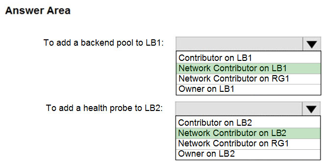

_Explanation:_
The Network Contributor role lets you manage networks, but not access them.
Reference:
https://docs.microsoft.com/en-us/azure/role-based-access-control/built-in-roles

---

### Question 42: Question #2 Topic 2

You have an Azure subscription that contains an Azure Active Directory (Azure AD) tenant named contoso.com and an Azure Kubernetes Service (AKS) cluster named AKS1.
An administrator reports that she is unable to grant access to AKS1 to the users in contoso.com.
You need to ensure that access to AKS1 can be granted to the contoso.com users.
What should you do first?

- A. From contoso.com, modify the Organization relationships settings.
- B. From contoso.com, create an OAuth 2.0 authorization endpoint.
- C. Recreate AKS1.
- D. From AKS1, create a namespace.

**Correct Answer:** B

---

### Question 43: Question #3 Topic 2

You have a Microsoft 365 tenant and an Azure Active Directory (Azure AD) tenant named contoso.com.
You plan to grant three users named User1, User2, and User3 access to a temporary Microsoft SharePoint document library named Library1.
You need to create groups for the users. The solution must ensure that the groups are deleted automatically after 180 days.
Which two groups should you create? Each correct answer presents a complete solution.
NOTE: Each correct selection is worth one point.

- A. a Microsoft 365 group that uses the Assigned membership type
- B. a Security group that uses the Assigned membership type
- C. a Microsoft 365 group that uses the Dynamic User membership type
- D. a Security group that uses the Dynamic User membership type
- E. a Security group that uses the Dynamic Device membership type

**Correct Answer:** AC

---

### Question 44: Question #4 Topic 2

HOTSPOT -
You have an Azure Active Directory (Azure AD) tenant named contoso.com that contains the users shown in the following table:
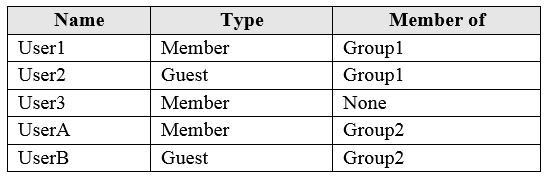
User3 is the owner of Group1.
Group2 is a member of Group1.
You configure an access review named Review1 as shown in the following exhibit:
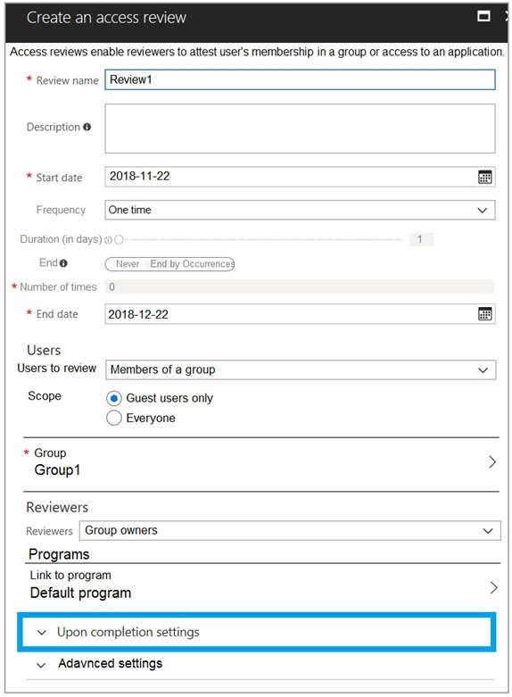
For each of the following statements, select Yes if the statement is true. Otherwise, select No.
NOTE: Each correct selection is worth one point.
Hot Area:
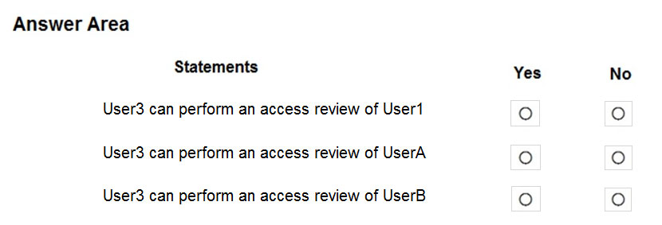

**Correct Answer:** 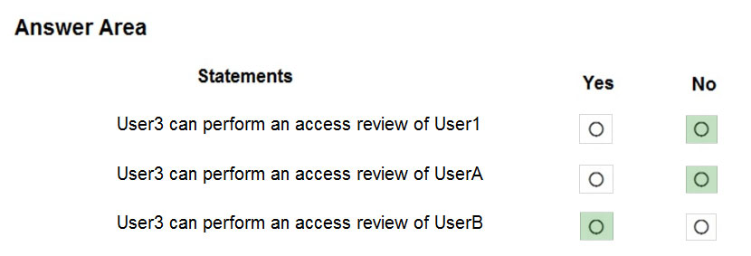

_Explanation:_
Reference:
https://docs.microsoft.com/en-us/azure/active-directory/governance/create-access-review

---

### Question 45: Question #5 Topic 2

HOTSPOT -
You have the Azure management groups shown in the following table:

You add Azure subscriptions to the management groups as shown in the following table:

You create the Azure policies shown in the following table:
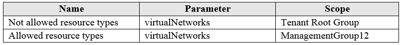
For each of the following statements, select Yes if the statement is true. Otherwise, select No.
NOTE: Each correct selection is worth one point.
Hot Area:
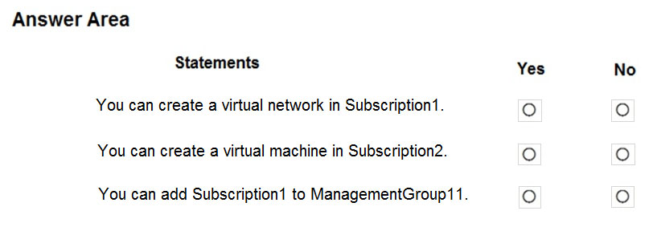

**Correct Answer:** 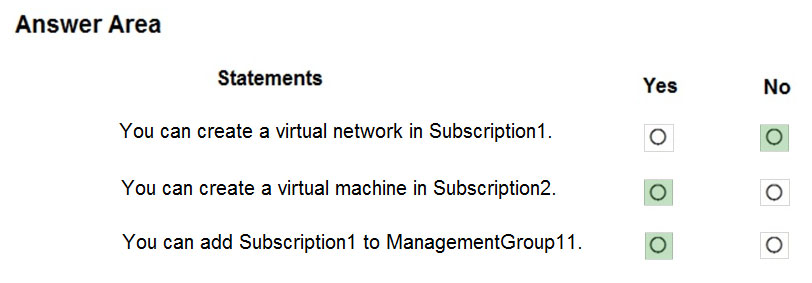

_Explanation:_
Box 1: No -
Virtual networks are not allowed at the root and is inherited. Deny overrides allowed.
Box 2: Yes -
Virtual Machines can be created on a Management Group provided the user has the required RBAC permissions.
Box 3: Yes -
Subscriptions can be moved between Management Groups provided the user has the required RBAC permissions.
Reference:
https://docs.microsoft.com/en-us/azure/governance/management-groups/overview https://docs.microsoft.com/en-us/azure/governance/management-groups/manage#moving-management-groups-and-subscriptions

---

### Question 46: Question #6 Topic 2

You have an Azure policy as shown in the following exhibit:
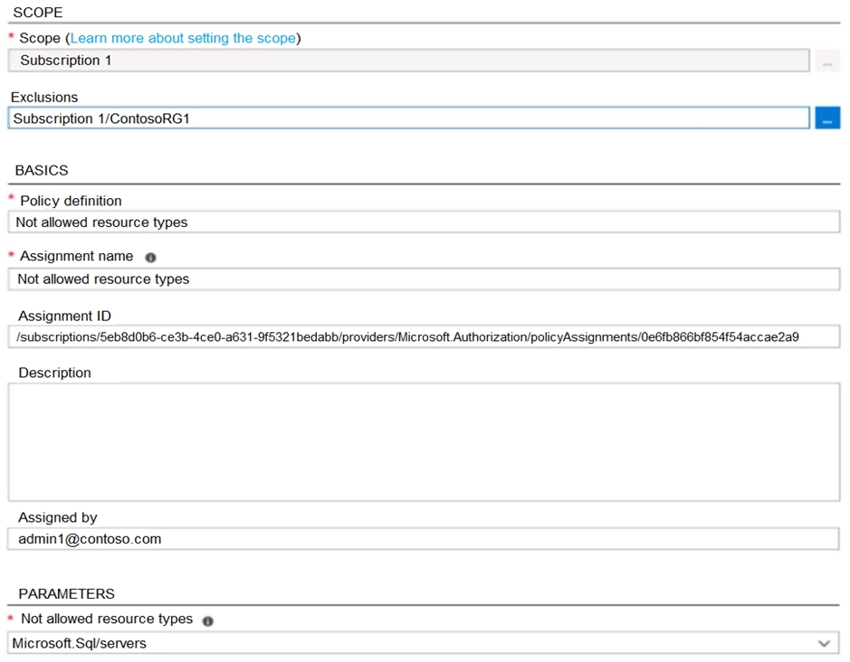
What is the effect of the policy?

- A. You are prevented from creating Azure SQL servers anywhere in Subscription 1.
- B. You can create Azure SQL servers in ContosoRG1 only.
- C. You are prevented from creating Azure SQL Servers in ContosoRG1 only.
- D. You can create Azure SQL servers in any resource group within Subscription 1.

**Correct Answer:** B

---

### Question 47: Question #7 Topic 2

HOTSPOT -
You have an Azure subscription that contains the resources shown in the following table:

You assign a policy to RG6 as shown in the following table:
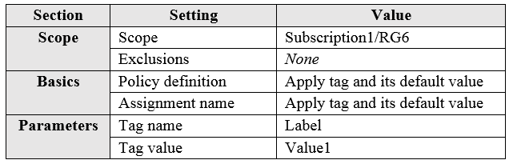
To RG6, you apply the tag: RGroup: RG6.
You deploy a virtual network named VNET2 to RG6.
Which tags apply to VNET1 and VNET2? To answer, select the appropriate options in the answer area.
NOTE: Each correct selection is worth one point.
Hot Area:
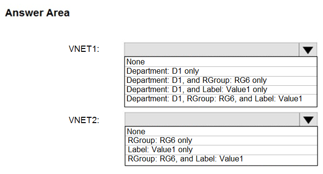

**Correct Answer:** 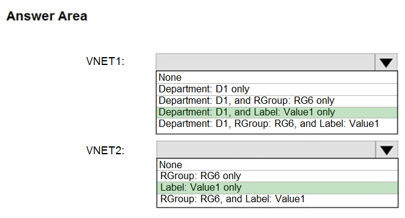

_Explanation:_
VNET1: Department: D1, and Label:Value1 only.
Tags applied to the resource group or subscription are not inherited by the resources.
Note: Azure Policy allows you to use either built-in or custom-defined policy definitions and assign them to either a specific resource group or across a whole
Azure subscription.
VNET2: Label:Value1 only.
Incorrect Answers:
RGROUP: RG6 -
Tags applied to the resource group or subscription are not inherited by the resources.
Reference:
https://docs.microsoft.com/en-us/azure/azure-resource-manager/management/tag-policies

---

### Question 48: Question #8 Topic 2

You have an Azure subscription named AZPT1 that contains the resources shown in the following table:
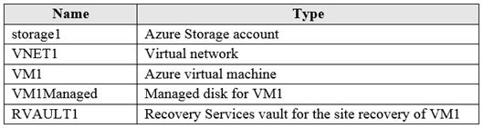
You create a new Azure subscription named AZPT2.
You need to identify which resources can be moved to AZPT2.
Which resources should you identify?

- A. VM1, storage1, VNET1, and VM1Managed only
- B. VM1 and VM1Managed only
- C. VM1, storage1, VNET1, VM1Managed, and RVAULT1
- D. RVAULT1 only

**Correct Answer:** C

---

### Question 49: Question #9 Topic 2

You recently created a new Azure subscription that contains a user named Admin1.
Admin1 attempts to deploy an Azure Marketplace resource by using an Azure Resource Manager template. Admin1 deploys the template by using Azure
PowerShell and receives the following error message: `User failed validation to purchase resources. Error message: `Legal terms have not been accepted for this item on this subscription. To accept legal terms, please go to the Azure portal (http://go.microsoft.com/fwlink/?LinkId=534873) and configure programmatic deployment for the Marketplace item or create it there for the first time.`
You need to ensure that Admin1 can deploy the Marketplace resource successfully.
What should you do?

- A. From Azure PowerShell, run the Set-AzApiManagementSubscription cmdlet
- B. From the Azure portal, register the Microsoft.Marketplace resource provider
- C. From Azure PowerShell, run the Set-AzMarketplaceTerms cmdlet
- D. From the Azure portal, assign the Billing administrator role to Admin1

**Correct Answer:** C

---

### Question 50: Question #10 Topic 2

You have an Azure Active Directory (Azure AD) tenant that contains 5,000 user accounts.
You create a new user account named AdminUser1.
You need to assign the User administrator administrative role to AdminUser1.
What should you do from the user account properties?

- A. From the Licenses blade, assign a new license
- B. From the Directory role blade, modify the directory role
- C. From the Groups blade, invite the user account to a new group

**Correct Answer:** B

---

### Question 51: Question #11 Topic 2

You have an Azure Active Directory (Azure AD) tenant named contoso.onmicrosoft.com that contains 100 user accounts.
You purchase 10 Azure AD Premium P2 licenses for the tenant.
You need to ensure that 10 users can use all the Azure AD Premium features.
What should you do?

- A. From the Licenses blade of Azure AD, assign a license
- B. From the Groups blade of each user, invite the users to a group
- C. From the Azure AD domain, add an enterprise application
- D. From the Directory role blade of each user, modify the directory role

**Correct Answer:** A

---

### Question 52: Question #12 Topic 2

You have an Azure subscription named Subscription1 and an on-premises deployment of Microsoft System Center Service Manager.
Subscription1 contains a virtual machine named VM1.
You need to ensure that an alert is set in Service Manager when the amount of available memory on VM1 is below 10 percent.
What should you do first?

- A. Create an automation runbook
- B. Deploy a function app
- C. Deploy the IT Service Management Connector (ITSM)
- D. Create a notification

**Correct Answer:** C

---

### Question 53: Question #13 Topic 2

You sign up for Azure Active Directory (Azure AD) Premium P2.
You need to add a user named admin1@contoso.com as an administrator on all the computers that will be joined to the Azure AD domain.
What should you configure in Azure AD?

- A. Device settings from the Devices blade
- B. Providers from the MFA Server blade
- C. User settings from the Users blade
- D. General settings from the Groups blade

**Correct Answer:** A

---

### Question 54: Question #14 Topic 2

HOTSPOT -
You have Azure Active Directory tenant named Contoso.com that includes following users:
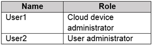
Contoso.com includes following Windows 10 devices:
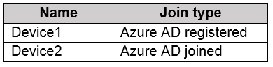
You create following security groups in Contoso.com:

For each of the following statements, select Yes if the statement is true. Otherwise, select No.
NOTE: Each correct selection is worth one point.
Hot Area:
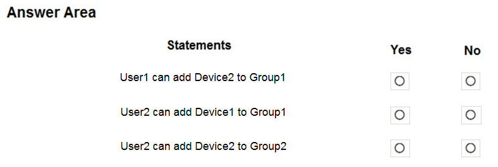

**Correct Answer:** 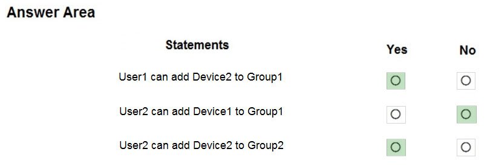

_Explanation:_
Box 1: Yes -
User1 is a Cloud Device Administrator.
Device2 is Azure AD joined.
Group1 has the assigned to join type. User1 is the owner of Group1.
Note: Assigned groups - Manually add users or devices into a static group.
Azure AD joined or hybrid Azure AD joined devices utilize an organizational account in Azure AD
Box 2: No -
User2 is a User Administrator.
Device1 is Azure AD registered.
Group1 has the assigned join type, and the owner is User1.
Note: Azure AD registered devices utilize an account managed by the end user, this account is either a Microsoft account or another locally managed credential.
Box 3: Yes -
User2 is a User Administrator.
Device2 is Azure AD joined.
Group2 has the Dynamic Device join type, and the owner is User2.
Reference:
https://docs.microsoft.com/en-us/azure/active-directory/devices/overview

---

### Question 55: Question #15 Topic 2

You have an Azure subscription that contains a resource group named RG26.
RG26 is set to the West Europe location and is used to create temporary resources for a project. RG26 contains the resources shown in the following table.
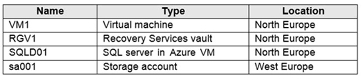
SQLDB01 is backed up to RGV1.
When the project is complete, you attempt to delete RG26 from the Azure portal. The deletion fails.
You need to delete RG26.
What should you do first?

- A. Delete VM1
- B. Stop VM1
- C. Stop the backup of SQLDB01
- D. Delete sa001

**Correct Answer:** C

---

### Question 56: Question #16 Topic 2

You have an Azure subscription named Subscription1 that contains a virtual network named VNet1. VNet1 is in a resource group named RG1.
Subscription1 has a user named User1. User1 has the following roles:
✑ Reader
✑ Security Admin
✑ Security Reader
You need to ensure that User1 can assign the Reader role for VNet1 to other users.
What should you do?

- A. Remove User1 from the Security Reader and Reader roles for Subscription1.
- B. Assign User1 the User Access Administrator role for VNet1.
- C. Assign User1 the Network Contributor role for VNet1.
- D. Assign User1 the Network Contributor role for RG1.

**Correct Answer:** B

---

### Question 57: Question #17 Topic 2

You have an Azure Active Directory (Azure AD) tenant named contosocloud.onmicrosoft.com.
Your company has a public DNS zone for contoso.com.
You add contoso.com as a custom domain name to Azure AD.
You need to ensure that Azure can verify the domain name.
Which type of DNS record should you create?

- A. MX
- B. NSEC
- C. PTR
- D. RRSIG

**Correct Answer:** A

---

### Question 58: Question #18 Topic 2

Note: This question is part of a series of questions that present the same scenario. Each question in the series contains a unique solution that might meet the stated goals. Some question sets might have more than one correct solution, while others might not have a correct solution.
After you answer a question in this section, you will NOT be able to return to it. As a result, these questions will not appear in the review screen.
You have an Azure Directory (Azure AD) tenant named Adatum and an Azure Subscription named Subscription1. Adatum contains a group named Developers.
Subscription1 contains a resource group named Dev.
You need to provide the Developers group with the ability to create Azure logic apps in the Dev resource group.
Solution: On Subscription1, you assign the DevTest Labs User role to the Developers group.
Does this meet the goal?

- A. Yes
- B. No

**Correct Answer:** B

---

### Question 59: Question #19 Topic 2

Note: This question is part of a series of questions that present the same scenario. Each question in the series contains a unique solution that might meet the stated goals. Some question sets might have more than one correct solution, while others might not have a correct solution.
After you answer a question in this section, you will NOT be able to return to it. As a result, these questions will not appear in the review screen.
You have an Azure Directory (Azure AD) tenant named Adatum and an Azure Subscription named Subscription1. Adatum contains a group named Developers.
Subscription1 contains a resource group named Dev.
You need to provide the Developers group with the ability to create Azure logic apps in the Dev resource group.
Solution: On Subscription1, you assign the Logic App Operator role to the Developers group.
Does this meet the goal?

- A. Yes
- B. No

**Correct Answer:** B

---

### Question 60: Question #20 Topic 2

Note: This question is part of a series of questions that present the same scenario. Each question in the series contains a unique solution that might meet the stated goals. Some question sets might have more than one correct solution, while others might not have a correct solution.
After you answer a question in this section, you will NOT be able to return to it. As a result, these questions will not appear in the review screen.
You have an Azure Directory (Azure AD) tenant named Adatum and an Azure Subscription named Subscription1. Adatum contains a group named Developers.
Subscription1 contains a resource group named Dev.
You need to provide the Developers group with the ability to create Azure logic apps in the Dev resource group.
Solution: On Dev, you assign the Contributor role to the Developers group.
Does this meet the goal?

- A. Yes
- B. No

**Correct Answer:** A

---

### Question 61: Question #21 Topic 2

DRAG DROP -
You have an Azure subscription that is used by four departments in your company. The subscription contains 10 resource groups. Each department uses resources in several resource groups.
You need to send a report to the finance department. The report must detail the costs for each department.
Which three actions should you perform in sequence? To answer, move the appropriate actions from the list of actions to the answer area and arrange them in the correct order.
Select and Place:
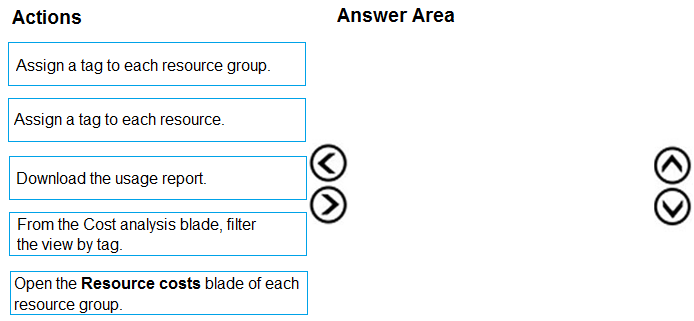

**Correct Answer:** 

_Explanation:_
Box 1: Assign a tag to each resource.
You apply tags to your Azure resources giving metadata to logically organize them into a taxonomy. After you apply tags, you can retrieve all the resources in your subscription with that tag name and value. Each resource or resource group can have a maximum of 15 tag name/value pairs. Tags applied to the resource group are not inherited by the resources in that resource group.
Box 2: From the Cost analysis blade, filter the view by tag
After you get your services running, regularly check how much they're costing you. You can see the current spend and burn rate in Azure portal.
1. Visit the Subscriptions blade in Azure portal and select a subscription.
You should see the cost breakdown and burn rate in the popup blade.
2. Click Cost analysis in the list to the left to see the cost breakdown by resource. Wait 24 hours after you add a service for the data to populate.
3. You can filter by different properties like tags, resource group, and timespan. Click Apply to confirm the filters and Download if you want to export the view to a
Comma-Separated Values (.csv) file.
Box 3: Download the usage report
Reference:
https://docs.microsoft.com/en-us/azure/azure-resource-manager/resource-group-using-tags https://docs.microsoft.com/en-us/azure/billing/billing-getting-started

---

### Question 62: Question #22 Topic 2

You have an Azure subscription named Subscription1 that contains an Azure Log Analytics workspace named Workspace1.
You need to view the error events from a table named Event.
Which query should you run in Workspace1?

- A. Get-Event Event | where {$_.EventType == "error"}
- B. search in (Event) "error"
- C. select * from Event where EventType == "error"
- D. search in (Event) * | where EventType -eq "error"

**Correct Answer:** B

---

### Question 63: Question #23 Topic 2

HOTSPOT -
You have an Azure subscription that contains a virtual network named VNET1 in the East US 2 region. A network interface named VM1-NI is connected to
VNET1.
You successfully deploy the following Azure Resource Manager template.
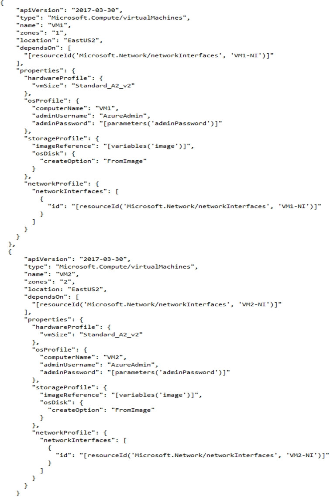
For each of the following statements, select Yes if the statement is true. Otherwise, select No.
NOTE: Each correct selection is worth one point.
Hot Area:
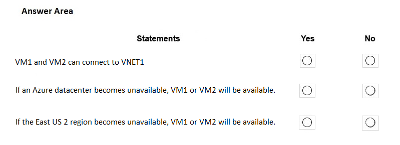

**Correct Answer:** 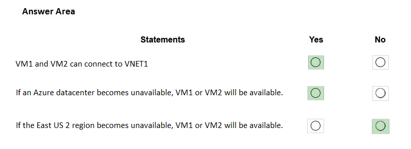

_Explanation:_
Box 1: Yes -
Box 2: Yes -
VM1 is in Zone1, while VM2 is on Zone2.
Box 3: No -
Reference:
https://docs.microsoft.com/en-us/azure/architecture/resiliency/recovery-loss-azure-region

---

### Question 64: Question #24 Topic 2

You have an Azure subscription named Subscription1. Subscription1 contains the resource groups in the following table.
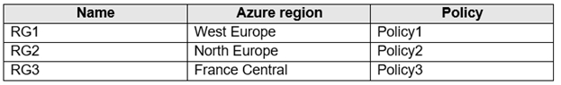
RG1 has a web app named WebApp1. WebApp1 is located in West Europe.
You move WebApp1 to RG2.
What is the effect of the move?

- A. The App Service plan for WebApp1 remains in West Europe. Policy2 applies to WebApp1.
- B. The App Service plan for WebApp1 moves to North Europe. Policy2 applies to WebApp1.
- C. The App Service plan for WebApp1 remains in West Europe. Policy1 applies to WebApp1.
- D. The App Service plan for WebApp1 moves to North Europe. Policy1 applies to WebApp1.

**Correct Answer:** A

---

### Question 65: Question #25 Topic 2

HOTSPOT -
You have an Azure subscription named Subscription1 that has a subscription ID of c276fc76-9cd4-44c9-99a7-4fd71546436e.
You need to create a custom RBAC role named CR1 that meets the following requirements:
✑ Can be assigned only to the resource groups in Subscription1
✑ Prevents the management of the access permissions for the resource groups
✑ Allows the viewing, creating, modifying, and deleting of resources within the resource groups
What should you specify in the assignable scopes and the permission elements of the definition of CR1? To answer, select the appropriate options in the answer area.
NOTE: Each correct selection is worth one point.
Hot Area:
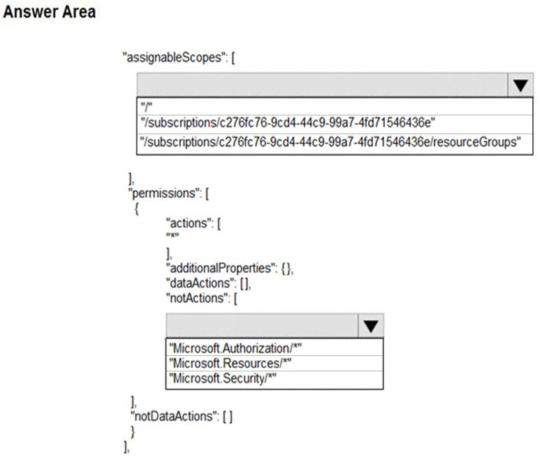

**Correct Answer:** 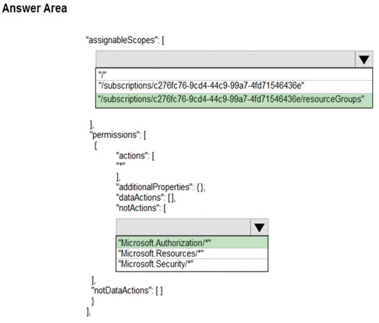

_Explanation:_
Reference:
https://docs.microsoft.com/en-us/azure/role-based-access-control/custom-roles https://docs.microsoft.com/en-us/azure/role-based-access-control/resource-provider-operations#microsoftresources

---

### Question 66: Question #26 Topic 2

You have an Azure subscription.
Users access the resources in the subscription from either home or from customer sites. From home, users must establish a point-to-site VPN to access the Azure resources. The users on the customer sites access the Azure resources by using site-to-site VPNs.
You have a line-of-business-app named App1 that runs on several Azure virtual machine. The virtual machines run Windows Server 2016.
You need to ensure that the connections to App1 are spread across all the virtual machines.
What are two possible Azure services that you can use? Each correct answer presents a complete solution.
NOTE: Each correct selection is worth one point.

- A. an internal load balancer
- B. a public load balancer
- C. an Azure Content Delivery Network (CDN)
- D. Traffic Manager
- E. an Azure Application Gateway

**Correct Answer:** AE

---

### Question 67: Question #27 Topic 2

You have an Azure subscription.
You have 100 Azure virtual machines.
You need to quickly identify underutilized virtual machines that can have their service tier changed to a less expensive offering.
Which blade should you use?

- A. Monitor
- B. Advisor
- C. Metrics
- D. Customer insights

**Correct Answer:** B

---

### Question 68: Question #28 Topic 2

HOTSPOT -
You have an Azure Active Directory (Azure AD) tenant.
You need to create a conditional access policy that requires all users to use multi-factor authentication when they access the Azure portal.
Which three settings should you configure? To answer, select the appropriate settings in the answer area.
NOTE: Each correct selection is worth one point.
Hot Area:

**Correct Answer:** 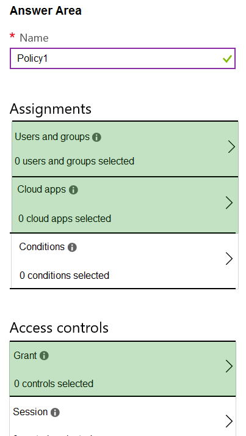

_Explanation:_
Reference:
https://docs.microsoft.com/en-us/azure/active-directory/conditional-access/app-based-mfa

---

### Question 69: Question #29 Topic 2

You have an Azure Active Directory (Azure AD) tenant named contoso.onmicrosoft.com.
The User administrator role is assigned to a user named Admin1.
An external partner has a Microsoft account that uses the user1@outlook.com sign in.
Admin1 attempts to invite the external partner to sign in to the Azure AD tenant and receives the following error message: `Unable to invite user user1@outlook.com `" Generic authorization exception.`
You need to ensure that Admin1 can invite the external partner to sign in to the Azure AD tenant.
What should you do?

- A. From the Users settings blade, modify the External collaboration settings.
- B. From the Custom domain names blade, add a custom domain.
- C. From the Organizational relationships blade, add an identity provider.
- D. From the Roles and administrators blade, assign the Security administrator role to Admin1.

**Correct Answer:** A

---

### Question 70: Question #30 Topic 2

You have an Azure subscription linked to an Azure Active Directory tenant. The tenant includes a user account named User1.
You need to ensure that User1 can assign a policy to the tenant root management group.
What should you do?

- A. Assign the Owner role for the Azure Subscription to User1, and then modify the default conditional access policies.
- B. Assign the Owner role for the Azure subscription to User1, and then instruct User1 to configure access management for Azure resources.
- C. Assign the Global administrator role to User1, and then instruct User1 to configure access management for Azure resources.
- D. Create a new management group and delegate User1 as the owner of the new management group.

**Correct Answer:** C

---

### Question 71: Question #31 Topic 2

HOTSPOT -
You have an Azure Active Directory (Azure AD) tenant named adatum.com. Adatum.com contains the groups in the following table.
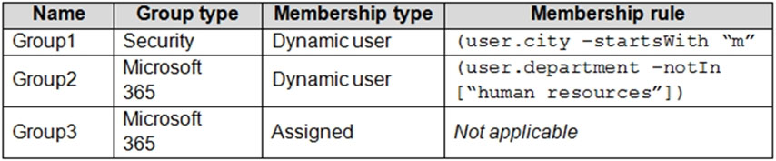
You create two user accounts that are configured as shown in the following table.
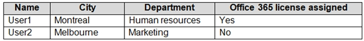
Of which groups are User1 and User2 members? To answer, select the appropriate options in the answer area.
NOTE: Each correct selection is worth one point.
Hot Area:

**Correct Answer:** 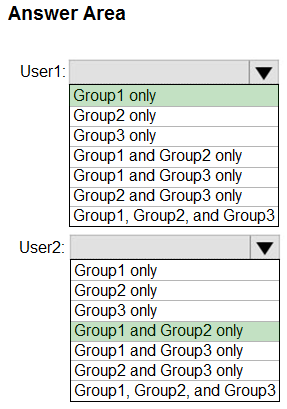

_Explanation:_
Box 1: Group 1 only -
First rule applies -
Box 2: Group1 and Group2 only -
Both membership rules apply.
Reference:
https://docs.microsoft.com/en-us/sccm/core/clients/manage/collections/create-collections

---

### Question 72: Question #32 Topic 2

HOTSPOT -
You have a hybrid deployment of Azure Active Directory (Azure AD) that contains the users shown in the following table.
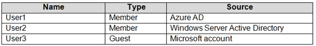
You need to modify the JobTitle and UsageLocation attributes for the users.
For which users can you modify the attributes from Azure AD? To answer, select the appropriate options in the answer area.
NOTE: Each correct selection is worth one point.
Hot Area:
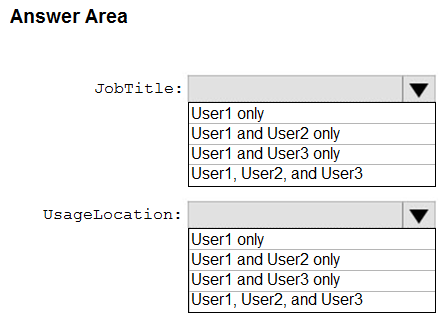

**Correct Answer:** 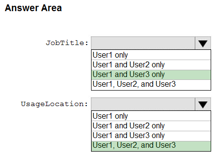

_Explanation:_
Box 1: User1 and User3 only -
You must use Windows Server Active Directory to update the identity, contact info, or job info for users whose source of authority is Windows Server Active
Directory.
Box 2: User1, User2, and User3 -
Reference:
https://docs.microsoft.com/en-us/azure/active-directory/fundamentals/active-directory-users-profile-azure-portal

---

### Question 73: Question #33 Topic 2

Note: This question is part of a series of questions that present the same scenario. Each question in the series contains a unique solution that might meet the stated goals. Some question sets might have more than one correct solution, while others might not have a correct solution.
After you answer a question in this section, you will NOT be able to return to it. As a result, these questions will not appear in the review screen.
You need to ensure that an Azure Active Directory (Azure AD) user named Admin1 is assigned the required role to enable Traffic Analytics for an Azure subscription.
Solution: You assign the Network Contributor role at the subscription level to Admin1.
Does this meet the goal?

- A. Yes
- B. No

**Correct Answer:** A

---

### Question 74: Question #34 Topic 2

Note: This question is part of a series of questions that present the same scenario. Each question in the series contains a unique solution that might meet the stated goals. Some question sets might have more than one correct solution, while others might not have a correct solution.
After you answer a question in this section, you will NOT be able to return to it. As a result, these questions will not appear in the review screen.
You need to ensure that an Azure Active Directory (Azure AD) user named Admin1 is assigned the required role to enable Traffic Analytics for an Azure subscription.
Solution: You assign the Owner role at the subscription level to Admin1.
Does this meet the goal?

- A. Yes
- B. No

**Correct Answer:** A

---

### Question 75: Question #35 Topic 2

Note: This question is part of a series of questions that present the same scenario. Each question in the series contains a unique solution that might meet the stated goals. Some question sets might have more than one correct solution, while others might not have a correct solution.
After you answer a question in this section, you will NOT be able to return to it. As a result, these questions will not appear in the review screen.
You need to ensure that an Azure Active Directory (Azure AD) user named Admin1 is assigned the required role to enable Traffic Analytics for an Azure subscription.
Solution: You assign the Reader role at the subscription level to Admin1.
Does this meet the goal?

- A. Yes
- B. No

**Correct Answer:** B

---

### Question 76: Question #36 Topic 2

You have an Azure subscription that contains a user named User1.
You need to ensure that User1 can deploy virtual machines and manage virtual networks. The solution must use the principle of least privilege.
Which role-based access control (RBAC) role should you assign to User1?

- A. Owner
- B. Virtual Machine Contributor
- C. Contributor
- D. Virtual Machine Administrator Login

**Correct Answer:** C

---

### Question 77: Question #37 Topic 2

HOTSPOT -
You have an Azure Active Directory (Azure AD) tenant that contains three global administrators named Admin1, Admin2, and Admin3.
The tenant is associated to an Azure subscription. Access control for the subscription is configured as shown in the Access control exhibit. (Click the Access
Control tab.)
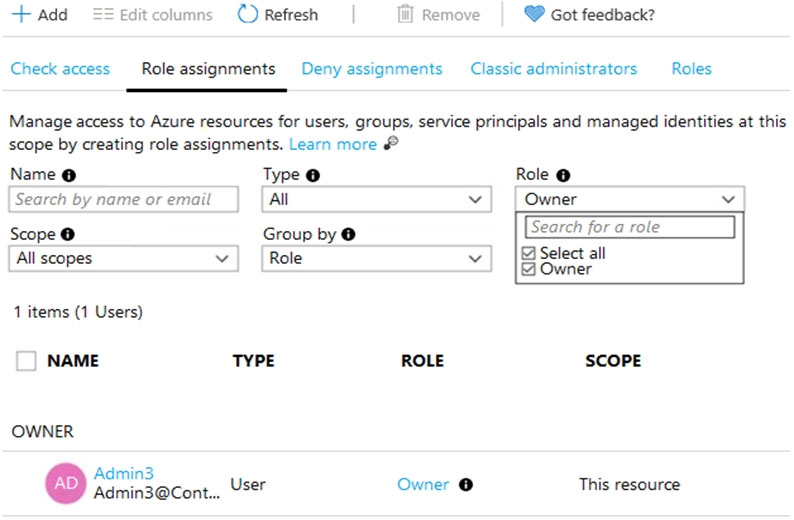
You sign in to the Azure portal as Admin1 and configure the tenant as shown in the Tenant exhibit. (Click the Tenant tab.)

For each of the following statements, select Yes if the statement is true. Otherwise, select No.
NOTE: Each correct selection is worth one point.
Hot Area:
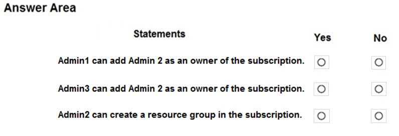

**Correct Answer:** 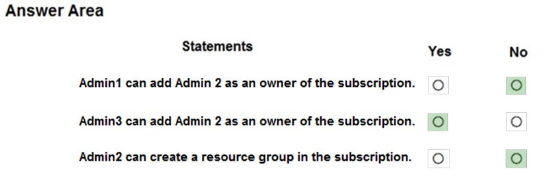

_Explanation:_
Box 1: No -
Only Admin3, the owner, can assign ownership.
Box 2: Yes -
Box 3: No -
Reference:
https://docs.microsoft.com/en-us/azure/cost-management-billing/manage/add-change-subscription-administrator

---

### Question 78: Question #38 Topic 2

You have an Azure subscription named Subscription1 that contains an Azure virtual machine named VM1. VM1 is in a resource group named RG1.
VM1 runs services that will be used to deploy resources to RG1.
You need to ensure that a service running on VM1 can manage the resources in RG1 by using the identity of VM1.
What should you do first?

- A. From the Azure portal, modify the Managed Identity settings of VM1
- B. From the Azure portal, modify the Access control (IAM) settings of RG1
- C. From the Azure portal, modify the Access control (IAM) settings of VM1
- D. From the Azure portal, modify the Policies settings of RG1

**Correct Answer:** A

---

### Question 79: Question #39 Topic 2

You have an Azure subscription that contains a resource group named TestRG.
You use TestRG to validate an Azure deployment.
TestRG contains the following resources:
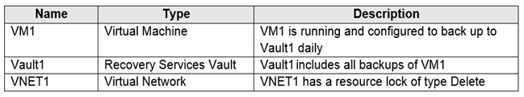
You need to delete TestRG.
What should you do first?

- A. Modify the backup configurations of VM1 and modify the resource lock type of VNET1
- B. Remove the resource lock from VNET1 and delete all data in Vault1
- C. Turn off VM1 and remove the resource lock from VNET1
- D. Turn off VM1 and delete all data in Vault1

**Correct Answer:** B

---

### Question 80: Question #40 Topic 2

You have an Azure DNS zone named adatum.com.
You need to delegate a subdomain named research.adatum.com to a different DNS server in Azure.
What should you do?

- A. Create an NS record named research in the adatum.com zone.
- B. Create a PTR record named research in the adatum.com zone.
- C. Modify the SOA record of adatum.com.
- D. Create an A record named *.research in the adatum.com zone.

**Correct Answer:** A

---

### Question 81: Question #41 Topic 2

DRAG DROP -
You have an Azure Active Directory (Azure AD) tenant that has the contoso.onmicrosoft.com domain name.
You have a domain name of contoso.com registered at a third-party registrar.
You need to ensure that you can create Azure AD users that have names containing a suffix of @contoso.com.
Which three actions should you perform in sequence? To answer, move the appropriate actions from the list of actions to the answer area and arrange them in the correct order.
Select and Place:
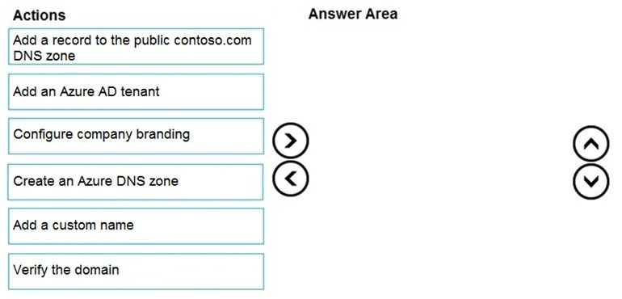

**Correct Answer:** 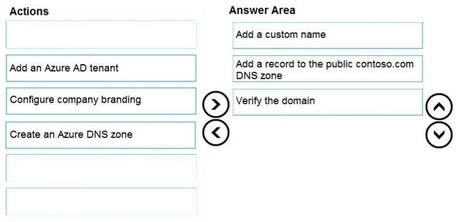

_Explanation:_
1. Add the custom domain name to your directory
2. Add a DNS entry for the domain name at the domain name registrar
3. Verify the custom domain name in Azure AD
Reference:
https://docs.microsoft.com/en-us/azure/dns/dns-web-sites-custom-domain

---

### Question 82: Question #42 Topic 2

You have an Azure subscription named Subscription1 that contains an Azure Log Analytics workspace named Workspace1.
You need to view the error events from a table named Event.
Which query should you run in Workspace1?

- A. Get-Event Event | where {$_.EventType == "error"}
- B. Event | search "error"
- C. select * from Event where EventType == "error"
- D. search in (Event) * | where EventType ג€"eq ג€errorג€

**Correct Answer:** B

---

### Question 83: Question #43 Topic 2

You have a registered DNS domain named contoso.com.
You create a public Azure DNS zone named contoso.com.
You need to ensure that records created in the contoso.com zone are resolvable from the internet.
What should you do?

- A. Create NS records in contoso.com.
- B. Modify the SOA record in the DNS domain registrar.
- C. Create the SOA record in contoso.com.
- D. Modify the NS records in the DNS domain registrar.

**Correct Answer:** D

---

### Question 84: Question #44 Topic 2

HOTSPOT -
You have an Azure subscription that contains a storage account named storage1. The subscription is linked to an Azure Active Directory (Azure AD) tenant named contoso.com that syncs to an on-premises Active Directory domain.
The domain contains the security principals shown in the following table.
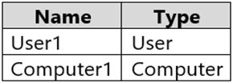
In Azure AD, you create a user named User2.
The storage1 account contains a file share named share1 and has the following configurations.
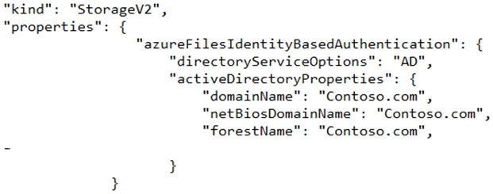
For each of the following statements, select Yes if the statement is true. Otherwise, select No.
NOTE: Each correct selection is worth one point.
Hot Area:
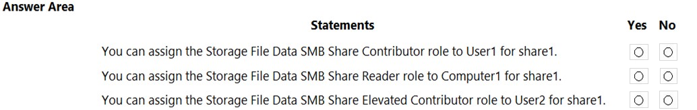

**Correct Answer:** 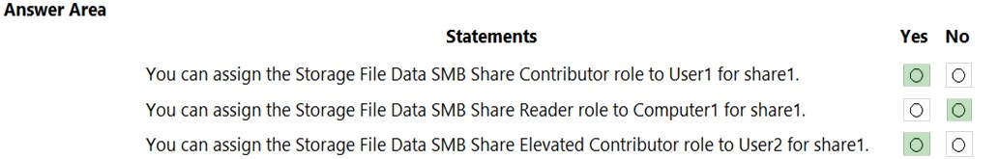

_Explanation:_
Reference:
https://docs.microsoft.com/en-us/azure/storage/files/storage-files-identity-ad-ds-assign-permissions?tabs=azure-portal

---

### Question 85: Question #45 Topic 2

HOTSPOT -
You have an Azure subscription named Subscription1 that contains a virtual network VNet1.
You add the users in the following table.
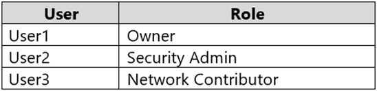
Which user can perform each configuration? To answer, select the appropriate options in the answer area.
NOTE: Each correct selection is worth one point.
Hot Area:
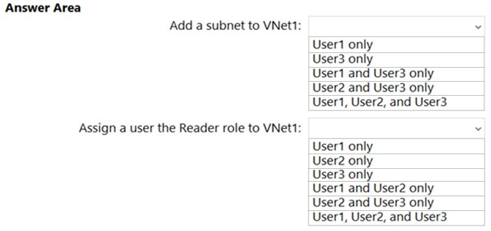

**Correct Answer:** 

_Explanation:_
Box 1: User1 and User3 only.
User1: The Owner Role lets you manage everything, including access to resources.
User3: The Network Contributor role lets you manage networks, including creating subnets.
Box 2: User1 only.
The Security Admin role: In Security Center only: Can view security policies, view security states, edit security policies, view alerts and recommendations, dismiss alerts and recommendations.
Reference:
https://docs.microsoft.com/en-us/azure/role-based-access-control/built-in-roles https://docs.microsoft.com/en-us/azure/role-based-access-control/resource-provider-operations#microsoftnetwork

---

### Question 86: Question #46 Topic 2

HOTSPOT -
You have the Azure resources shown on the following exhibit.
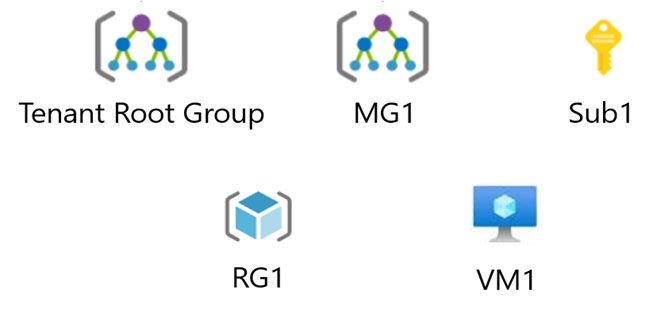
You plan to track resource usage and prevent the deletion of resources.
To which resources can you apply locks and tags? To answer, select the appropriate options in the answer area.
NOTE: Each correct selection is worth one point.
Hot Area:
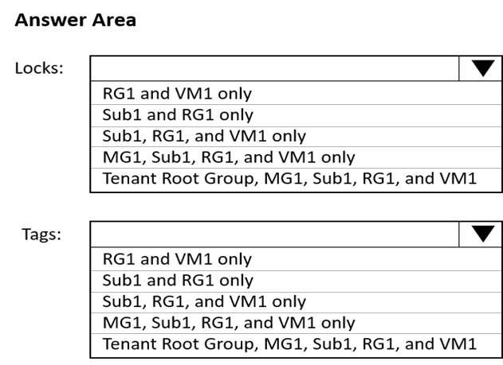

**Correct Answer:** 

_Explanation:_
Box 1: Sub1, RG1, and VM1 only -
You can lock a subscription, resource group, or resource to prevent other users in your organization from accidentally deleting or modifying critical resources.
Box 2: Sub1, RG1, and VM1 only -
You apply tags to your Azure resources, resource groups, and subscriptions.
Reference:
https://docs.microsoft.com/en-us/azure/azure-resource-manager/management/lock-resources?tabs=json https://docs.microsoft.com/en-us/azure/azure-resource-manager/management/tag-resources?tabs=json

---

### Question 87: Question #47 Topic 2

You have an Azure Active Directory (Azure AD) tenant.
You plan to delete multiple users by using Bulk delete in the Azure Active Directory admin center.
You need to create and upload a file for the bulk delete.
Which user attributes should you include in the file?

- A. The user principal name and usage location of each user only
- B. The user principal name of each user only
- C. The display name of each user only
- D. The display name and usage location of each user only
- E. The display name and user principal name of each user only

**Correct Answer:** B

---

### Question 88: Question #48 Topic 2

HOTSPOT -
You have an Azure subscription named Sub1 that contains the Azure resources shown in the following table.
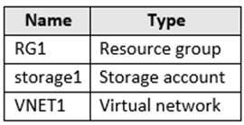
You assign an Azure policy that has the following settings:
✑ Scope: Sub1
✑ Exclusions: Sub1/RG1/VNET1
✑ Policy definition: Append a tag and its value to resources
✑ Policy enforcement: Enabled
✑ Tag name: Tag4
✑ Tag value: value4
You assign tags to the resources as shown in the following table.
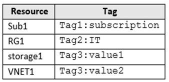
For each of the following statements, select Yes if the statement is true. Otherwise, select No.
NOTE: Each correct selection is worth one point.
Hot Area:

**Correct Answer:** 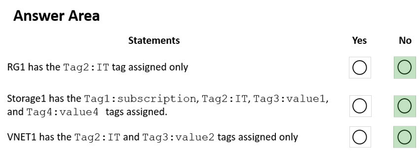

_Explanation:_
Box 1: No -
The Azure Policy will add Tag4 to RG1.
Box 2: No -
Tags applied to the resource group or subscription aren't inherited by the resources although you can enable inheritance with Azure Policy. Storage1 has Tag3:
Value1 and the Azure Policy will add Tag4.
Box 3: No -
Tags applied to the resource group or subscription aren't inherited by the resources so VNET1 does not have Tag2.
VNET1 has Tag3:value2. VNET1 is excluded from the Azure Policy so Tag4 will not be added to VNET1.
Reference:
https://docs.microsoft.com/en-us/azure/azure-resource-manager/management/tag-resources?tabs=json

---

### Question 89: Question #49 Topic 2

Note: This question is part of a series of questions that present the same scenario. Each question in the series contains a unique solution that might meet the stated goals. Some question sets might have more than one correct solution, while others might not have a correct solution.
After you answer a question in this section, you will NOT be able to return to it. As a result, these questions will not appear in the review screen.
You need to ensure that an Azure Active Directory (Azure AD) user named Admin1 is assigned the required role to enable Traffic Analytics for an Azure subscription.
Solution: You assign the Traffic Manager Contributor role at the subscription level to Admin1.
Does this meet the goal?

- A. Yes
- B. No

**Correct Answer:** B

---

### Question 90: Question #50 Topic 2

You have three offices and an Azure subscription that contains an Azure Active Directory (Azure AD) tenant.
You need to grant user management permissions to a local administrator in each office.
What should you use?

- A. Azure AD roles
- B. administrative units
- C. access packages in Azure AD entitlement management
- D. Azure roles

**Correct Answer:** B

---

### Question 91: Question #51 Topic 2

Note: This question is part of a series of questions that present the same scenario. Each question in the series contains a unique solution that might meet the stated goals. Some question sets might have more than one correct solution, while others might not have a correct solution.
After you answer a question in this section, you will NOT be able to return to it. As a result, these questions will not appear in the review screen.
You have an Azure Directory (Azure AD) tenant named Adatum and an Azure Subscription named Subscription1. Adatum contains a group named Developers.
Subscription1 contains a resource group named Dev.
You need to provide the Developers group with the ability to create Azure logic apps in the Dev resource group.
Solution: On Dev, you assign the Logic App Contributor role to the Developers group.
Does this meet the goal?

- A. Yes
- B. No

**Correct Answer:** A

---

### Question 92: Question #52 Topic 2

HOTSPOT -
You have an Azure Load Balancer named LB1.
You assign a user named User1 the roles shown in the following exhibit.
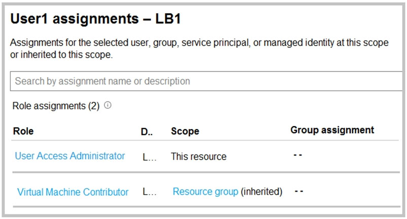
Use the drop-down menus to select the answer choice that completes each statement based on the information presented in the graphic.
NOTE: Each correct selection is worth one point.
Hot Area:
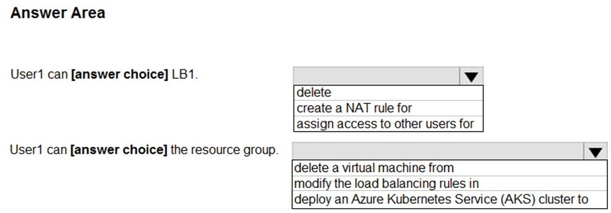

**Correct Answer:** 

_Explanation:_
Reference:
https://docs.microsoft.com/en-us/azure/role-based-access-control/built-in-roles#virtual-machine-contributor https://docs.microsoft.com/en-us/azure/role-based-access-control/rbac-and-directory-admin-roles

---

### Question 93: Question #53 Topic 2

You have an Azure subscription named Subscription1 that contains a virtual network named VNet1. VNet1 is in a resource group named RG1.
Subscription1 has a user named User1. User1 has the following roles:
✑ Reader
✑ Security Admin
✑ Security Reader
You need to ensure that User1 can assign the Reader role for VNet1 to other users.
What should you do?

- A. Remove User1 from the Security Reader role for Subscription1. Assign User1 the Contributor role for RG1.
- B. Assign User1 the Owner role for VNet1.
- C. Assign User1 the Contributor role for VNet1.
- D. Assign User1 the Network Contributor role for VNet1.

**Correct Answer:** B

---

### Question 94: Question #54 Topic 2

HOTSPOT -
You configure the custom role shown in the following exhibit.
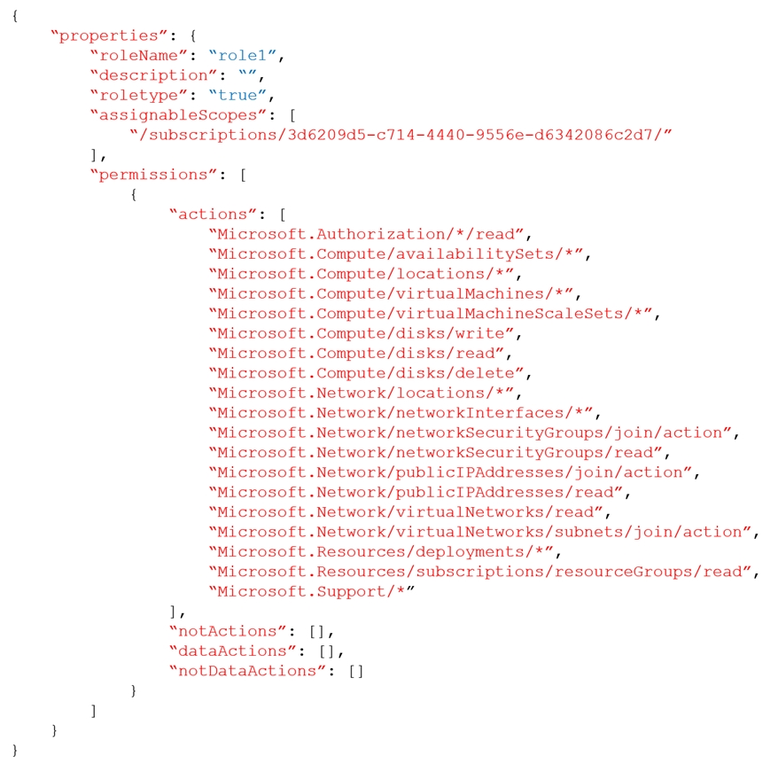
Use the drop-down menus to select the answer choice that completes each statement based on the information presented in the graphic.
NOTE: Each correct selection is worth one point.
Hot Area:
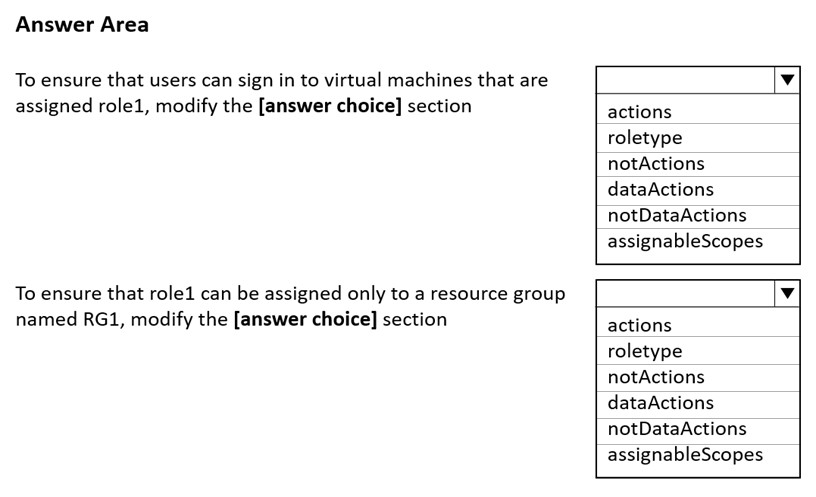

**Correct Answer:** 

_Explanation:_
Box 1: roletype -
You need to configure Azure RBAC policy to determine who can log in to the VM. Two Azure roles are used to authorize VM login:
Virtual Machine Administrator Login: Users with this role assigned can log in to an Azure virtual machine with administrator privileges.
Virtual Machine User Login: Users with this role assigned can log in to an Azure virtual machine with regular user privileges.
Note, example roletype:
"roleName": "Virtual Machine Administrator Login",
"roleType": "BuiltInRole",
"type": "Microsoft.Authorization/roleDefinitions"
Box 2: assignableScopes -
Azure role-based access control (Azure RBAC) is the authorization system you use to manage access to Azure resources. To grant access, you assign roles to users, groups, service principals, or managed identities at a particular scope.
When you assign roles, you must specify a scope. Scope is the set of resources the access applies to. In Azure, you can specify a scope at four levels from broad to narrow: management group, subscription, resource group, and resource.
Reference:
https://docs.microsoft.com/en-us/azure/active-directory/devices/howto-vm-sign-in-azure-ad-windows https://docs.microsoft.com/en-us/azure/role-based-access-control/built-in-roles https://docs.microsoft.com/en-us/azure/role-based-access-control/role-assignments-portal

---

### Question 95: Question #55 Topic 2

You have an Azure subscription that contains a storage account named storage1. The storage1 account contains a file share named share1.
The subscription is linked to a hybrid Azure Active Directory (Azure AD) tenant that contains a security group named Group1.
You need to grant Group1 the Storage File Data SMB Share Elevated Contributor role for share1.
What should you do first?

- A. Enable Active Directory Domain Service (AD DS) authentication for storage1.
- B. Grant share-level permissions by using File Explorer.
- C. Mount share1 by using File Explorer.
- D. Create a private endpoint.

**Correct Answer:** A

---

### Question 96: Question #56 Topic 2

You have 15 Azure subscriptions.
You have an Azure Active Directory (Azure AD) tenant that contains a security group named Group1.
You plan to purchase additional Azure subscription.
You need to ensure that Group1 can manage role assignments for the existing subscriptions and the planned subscriptions. The solution must meet the following requirements:
✑ Use the principle of least privilege.
✑ Minimize administrative effort.
What should you do?

- A. Assign Group1 the Owner role for the root management group.
- B. Assign Group1 the User Access Administrator role for the root management group.
- C. Create a new management group and assign Group1 the User Access Administrator role for the group.
- D. Create a new management group and assign Group1 the Owner role for the group.

**Correct Answer:** B

---

### Question 97: Question #57 Topic 2

HOTSPOT -
You have an Azure subscription that contains the hierarchy shown in the following exhibit.
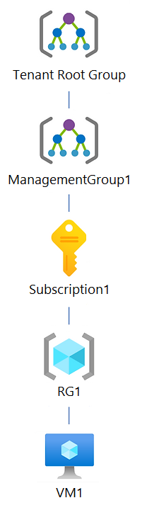
You create an Azure Policy definition named Policy1.
To which Azure resources can you assign Policy1 and which Azure resources can you specify as exclusions from Policy1? To answer, select the appropriate options in the answer area.
NOTE: Each correct selection is worth one point.
Hot Area:

**Correct Answer:** 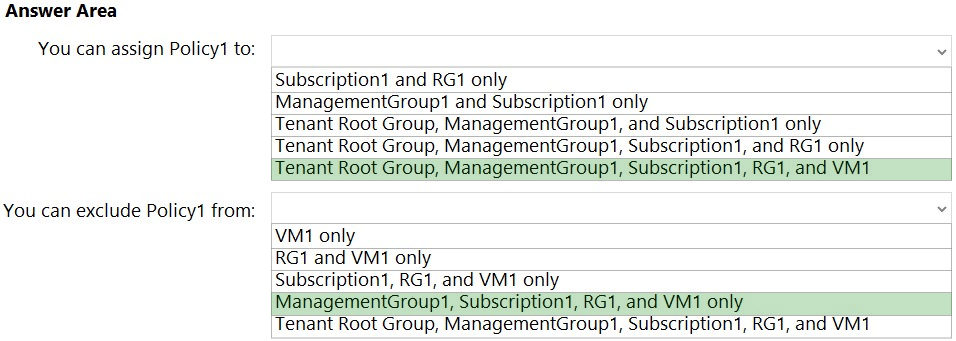

_Explanation:_
Box 1: Tenant Root Group, ManagementGroup1, Subscription1, RG1, and VM1
Once your business rules have been formed, the policy definition or initiative is assigned to any scope of resources that Azure supports, such as management groups, subscriptions, resource groups, or individual resources.
Note: Azure provides four levels of scope: management groups, subscriptions, resource groups, and resources. The following image shows an example of these layers.
Box 2: ManagementGroup1, Subscription1, RG1, and VM1
You can exclude a subscope from the assignment.
Reference:
https://docs.microsoft.com/en-us/azure/azure-resource-manager/management/overview

---

### Question 98: Question #58 Topic 2

Note: This question is part of a series of questions that present the same scenario. Each question in the series contains a unique solution that might meet the stated goals. Some question sets might have more than one correct solution, while others might not have a correct solution.
After you answer a question in this section, you will NOT be able to return to it. As a result, these questions will not appear in the review screen.
You have an Azure subscription that contains the following users in an Azure Active Directory tenant named contoso.onmicrosoft.com:
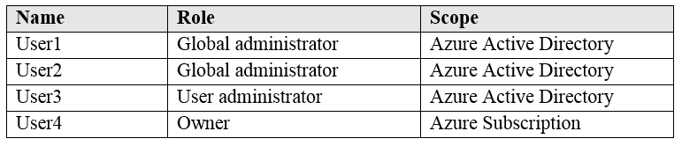
User1 creates a new Azure Active Directory tenant named external.contoso.onmicrosoft.com.
You need to create new user accounts in external.contoso.onmicrosoft.com.
Solution: You instruct User2 to create the user accounts.
Does that meet the goal?

- A. Yes
- B. No

**Correct Answer:** B

---

### Question 99: Question #59 Topic 2

Note: This question is part of a series of questions that present the same scenario. Each question in the series contains a unique solution that might meet the stated goals. Some question sets might have more than one correct solution, while others might not have a correct solution.
After you answer a question in this section, you will NOT be able to return to it. As a result, these questions will not appear in the review screen.
You have an Azure subscription that contains the following users in an Azure Active Directory tenant named contoso.onmicrosoft.com:

User1 creates a new Azure Active Directory tenant named external.contoso.onmicrosoft.com.
You need to create new user accounts in external.contoso.onmicrosoft.com.
Solution: You instruct User4 to create the user accounts.
Does that meet the goal?

- A. Yes
- B. No

**Correct Answer:** B

---

### Question 100: Question #60 Topic 2

Note: This question is part of a series of questions that present the same scenario. Each question in the series contains a unique solution that might meet the stated goals. Some question sets might have more than one correct solution, while others might not have a correct solution.
After you answer a question in this section, you will NOT be able to return to it. As a result, these questions will not appear in the review screen.
You have an Azure subscription that contains the following users in an Azure Active Directory tenant named contoso.onmicrosoft.com:
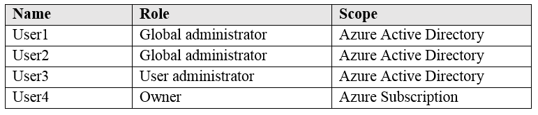
User1 creates a new Azure Active Directory tenant named external.contoso.onmicrosoft.com.
You need to create new user accounts in external.contoso.onmicrosoft.com.
Solution: You instruct User3 to create the user accounts.
Does that meet the goal?

- A. Yes
- B. No

**Correct Answer:** B

---

### Question 101: Question #61 Topic 2

You have two Azure subscriptions named Sub1 and Sub2.
An administrator creates a custom role that has an assignable scope to a resource group named RG1 in Sub1.
You need to ensure that you can apply the custom role to any resource group in Sub1 and Sub2. The solution must minimize administrative effort.
What should you do?

- A. Select the custom role and add Sub1 and Sub2 to the assignable scopes. Remove RG1 from the assignable scopes.
- B. Create a new custom role for Sub1. Create a new custom role for Sub2. Remove the role from RG1.
- C. Create a new custom role for Sub1 and add Sub2 to the assignable scopes. Remove the role from RG1.
- D. Select the custom role and add Sub1 to the assignable scopes. Remove RG1 from the assignable scopes. Create a new custom role for Sub2.

**Correct Answer:** A

---

### Question 102: Question #62 Topic 2

You have an Azure Subscription that contains a storage account named storageacct1234 and two users named User1 and User2.
You assign User1 the roles shown in the following exhibit.
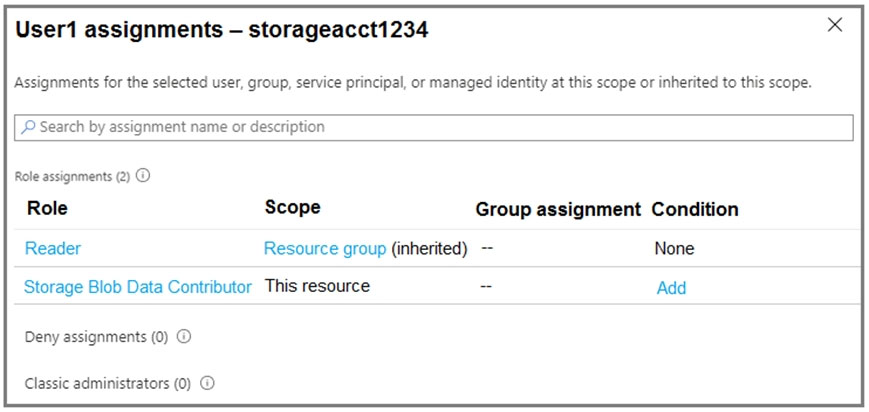
Which two actions can User1 perform? Each correct answer presents a complete solution.
NOTE: Each correct selection is worth one point.

- A. Assign roles to User2 for storageacct1234.
- B. Upload blob data to storageacct1234.
- C. Modify the firewall of storageacct1234.
- D. View blob data in storageacct1234.
- E. View file shares in storageacct1234.

**Correct Answer:** BD

---

### Question 103: Question #63 Topic 2

You have an Azure subscription named Subscription1 that contains an Azure Log Analytics workspace named Workspace1.
You need to view the error events from a table named Event.
Which query should you run in Workspace1?

- A. select * from Event where EventType == "error"
- B. Event | search "error"
- C. Event | where EventType is "error"
- D. Get-Event Event | where {$_.EventType == "error"}

**Correct Answer:** B

---

### Question 104: Question #64 Topic 2

You have an Azure App Services web app named App1.
You plan to deploy App1 by using Web Deploy.
You need to ensure that the developers of App1 can use their Azure AD credentials to deploy content to App1. The solution must use the principle of least privilege.
What should you do?

- A. Assign the Owner role to the developers
- B. Configure app-level credentials for FTPS
- C. Assign the Website Contributor role to the developers
- D. Configure user-level credentials for FTPS

**Correct Answer:** C

---

### Question 105: Question #65 Topic 2

Note: This question is part of a series of questions that present the same scenario. Each question in the series contains a unique solution that might meet the stated goals. Some question sets might have more than one correct solution, while others might not have a correct solution.
After you answer a question in this section, you will NOT be able to return to it. As a result, these questions will not appear in the review screen.
You have an Azure Active Directory (Azure AD) tenant named contoso.com.
You have a CSV file that contains the names and email addresses of 500 external users.
You need to create a guest user account in contoso.com for each of the 500 external users.
Solution: From Azure AD in the Azure portal, you use the Bulk invite users operation.
Does this meet the goal?

- A. Yes
- B. No

**Correct Answer:** B

---

### Question 106: Question #66 Topic 2

HOTSPOT
-
You have an Azure subscription that is linked to an Azure AD tenant. The tenant contains the custom role-based access control (RBAC) roles shown in the following table.
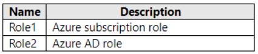
From the Azure portal, you need to create two custom roles named Role3 and Role4. Role3 will be an Azure subscription role. Role4 will be an Azure AD role.
Which roles can you clone to create the new roles? To answer, select the appropriate options in the answer area.
NOTE: Each correct selection is worth one point.
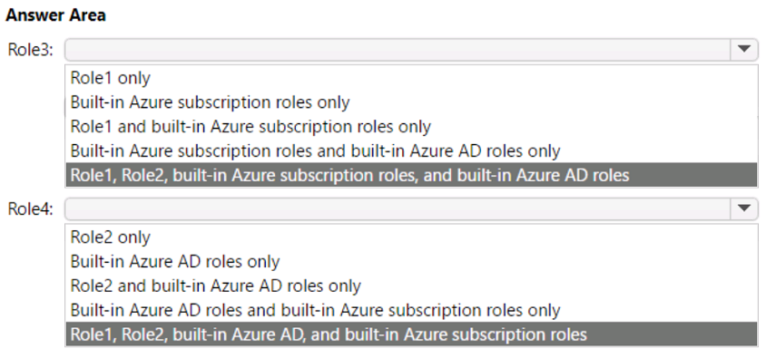

**Correct Answer:** 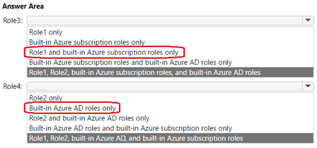

---

### Question 107: Question #67 Topic 2

DRAG DROP
-
You have an Azure subscription named Sub1 that contains two users named User1 and User2.
You need to assign role-based access control (RBAC) roles to User1 and User2. The users must be able to perform the following tasks in Sub1:
• User1 must view the data in any storage account.
• User2 must assign users the Contributor role for storage accounts.
The solution must use the principle of least privilege.
Which RBAC role should you assign to each user? To answer, drag the appropriate roles to the correct users. Each role may be used once, more than once, or not at all. You may need to drag the split bar between panes or scroll to view content.
NOTE: Each correct selection is worth one point.
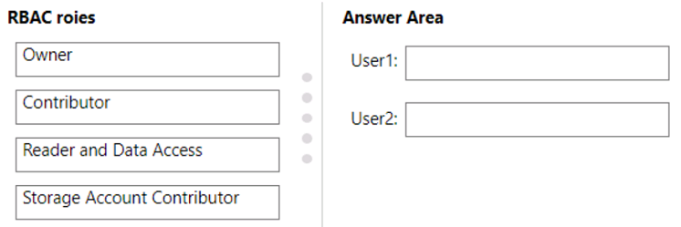

**Correct Answer:** 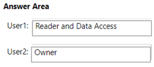

---

### Question 108: Question #68 Topic 2

You have an Azure subscription that contains 10 virtual machines, a key vault named Vault1, and a network security group (NSG) named NSG1. All the resources are deployed to the East US Azure region.
The virtual machines are protected by using NSG1. NSG1 is configured to block all outbound traffic to the internet.
You need to ensure that the virtual machines can access Vault1. The solution must use the principle of least privilege and minimize administrative effort
What should you configure as the destination of the outbound security rule for NSG1?

- A. an application security group
- B. a service tag
- C. an IP address range

**Correct Answer:** B

---

### Question 109: Question #69 Topic 2

You have an Azure AD tenant named adatum.com that contains the groups shown in the following table.
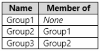
Adatum.com contains the users shown in the following table.
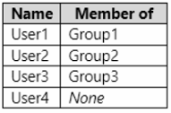
You assign the Azure Active Directory Premium Plan 2 license to Group1 and User4.
Which users are assigned the Azure Active Directory Premium Plan 2 license?

- A. User4 only
- B. User1 and User4 only
- C. User1, User2, and User4 only
- D. User1, User2, User3, and User4

**Correct Answer:** B

---

### Question 110: Question #70 Topic 2

HOTSPOT
-
You have an Azure AD tenant named contoso.com.
You have two external partner organizations named fabrikam.com and litwareinc.com. Fabrikam.com is configured as a connected organization.
You create an access package as shown in the Access package exhibit. (Click the Access package tab.)
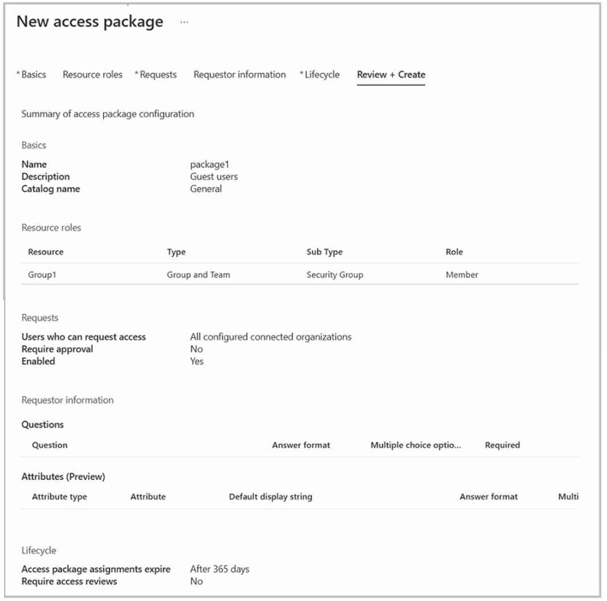
You configure the external user lifecycle settings as shown in the Lifecycle exhibit. (Click the Lifecycle tab.)
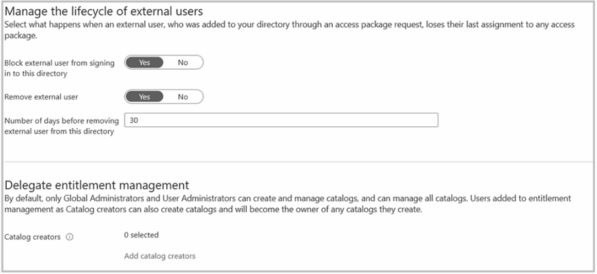
For each of the following statements, select Yes if the statement is true. Otherwise, select No.
NOTE: Each correct selection is worth one point.

**Correct Answer:** 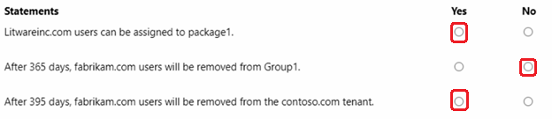

---

### Question 111: Question #71 Topic 2

You have an Azure subscription named Subscription1 that contains a virtual network named VNet1. VNet1 is in a resource group named RG1.
Subscription1 has a user named User1. User1 has the following roles:
•Reader
•Security Admin
•Security Reader
You need to ensure that User1 can assign the Reader role for VNet1 to other users.
What should you do?

- A. Assign User1 the Network Contributor role for VNet1.
- B. Remove User1 from the Security Reader role for Subscription1. Assign User1 the Contributor role for RG1.
- C. Assign User1 the Owner role for VNet1.
- D. Assign User1 the Network Contributor role for RG1.

**Correct Answer:** C

---

### Question 112: Question #72 Topic 2

HOTSPOT
-
You have an Azure subscription that contains the users shown in the following table.
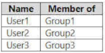
The groups are configured as shown in the following table.
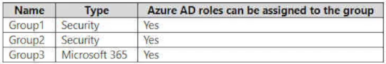
You have a resource group named RG1 as shown in the following exhibit.
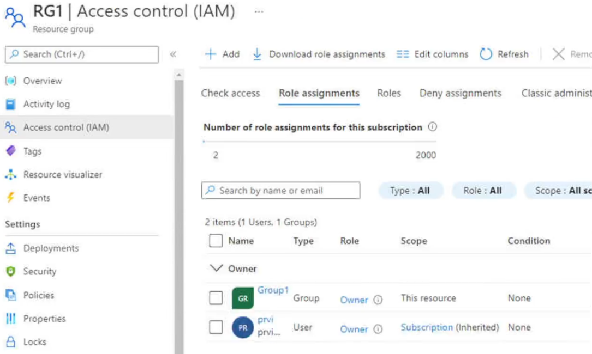
For each of the following statements, select Yes if the statement is true. Otherwise, select No.
NOTE: Each correct selection is worth one point.
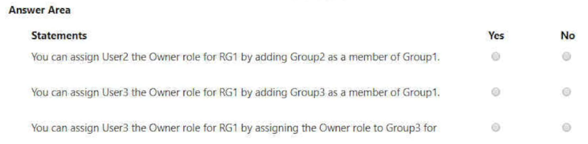

**Correct Answer:** 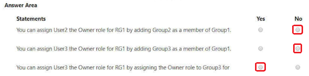

---

### Question 113: Question #73 Topic 2

You have an Azure subscription named Subscription1 that contains a virtual network named VNet1. VNet1 is in a resource group named RG1.
Subscription1 has a user named User1. User1 has the following roles:
•Reader
•Security Admin
•Security Reader
You need to ensure that User1 can assign the Reader role for VNet1 to other users.
What should you do?

- A. Remove User1 from the Security Reader role for Subscript on 1. Assign User1 the Contributor role for RG1.
- B. Assign User1 the Owner role for VNet1.
- C. Remove User1 from the Security Reader and Reader roles for Subscription1. Assign User1 the Contributor role for Subscription 1.
- D. Assign User1 the Contributor role for VNet1.

**Correct Answer:** B

---

### Question 114: Question #74 Topic 2

Your on-premises network contains a VPN gateway.
You have an Azure subscription that contains the resources shown in the following table.

You need to ensure that all the traffic from VM1 to storage1 travels across the Microsoft backbone network.
What should you configure?

- A. Azure Application Gateway
- B. private endpoints
- C. a network security group (NSG)
- D. Azure Virtual WAN

**Correct Answer:** B

---

### Question 115: Question #75 Topic 2

HOTSPOT
-
You have an Azure subscription that contains a user named User1 and the resources shown in the following table.
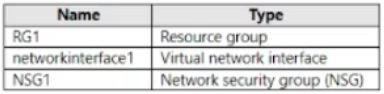
NSG1 is associated to networkinterface1.
User1 has role assignments for NSG1 as shown in the following table.
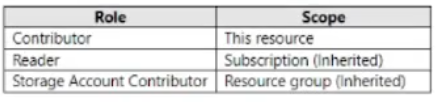
For each of the following statements, select Yes if the statement is true. Otherwise, select No.
NOTE: Each correct selection is worth one point.
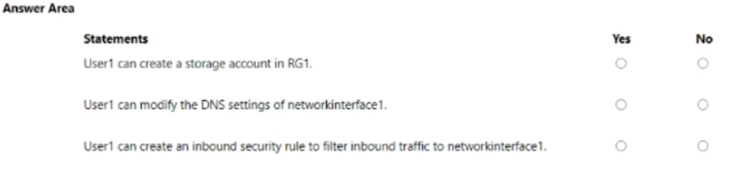

**Correct Answer:** 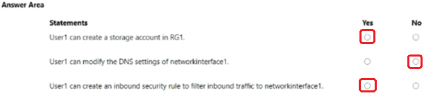

---

### Question 116: Question #76 Topic 2

You have an Azure subscription named Subscription1 that contains a virtual network named VNet1. VNet1 is in a resource group named RG1.
Subscription1 has a user named User1. User1 has the following roles:
•Reader
•Security Admin
•Security Reader
You need to ensure that User1 can assign the Reader role for VNet1 to other users.
What should you do?

- A. Remove User1 from the Security Reader role for Subscription1. Assign User1 the Contributor role for RG1.
- B. Assign User1 the Access Administrator role for VNet1.
- C. Remove User1 from the Security Reader and Reader roles for Subscription1. Assign User1 the Contributor role for Subscription1.
- D. Assign User1 the Network Contributor role for RG1.

**Correct Answer:** B

---

### Question 117: Question #77 Topic 2

HOTSPOT
-
You have three Azure subscriptions named Sub1, Sub2, and Sub3 that are linked to an Azure AD tenant.
The tenant contains a user named User1, a security group named Group1, and a management group named MG1. User is a member of Group1.
Sub1 and Sub2 are members of MG1. Sub1 contains a resource group named RG1. RG1 contains five Azure functions.
You create the following role assignments for MG1:
•Group1: Reader
•User1: User Access Administrator
You assign User the Virtual Machine Contributor role for Sub1 and Sub2.
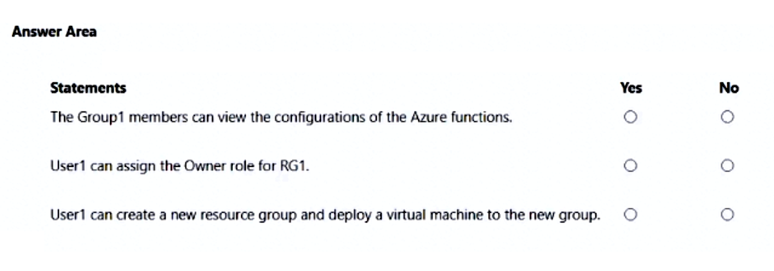

**Correct Answer:** 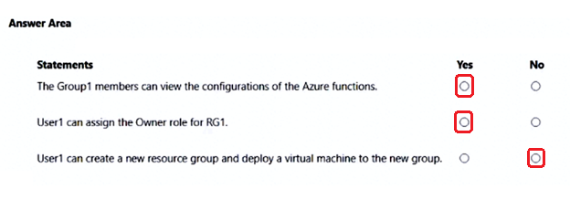

---

### Question 118: Question #78 Topic 2

You have an Azure subscription that contains the resources shown in the following table.
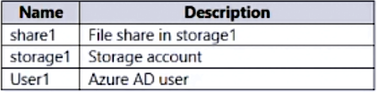
You need to assign User1 the Storage File Data SMB Share Contributor role for share1.
What should you do first?

- A. Enable identity-based data access for the file shares in storage1.
- B. Modify the security profile for the file shares in storage1.
- C. Select Default to Azure Active Directory authorization in the Azure portal for storage1.
- D. Configure Access control (IAM) for share1.

**Correct Answer:** A

---

### Question 119: Question #79 Topic 2

You have an Azure subscription named Subscription1 that contains a virtual network named VNet1. VNet1 is in a resource group named RG1.
Subscription1 has a user named User1. User1 has the following roles:
•Reader
•Security Admin
•Security Reader
You need to ensure that User1 can assign the Reader role for VNet1 to other users.
What should you do?

- A. Remove User1 from the Security Reader role for Subscription1. Assign User1 the Contributor role for RG1.
- B. Assign User1 the User Access Administrator role for VNet1.
- C. Remove User1 from the Security Reader and Reader roles for Subscription1.
- D. Assign User1 the Contributor role for VNet1.

**Correct Answer:** B

---

### Question 120: Question #80 Topic 2

HOTSPOT
-
You have an Azure AD tenant named adatum.com that contains the groups shown in the following table.
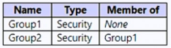
Adatum.com contains the users shown in the following table.
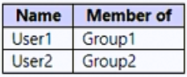
You assign an Azure Active Directory Premium P2 license to Group1 as shown in the following exhibit.
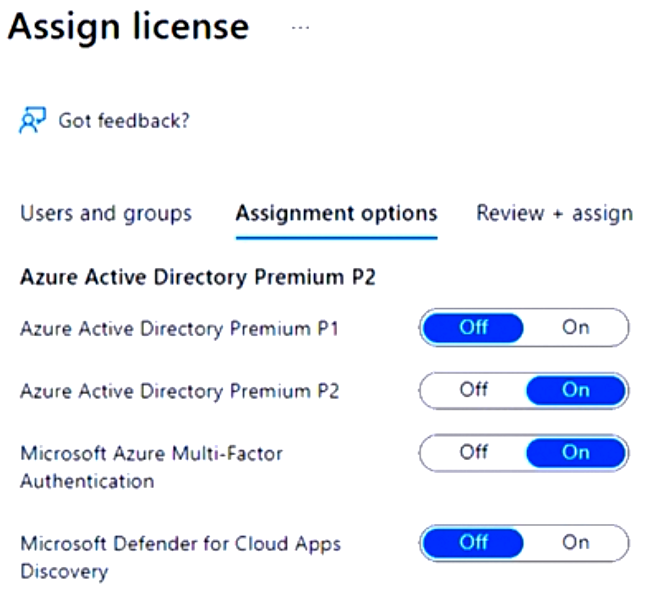
Group2 is NOT directly assigned a license.
For each of the following statements, select Yes if the statement is true. Otherwise, select No.
NOTE: Each correct selection is worth one point.
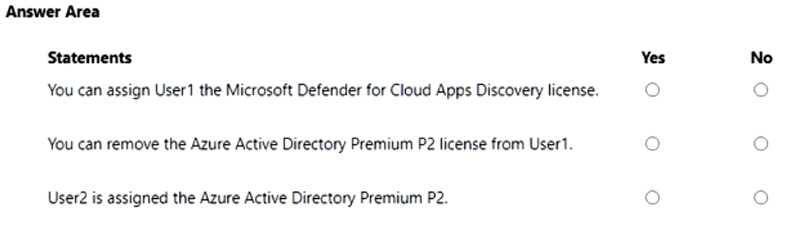

**Correct Answer:** 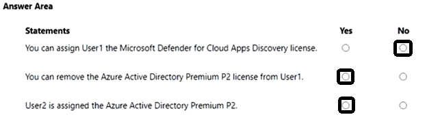

---

### Question 121: Question #81 Topic 2

HOTSPOT
-
You have a hybrid deployment of Azure Active Directory (Azure AD) that contains the users shown in the following table.
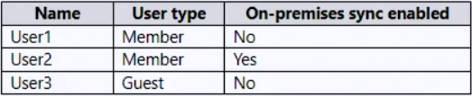
You need to modify the JobTitle and UsageLocation attributes for the users.
For which users can you modify the attributes from Azure AD? To answer, select the appropriate options in the answer area.
NOTE: Each correct selection is worth one point.
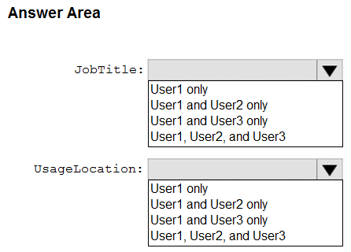

**Correct Answer:** 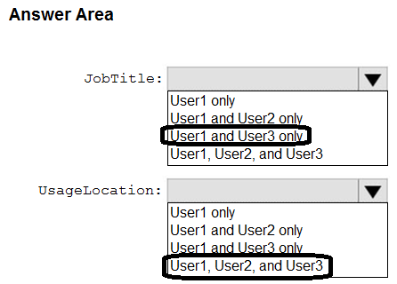

---

### Question 122: Question #82 Topic 2

Note: This question is part of a series of questions that present the same scenario. Each question in the series contains a unique solution that might meet the stated goals. Some question sets might have more than one correct solution, while others might not have a correct solution.
After you answer a question in this section, you will NOT be able to return to it. As a result, these questions will not appear in the review screen.
You have an Azure Active Directory (Azure AD) tenant named contoso.com.
You have a CSV file that contains the names and email addresses of 500 external users.
You need to create a guest user account in contoso.com for each of the 500 external users.
Solution: You create a PowerShell script that runs the New-MgUser cmdlet for each external user.
Does this meet the goal?

- A. Yes
- B. No

**Correct Answer:** B

---

### Question 123: Question #83 Topic 2

Note: This question is part of a series of questions that present the same scenario. Each question in the series contains a unique solution that might meet the stated goals. Some question sets might have more than one correct solution, while others might not have a correct solution.
After you answer a question in this section, you will NOT be able to return to it. As a result, these questions will not appear in the review screen.
You have an Azure Active Directory (Azure AD) tenant named contoso.com.
You have a CSV file that contains the names and email addresses of 500 external users.
You need to create a guest user account in contoso.com for each of the 500 external users.
Solution: You create a PowerShell script that runs the New-MgInvitation cmdlet for each external user.
Does this meet the goal?

- A. Yes
- B. No

**Correct Answer:** A

---

### Question 124: Question #84 Topic 2

You have an Azure subscription named Subscription1 that contains virtual network named VNet1. VNet1 is in a resource group named RG1.
A user named User1 has the following roles for Subscription1:
•Reader
•Security Admin
•Security Reader
You need to ensure that User1 can assign the Reader role for VNet1 to other users.
What should you do?

- A. Assign User1 the Contributor role for VNet1.
- B. Assign User1 the Network Contributor role for VNet1.
- C. Assign User1 the User Access Administrator role for VNet1.
- D. Remove User1 from the Security Reader and Reader roles for Subscription1. Assign User1 the Contributor role for Subscription1.

**Correct Answer:** C

---

### Question 125: Question #85 Topic 2

You have an Azure subscription named Subscription1 that contains virtual network named VNet1. VNet1 is in a resource group named RG1.
User named User1 has the following roles for Subscription1:
•Reader
•Security Admin
•Security Reader
You need to ensure that User1 can assign the Reader role for VNet1 to other users.
What should you do?

- A. Remove User1 from the Security Reader and Reader roles for Subscription1. Assign User1 the Contributor role for Subscription1.
- B. Remove User1 from the Security Reader role for Subscription1. Assign User1 the Contributor role for RG1.
- C. Assign User1 the Network Contributor role for VNet1.
- D. Assign User1 the User Access Administrator role for VNet1.

**Correct Answer:** D

---

### Question 126: Question #86 Topic 2

HOTSPOT
-
You have an Azure Storage account named storage1 that uses Azure Blob storage and Azure File storage.
You need to use AzCopy to copy data to the blob storage and file storage in storage1.
Which authentication method should you use for each type of storage? To answer, select the appropriate options in the answer area.
NOTE: Each correct selection is worth one point.
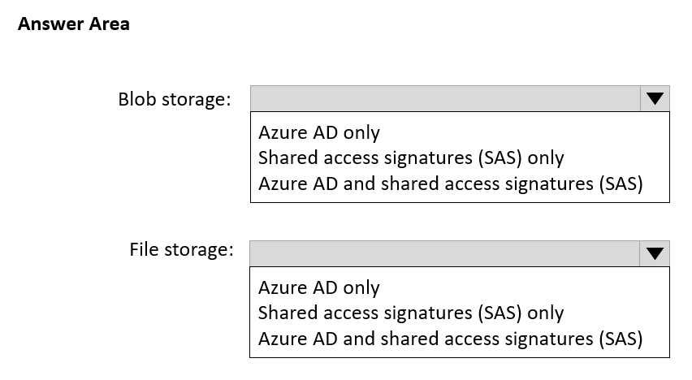

**Correct Answer:** 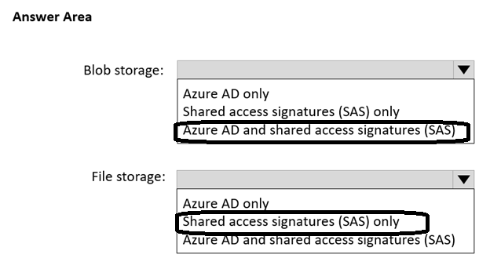

---

### Question 127: Question #87 Topic 2

HOTSPOT
-
You have an Azure AD tenant that contains a user named External User.
External User authenticates to the tenant by using external195@gmail.com.
You need to ensure that External User authenticates to the tenant by using contractor@gmail.com.
Which two settings should you configure from the Overview blade? To answer, select the appropriate settings in the answer area.
NOTE: Each correct answer is worth one point.
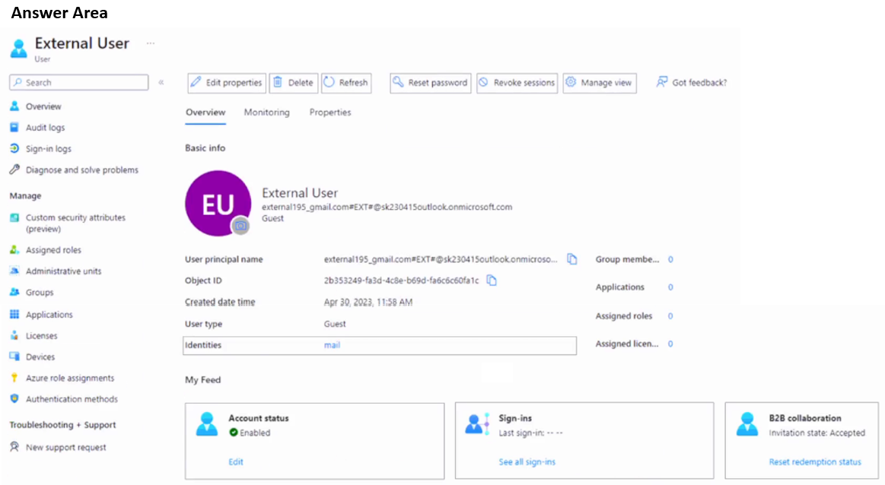

**Correct Answer:** 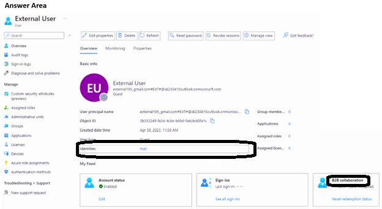

---

### Question 128: Question #88 Topic 2

You have an Azure subscription that contains the resources shown in the following table.
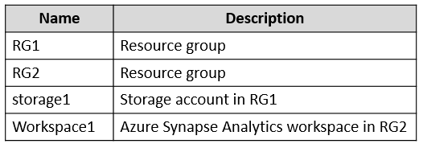
You need to assign Workspace1 a role to allow read, write, and delete operations for the data stored in the containers of storage1.
Which role should you assign?

- A. Storage Account Contributor
- B. Contributor
- C. Storage Blob Data Contributor
- D. Reader and Data Access

**Correct Answer:** C

---

### Question 129: Question #89 Topic 2

You have an Azure subscription named Subscription1 that contains virtual network named VNet1. VNet1 is in a resource group named RG1.
A user named User1 has the following roles for Subscription1:
•Reader
•Security Admin
•Security Reader
You need to ensure that User1 can assign the Reader role for VNet1 to other users.
What should you do?

- A. Remove User1 from the Security Reader and Reader roles for Subscription1. Assign User1 the Contributor role for Subscription1.
- B. Assign User1 the Contributor role for VNet1.
- C. Assign User1 the Owner role for VNet1.
- D. Assign User1 the Network Contributor role for RG1.

**Correct Answer:** C

---

### Question 130: Question #90 Topic 2

You have an Azure AD tenant that contains the groups shown in the following table.
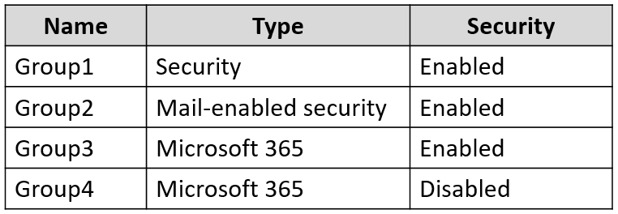
You purchase Azure Active Directory Premium P2 licenses.
To which groups can you assign a license?

- A. Group1 only
- B. Group1 and Group3 only
- C. Group3 and Group4 only
- D. Group1, Group2, and Group3 only
- E. Group1, Group2, Group3, and Group4

**Correct Answer:** B

---

### Question 131: Question #91 Topic 2

HOTSPOT
-
You have an Azure AD tenant.
You need to create a Microsoft 365 group that contains only members of a marketing department in France.
How should you complete the dynamic membership rule? To answer, select the appropriate options in the answer area.
NOTE: Each correct answer is worth one point.
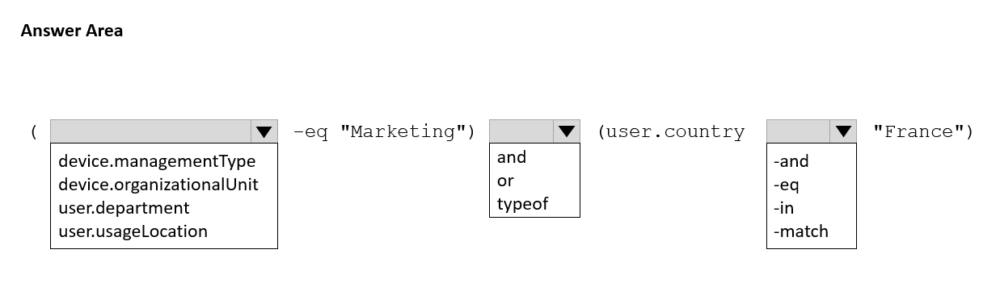

**Correct Answer:** 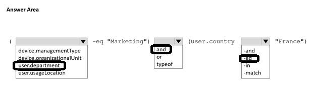

---

### Question 132: Question #92 Topic 2

HOTSPOT
-
You have an Azure AD tenant.
You need to modify the Default user role permissions settings for the tenant. The solution must meet the following requirements:
•Standard users must be prevented from creating new service principals.
•Standard users must only be able to use PowerShell or Microsoft Graph to manage their own Azure resources.
Which two settings should you modify? To answer, select the appropriate settings in the answer area.
NOTE: Each correct answer is worth one point.
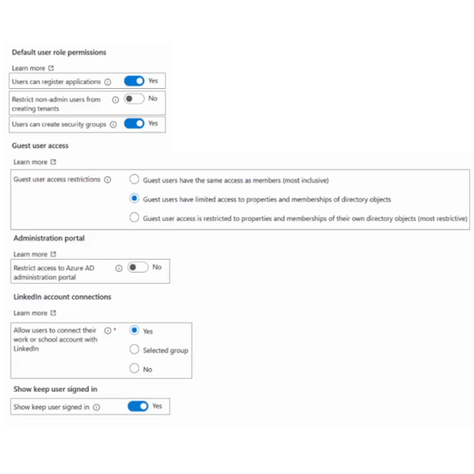

**Correct Answer:** 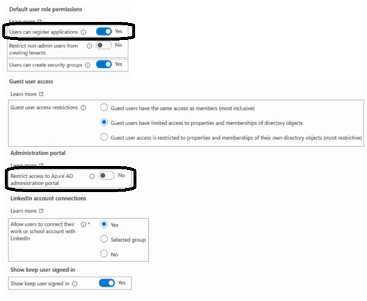

---

### Question 133: Question #93 Topic 2

HOTSPOT
-
You have an Azure subscription named Sub1 that contains the blob containers shown in the following table.
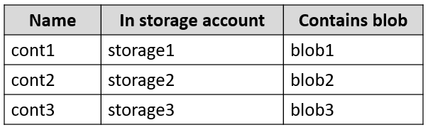
Sub1 contains two users named User1 and User2. Both users are assigned the Reader role at the Sub1 scope.
You have a condition named Condition1 as shown in the following exhibit.
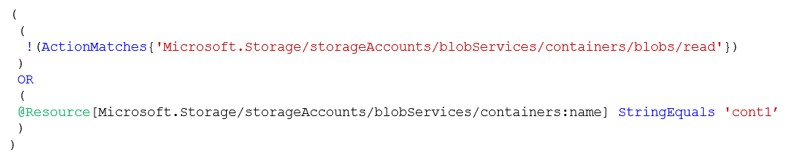
You have a condition named Condition2 as shown in the following exhibit.
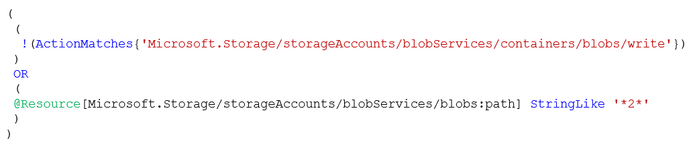
You assign roles to User1 and User2 as shown in the following table.
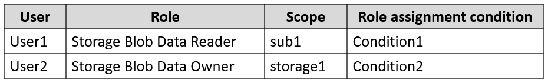
For each of the following statements, select Yes if the statement is true. Otherwise, select No.
NOTE: Each correct selection is worth one point.
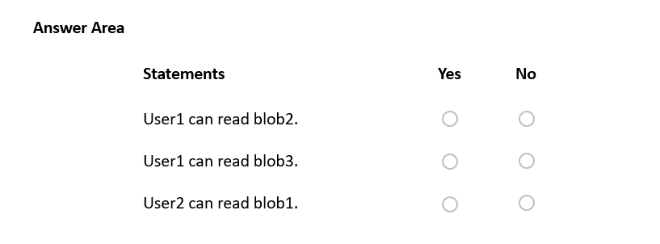

**Correct Answer:** 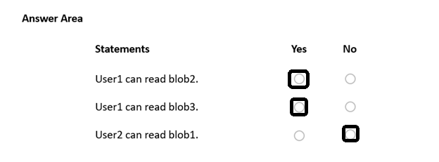

---

### Question 134: Question #94 Topic 2

Note: This question is part of a series of questions that present the same scenario. Each question in the series contains a unique solution that might meet the stated goals. Some question sets might have more than one correct solution, while others might not have a correct solution.
After you answer a question in this section, you will NOT be able to return to it. As a result, these questions will not appear in the review screen.
You have an Azure Active Directory (Azure AD) tenant named contoso.com.
You have a CSV file that contains the names and email addresses of 500 external users.
You need to create a guest user account in contoso.com for each of the 500 external users.
Solution: You create a PowerShell script that runs the New-MgUser cmdlet for each user.
Does this meet the goal?

- A. Yes
- B. No

**Correct Answer:** B

---

### Question 135: Question #95 Topic 2

HOTSPOT
-
You purchase a new Azure subscription.
You create an Azure Resource Manager (ARM) template named deploy.json as shown in the following exhibit.
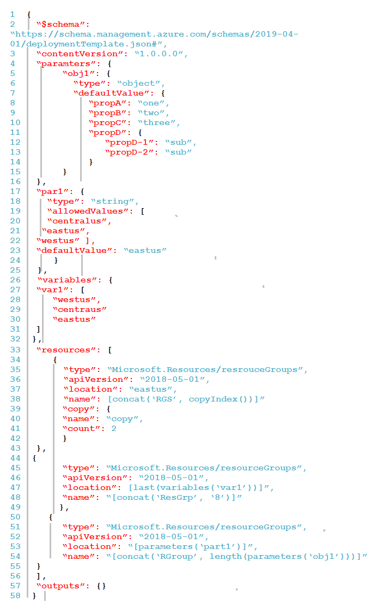
You connect to the subscription and run the following command.
New-AzDeployment –Location westus –TemplateFile “deploy.json”
For each of the following statements, select Yes if the statement is true. Otherwise, select No.
NOTE: Each correct selection is worth one point.
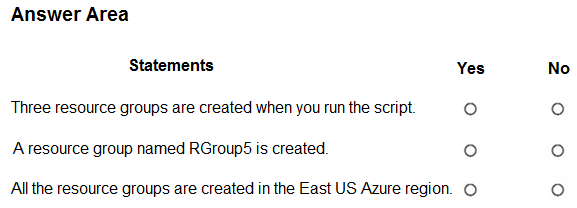

**Correct Answer:** 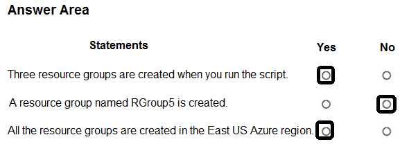

---

### Question 136: Question #96 Topic 2

Your on-premises network contains a VPN gateway.
You have an Azure subscription that contains the resources shown in the following table.

You need to ensure that all the traffic from VM1 to storage1 travels across the Microsoft backbone network.
What should you configure?

- A. Azure AD Application Proxy
- B. private endpoints
- C. a network security group (NSG)
- D. Azure Peering Service

**Correct Answer:** B

---

### Question 137: Question #97 Topic 2

Your on-premises network contains a VPN gateway.
You have an Azure subscription that contains the resources shown in the following table.

You need to ensure that all the traffic from VM1 to storage1 travels across the Microsoft backbone network.
What should you configure?

- A. Azure AD Application Proxy
- B. service endpoints
- C. a network security group (NSG)
- D. Azure Firewall

**Correct Answer:** B

---

### Question 138: Question #98 Topic 2

Your on-premises network contains a VPN gateway.
You have an Azure subscription that contains the resources shown in the following table.

You need to ensure that all the traffic from VM1 to storage1 travels across the Microsoft backbone network.
What should you configure?

- A. Azure Application Gateway
- B. service endpoints
- C. a network security group (NSG)
- D. Azure Peering Service

**Correct Answer:** B

---

### Question 139: Question #99 Topic 2

You have an Azure subscription named Sub1 that contains the resources shown in the following table.
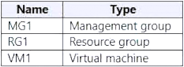
You create a user named Admin1.
To what can you add Admin1 as a co-administrator?

- A. RG1
- B. MG1
- C. Sub1
- D. VM1

**Correct Answer:** C

---

### Question 140: Question #100 Topic 2

HOTSPOT
-
You have a Microsoft Entra tenant that contains the groups shown in the following table.
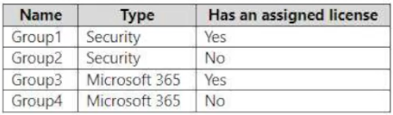
The tenant contains the users shown in the following table.
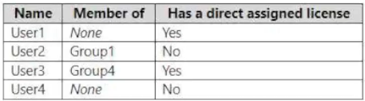
Which users and groups can you delete? To answer, select the appropriate options in the answer area.
NOTE: Each correct selection is worth one point.
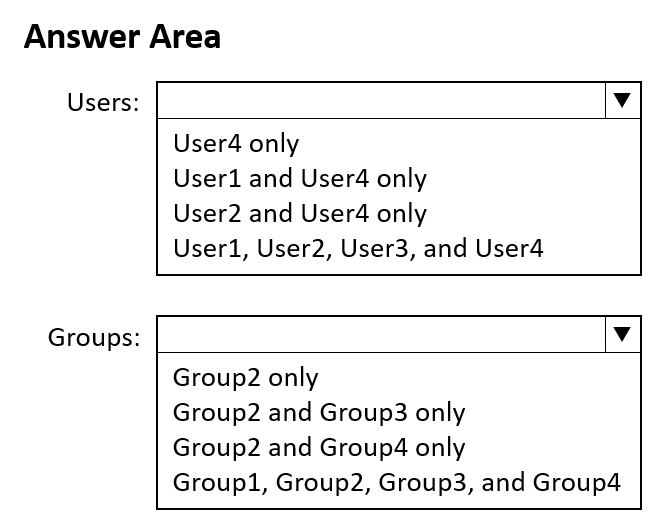

**Correct Answer:** 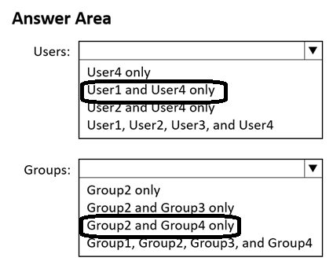

---

### Question 141: Question #101 Topic 2

You have an Azure subscription that contains the resources shown in the following table.
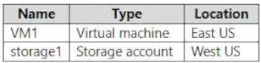
You need to ensure that data transfers between storage1 and VM1 do NOT traverse the internet
What should you configure for storage1?

- A. data protection
- B. a private endpoint
- C. Public network access in the Firewalls and virtual networks settings
- D. a shared access signature (SAS)

**Correct Answer:** B

---

### Question 142: Question #102 Topic 2

HOTSPOT
-
You have a Microsoft Entra tenant that is linked to the subscriptions shown in the following table.
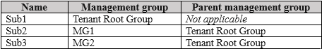
You have the resource groups shown in the following table.
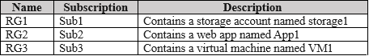
You assign roles to users as shown in the following table.
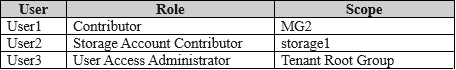
For each of the following statements, select Yes if the statement is true. Otherwise, select No.
NOTE: Each correct selection is worth one point.
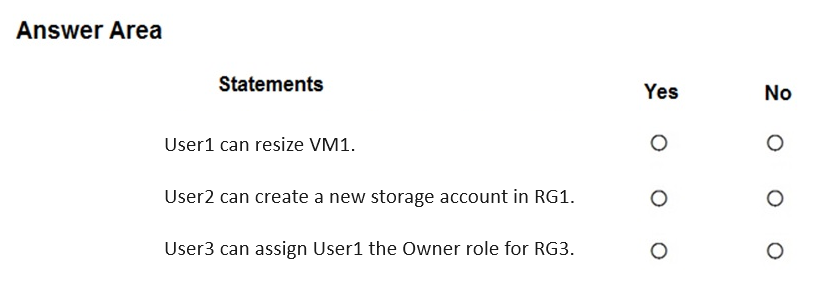

**Correct Answer:** 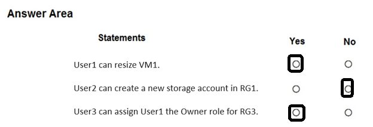

---

### Question 143: Question #103 Topic 2

Your on-premises network contains a VPN gateway.
You have an Azure subscription that contains the resources shown in the following table.
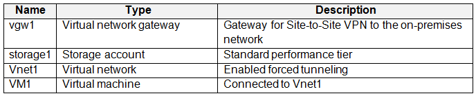
You need to ensure that all the traffic from VM1 to storage1 travels across the Microsoft backbone network.
What should you configure?

- A. a network security group (NSG)
- B. private endpoints
- C. Microsoft Entra Application Proxy
- D. Azure Virtual WAN

**Correct Answer:** B

---

### Question 144: Question #104 Topic 2

You have a Microsoft Entra tenant.
You plan to perform a bulk import of users.
You need to ensure that imported user objects are added automatically as the members of a specific group based on each user's department. The solution must minimize administrative effort.
Which two actions should you perform? Each correct answer presents part of the solution.
NOTE: Each correct selection is worth one point.

- A. Create groups that use the Assigned membership type.
- B. Create an Azure Resource Manager (ARM) template.
- C. Create groups that use the Dynamic User membership type.
- D. Write a PowerShell script that parses an import file.
- E. Create an XML file that contains user information and the appropriate attributes.
- F. Create a CSV file that contains user information and the appropriate attributes.

**Correct Answer:** CF

---

### Question 145: Question #105 Topic 2

You have an Azure subscription that contains a storage account named storage1.
You need to ensure that the access keys for storage1 rotate automatically.
What should you configure?

- A. a backup vault
- B. redundancy for storage1
- C. lifecycle management for storage1
- D. an Azure key vault
- E. a Recovery Services vault

**Correct Answer:** D

---

### Question 146: Question #106 Topic 2

You have an Azure subscription that contains the Microsoft Entra identities shown in the following table.
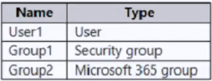
You need to enable self-service password reset (SSPR).
For which identities can you enable SSPR in the Azure portal?

- A. User1 only
- B. Group1 only
- C. User1 and Group1 only
- D. Group1 and Group2 only
- E. User1, Group1, and Group2

**Correct Answer:** D

---

### Question 147: Question #107 Topic 2

DRAG DROP -
You have a Microsoft Entra tenant.
You need to ensure that when a new Microsoft 365 group is created, the group name is automatically formatted as follows:
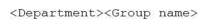
Which three actions should you perform in sequence in the Microsoft Entra admin center? To answer, move the appropriate actions from the list of actions to the answer area and arrange them in the correct order.
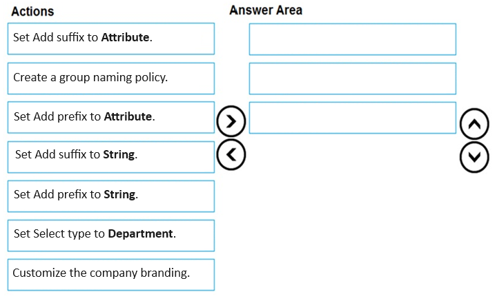

**Correct Answer:** 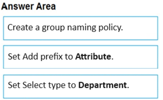

---

### Question 148: Question #108 Topic 2

HOTSPOT
-
You have a Microsoft Entra tenant that contains the users shown in the following table.
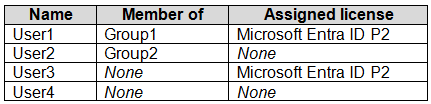
The tenant contains the groups shown in the following table.
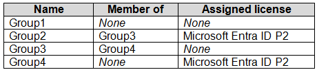
Which users and groups can be deleted? To answer, select the appropriate options in the answer area.
NOTE: Each correct selection is worth one point.
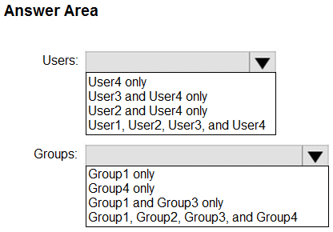

**Correct Answer:** 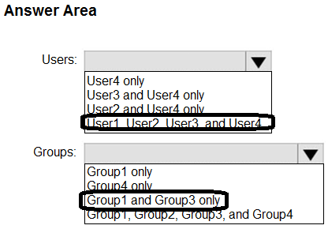

---

### Question 149: Question #109 Topic 2

HOTSPOT
-
You have an Azure subscription that contains the resources shown in the following table.
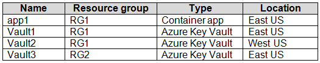
You plan to use an Azure key vault to provide a secret to app1.
What should you create for app1 to access the key vault, and from which key vault can the secret be used? To answer, select the appropriate options in the answer area.
NOTE: Each correct selection is worth one point.
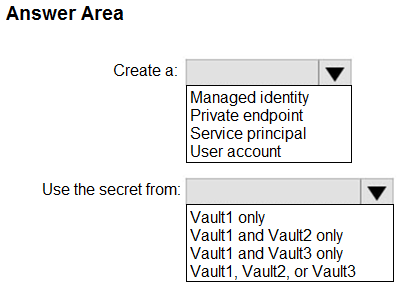

**Correct Answer:** 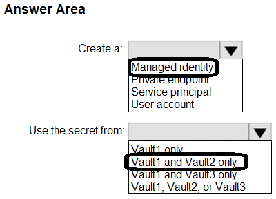

---

### Question 150: Question #110 Topic 2

You have a Microsoft Entra tenant named contoso.com.
You collaborate with an external partner named fabrikam.com.
You plan to invite users in fabrikam.com to the contoso.com tenant.
You need to ensure that invitations can be sent only to fabrikam.com users.
What should you do in the Microsoft Entra admin center?

- A. From Cross-tenant access settings, configure the Tenant restrictions settings.
- B. From Cross-tenant access settings, configure the Microsoft cloud settings.
- C. From External collaboration settings, configure the Guest user access restrictions settings.
- D. From External collaboration settings, configure the Collaboration restrictions settings.

**Correct Answer:** D

---

### Question 151: Question #111 Topic 2

You have an Azure subscription that contains a storage account named storage1. The storage1 account contains blob data.
You need to assign a role to a user named User1 to ensure that the user can access the blob data in storage1. The role assignment must support conditions.
Which two roles can you assign to User1? Each correct answer presents a complete solution.
NOTE: Each correct selection is worth one point.

- A. Owner
- B. Storage Account Contributor
- C. Storage Account Backup Contributor
- D. Storage Blob Data Contributor
- E. Storage Blob Data Owner
- F. Storage Blob Delegator

**Correct Answer:** DE

---

### Question 152: Question #112 Topic 2

HOTSPOT
-
Case study
-
This is a case study. Case studies are not timed separately. You can use as much exam time as you would like to complete each case. However, there may be additional case studies and sections on this exam. You must manage your time to ensure that you are able to complete all questions included on this exam in the time provided.
To answer the questions included in a case study, you will need to reference information that is provided in the case study. Case studies might contain exhibits and other resources that provide more information about the scenario that is described in the case study. Each question is independent of the other questions in this case study.
At the end of this case study, a review screen will appear. This screen allows you to review your answers and to make changes before you move to the next section of the exam. After you begin a new section, you cannot return to this section.
To start the case study
-
To display the first question in this case study, click the Next button. Use the buttons in the left pane to explore the content of the case study before you answer the questions. Clicking these buttons displays information such as business requirements, existing environment, and problem statements. If the case study has an All Information tab, note that the information displayed is identical to the information displayed on the subsequent tabs. When you are ready to answer a question, click the Question button to return to the question.
Overview
-
ADatum Corporation is consulting firm that has a main office in Montreal and branch offices in Seattle and New York.
Existing Environment
-
Azure Environment
-
ADatum has an Azure subscription that contains three resource groups named RG1, RG2, and RG3.
The subscription contains the storage accounts shown in the following table.
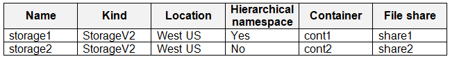
The subscription contains the virtual machines shown in the following table.
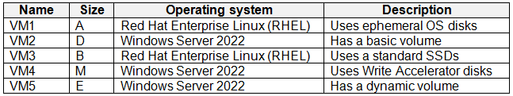
The subscription has an Azure container registry that contains the images shown in the following table.
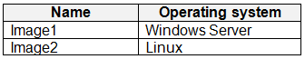
The subscription contains the resources shown in the following table.
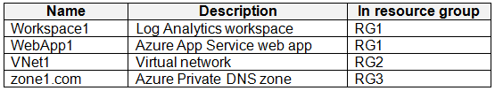
Azure Key Vault
-
The subscription contains an Azure key vault named Vault1.
Vault1 contains the certificates shown in the following table.
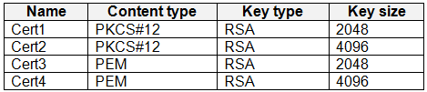
Vault1 contains the keys shown in the following table.
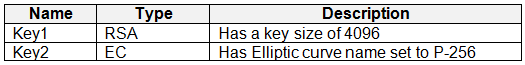
Microsoft Entra Environment
-
ADatum has a Microsoft Entra tenant named adatum.com that is linked to the Azure subscription and contains the users shown in the following table.
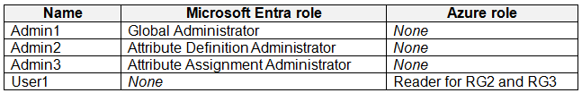
The tenant contains the groups shown in the following table.
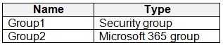
The adatum.com tenant has a custom security attribute named Attribute1.
Planned Changes
-
ADatum plans to implement the following changes:
•Configure a data collection rule (DCR) named DCR1 to collect only system events that have an event ID of 4648 from VM2 and VM4.
•In storage1, create a new container named cont2 that has the following access policies:
oThree stored access policies named Stored1, Stored2, and Stored3
oA legal hold for immutable blob storage
•Whenever possible, use directories to organize storage account content.
•Grant User1 the permissions required to link Zone1 to VNet1.
•Assign Attribute1 to supported adatum.com resources.
•In storage2, create an encryption scope named Scope1.
•Deploy new containers by using Image1 or Image2.
Technical Requirements
-
ADatum must meet the following technical requirements:
•Use TLS for WebApp1.
•Follow the principle of least privilege.
•Grant permissions at the required scope only.
•Ensure that Scope1 is used to encrypt storage services.
•Use Azure Backup to back up cont1 and share1 as frequently as possible.
•Whenever possible, use Azure Disk Encryption and a key encryption key (KEK) to encrypt the virtual machines.
You need to implement the planned change for Attribute1.
For each of the following statements, select Yes if the statement is true. Otherwise, select No.
NOTE: Each correct selection is worth one point.
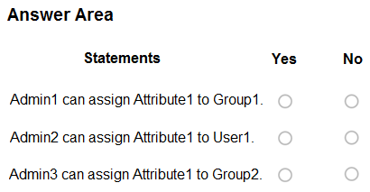

**Correct Answer:** 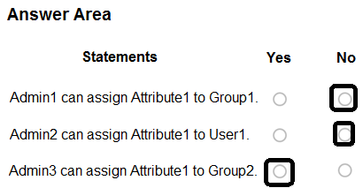

---

### Question 153: Question #113 Topic 2

You have a Microsoft Entra tenant configured as shown in the following exhibit.
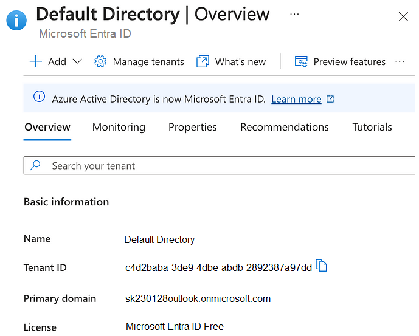
The tenant contains the identities shown in the following table.
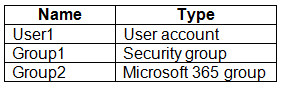
You purchase a Microsoft Fabric license.
To which identities can you assign the license?

- A. User1 only
- B. User1 and Group1 only
- C. User1 and Group2 only
- D. User1, Group1, and Group2

**Correct Answer:** A

---

### Question 154: Question #114 Topic 2

You have an Azure subscription that contains a storage account named storage. The storage account contains a blob that stores images.
Client access to storage1 is granted by using a shared access signature (SAS).
You need to ensure that users receive a warning message when they generate a SAS that exceeds a seven-day time period.
What should you do for storage?

- A. Enable a read-only lock.
- B. Configure an alert rule.
- C. Add a lifecycle management rule.
- D. Set Allow recommended upper limit for shared access signature (SAS) expiry interval to Enabled.

**Correct Answer:** D

---

### Question 155: Question #1 Topic 3

You have an Azure subscription named Subscription1 that contains the storage accounts shown in the following table:
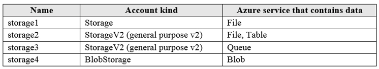
You plan to use the Azure Import/Export service to export data from Subscription1.
You need to identify which storage account can be used to export the data.
What should you identify?

- A. storage1
- B. storage2
- C. storage3
- D. storage4

**Correct Answer:** D

---

### Question 156: Question #2 Topic 3

HOTSPOT -
You have Azure Storage accounts as shown in the following exhibit.
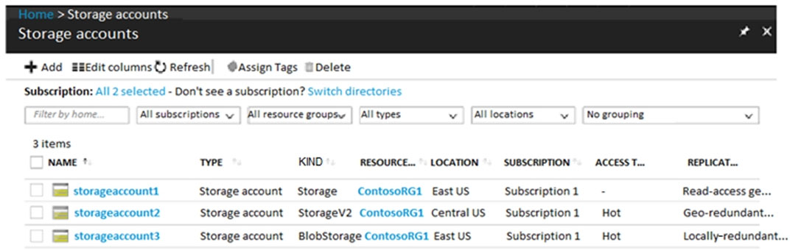
Use the drop-down menus to select the answer choice that completes each statement based on the information presented in the graphic.
NOTE: Each correct selection is worth one point.
Hot Area:
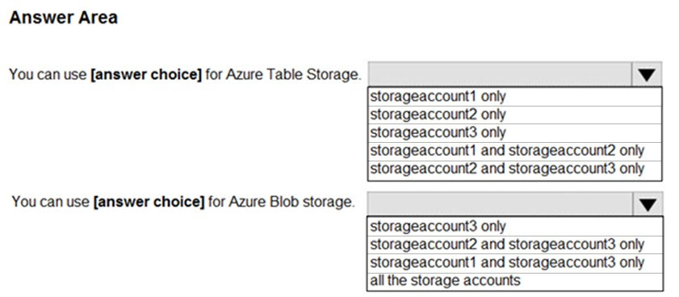

**Correct Answer:** 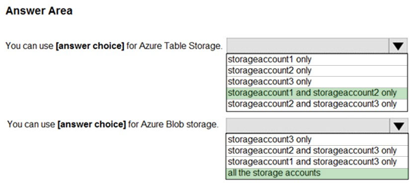

_Explanation:_
Box 1: storageaccount1 and storageaccount2 only
Box 2: All the storage accounts -
Note: The three different storage account options are: General-purpose v2 (GPv2) accounts, General-purpose v1 (GPv1) accounts, and Blob storage accounts.
✑ General-purpose v2 (GPv2) accounts are storage accounts that support all of the latest features for blobs, files, queues, and tables.
✑ Blob storage accounts support all the same block blob features as GPv2, but are limited to supporting only block blobs.
✑ General-purpose v1 (GPv1) accounts provide access to all Azure Storage services, but may not have the latest features or the lowest per gigabyte pricing.
Reference:
https://docs.microsoft.com/en-us/azure/storage/common/storage-account-options

---

### Question 157: Question #3 Topic 3

You have Azure subscription that includes data in following locations:
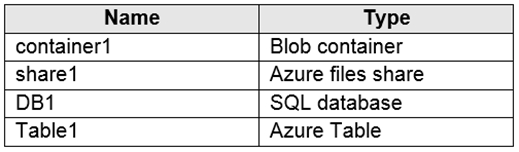
You plan to export data by using Azure import/export job named Export1.
You need to identify the data that can be exported by using Export1.
Which data should you identify?

- A. DB1
- B. container1
- C. share1
- D. Table1

**Correct Answer:** B

---

### Question 158: Question #4 Topic 3

HOTSPOT -
You have an Azure Storage account named storage1.
You have an Azure App Service app named App1 and an app named App2 that runs in an Azure container instance. Each app uses a managed identity.
You need to ensure that App1 and App2 can read blobs from storage1. The solution must meet the following requirements:
✑ Minimize the number of secrets used.
✑ Ensure that App2 can only read from storage1 for the next 30 days.
What should you configure in storage1 for each app? To answer, select the appropriate options in the answer area.
NOTE: Each correct selection is worth one point.
Hot Area:

**Correct Answer:** 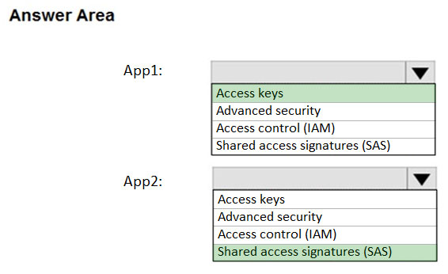

_Explanation:_
App1: Access keys -
App2: Shared access signature (SAS)
A shared access signature (SAS) provides secure delegated access to resources in your storage account without compromising the security of your data. With a
SAS, you have granular control over how a client can access your data. You can control what resources the client may access, what permissions they have on those resources, and how long the SAS is valid, among other parameters.
Reference:
https://docs.microsoft.com/en-us/azure/storage/common/storage-sas-overview

---

### Question 159: Question #5 Topic 3

HOTSPOT -
You need to create an Azure Storage account that meets the following requirements:
✑ Minimizes costs
✑ Supports hot, cool, and archive blob tiers
✑ Provides fault tolerance if a disaster affects the Azure region where the account resides
How should you complete the command? To answer, select the appropriate options in the answer area.
NOTE: Each correct selection is worth one point.
Hot Area:
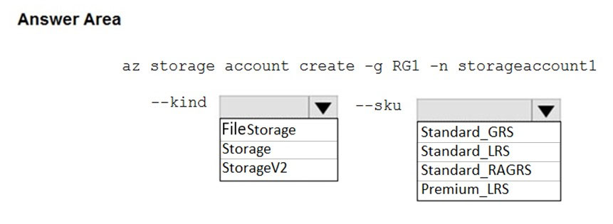

**Correct Answer:** 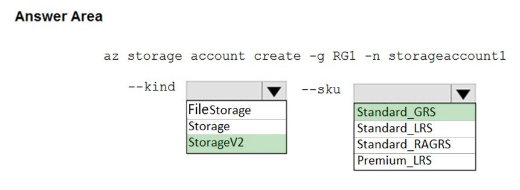

_Explanation:_
Box 1: StorageV2 -
You may only tier your object storage data to hot, cool, or archive in Blob storage and General Purpose v2 (GPv2) accounts. General Purpose v1 (GPv1) accounts do not support tiering.
General-purpose v2 accounts deliver the lowest per-gigabyte capacity prices for Azure Storage, as well as industry-competitive transaction prices.
Box 2: Standard_GRS -
Geo-redundant storage (GRS): Cross-regional replication to protect against region-wide unavailability.
Incorrect Answers:
Locally-redundant storage (LRS): A simple, low-cost replication strategy. Data is replicated within a single storage scale unit.
Read-access geo-redundant storage (RA-GRS): Cross-regional replication with read access to the replica. RA-GRS provides read-only access to the data in the secondary location, in addition to geo-replication across two regions, but is more expensive compared to GRS.
Reference:
https://docs.microsoft.com/en-us/azure/storage/common/storage-redundancy-grs https://docs.microsoft.com/en-us/azure/storage/blobs/storage-blob-storage-tiers

---

### Question 160: Question #6 Topic 3

You have an Azure subscription that contains the resources in the following table.
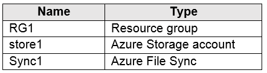
Store1 contains a file share named data. Data contains 5,000 files.
You need to synchronize the files in the file share named data to an on-premises server named Server1.
Which three actions should you perform? Each correct answer presents part of the solution.
NOTE: Each correct selection is worth one point.

- A. Create a container instance
- B. Register Server1
- C. Install the Azure File Sync agent on Server1
- D. Download an automation script
- E. Create a sync group

**Correct Answer:** BCE

---

### Question 161: Question #7 Topic 3

HOTSPOT -
You have an Azure subscription that contains the resources shown in the following table.
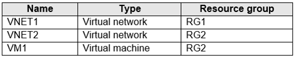
The status of VM1 is Running.
You assign an Azure policy as shown in the exhibit. (Click the Exhibit tab.)
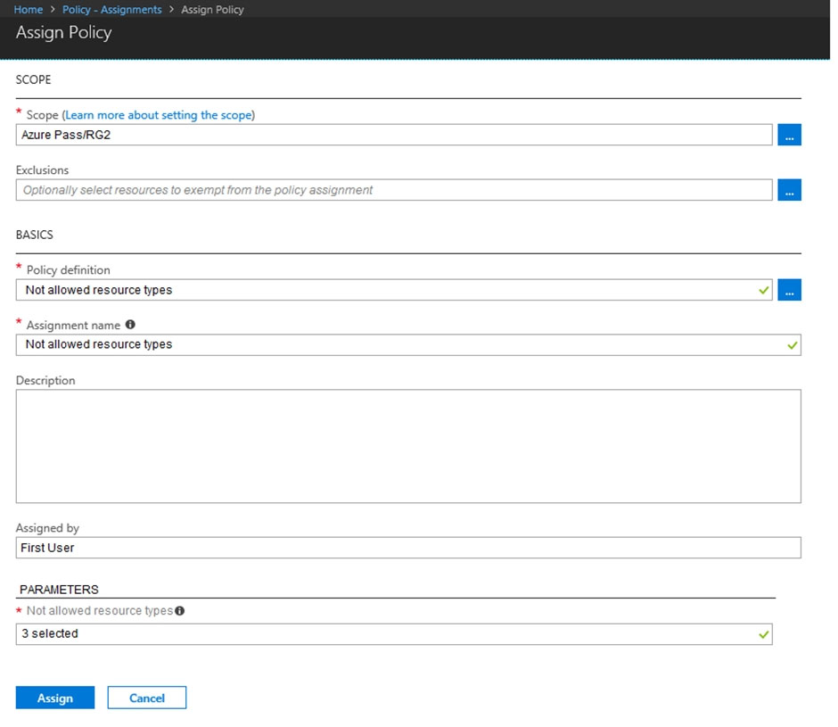
You assign the policy by using the following parameters:
Microsoft.ClassicNetwork/virtualNetworks
Microsoft.Network/virtualNetworks
Microsoft.Compute/virtualMachines
For each of the following statements, select Yes if the statement is true. Otherwise, select No.
NOTE: Each correct selection is worth one point.
Hot Area:
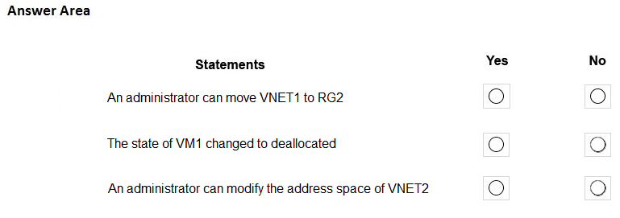

**Correct Answer:** 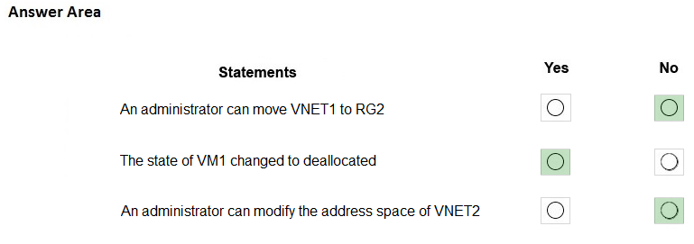

---

### Question 162: Question #8 Topic 3

DRAG DROP -
You have an Azure subscription that contains a storage account.
You have an on-premises server named Server1 that runs Windows Server 2016. Server1 has 2 TB of data.
You need to transfer the data to the storage account by using the Azure Import/Export service.
In which order should you perform the actions? To answer, move all actions from the list of actions to the answer area and arrange them in the correct order.
NOTE: More than one order of answer choices is correct. You will receive credit for any of the correct orders you select.
Select and Place:
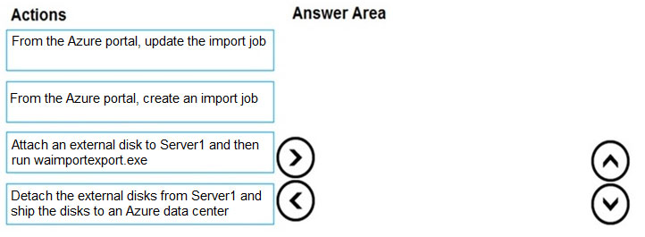

**Correct Answer:** 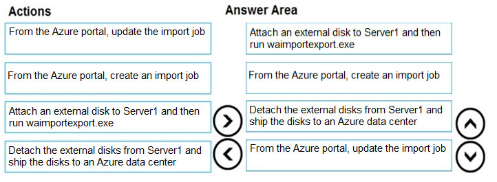

_Explanation:_
At a high level, an import job involves the following steps:
Step 1: Attach an external disk to Server1 and then run waimportexport.exe
Determine data to be imported, number of drives you need, destination blob location for your data in Azure storage.
Use the WAImportExport tool to copy data to disk drives. Encrypt the disk drives with BitLocker.
Step 2: From the Azure portal, create an import job.
Create an import job in your target storage account in Azure portal. Upload the drive journal files.
Step 3: Detach the external disks from Server1 and ship the disks to an Azure data center.
Provide the return address and carrier account number for shipping the drives back to you.
Ship the disk drives to the shipping address provided during job creation.
Step 4: From the Azure portal, update the import job
Update the delivery tracking number in the import job details and submit the import job.
The drives are received and processed at the Azure data center.
The drives are shipped using your carrier account to the return address provided in the import job.
Reference:
https://docs.microsoft.com/en-us/azure/storage/common/storage-import-export-service

---

### Question 163: Question #9 Topic 3

HOTSPOT -
You have Azure subscription that includes following Azure file shares:
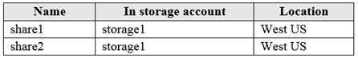
You have the following on-premises servers:
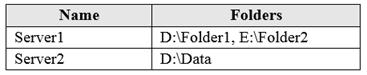
You create a Storage Sync Service named Sync1 and an Azure File Sync group named Group1. Group1 uses share1 as a cloud endpoint.
You register Server1 and Server2 in Sync1. You add D:\Folder1 on Server1 as a server endpoint of Group1.
For each of the following statements, select Yes if the statement is true. Otherwise, select No.
NOTE: Each correct selection is worth one point.
Hot Area:
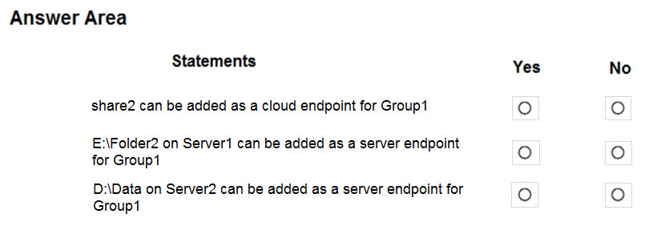

**Correct Answer:** 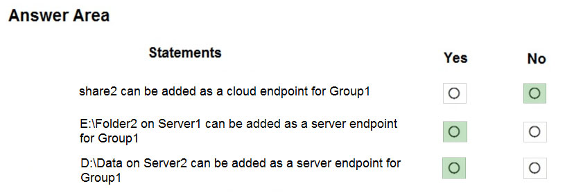

_Explanation:_
Box 1: No -
Group1 already has a cloud endpoint named Share1.
A sync group must contain one cloud endpoint, which represents an Azure file share and one or more server endpoints.
Box 2: Yes -
Yes, one or more server endpoints can be added to the sync group.
Box 3: Yes -
Yes, one or more server endpoints can be added to the sync group.
Reference:
https://docs.microsoft.com/en-us/azure/storage/files/storage-sync-files-deployment-guide

---

### Question 164: Question #10 Topic 3

DRAG DROP -
You have an Azure subscription named Subscription1.
You create an Azure Storage account named contosostorage, and then you create a file share named data.
Which UNC path should you include in a script that references files from the data file share? To answer, drag the appropriate values to the correct targets. Each value may be used once, more than once or not at all. You may need to drag the split bar between panes or scroll to view content.
NOTE: Each correct selection is worth one point.
Select and Place:
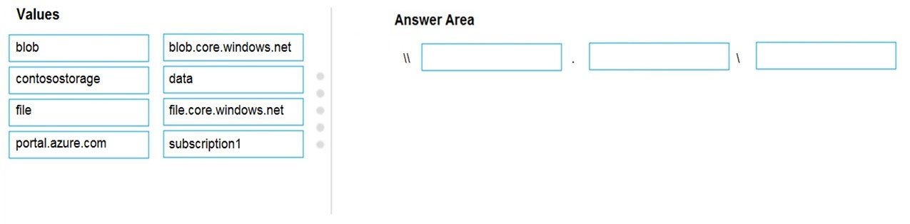

**Correct Answer:** 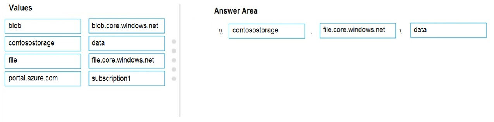

_Explanation:_
Box 1: contosostorage -
The name of account -
Box 2: file.core.windows.net -
Box 3: data -
The name of the file share is data.
Example:
Reference:
https://docs.microsoft.com/en-us/azure/storage/files/storage-how-to-use-files-windows

---

### Question 165: Question #11 Topic 3

HOTSPOT -
You have an Azure subscription that contains an Azure Storage account.
You plan to copy an on-premises virtual machine image to a container named vmimages.
You need to create the container for the planned image.
Which command should you run? To answer, select the appropriate options in the answer area.
NOTE: Each correct selection is worth one point.
Hot Area:
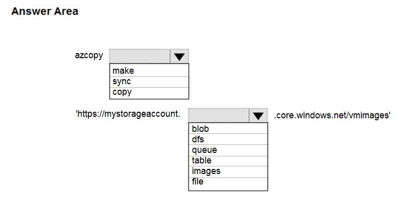

**Correct Answer:** 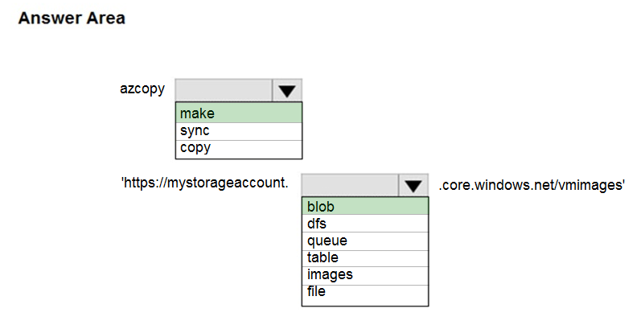

---

### Question 166: Question #12 Topic 3

HOTSPOT -
You have an Azure File sync group that has the endpoints shown in the following table.

Cloud tiering is enabled for Endpoint3.
You add a file named File1 to Endpoint1 and a file named File2 to Endpoint2.
On which endpoints will File1 and File2 be available within 24 hours of adding the files? To answer, select the appropriate options in the answer area.
NOTE: Each correct selection is worth one point.
Hot Area:

**Correct Answer:** 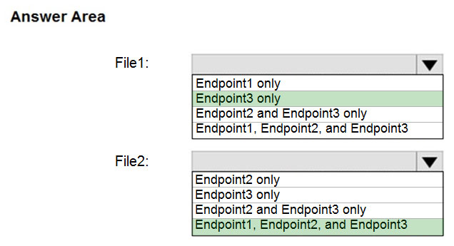

_Explanation:_
File1: Endpoint3 only -
Cloud Tiering: A switch to enable or disable cloud tiering. When enabled, cloud tiering will tier files to your Azure file shares. This converts on-premises file shares into a cache, rather than a complete copy of the dataset, to help you manage space efficiency on your server. With cloud tiering, infrequently used or accessed files can be tiered to Azure Files.
File2: Endpoint1, Endpoint2, and Endpoint3
Reference:
https://docs.microsoft.com/en-us/azure/storage/files/storage-sync-cloud-tiering

---

### Question 167: Question #13 Topic 3

HOTSPOT -
You have several Azure virtual machines on a virtual network named VNet1.
You configure an Azure Storage account as shown in the following exhibit.
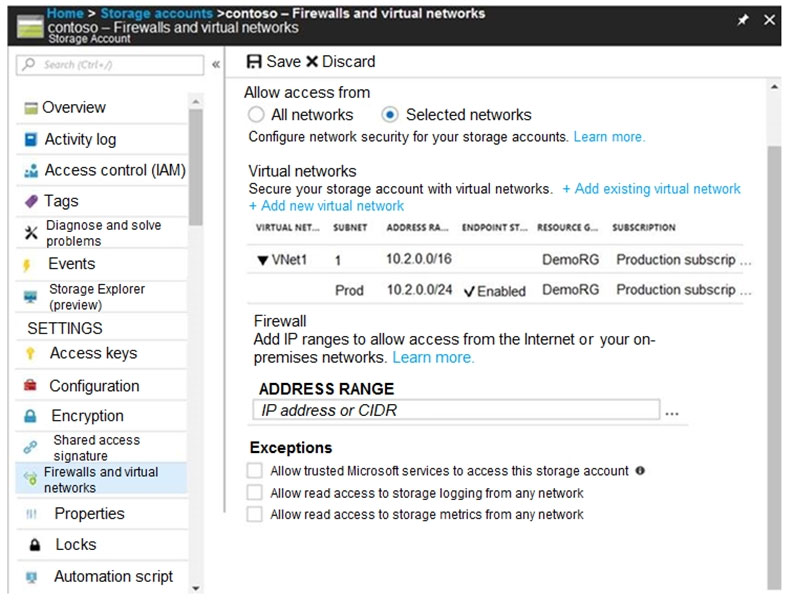
Use the drop-down menus to select the answer choice that completes each statement based on the information presented in the graphic.
NOTE: Each correct selection is worth one point.
Hot Area:
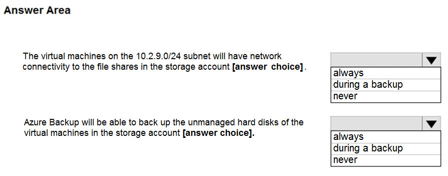

**Correct Answer:** 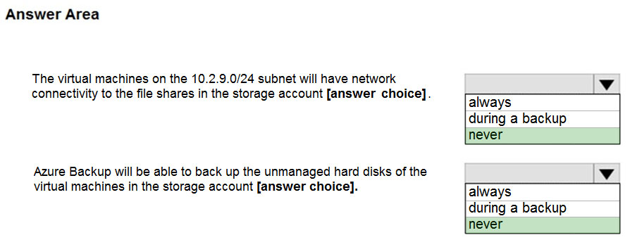

_Explanation:_
Box 1: never -
The 10.2.9.0/24 subnet is not whitelisted.
Box 2: never -
After you configure firewall and virtual network settings for your storage account, select Allow trusted Microsoft services to access this storage account as an exception to enable Azure Backup service to access the network restricted storage account.
Reference:
https://docs.microsoft.com/en-us/azure/storage/files/storage-how-to-use-files-windows https://azure.microsoft.com/en-us/blog/azure-backup-now-supports-storage-accounts-secured-with-azure-storage-firewalls-and-virtual-networks/

---

### Question 168: Question #14 Topic 3

HOTSPOT -
You have a sync group named Sync1 that has a cloud endpoint. The cloud endpoint includes a file named File1.txt.
Your on-premises network contains servers that run Windows Server 2016. The servers are configured as shown in the following table.
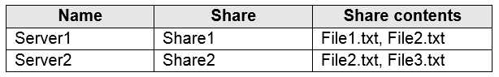
You add Share1 as an endpoint for Sync1. One hour later, you add Share2 as an endpoint for Sync1.
For each of the following statements, select Yes if the statement is true. Otherwise, select No.
NOTE: Each correct selection is worth one point.
Hot Area:
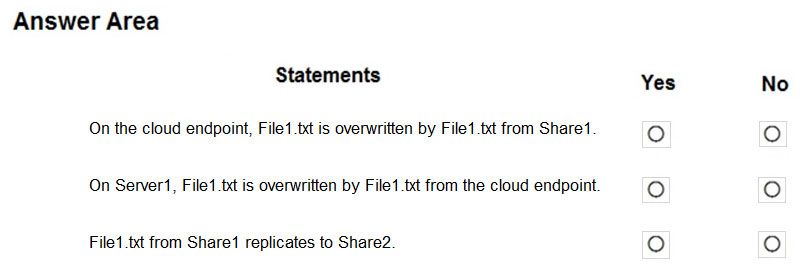

**Correct Answer:** 

_Explanation:_
Box 1: Yes -
If you add an Azure file share that has an existing set of files as a cloud endpoint to a sync group, the existing files are merged with any other files that are already on other endpoints in the sync group.
Box 2: No -
Box 3: Yes -
Reference:
https://docs.microsoft.com/en-us/azure/storage/files/storage-sync-files-planning

---

### Question 169: Question #15 Topic 3

You have an Azure subscription that contains the storage accounts shown in the following table.
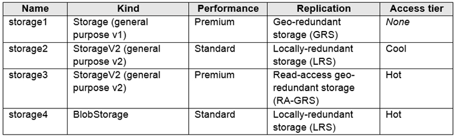
You need to identify which storage account can be converted to zone-redundant storage (ZRS) replication by requesting a live migration from Azure support.
What should you identify?

- A. storage1
- B. storage2
- C. storage3
- D. storage4

**Correct Answer:** B

---

### Question 170: Question #16 Topic 3

You have an Azure subscription that contains a storage account named account1.
You plan to upload the disk files of a virtual machine to account1 from your on-premises network. The on-premises network uses a public IP address space of
131.107.1.0/24.
You plan to use the disk files to provision an Azure virtual machine named VM1. VM1 will be attached to a virtual network named VNet1. VNet1 uses an IP address space of 192.168.0.0/24.
You need to configure account1 to meet the following requirements:
✑ Ensure that you can upload the disk files to account1.
✑ Ensure that you can attach the disks to VM1.
✑ Prevent all other access to account1.
Which two actions should you perform? Each correct answer presents part of the solution.
NOTE: Each correct selection is worth one point.

- A. From the Networking blade of account1, select Selected networks.
- B. From the Networking blade of account1, select Allow trusted Microsoft services to access this storage account.
- C. From the Networking blade of account1, add the 131.107.1.0/24 IP address range.
- D. From the Networking blade of account1, add VNet1.
- E. From the Service endpoints blade of VNet1, add a service endpoint.

**Correct Answer:** AC

---

### Question 171: Question #17 Topic 3

DRAG DROP -
You have an on-premises file server named Server1 that runs Windows Server 2016.
You have an Azure subscription that contains an Azure file share.
You deploy an Azure File Sync Storage Sync Service, and you create a sync group.
You need to synchronize files from Server1 to Azure.
Which three actions should you perform in sequence? To answer, move the appropriate actions from the list of actions to the answer area and arrange them in the correct order.
Select and Place:
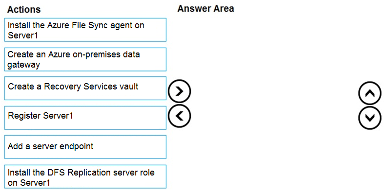

**Correct Answer:** 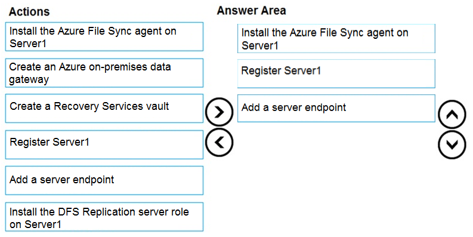

_Explanation:_
Step 1: Install the Azure File Sync agent on Server1
The Azure File Sync agent is a downloadable package that enables Windows Server to be synced with an Azure file share
Step 2: Register Server1.
Register Windows Server with Storage Sync Service
Registering your Windows Server with a Storage Sync Service establishes a trust relationship between your server (or cluster) and the Storage Sync Service.
Step 3: Add a server endpoint -
Create a sync group and a cloud endpoint.
A sync group defines the sync topology for a set of files. Endpoints within a sync group are kept in sync with each other. A sync group must contain one cloud endpoint, which represents an Azure file share and one or more server endpoints. A server endpoint represents a path on registered server.
Reference:
https://docs.microsoft.com/en-us/azure/storage/files/storage-sync-files-deployment-guide

---

### Question 172: Question #18 Topic 3

HOTSPOT -
You plan to create an Azure Storage account in the Azure region of East US 2.
You need to create a storage account that meets the following requirements:
✑ Replicates synchronously.
✑ Remains available if a single data center in the region fails.
How should you configure the storage account? To answer, select the appropriate options in the answer area.
NOTE: Each correct selection is worth one point.
Hot Area:
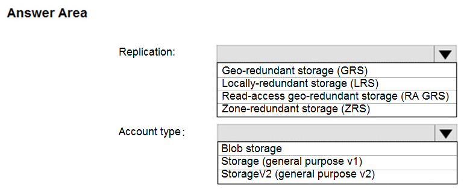

**Correct Answer:** 

_Explanation:_
Box 1: Zone-redundant storage (ZRS)
Zone-redundant storage (ZRS) replicates your data synchronously across three storage clusters in a single region.
LRS would not remain available if a data center in the region fails
GRS and RA GRS use asynchronous replication.
Box 2: StorageV2 (general purpose V2)
ZRS only support GPv2.
Reference:
https://docs.microsoft.com/en-us/azure/storage/common/storage-redundancy https://docs.microsoft.com/en-us/azure/storage/common/storage-redundancy-zrs

---

### Question 173: Question #19 Topic 3

You plan to use the Azure Import/Export service to copy files to a storage account.
Which two files should you create before you prepare the drives for the import job? Each correct answer presents part of the solution.
NOTE: Each correct selection is worth one point.

- A. an XML manifest file
- B. a dataset CSV file
- C. a JSON configuration file
- D. a PowerShell PS1 file
- E. a driveset CSV file

**Correct Answer:** BE

---

### Question 174: Question #20 Topic 3

You have a Recovery Service vault that you use to test backups. The test backups contain two protected virtual machines.
You need to delete the Recovery Services vault.
What should you do first?

- A. From the Recovery Service vault, delete the backup data.
- B. Modify the disaster recovery properties of each virtual machine.
- C. Modify the locks of each virtual machine.
- D. From the Recovery Service vault, stop the backup of each backup item.

**Correct Answer:** D

---

### Question 175: Question #21 Topic 3

HOTSPOT -
You have an Azure subscription named Subscription1 that contains the resources shown in the following table.
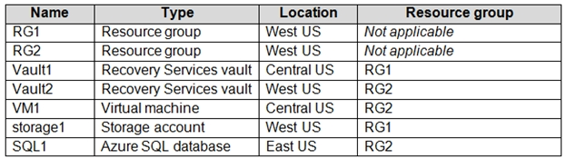
In storage1, you create a blob container named blob1 and a file share named share1.
Which resources can be backed up to Vault1 and Vault2? To answer, select the appropriate options in the answer area.
NOTE: Each correct selection is worth one point.
Hot Area:
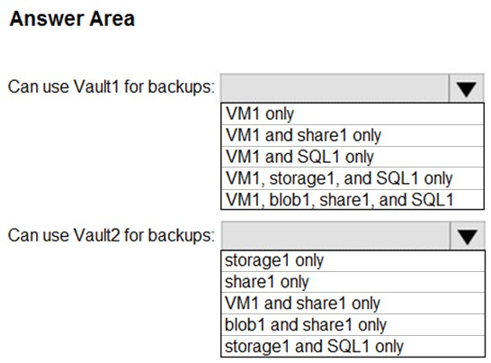

**Correct Answer:** 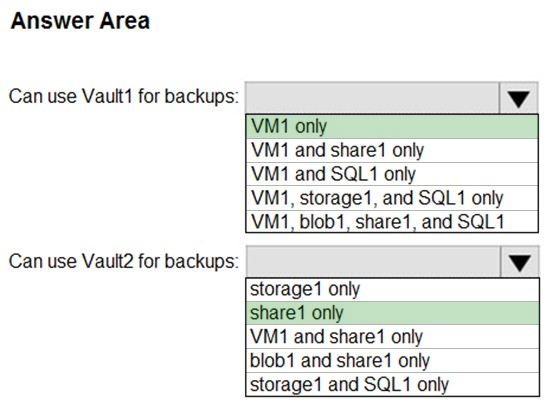

_Explanation:_
Box 1: VM1 only -
VM1 is in the same region as Vault1.
File1 is not in the same region as Vautl1.
SQL is not in the same region as Vault1.
Blobs cannot be backup up to service vaults.
Note: To create a vault to protect virtual machines, the vault must be in the same region as the virtual machines.
Box 2: Share1 only.
Storage1 is in the same region (West USA) as Vault2. Share1 is in Storage1.
Note: After you select Backup, the Backup pane opens and prompts you to select a storage account from a list of discovered supported storage accounts. They're either associated with this vault or present in the same region as the vault, but not yet associated to any Recovery Services vault.
Reference:
https://docs.microsoft.com/bs-cyrl-ba/azure/backup/backup-create-rs-vault https://docs.microsoft.com/en-us/azure/backup/backup-afs

---

### Question 176: Question #22 Topic 3

You have an Azure subscription named Subscription1.
You have 5 TB of data that you need to transfer to Subscription1.
You plan to use an Azure Import/Export job.
What can you use as the destination of the imported data?

- A. a virtual machine
- B. an Azure Cosmos DB database
- C. Azure File Storage
- D. the Azure File Sync Storage Sync Service

**Correct Answer:** C

---

### Question 177: Question #23 Topic 3

HOTSPOT -
You have an Azure subscription.
You create the Azure Storage account shown in the following exhibit.
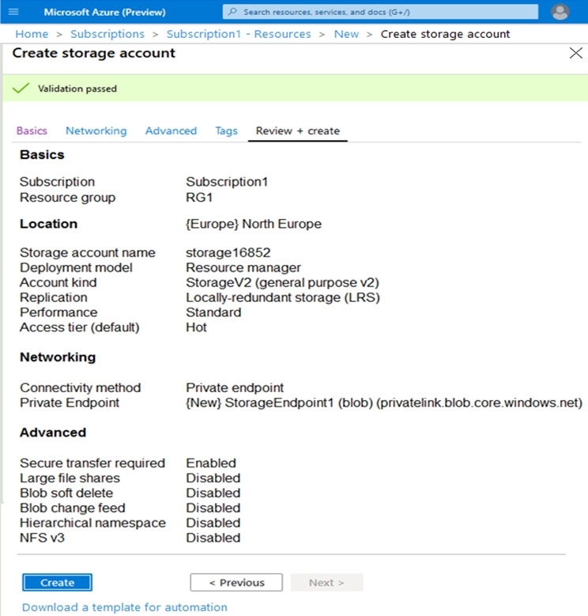
Use the drop-down menus to select the answer choice that completes each statement based on the information presented in the graphic.
NOTE: Each correct selection is worth one point.
Hot Area:
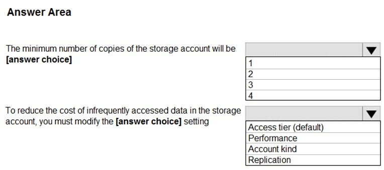

**Correct Answer:** 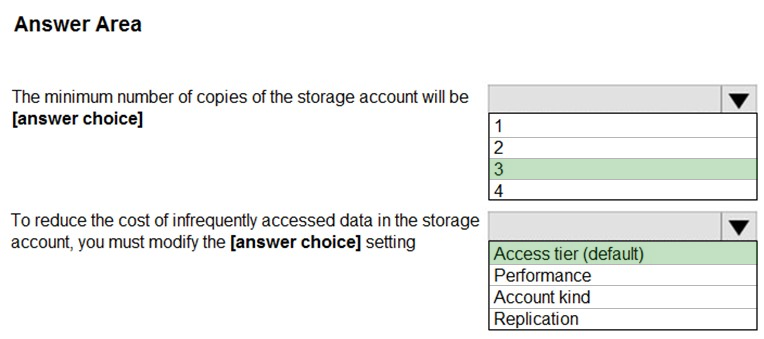

_Explanation:_
Box 1: 3 -
Locally Redundant Storage (LRS) provides highly durable and available storage within a single location (sub region). We maintain an equivalent of 3 copies
(replicas) of your data within the primary location as described in our SOSP paper; this ensures that we can recover from common failures (disk, node, rack) without impacting your storage account's availability and durability.
Box 2: Access tier -
Change the access tier from Hot to Cool.
Note: Azure storage offers different access tiers, which allow you to store blob object data in the most cost-effective manner. The available access tiers include:
Hot - Optimized for storing data that is accessed frequently.
Cool - Optimized for storing data that is infrequently accessed and stored for at least 30 days.
Archive - Optimized for storing data that is rarely accessed and stored for at least 180 days with flexible latency requirements (on the order of hours).
Reference:
https://azure.microsoft.com/en-us/blog/data-series-introducing-locally-redundant-storage-for-windows-azure-storage/ https://docs.microsoft.com/en-us/azure/storage/blobs/storage-blob-storage-tiers

---

### Question 178: Question #24 Topic 3

You have an Azure Storage account named storage1.
You plan to use AzCopy to copy data to storage1.
You need to identify the storage services in storage1 to which you can copy the data.
Which storage services should you identify?

- A. blob, file, table, and queue
- B. blob and file only
- C. file and table only
- D. file only
- E. blob, table, and queue only

**Correct Answer:** B

---

### Question 179: Question #25 Topic 3

HOTSPOT -
You have an Azure Storage account named storage1 that uses Azure Blob storage and Azure File storage.
You need to use AzCopy to copy data to the blob storage and file storage in storage1.
Which authentication method should you use for each type of storage? To answer, select the appropriate options in the answer area.
NOTE: Each correct selection is worth one point.
Hot Area:
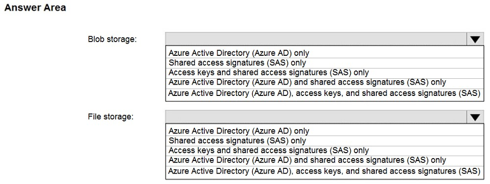

**Correct Answer:** 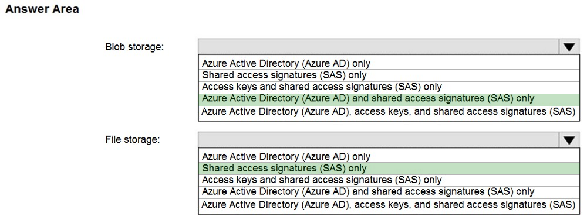

_Explanation:_
You can provide authorization credentials by using Azure Active Directory (AD), or by using a Shared Access Signature (SAS) token.
Box 1:
Both Azure Active Directory (AD) and Shared Access Signature (SAS) token are supported for Blob storage.
Box 2:
Only Shared Access Signature (SAS) token is supported for File storage.
Reference:
https://docs.microsoft.com/en-us/azure/storage/common/storage-use-azcopy-v10

---

### Question 180: Question #26 Topic 3

You have an Azure subscription that contains an Azure Storage account.
You plan to create an Azure container instance named container1 that will use a Docker image named Image1. Image1 contains a Microsoft SQL Server instance that requires persistent storage.
You need to configure a storage service for Container1.
What should you use?

- A. Azure Files
- B. Azure Blob storage
- C. Azure Queue storage
- D. Azure Table storage

**Correct Answer:** A

---

### Question 181: Question #27 Topic 3

You have an app named App1 that runs on two Azure virtual machines named VM1 and VM2.
You plan to implement an Azure Availability Set for App1. The solution must ensure that App1 is available during planned maintenance of the hardware hosting
VM1 and VM2.
What should you include in the Availability Set?

- A. one update domain
- B. two fault domains
- C. one fault domain
- D. two update domains

**Correct Answer:** D

---

### Question 182: Question #28 Topic 3

You have an Azure subscription named Subscription1.
You have 5 TB of data that you need to transfer to Subscription1.
You plan to use an Azure Import/Export job.
What can you use as the destination of the imported data?

- A. an Azure Cosmos DB database
- B. Azure Blob storage
- C. Azure Data Lake Store
- D. the Azure File Sync Storage Sync Service

**Correct Answer:** B

---

### Question 183: Question #29 Topic 3

DRAG DROP -
You have an Azure subscription that contains an Azure file share.
You have an on-premises server named Server1 that runs Windows Server 2016.
You plan to set up Azure File Sync between Server1 and the Azure file share.
You need to prepare the subscription for the planned Azure File Sync.
Which two actions should you perform in the Azure subscription? To answer, drag the appropriate actions to the correct targets. Each action may be used once, more than once, or not at all. You may need to drag the split bar between panes or scroll to view content.
NOTE: Each correct selection is worth one point.
Select and Place:
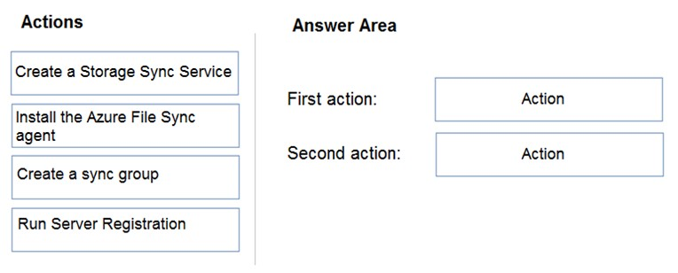

**Correct Answer:** 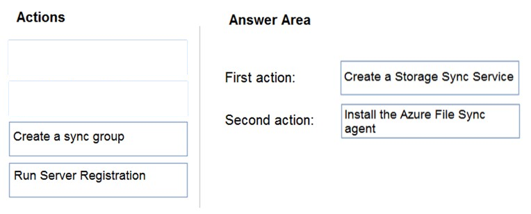

_Explanation:_
First action: Create a Storage Sync Service
The deployment of Azure File Sync starts with placing a Storage Sync Service resource into a resource group of your selected subscription.
Second action: Install the Azure File Sync agent
The Azure File Sync agent is a downloadable package that enables Windows Server to be synced with an Azure file share.
Reference:
https://docs.microsoft.com/en-us/azure/storage/files/storage-sync-files-deployment-guide

---

### Question 184: Question #30 Topic 3

HOTSPOT -
You have an Azure subscription that contains the file shares shown in the following table.
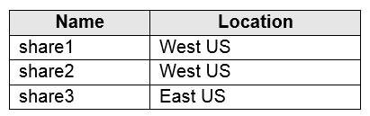
You have the on-premises file shares shown in the following table.
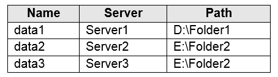
You create an Azure file sync group named Sync1 and perform the following actions:
✑ Add share1 as the cloud endpoint for Sync1.
✑ Add data1 as a server endpoint for Sync1.
✑ Register Server1 and Server2 to Sync1.
For each of the following statements, select Yes if the statement is true. Otherwise, select No.
NOTE: Each correct selection is worth one point.
Hot Area:
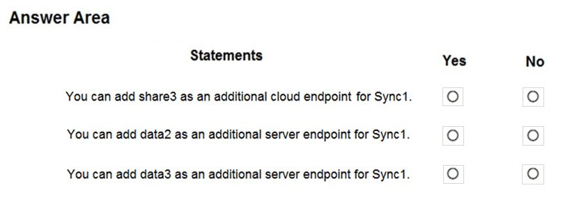

**Correct Answer:** 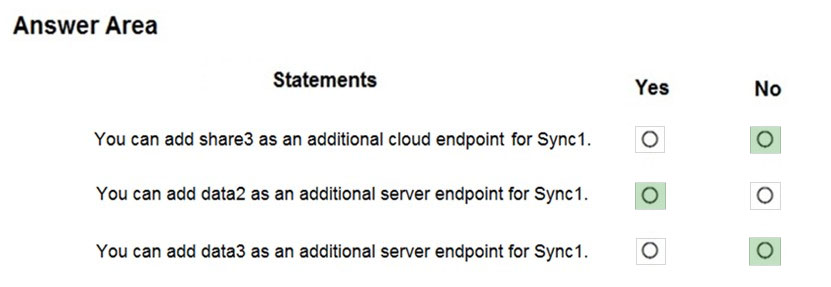

_Explanation:_
Box 1: No -
A sync group must contain one cloud endpoint, which represents an Azure file share and one or more server endpoints.
Box 2: Yes -
Data2 is located on Server2 which is registered to Sync1.
Box 3: No -
Data3 is located on Server3 which is not registered to Sync1.
Reference:
https://docs.microsoft.com/en-us/azure/storage/files/storage-sync-files-deployment-guide?tabs=azure-portal%2Cproactive-portal#create-a-sync-group-and-a- cloud-endpoint

---

### Question 185: Question #31 Topic 3

HOTSPOT -
You have an Azure subscription named Subscription1 that contains the resources shown in the following table:
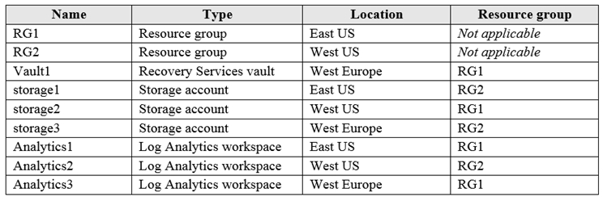
You plan to configure Azure Backup reports for Vault1.
You are configuring the Diagnostics settings for the AzureBackupReports log.
Which storage accounts and which Log Analytics workspaces can you use for the Azure Backup reports of Vault1? To answer, select the appropriate options in the answer area.
NOTE: Each correct selection is worth one point.
Hot Area:
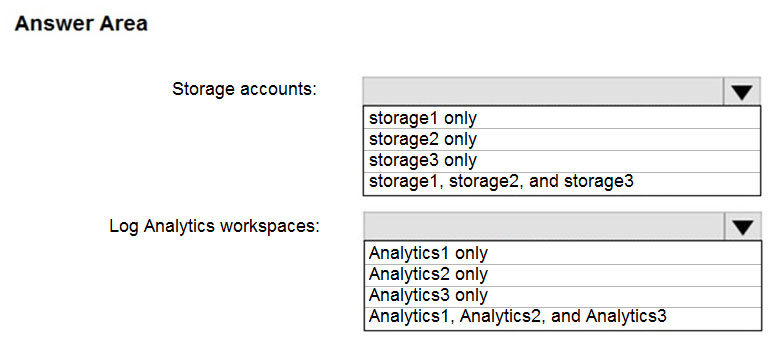

**Correct Answer:** 

_Explanation:_
Box 1: storage1, storage2, and storage3
The location and subscription where this Log Analytics workspace can be created is independent of the location and subscription where your vaults exist.
Box 2: Analytics3 -
Vault1 and Analytics3 are both in West Europe.
Reference:
https://docs.microsoft.com/en-us/azure/backup/backup-azure-configure-reports

---

### Question 186: Question #32 Topic 3

HOTSPOT -
You have an Azure subscription that contains the storage accounts shown in the following exhibit.
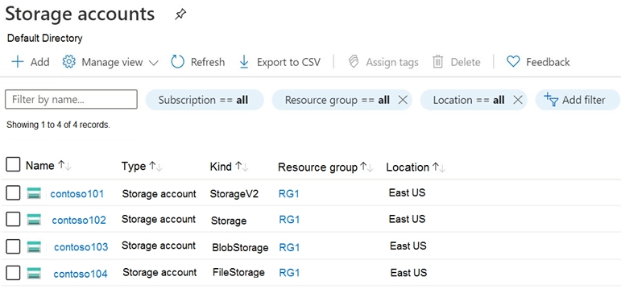
Use the drop-down menus to select the answer choice that completes each statement based on the information presented in the graphic.
NOTE: Each correct selection is worth one point.
Hot Area:
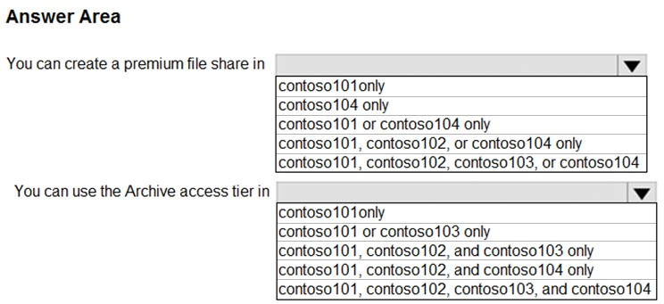

**Correct Answer:** 

_Explanation:_
Box 1: contoso104 only -
Premium file shares are hosted in a special purpose storage account kind, called a FileStorage account.
Box 2: contoso101, contoso102, and contos103 only
Reference:
https://docs.microsoft.com/en-us/azure/storage/files/storage-how-to-create-premium-fileshare?tabs=azure-portal https://docs.microsoft.com/en-us/azure/storage/blobs/storage-blob-storage-tiers

---

### Question 187: Question #33 Topic 3

HOTSPOT -
You have an Azure subscription named Subscription1.
In Subscription1, you create an Azure file share named share1.
You create a shared access signature (SAS) named SAS1 as shown in the following exhibit:
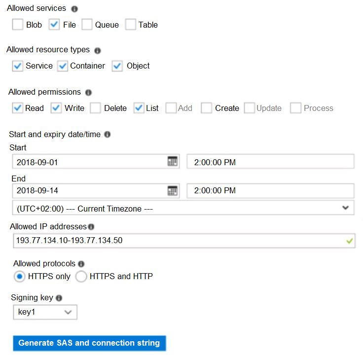
To answer, select the appropriate options in the answer area.
NOTE: Each correct selection is worth one point.
Hot Area:
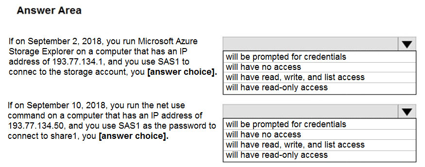

**Correct Answer:** 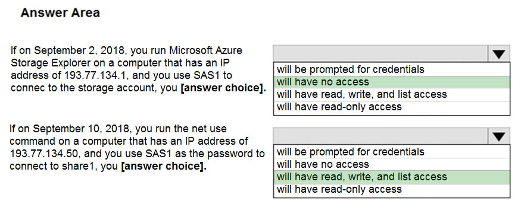

_Explanation:_
Box 1: Will have no access -
The IP 193.77.134.1 does not have access on the SAS.
Box 2: Will have read, write, and list access
The net use command is used to connect to file shares.
Reference:
https://docs.microsoft.com/en-us/azure/storage/common/storage-dotnet-shared-access-signature-part-1 https://docs.microsoft.com/en-us/azure/vs-azure-tools-storage-manage-with-storage-explorer?tabs=windows

---

### Question 188: Question #34 Topic 3

You have two Azure virtual machines named VM1 and VM2. You have two Recovery Services vaults named RSV1 and RSV2.
VM2 is backed up to RSV1.
You need to back up VM2 to RSV2.
What should you do first?

- A. From the RSV1 blade, click Backup items and stop the VM2 backup
- B. From the RSV2 blade, click Backup. From the Backup blade, select the backup for the virtual machine, and then click Backup
- C. From the VM2 blade, click Disaster recovery, click Replication settings, and then select RSV2 as the Recovery Services vault
- D. From the RSV1 blade, click Backup Jobs and export the VM2 job

**Correct Answer:** A

---

### Question 189: Question #35 Topic 3

You have a general-purpose v1 Azure Storage account named storage1 that uses locally-redundant storage (LRS).
You need to ensure that the data in the storage account is protected if a zone fails. The solution must minimize costs and administrative effort.
What should you do first?

- A. Create a new storage account.
- B. Configure object replication rules.
- C. Upgrade the account to general-purpose v2.
- D. Modify the Replication setting of storage1.

**Correct Answer:** C

---

### Question 190: Question #36 Topic 3

You have an Azure subscription that contains the storage accounts shown in the following table.
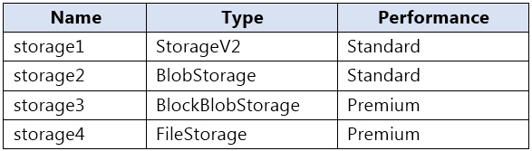
You plan to manage the data stored in the accounts by using lifecycle management rules.
To which storage accounts can you apply lifecycle management rules?

- A. storage1 only
- B. storage1 and storage2 only
- C. storage3 and storage4 only
- D. storage1, storage2, and storage3 only
- E. storage1, storage2, storage3, and storage4

**Correct Answer:** D

---

### Question 191: Question #37 Topic 3

You create an Azure Storage account named contosostorage.
You plan to create a file share named data.
Users need to map a drive to the data file share from home computers that run Windows 10.
Which outbound port should you open between the home computers and the data file share?

- A. 80
- B. 443
- C. 445
- D. 3389

**Correct Answer:** C

---

### Question 192: Question #38 Topic 3

You have an Azure subscription named Subscription1.
You have 5 TB of data that you need to transfer to Subscription1.
You plan to use an Azure Import/Export job.
What can you use as the destination of the imported data?

- A. Azure File Storage
- B. an Azure Cosmos DB database
- C. Azure Data Factory
- D. Azure SQL Database

**Correct Answer:** A

---

### Question 193: Question #39 Topic 3

HOTSPOT -
You have an Azure subscription that contains an Azure Storage account named storageaccount1.
You export storageaccount1 as an Azure Resource Manager template. The template contains the following sections.

For each of the following statements, select Yes if the statement is true. Otherwise, select No.
NOTE: Each correct selection is worth one point
Hot Area:
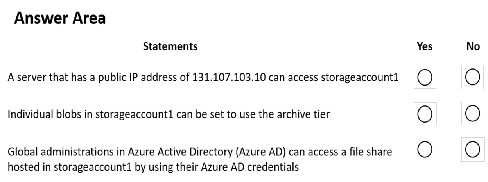

**Correct Answer:** 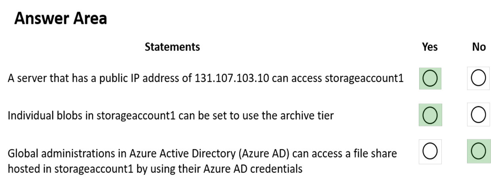

_Explanation:_
Reference:
https://docs.microsoft.com/en-us/azure/templates/microsoft.storage/storageaccounts?tabs=json

---

### Question 194: Question #40 Topic 3

You have an Azure subscription that contains a storage account named storage1.
You have the devices shown in the following table.
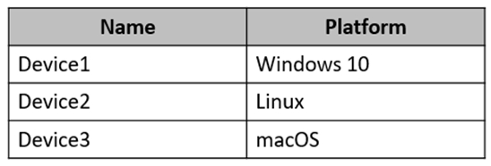
From which devices can you use AzCopy to copy data to storage1?

- A. Device 1 only
- B. Device1, Device2 and Device3
- C. Device1 and Device2 only
- D. Device1 and Device3 only

**Correct Answer:** B

---

### Question 195: Question #41 Topic 3

You have an Azure Storage account named storage1 that contains a blob container named container1.
You need to prevent new content added to container1 from being modified for one year.
What should you configure?

- A. the access tier
- B. an access policy
- C. the Access control (IAM) settings
- D. the access level

**Correct Answer:** B

---

### Question 196: Question #42 Topic 3

HOTSPOT -
You have an Azure Storage account named storage1 that contains a blob container. The blob container has a default access tier of Hot. Storage1 contains a container named conainer1.
You create lifecycle management rules in storage1 as shown in the following table.
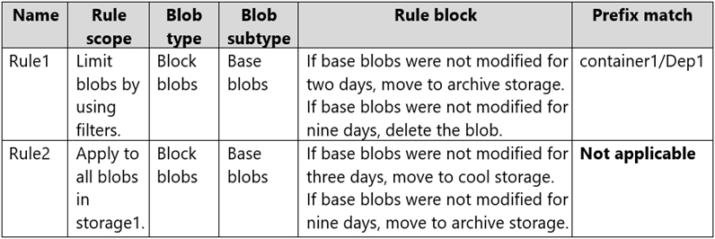
You perform the actions shown in the following table.

For each of the following statements, select Yes if the statement is true. Otherwise, select No.
NOTE: Each correct selection is worth one point.
Hot Area:
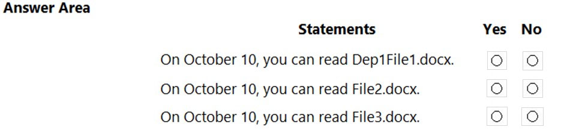

**Correct Answer:** 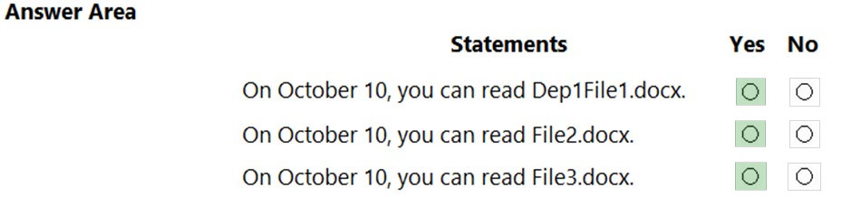

---

### Question 197: Question #43 Topic 3

You are configuring Azure Active Directory (Azure AD) authentication for an Azure Storage account named storage1.
You need to ensure that the members of a group named Group1 can upload files by using the Azure portal. The solution must use the principle of least privilege.
Which two roles should you configure for storage1? Each correct answer presents part of the solution.
NOTE: Each correct selection is worth one point.

- A. Storage Account Contributor
- B. Storage Blob Data Contributor
- C. Reader
- D. Contributor
- E. Storage Blob Data Reader

**Correct Answer:** BC

---

### Question 198: Question #44 Topic 3

HOTSPOT -
You have an Azure Storage account named storage1 that stores images.
You need to create a new storage account and replicate the images in storage1 to the new account by using object replication.
How should you configure the new account? To answer, select the appropriate options in the answer area.
NOTE: Each correct selection is worth one point.
Hot Area:
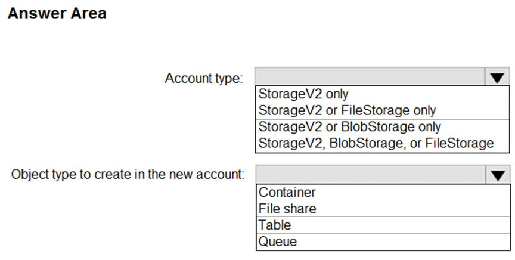

**Correct Answer:** 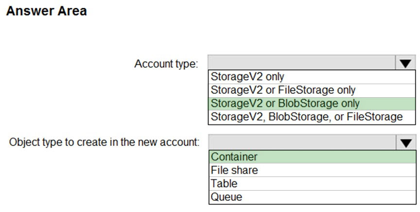

_Explanation:_
Reference:
https://docs.microsoft.com/en-us/azure/storage/blobs/object-replication-overview

---

### Question 199: Question #45 Topic 3

You have an on-premises server that contains a folder named D:\Folder1.
You need to copy the contents of D:\Folder1 to the public container in an Azure Storage account named contosodata.
Which command should you run?

- A. https://contosodata.blob.core.windows.net/public
- B. azcopy sync D:\folder1 https://contosodata.blob.core.windows.net/public --snapshot
- C. azcopy copy D:\folder1 https://contosodata.blob.core.windows.net/public --recursive
- D. az storage blob copy start-batch D:\Folder1 https://contosodata.blob.core.windows.net/public

**Correct Answer:** C

---

### Question 200: Question #46 Topic 3

You have an Azure subscription.
In the Azure portal, you plan to create a storage account named storage1 that will have the following settings:
✑ Performance: Standard
✑ Replication: Zone-redundant storage (ZRS)
✑ Access tier (default): Cool
✑ Hierarchical namespace: Disabled
You need to ensure that you can set Account kind for storage1 to BlockBlobStorage.
Which setting should you modify first?

- A. Performance
- B. Replication
- C. Access tier (default)
- D. Hierarchical namespace

**Correct Answer:** A

---

### Question 201: Question #47 Topic 3

DRAG DROP -
You have an Azure subscription that contains the storage accounts shown in the following table.
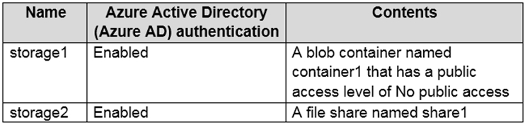
You plan to use AzCopy to copy a blob from container1 directly to share1.
You need to identify which authentication method to use when you use AzCopy.
What should you identify for each account? To answer, drag the appropriate authentication methods to the correct accounts. Each method may be used once, more than once, or not at all. You may need to drag the split bar between panes or scroll to view content.
NOTE: Each correct selection is worth one point.
Select and Place:
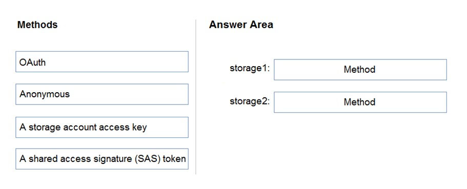

**Correct Answer:** 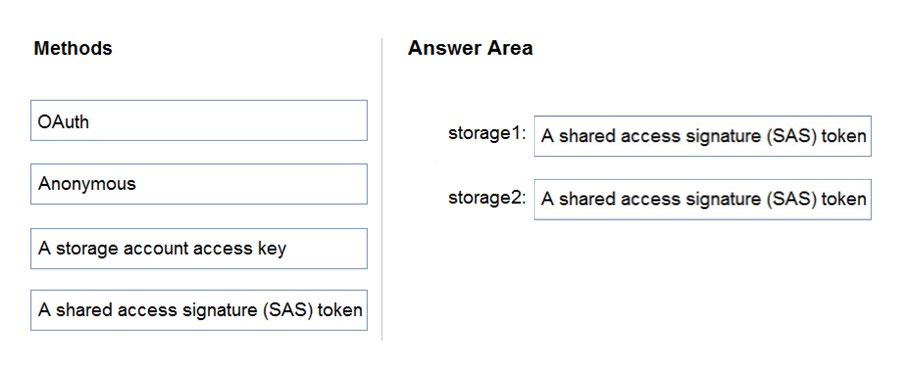

_Explanation:_
Box 1: A shared access signature (SAS) token.
You can provide authorization credentials by using Azure Active Directory (AD), or by using a Shared Access Signature (SAS) token.
For Blob storage you can use Azure AD & SAS.
Note: In the current release, if you plan to copy blobs between storage accounts, you'll have to append a SAS token to each source URL. You can omit the SAS token only from the destination URL.
Box 2: A shared access signature (SAS) token.
For File storage you can only use SAS.
Reference:
https://docs.microsoft.com/en-us/azure/storage/common/storage-use-azcopy-v10

---

### Question 202: Question #48 Topic 3

You create an Azure Storage account.
You plan to add 10 blob containers to the storage account.
For one of the containers, you need to use a different key to encrypt data at rest.
What should you do before you create the container?

- A. Generate a shared access signature (SAS).
- B. Modify the minimum TLS version.
- C. Rotate the access keys.
- D. Create an encryption scope.

**Correct Answer:** D

---

### Question 203: Question #49 Topic 3

HOTSPOT
-
You have an Azure subscription. The subscription contains a storage account named storage1 that has the lifecycle management rules shown in the following table.
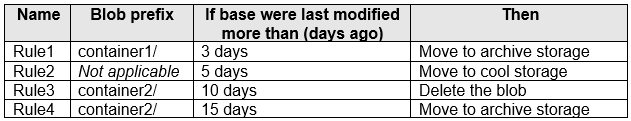
On June 1, you store two blobs in storage1 as shown in the following table.
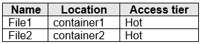
For each of the following statements, select Yes if the statement is true. Otherwise, select No.
NOTE: Each correct selection is worth one point.
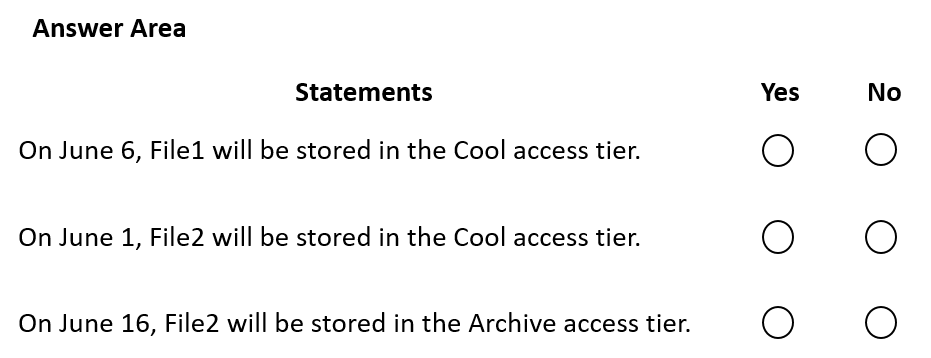

**Correct Answer:** 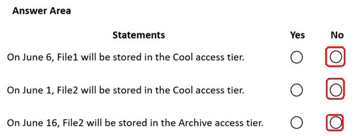

---

### Question 204: Question #50 Topic 3

HOTSPOT
-
You have an Azure subscription.
You plan to deploy a storage account named storage1 by using the following Azure Resource Manager (ARM) template.
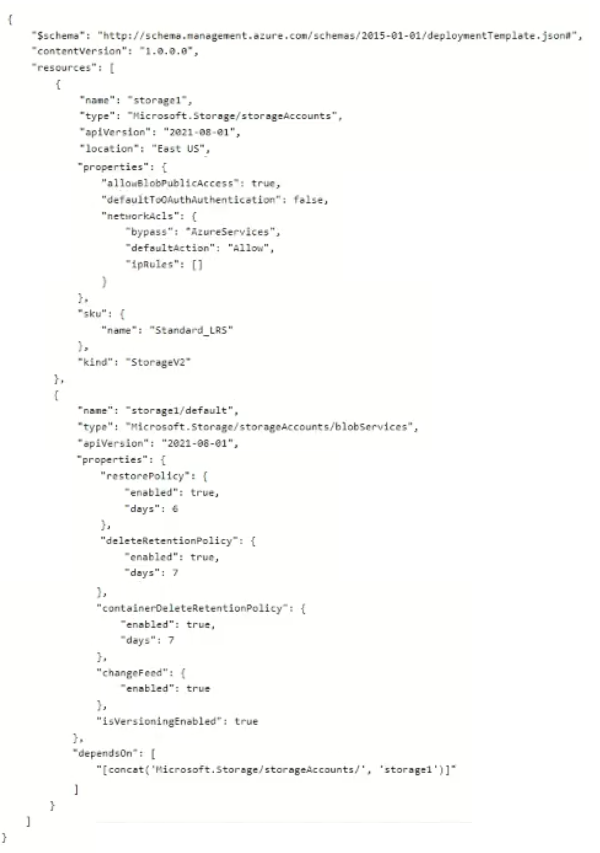
For each of the following statements, select Yes if the statement is hue. Otherwise, select No.
NOTE: Each correct selection is worth one point.
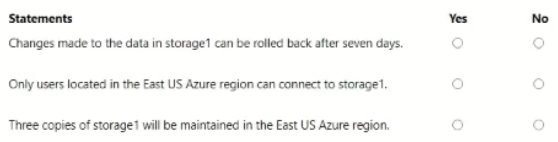

**Correct Answer:** 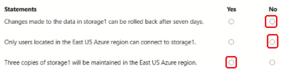

---

### Question 205: Question #51 Topic 3

You have an on-premises server that contains a folder named D:\Folder1.
You need to copy the contents of D:\Folder1 to the public container in an Azure Storage account named contosodata.
Which command should you run?

- A. az storage blob copy start D:\Folder1 https://contosodata.blob.core.windows.net/public
- B. azcopy sync D:\folder1 https://contosodata.blob.core.windows.net/public --snapshot
- C. azcopy copy D:\folder1 https://contosodata.blob.core.windows.net/public --recursive
- D. az storage blob copy start-batch D:\Folder1 https://contosodata.blob.core.windows.net/public

**Correct Answer:** C

---

### Question 206: Question #52 Topic 3

HOTSPOT
-
You have an Azure subscription that contains a storage account named storage1. The storage1 account contains a container named container1.
You need to create a lifecycle management rule for storage1 that will automatically move the blobs in container1 to the lowest-cost tier after 90 days.
How should you complete the rule? To answer, select the appropriate options in the answer area.
NOTE: Each correct selection is worth one point.
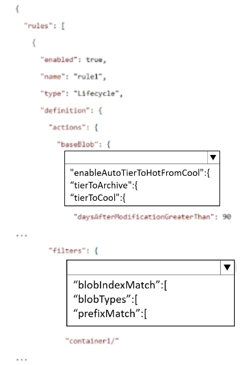

**Correct Answer:** 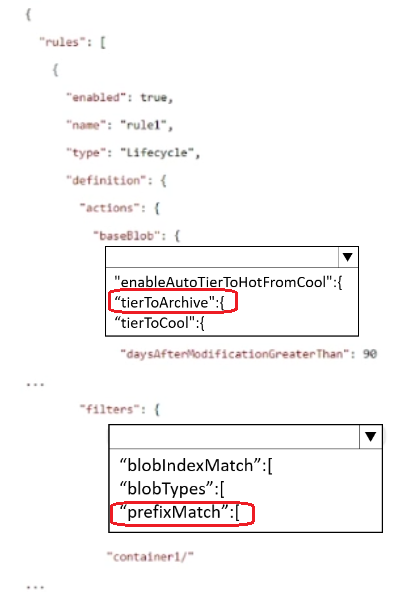

---

### Question 207: Question #53 Topic 3

DRAG DROP
-
You have an Azure subscription that contains a virtual machine named VM1.
You need to back up VM1. The solution must ensure that backups are stored across three availability zones in the primary region.
Which three actions should you perform in sequence? To answer, move the appropriate actions from the list of actions to the answer area and arrange them in the correct order.
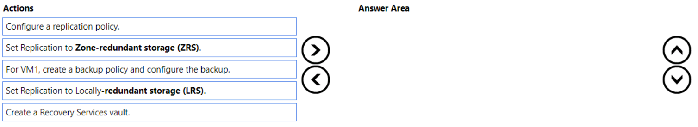

**Correct Answer:** 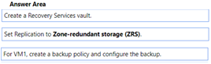

---

### Question 208: Question #54 Topic 3

You have an Azure subscription named Subscription1.
You have 5 TB of data that you need to transfer to Subscription1.
You plan to use an Azure Import/Export job.
What can you use as the destination of the imported data?

- A. an Azure Cosmos DB database
- B. Azure File Storage
- C. Azure SQL Database
- D. a virtual machine

**Correct Answer:** B

---

### Question 209: Question #55 Topic 3

You have an Azure subscription that contains the resources shown in the following table.
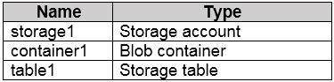
You need to perform the tasks shown in the following table.
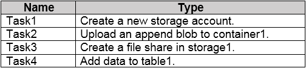
Which tasks can you perform by using Azure Storage Explorer?

- A. Task1 and Task3 only
- B. Task1, Task2, and Task3 only
- C. Task1, Task3, and Task4 only
- D. Task2, Task3, and Task4 only
- E. Task1, Task2, Task3, and Task4

**Correct Answer:** D

---

### Question 210: Question #56 Topic 3

HOTSPOT
-
You have an Azure AD user named User1 and a read-access geo-redundant storage (RA-GRS) account named contoso2023.
You need to meet the following requirements:
•User1 must be able to write blob data to contoso2023.
•The contoso2023 account must fail over to its secondary endpoint.
Which two settings should you configure? To answer, select the appropriate settings in the answer area.
NOTE: Each correct selection is worth one point.
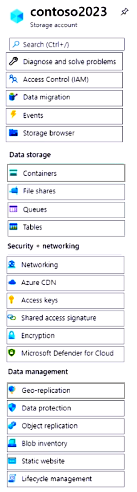

**Correct Answer:** 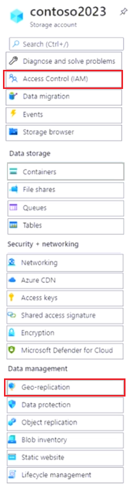

---

### Question 211: Question #57 Topic 3

You have an Azure subscription that contains a storage account named storage1.
You plan to create a blob container named container1.
You need to use customer-managed key encryption for container1.
Which key should you use?

- A. an EC key that uses the P-384 curve only
- B. an EC key that uses the P-521 curve only
- C. an EC key that uses the P-384 curve or P-521 curve only
- D. an RSA key with a key size of 4096 only
- E. an RSA key type with a key size of 2048, 3072, or 4096 only

**Correct Answer:** E

---

### Question 212: Question #58 Topic 3

HOTSPOT
-
You have an Azure subscription that contains a user named User1 and a storage account named storage1. The storage1 account contains the resources shown in the following table.
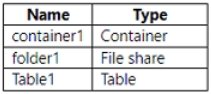
User1 is assigned the following roles for storage1:
•Storage Blob Data Reader
•Storage Table Data Contributor
•Storage File Data SMB Share Contributor
For storage1, you create a shared access signature (SAS) named SAS1 that has the settings shown in the following exhibit. (Click the Exhibit tab.)
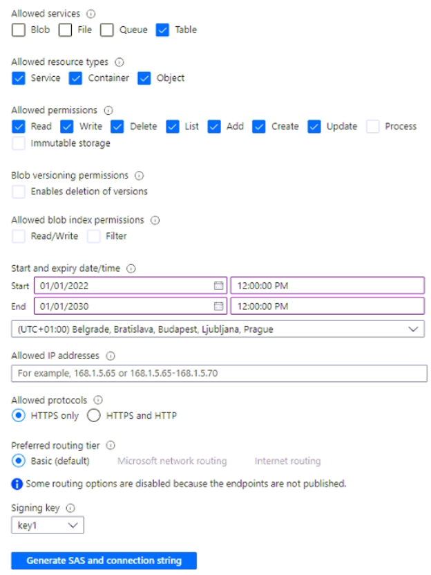
To which resources can User1 write by using SAS1 and key1? To answer, select the appropriate options in the answer area.
NOTE: Each correct selection is worth one point.
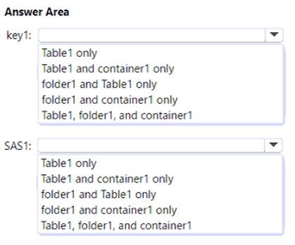

**Correct Answer:** 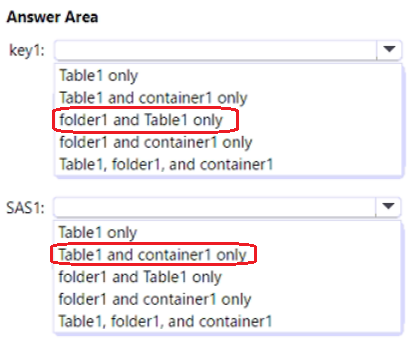

---

### Question 213: Question #59 Topic 3

HOTSPOT
-
You have an Azure subscription that contains the storage account shown in the following exhibit.
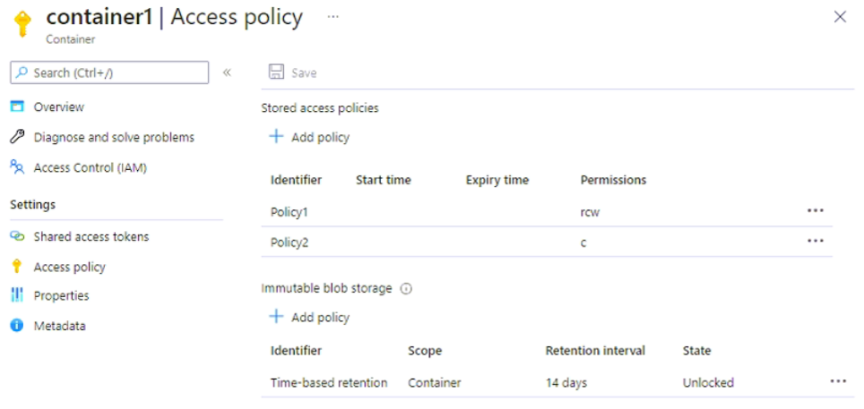
Use the drop-down menus to select the answer choice that completes each statement based on the information presented in the graphic
NOTE: Each correct selection is worth one point.
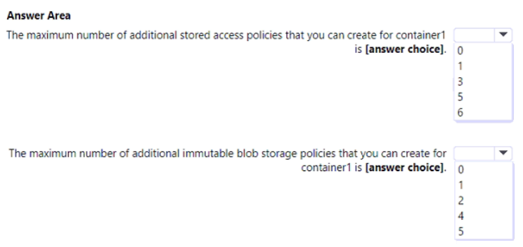

**Correct Answer:** 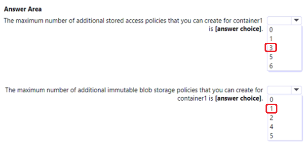

---

### Question 214: Question #60 Topic 3

You have an Azure subscription named Subscription1.
You have 5 TB of data that you need to transfer to Subscription1.
You plan to use an Azure Import/Export job.
What can you use as the destination of the imported data?

- A. Azure Blob Storage
- B. Azure Data Lake Store
- C. Azure SQL Database
- D. a virtual machine

**Correct Answer:** A

---

### Question 215: Question #61 Topic 3

You have an Azure subscription. The subscription contains a storage account named storage1 that has the lifecycle management rules shown in the following table.
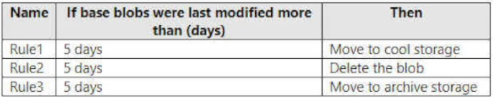
On June 1, you store a blob named File1 in the Hot access tier of storage1.
What is the state of File1 on June 7?

- A. stored in the Cool access tier
- B. stored in the Archive access tier
- C. stored in the Hot access tier
- D. deleted

**Correct Answer:** D

---

### Question 216: Question #62 Topic 3

HOTSPOT
-
You have an Azure subscription that contains the storage accounts shown in the following table.
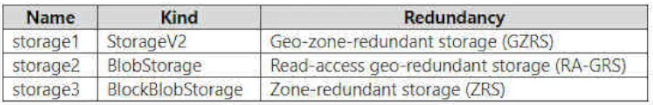
You need to identify which storage accounts support lifecycle management, and which storage accounts support moving data to the Archive access tier.
Which storage accounts should you use? To answer, select the appropriate options in the answer area.
NOTE: Each correct selection is worth one point.
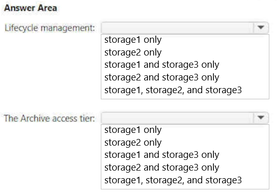

**Correct Answer:** 

---

### Question 217: Question #63 Topic 3

You have an Azure subscription named Subscription1.
You have 5 TB of data that you need to transfer to Subscription1.
You plan to use an Azure Import/Export job.
What can you use as the destination of the imported data?

- A. an Azure Cosmos DB database
- B. Azure Data Lake Store
- C. Azure Blob storage
- D. Azure Data Factory

**Correct Answer:** C

---

### Question 218: Question #64 Topic 3

HOTSPOT
-
You have an Azure subscription that contains a storage account named storage1. The storage1 account contains a container named container1.
You create a blob lifecycle rule named rule1.
You need to configure rule1 to automatically move blobs that were NOT updated for 45 days from contained to the Cool access tier.
How should you complete the rule? To answer, select the appropriate options in the answer area.
NOTE: Each correct selection is worth one point.
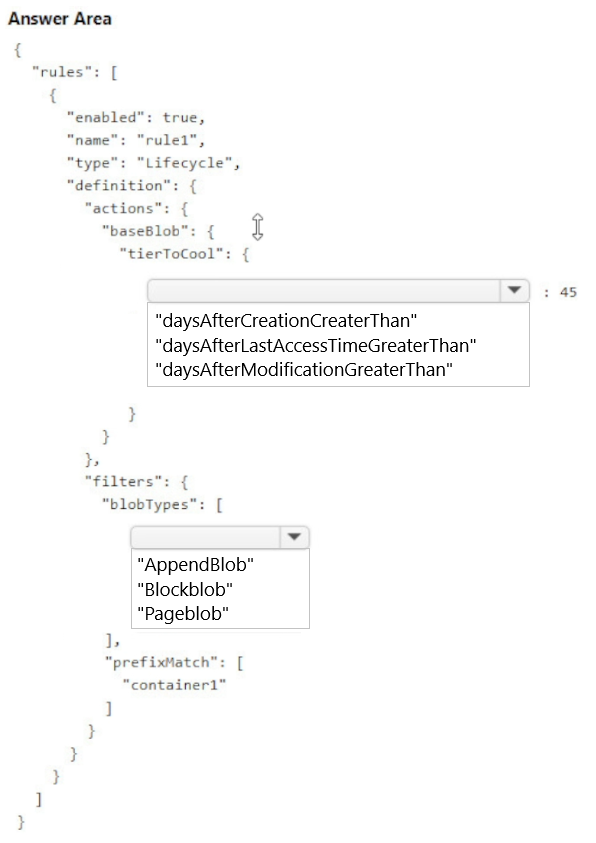

**Correct Answer:** 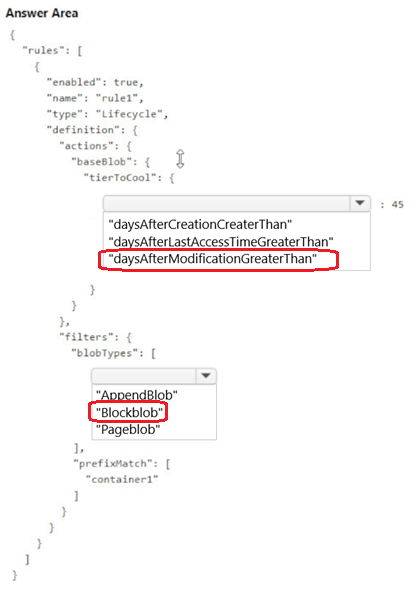

---

### Question 219: Question #65 Topic 3

You have an Azure subscription named Subscription1.
You have 5 TB of data that you need to transfer to Subscription1.
You plan to use an Azure Import/Export job.
What can you use as the destination of the imported data?

- A. an Azure Cosmos DB database
- B. Azure Blob Storage
- C. Azure SQL Database
- D. the Azure File Sync Storage Sync Service

**Correct Answer:** B

---

### Question 220: Question #66 Topic 3

You plan to create an Azure Storage account named storage1 that will contain a file share named share1.
You need to ensure that share1 can support SMB Multichannel. The solution must minimize costs.
How should you configure storage?

- A. Premium performance with locally-redundant storage (LRS)
- B. Standard performance with zone-redundant storage (ZRS)
- C. Premium performance with geo-redundant storage (GRS)
- D. Standard performance with locally-redundant storage (LRS)

**Correct Answer:** A

---

### Question 221: Question #67 Topic 3

You have an Azure subscription named Subscription1.
You have 5 TB of data that you need to transfer to Subscription1.
You plan to use an Azure Import/Export job.
What can you use as the destination of the imported data?

- A. Azure Data Lake Store
- B. Azure File Storage
- C. Azure SQL Database
- D. the Azure File Sync Storage Sync Service

**Correct Answer:** B

---

### Question 222: Question #68 Topic 3

You have an Azure subscription that contains a storage account named storage1.
You plan to use conditions when assigning role-based access control (RBAC) roles to storage1.
Which storage1 services support conditions when assigning roles?

- A. containers only
- B. file shares only
- C. tables only
- D. queues only
- E. containers and queues only
- F. files shares and tables only

**Correct Answer:** E

---

### Question 223: Question #69 Topic 3

HOTSPOT
-
You have an Azure subscription that contains the resource groups shown in the following table.
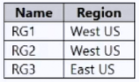
The subscription contains the virtual networks shown in the following table.
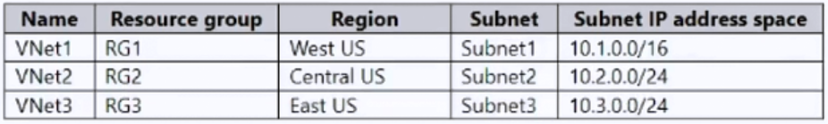
You plan to deploy the Azure Kubernetes Service (AKS) clusters shown in the following table.
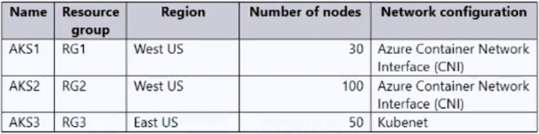
For each of the following statements, select Yes if the statement is true. Otherwise, select No.
NOTE: Each correct selection is worth one point.
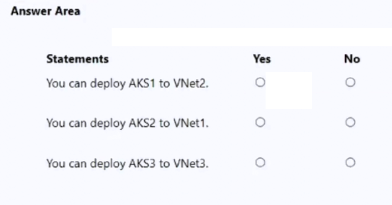

**Correct Answer:** 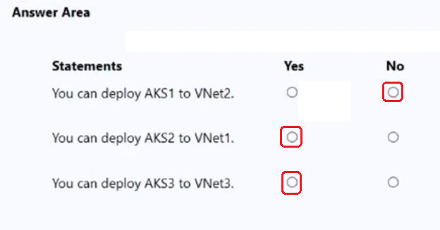

---

### Question 224: Question #70 Topic 3

Note: This question is part of a series of questions that present the same scenario. Each question in the series contains a unique solution that might meet the stated goals. Some question sets might have more than one correct solution, while others might not have a correct solution.
After you answer a question in this section, you will NOT be able to return to it. As a result, these questions will not appear in the review screen.
You have an Azure Storage account named storage1.
You need to enable a user named User1 to list and regenerate storage account keys for storage1.
Solution: You assign the Storage Account Encryption Scope Contributor Role to User1.
Does this meet the goal?

- A. Yes
- B. No

**Correct Answer:** B

---

### Question 225: Question #71 Topic 3

HOTSPOT
-
You have an Azure subscription that has offices in the East US and West US Azure regions.
You plan to create the storage account shown in the following exhibit.
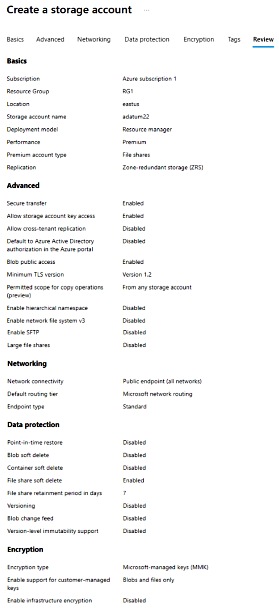
Use the drop-down menus to select the answer choice that completes each statement based on the information presented in the graphic.
NOTE: Each correct selection is worth one point.
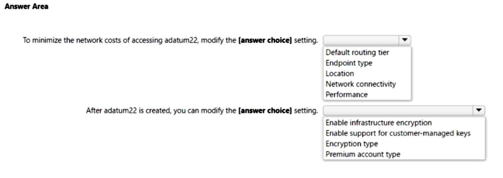

**Correct Answer:** 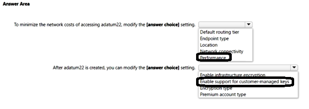

---

### Question 226: Question #72 Topic 3

HOTSPOT
-
You have an Azure subscription.
You plan to deploy a new storage account.
You need to configure encryption for the account. The solution must meet the following requirements:
•Use a customer-managed key stored in a key vault.
•Use the maximum supported bit length.
Which type of key and which bit length should you use? To answer, select the appropriate options in the answer area.
NOTE: Each correct selection is worth one point.
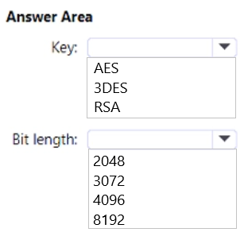

**Correct Answer:** 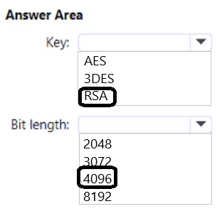

---

### Question 227: Question #73 Topic 3

You have an Azure Storage account that contains 5,000 blobs accessed by multiple users.
You need to ensure that the users can view only specific blobs based on blob index tags.
What should you include in the solution?

- A. a role assignment condition
- B. a stored access policy
- C. just-in-time (JIT) VM access
- D. a shared access signature (SAS)

**Correct Answer:** A

---

### Question 228: Question #74 Topic 3

You have an Azure Storage account named storage1.
For storage1, you create an encryption scope named Scope1.
Which storage types can you encrypt by using Scope?

- A. file shares only
- B. containers only
- C. file shares and containers only
- D. containers and tables only
- E. file shares, containers, and tables only
- F. file shares, containers, tables, and queues

**Correct Answer:** B

---

### Question 229: Question #75 Topic 3

HOTSPOT
-
You have an Azure subscription.
You plan to create a role definition to meet the following requirements:
•Users must be able to view the configuration data of a storage account.
•Users must be able to perform all actions on a virtual network.
•The solution must use the principle of least privilege.
What should you include in the role definition for each requirement? To answer, select the appropriate options in the answer area.
NOTE: Each correct selection is worth one point.
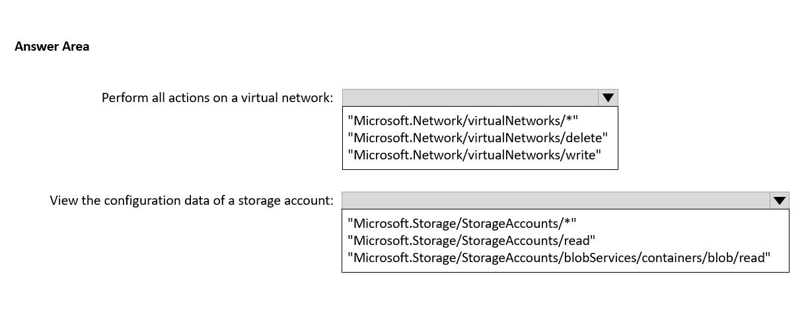

**Correct Answer:** 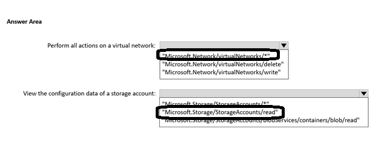

---

### Question 230: Question #76 Topic 3

You have an Azure subscription named Subscription1.
You have 5 TB of data that you need to transfer to Subscription1.
You plan to use an Azure Import/Export job.
What can you use as the destination of the imported data?

- A. Azure Data Factory
- B. the Azure File Sync Storage Sync Service
- C. Azure File Storage
- D. Azure SQL Database

**Correct Answer:** C

---

### Question 231: Question #77 Topic 3

HOTSPOT
-
You have an Azure subscription that contains a virtual machine named VM1.
To VM1, you plan to add a 1-TB data disk that meets the following requirements:
•Provides data resiliency in the event of a datacenter outage.
•Provides the lowest latency and the highest performance.
•Ensures that no data loss occurs if a host fails.
You need to recommend which type of storage and host caching to configure for the new data disk.
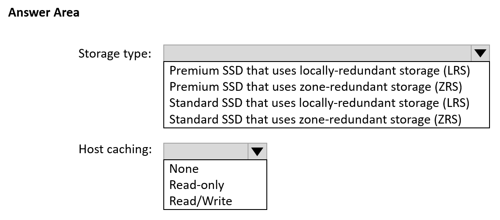

**Correct Answer:** 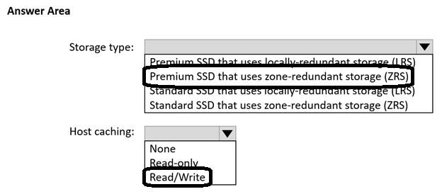

---

### Question 232: Question #78 Topic 3

You have an Azure virtual machine named VM1 and an Azure key vault named Vault1.
On VM1, you plan to configure Azure Disk Encryption to use a key encryption key (KEK).
You need to prepare Vault1 for Azure Disk Encryption.
Which two actions should you perform on Vault1? Each correct answer presents part of the solution.
NOTE: Each correct selection is worth one point.

- A. Select Azure Virtual machines for deployment.
- B. Create a new key.
- C. Create a new secret.
- D. Configure a key rotation policy.
- E. Select Azure Disk Encryption for volume encryption.

**Correct Answer:** BE

---

### Question 233: Question #79 Topic 3

You have an Azure subscription that contains a virtual machine named VM1 and an Azure key vault named KV1.
You need to configure encryption for VM1. The solution must meet the following requirements:
•Store and use the encryption key in KV1.
•Maintain encryption if VM1 is downloaded from Azure.
•Encrypt both the operating system disk and the data disks.
Which encryption method should you use?

- A. customer-managed keys
- B. Confidential disk encryption
- C. Azure Disk Encryption
- D. encryption at host

**Correct Answer:** C

---

### Question 234: Question #80 Topic 3

HOTSPOT
-
You have an Azure subscription that contains a storage account named storage1.
You need to configure a shared access signature (SAS) to ensure that users can only download blobs securely by name.
Which two settings should you configure? To answer, select the appropriate settings in the answer area.
NOTE: Each correct answer is worth one point.
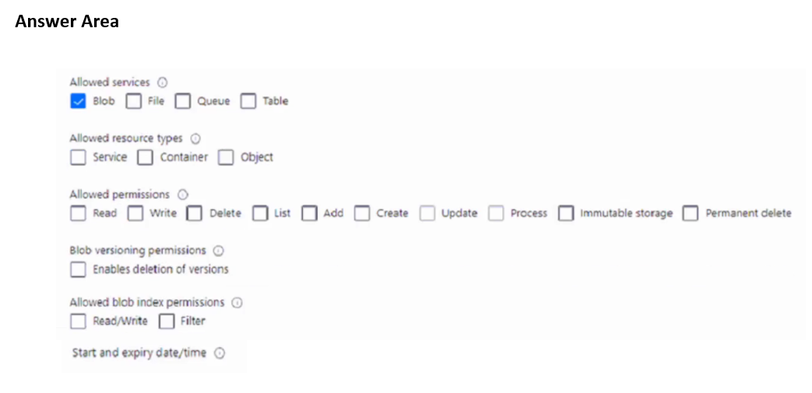

**Correct Answer:** 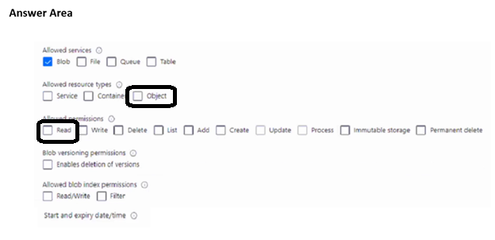

---

### Question 235: Question #81 Topic 3

You have an Azure subscription that contains a storage account named storage1. The storage1 account contains a container named container1.
You need to configure access to container1. The solution must meet the following requirements:
•Only allow read access.
•Allow both HTTP and HTTPS protocols.
•Apply access permissions to all the content in the container.
What should you use?

- A. an access policy
- B. a shared access signature (SAS)
- C. Azure Content Delivery Network (CDN)
- D. access keys

**Correct Answer:** B

---

### Question 236: Question #82 Topic 3

You need to create an Azure Storage account named storage1. The solution must meet the following requirements:
•Support Azure Data Lake Storage.
•Minimize costs for infrequently accessed data.
•Automatically replicate data to a secondary Azure region.
Which three options should you configure for storage1? Each correct answer presents part of the solution.
NOTE: Each correct answer is worth one point.

- A. zone-redundant storage (ZRS)
- B. the Cool access tire
- C. geo-redundant storage (GRS)
- D. the Hot access tier
- E. hierarchical namespace

**Correct Answer:** BCE

---

### Question 237: Question #83 Topic 3

HOTSPOT
-
You have an Azure Storage account named storage1 that contains two containers named container1 and container2. Blob versioning is enabled for both containers.
You periodically take blob snapshots of critical blobs.
You create the following lifecycle management policy.
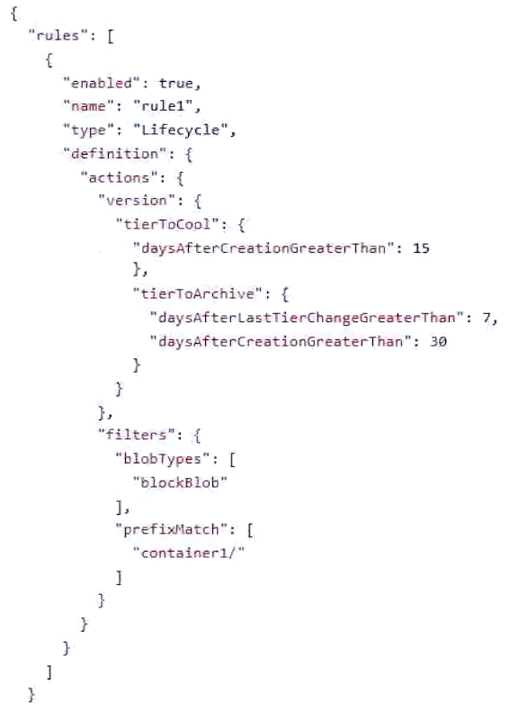
For each of the following statements, select Yes if the statement is true. Otherwise, select No.
NOTE: Each correct selection is worth one point.
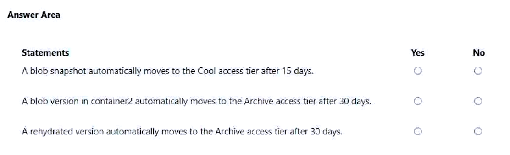

**Correct Answer:** 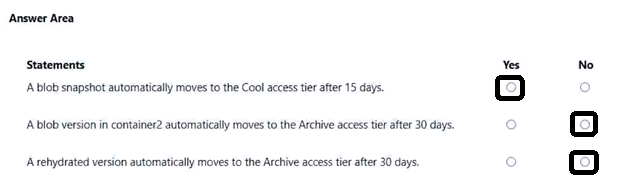

---

### Question 238: Question #84 Topic 3

You have an Azure subscription that contains the storage accounts shown in the following table.
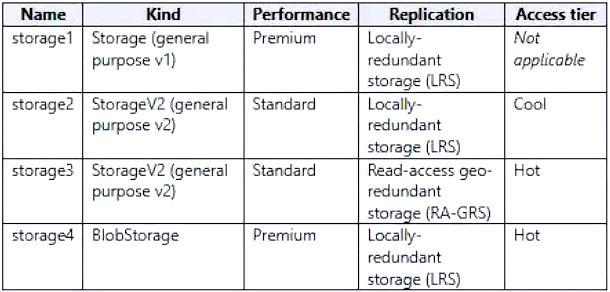
Which storage account can be converted to zone-redundant storage (ZRS) replication?

- A. storage1
- B. storage2
- C. storage3
- D. storage4

**Correct Answer:** B

---

### Question 239: Question #85 Topic 3

You have an Azure subscription that contains the devices shown in the following table.
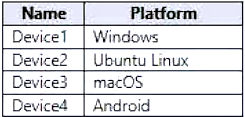
On which devices can you install Azure Storage Explorer?

- A. Device1 only
- B. Device1 and Device2 only
- C. Device1 and Device3 only
- D. Device1, Device2, and Device3 only
- E. Device1, Device3, and Device4 only

**Correct Answer:** D

---

### Question 240: Question #86 Topic 3

Note: This question is part of a series of questions that present the same scenario. Each question in the series contains a unique solution that might meet the stated goals. Some question sets might have more than one correct solution, while others might not have a correct solution.
After you answer a question in this section, you will NOT be able to return to it. As a result, these questions will not appear in the review screen.
You have an Azure Storage account named storage1.
You need to enable a user named User1 to list and regenerate storage account keys for storage1.
Solution: You assign the Storage Account Key Operator Service Role to User1.
Does this meet the goal?

- A. Yes
- B. No

**Correct Answer:** A

---

### Question 241: Question #87 Topic 3

HOTSPOT
-
You have an Azure Storage account named storage1 that contains a container named container1. The container1 container stores thousands of image files.
You plan to use an Azure Resource Manager (ARM) template to create a blob inventory rule named rule1.
You need to ensure that only blobs whose names start with the word finance are stored daily as a CSV file in container1.
How should you complete rule1? To answer, select the options in the answer area.
NOTE: Each correct answer is worth one point.
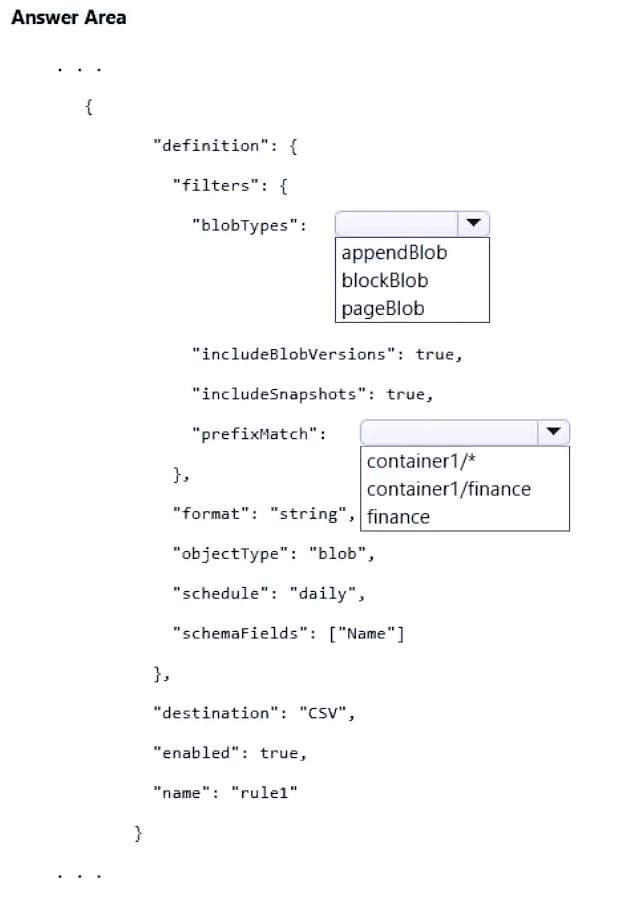

**Correct Answer:** 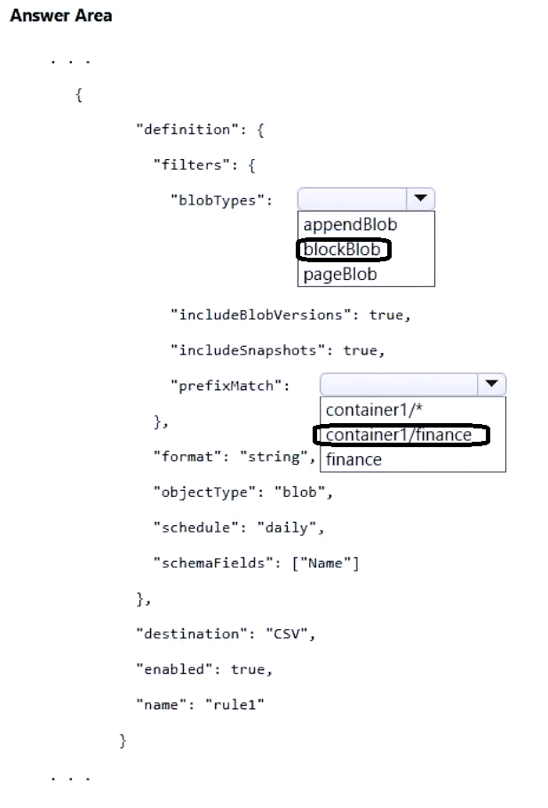

---

### Question 242: Question #88 Topic 3

HOTSPOT
-
You have an Azure subscription that contains a storage account named storage1. The storage1 account contains blobs in a container named container1.
You plan to share access to storage1.
You need to generate a shared access signature (SAS). The solution must meet the following requirements:
•Ensure that the SAS can only be used to enumerate and download blobs stored in container1.
•Use the principle of least privilege.
Which three settings should you enable? To answer, select the appropriate settings in the answer area.
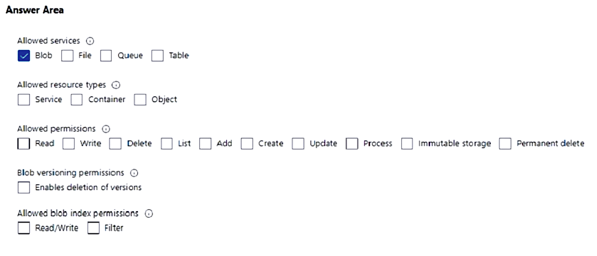

**Correct Answer:** 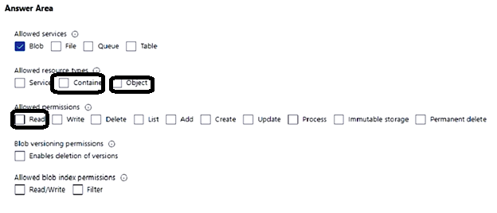

---

### Question 243: Question #89 Topic 3

HOTSPOT
-
You have an Azure subscription. The subscription contains a storage account named storage1 that has the lifecycle management rules shown in the following table.

On June 1, you store two blobs in storage1 as shown in the following table.
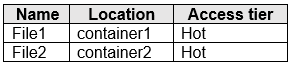
For each of the following statements, select Yes if the statement is true. Otherwise, select No.
NOTE: Each correct selection is worth one point.
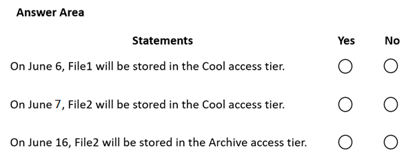

**Correct Answer:** 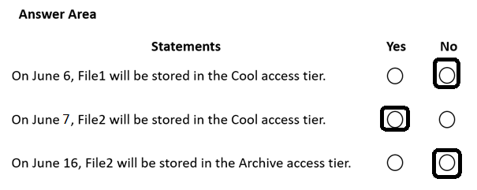

---

### Question 244: Question #90 Topic 3

HOTSPOT
-
You have an Azure Storage account named contoso2024 that contains the resources shown in the following table.
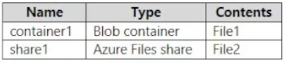
You have users that have permissions for contoso2024 as shown in the following table.
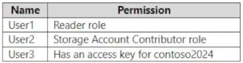
The contoso2024 account is configured as shown in the following exhibit.
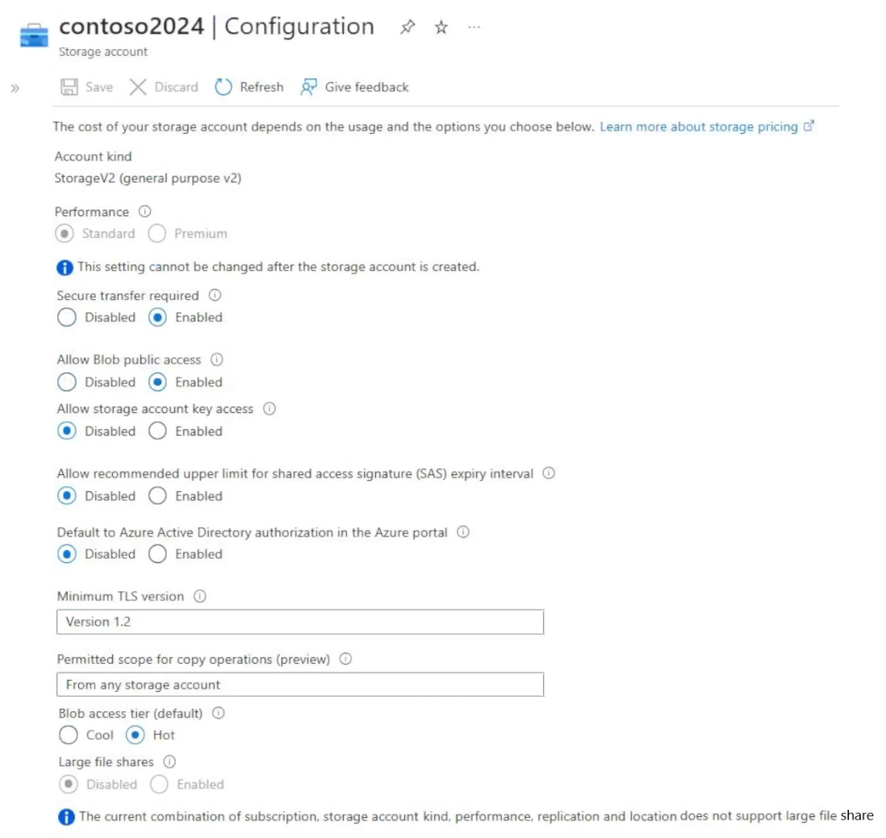
For each of the following statements, select Yes if the statement is true. Otherwise, select No.
NOTE: Each correct selection is worth one point.
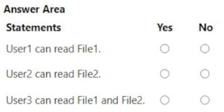

**Correct Answer:** 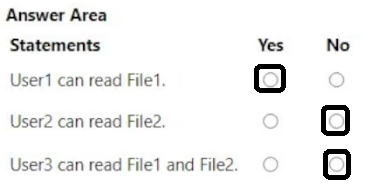

---

### Question 245: Question #91 Topic 3

HOTSPOT
-
You have an Azure subscription linked to a hybrid Microsoft Entra tenant. The tenant contains the users shown in the following table.
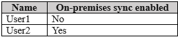
You create the Azure Files shares shown in the following table.
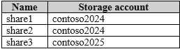
You configure identity-based access for contoso2024 as shown in the following exhibit.
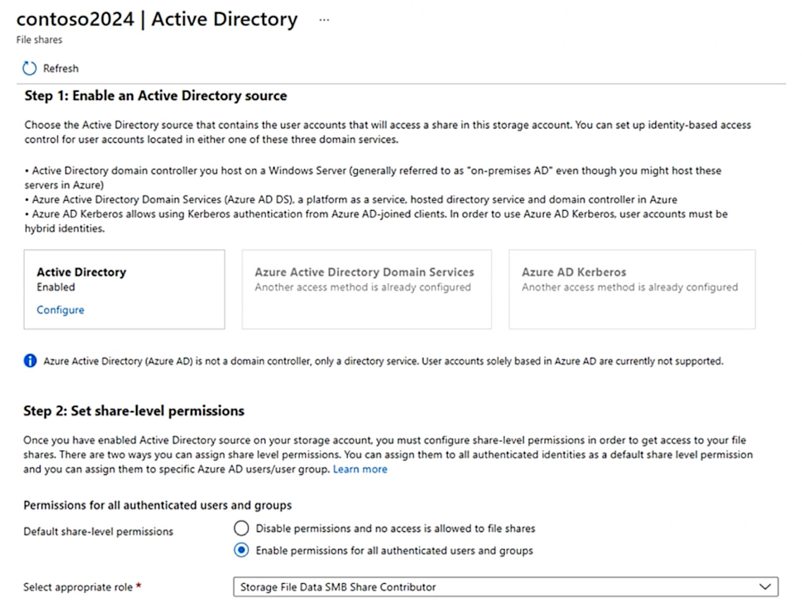
For each of the following statements, select Yes if the statement is true. Otherwise, select No.
NOTE: Each correct selection is worth one point.
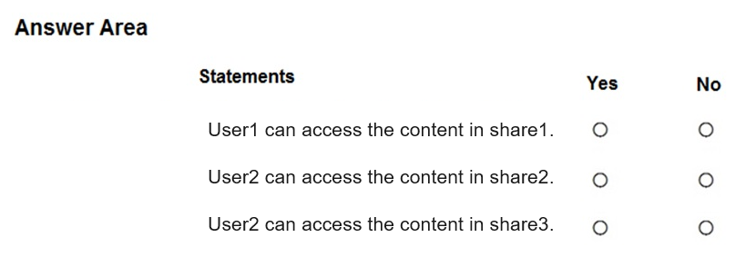

**Correct Answer:** 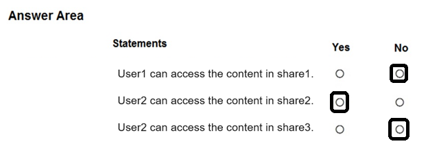

---

### Question 246: Question #92 Topic 3

HOTSPOT
-
Your network contains an on-premises Active Directory Domain Services (AD DS) domain.
The domain contains the identities shown in the following table.
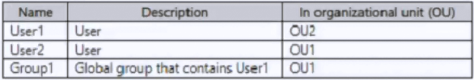
You have an Azure subscription that contains a storage account named storage1. The file shares in storage1 have an identity source of AD DS and Default share-level permissions set to Enable permissions for all authenticated users and groups.
You create an Azure Files share named share1 that has the roles shown in the following table.
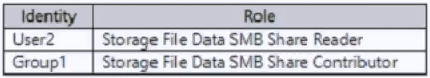
You have a Microsoft Entra tenant that contains a cloud-only user named User3.
You use Microsoft Entra Connect to sync OU1 from the AD DS domain to the Microsoft Entra tenant.
For each of the following statements, select Yes if the statement is true. Otherwise, select No.
NOTE: Each correct selection is worth one point.
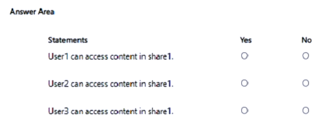

**Correct Answer:** 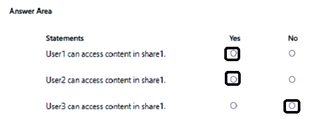

---

### Question 247: Question #93 Topic 3

You have an Azure subscription that contains the storage accounts shown in the following table.
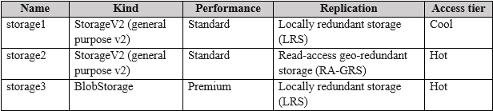
Which storage account can be converted to zone-redundant storage (ZRS) replication?

- A. storage1 only
- B. storage2 only
- C. storage3 only
- D. storage2 and storage3
- E. storage1, storage2, and storage3

**Correct Answer:** A

---

### Question 248: Question #94 Topic 3

Note: This question is part of a series of questions that present the same scenario. Each question in the series contains a unique solution that might meet the stated goals. Some question sets might have more than one correct solution, while others might not have a correct solution.
After you answer a question in this section, you will NOT be able to return to it. As a result, these questions will not appear in the review screen.
You have an Azure Storage account named storage1.
You need to enable a user named User1 to list and regenerate storage account keys for storage1.
Solution: You assign the Reader and Data Access role to User1.
Does this meet the goal?

- A. Yes
- B. No

**Correct Answer:** B

---

### Question 249: Question #95 Topic 3

You have an Azure subscription that contains a Standard SKU Azure container registry named ContReg1.
You need to ensure that ContReg1 supports geo-replication.
What should you do first for ContReg1?

- A. Enable Admin user.
- B. Add a scope map.
- C. Add an automation task.
- D. Create a cache rule.
- E. Upgrade the SKU.

**Correct Answer:** E

---

### Question 250: Question #96 Topic 3

HOTSPOT
-
Case study
-
This is a case study. Case studies are not timed separately. You can use as much exam time as you would like to complete each case. However, there may be additional case studies and sections on this exam. You must manage your time to ensure that you are able to complete all questions included on this exam in the time provided.
To answer the questions included in a case study, you will need to reference information that is provided in the case study. Case studies might contain exhibits and other resources that provide more information about the scenario that is described in the case study. Each question is independent of the other questions in this case study.
At the end of this case study, a review screen will appear. This screen allows you to review your answers and to make changes before you move to the next section of the exam. After you begin a new section, you cannot return to this section.
To start the case study
-
To display the first question in this case study, click the Next button. Use the buttons in the left pane to explore the content of the case study before you answer the questions. Clicking these buttons displays information such as business requirements, existing environment, and problem statements. If the case study has an All Information tab, note that the information displayed is identical to the information displayed on the subsequent tabs. When you are ready to answer a question, click the Question button to return to the question.
Overview
-
ADatum Corporation is consulting firm that has a main office in Montreal and branch offices in Seattle and New York.
Existing Environment
-
Azure Environment
-
ADatum has an Azure subscription that contains three resource groups named RG1, RG2, and RG3.
The subscription contains the storage accounts shown in the following table.

The subscription contains the virtual machines shown in the following table.

The subscription has an Azure container registry that contains the images shown in the following table.

The subscription contains the resources shown in the following table.

Azure Key Vault
-
The subscription contains an Azure key vault named Vault1.
Vault1 contains the certificates shown in the following table.

Vault1 contains the keys shown in the following table.

Microsoft Entra Environment
-
ADatum has a Microsoft Entra tenant named adatum.com that is linked to the Azure subscription and contains the users shown in the following table.

The tenant contains the groups shown in the following table.

The adatum.com tenant has a custom security attribute named Attribute1.
Planned Changes
-
ADatum plans to implement the following changes:
•Configure a data collection rule (DCR) named DCR1 to collect only system events that have an event ID of 4648 from VM2 and VM4.
•In storage1, create a new container named cont2 that has the following access policies:
oThree stored access policies named Stored1, Stored2, and Stored3
oA legal hold for immutable blob storage
•Whenever possible, use directories to organize storage account content.
•Grant User1 the permissions required to link Zone1 to VNet1.
•Assign Attribute1 to supported adatum.com resources.
•In storage2, create an encryption scope named Scope1.
•Deploy new containers by using Image1 or Image2.
Technical Requirements
-
ADatum must meet the following technical requirements:
•Use TLS for WebApp1.
•Follow the principle of least privilege.
•Grant permissions at the required scope only.
•Ensure that Scope1 is used to encrypt storage services.
•Use Azure Backup to back up cont1 and share1 as frequently as possible.
•Whenever possible, use Azure Disk Encryption and a key encryption key (KEK) to encrypt the virtual machines.
You implement the planned changes for cont2.
What is the maximum number of additional access policies you can create for cont2? To answer, select the appropriate options in the answer area.
NOTE: Each correct selection is worth one point.
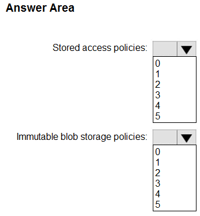

**Correct Answer:** 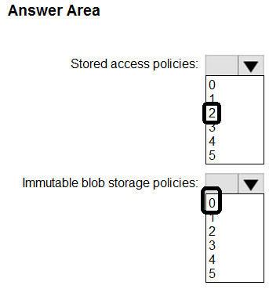

---

### Question 251: Question #97 Topic 3

Case study -
This is a case study. Case studies are not timed separately. You can use as much exam time as you would like to complete each case. However, there may be additional case studies and sections on this exam. You must manage your time to ensure that you are able to complete all questions included on this exam in the time provided.
To answer the questions included in a case study, you will need to reference information that is provided in the case study. Case studies might contain exhibits and other resources that provide more information about the scenario that is described in the case study. Each question is independent of the other questions in this case study.
At the end of this case study, a review screen will appear. This screen allows you to review your answers and to make changes before you move to the next section of the exam. After you begin a new section, you cannot return to this section.
To start the case study -
To display the first question in this case study, click the Next button. Use the buttons in the left pane to explore the content of the case study before you answer the questions. Clicking these buttons displays information such as business requirements, existing environment, and problem statements. If the case study has an All Information tab, note that the information displayed is identical to the information displayed on the subsequent tabs. When you are ready to answer a question, click the Question button to return to the question.
Overview -
ADatum Corporation is consulting firm that has a main office in Montreal and branch offices in Seattle and New York.
Existing Environment -
Azure Environment -
ADatum has an Azure subscription that contains three resource groups named RG1, RG2, and RG3.
The subscription contains the storage accounts shown in the following table.

The subscription contains the virtual machines shown in the following table.

The subscription has an Azure container registry that contains the images shown in the following table.

The subscription contains the resources shown in the following table.

Azure Key Vault -
The subscription contains an Azure key vault named Vault1.
Vault1 contains the certificates shown in the following table.

Vault1 contains the keys shown in the following table.

Microsoft Entra Environment -
ADatum has a Microsoft Entra tenant named adatum.com that is linked to the Azure subscription and contains the users shown in the following table.

The tenant contains the groups shown in the following table.

The adatum.com tenant has a custom security attribute named Attribute1.
Planned Changes -
ADatum plans to implement the following changes:
•Configure a data collection rule (DCR) named DCR1 to collect only system events that have an event ID of 4648 from VM2 and VM4.
•In storage1, create a new container named cont2 that has the following access policies: oThree stored access policies named Stored1, Stored2, and Stored3 oA legal hold for immutable blob storage
•Whenever possible, use directories to organize storage account content.
•Grant User1 the permissions required to link Zone1 to VNet1.
•Assign Attribute1 to supported adatum.com resources.
•In storage2, create an encryption scope named Scope1.
•Deploy new containers by using Image1 or Image2.
Technical Requirements -
ADatum must meet the following technical requirements:
•Use TLS for WebApp1.
•Follow the principle of least privilege.
•Grant permissions at the required scope only.
•Ensure that Scope1 is used to encrypt storage services.
•Use Azure Backup to back up cont1 and share1 as frequently as possible.
•Whenever possible, use Azure Disk Encryption and a key encryption key (KEK) to encrypt the virtual machines.
You need to configure encryption for the virtual machines. The solution must meet the technical requirements.
Which virtual machines can you encrypt?

- A. VM1 and VM3
- B. VM4 and VM5
- C. VM2 and VM3
- D. VM2 and VM4

**Correct Answer:** C

---

### Question 252: Question #98 Topic 3

Case study -
This is a case study. Case studies are not timed separately. You can use as much exam time as you would like to complete each case. However, there may be additional case studies and sections on this exam. You must manage your time to ensure that you are able to complete all questions included on this exam in the time provided.
To answer the questions included in a case study, you will need to reference information that is provided in the case study. Case studies might contain exhibits and other resources that provide more information about the scenario that is described in the case study. Each question is independent of the other questions in this case study.
At the end of this case study, a review screen will appear. This screen allows you to review your answers and to make changes before you move to the next section of the exam. After you begin a new section, you cannot return to this section.
To start the case study -
To display the first question in this case study, click the Next button. Use the buttons in the left pane to explore the content of the case study before you answer the questions. Clicking these buttons displays information such as business requirements, existing environment, and problem statements. If the case study has an All Information tab, note that the information displayed is identical to the information displayed on the subsequent tabs. When you are ready to answer a question, click the Question button to return to the question.
Overview -
ADatum Corporation is consulting firm that has a main office in Montreal and branch offices in Seattle and New York.
Existing Environment -
Azure Environment -
ADatum has an Azure subscription that contains three resource groups named RG1, RG2, and RG3.
The subscription contains the storage accounts shown in the following table.

The subscription contains the virtual machines shown in the following table.

The subscription has an Azure container registry that contains the images shown in the following table.

The subscription contains the resources shown in the following table.

Azure Key Vault -
The subscription contains an Azure key vault named Vault1.
Vault1 contains the certificates shown in the following table.

Vault1 contains the keys shown in the following table.

Microsoft Entra Environment -
ADatum has a Microsoft Entra tenant named adatum.com that is linked to the Azure subscription and contains the users shown in the following table.

The tenant contains the groups shown in the following table.

The adatum.com tenant has a custom security attribute named Attribute1.
Planned Changes -
ADatum plans to implement the following changes:
•Configure a data collection rule (DCR) named DCR1 to collect only system events that have an event ID of 4648 from VM2 and VM4.
•In storage1, create a new container named cont2 that has the following access policies: oThree stored access policies named Stored1, Stored2, and Stored3 oA legal hold for immutable blob storage
•Whenever possible, use directories to organize storage account content.
•Grant User1 the permissions required to link Zone1 to VNet1.
•Assign Attribute1 to supported adatum.com resources.
•In storage2, create an encryption scope named Scope1.
•Deploy new containers by using Image1 or Image2.
Technical Requirements -
ADatum must meet the following technical requirements:
•Use TLS for WebApp1.
•Follow the principle of least privilege.
•Grant permissions at the required scope only.
•Ensure that Scope1 is used to encrypt storage services.
•Use Azure Backup to back up cont1 and share1 as frequently as possible.
•Whenever possible, use Azure Disk Encryption and a key encryption key (KEK) to encrypt the virtual machines.
You need to implement the planned changes for the storage account content.
Which containers and file shares can you use to organize the content?

- A. share1 only
- B. cont1 and share1 only
- C. share1 and share2 only
- D. cont1, share1, and share2 only
- E. cont1, cont2, share1, and share2

**Correct Answer:** D

---

### Question 253: Question #1 Topic 4

Note: This question is part of a series of questions that present the same scenario. Each question in the series contains a unique solution that might meet the stated goals. Some question sets might have more than one correct solution, while others might not have a correct solution.
After you answer a question in this section, you will NOT be able to return to it. As a result, these questions will not appear in the review screen.
You deploy an Azure Kubernetes Service (AKS) cluster named AKS1.
You need to deploy a YAML file to AKS1.
Solution: From Azure CLI, you run az aks.
Does this meet the goal?

- A. Yes
- B. No

**Correct Answer:** B

---

### Question 254: Question #2 Topic 4

Note: This question is part of a series of questions that present the same scenario. Each question in the series contains a unique solution that might meet the stated goals. Some question sets might have more than one correct solution, while others might not have a correct solution.
After you answer a question in this section, you will NOT be able to return to it. As a result, these questions will not appear in the review screen.
You deploy an Azure Kubernetes Service (AKS) cluster named AKS1.
You need to deploy a YAML file to AKS1.
Solution: From Azure CLI, you run the kubectl client.
Does this meet the goal?

- A. Yes
- B. No

**Correct Answer:** A

---

### Question 255: Question #3 Topic 4

Note: This question is part of a series of questions that present the same scenario. Each question in the series contains a unique solution that might meet the stated goals. Some question sets might have more than one correct solution, while others might not have a correct solution.
After you answer a question in this section, you will NOT be able to return to it. As a result, these questions will not appear in the review screen.
You deploy an Azure Kubernetes Service (AKS) cluster named AKS1.
You need to deploy a YAML file to AKS1.
Solution: From Azure CLI, you run azcopy.
Does this meet the goal?

- A. Yes
- B. No

**Correct Answer:** B

---

### Question 256: Question #4 Topic 4

Note: This question is part of a series of questions that present the same scenario. Each question in the series contains a unique solution that might meet the stated goals. Some question sets might have more than one correct solution, while others might not have a correct solution.
After you answer a question in this section, you will NOT be able to return to it. As a result, these questions will not appear in the review screen.
You have an Azure virtual machine named VM1 that runs Windows Server 2016.
You need to create an alert in Azure when more than two error events are logged to the System event log on VM1 within an hour.
Solution: You create an Azure storage account and configure shared access signatures (SASs). You install the Microsoft Monitoring Agent on VM1. You create an alert in Azure Monitor and specify the storage account as the source.
Does that meet the goal?

- A. Yes
- B. No

**Correct Answer:** B

---

### Question 257: Question #5 Topic 4

HOTSPOT -
You have an Azure subscription named Subscription1. Subscription1 contains the resources in the following table.
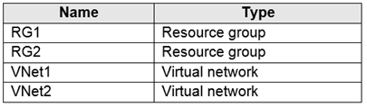
VNet1 is in RG1. VNet2 is in RG2. There is no connectivity between VNet1 and VNet2.
An administrator named Admin1 creates an Azure virtual machine named VM1 in RG1. VM1 uses a disk named Disk1 and connects to VNet1. Admin1 then installs a custom application in VM1.
You need to move the custom application to VNet2. The solution must minimize administrative effort.
Which two actions should you perform? To answer, select the appropriate options in the answer area.
NOTE: Each correct selection is worth one point.
Hot Area:
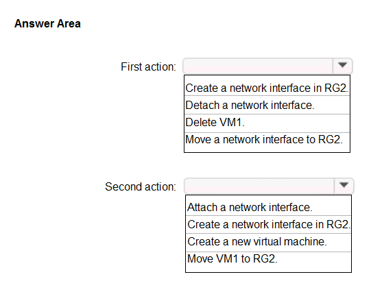

**Correct Answer:** 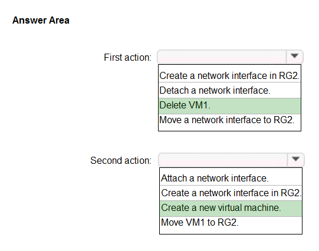

_Explanation:_
We cannot just move a virtual machine between networks. What we need to do is identify the disk used by the VM, delete the VM itself while retaining the disk, and recreate the VM in the target virtual network and then attach the original disk to it.
Reference:
https://blogs.technet.microsoft.com/canitpro/2014/06/16/step-by-step-move-a-vm-to-a-different-vnet-on-azure/ https://4sysops.com/archives/move-an-azure-vm-to-another-virtual-network-vnet/#migrate-an-azure-vm-between-vnets

---

### Question 258: Question #6 Topic 4

You download an Azure Resource Manager template based on an existing virtual machine. The template will be used to deploy 100 virtual machines.
You need to modify the template to reference an administrative password. You must prevent the password from being stored in plain text.
What should you create to store the password?

- A. an Azure Key Vault and an access policy
- B. an Azure Storage account and an access policy
- C. a Recovery Services vault and a backup policy
- D. Azure Active Directory (AD) Identity Protection and an Azure policy

**Correct Answer:** A

---

### Question 259: Question #7 Topic 4

HOTSPOT -
You have the App Service plans shown in the following table.

You plan to create the Azure web apps shown in the following table.
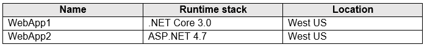
You need to identify which App Service plans can be used for the web apps.
What should you identify? To answer, select the appropriate options in the answer area.
NOTE: Each correct selection is worth one point.
Hot Area:
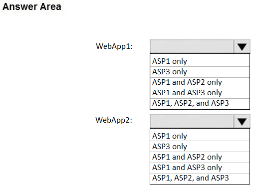

**Correct Answer:** 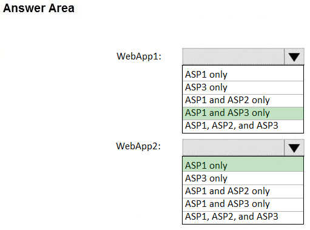

_Explanation:_
Box 1: ASP1 ASP3 -
Asp1, ASP3: ASP.NET Core apps can be hosted both on Windows or Linux.
Not ASP2: The region in which your app runs is the region of the App Service plan it's in.
Box 2: ASP1 -
ASP.NET apps can be hosted on Windows only.
Reference:
https://docs.microsoft.com/en-us/azure/app-service/quickstart-dotnetcore?pivots=platform-linux https://docs.microsoft.com/en-us/azure/app-service/app-service-plan-manage#

---

### Question 260: Question #8 Topic 4

HOTSPOT -
You create a virtual machine scale set named Scale1. Scale1 is configured as shown in the following exhibit.
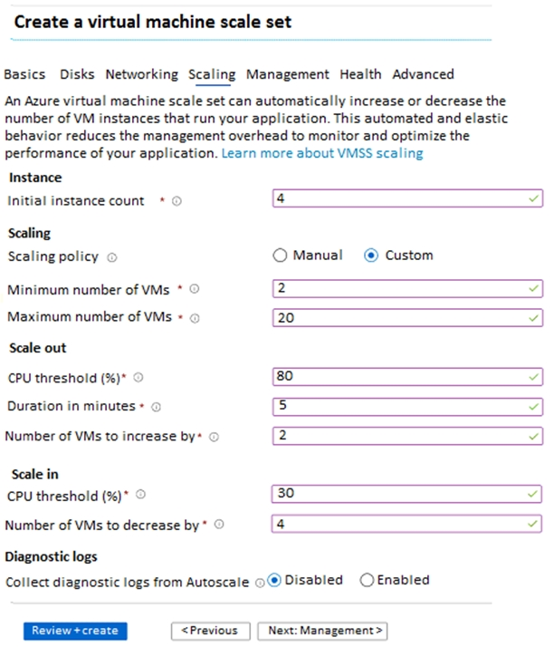
Use the drop-down menus to select the answer choice that completes each statement based on the information presented in the graphic.
NOTE: Each correct selection is worth one point.
Hot Area:
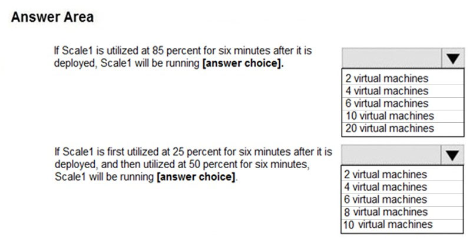

**Correct Answer:** 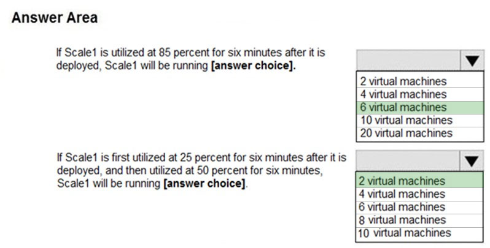

_Explanation:_
Box 1: 6 virtual machines -
The Autoscale scale out rule increases the number of VMs by 2 if the CPU threshold is 80% or higher. The initial instance count is 4 and rises to 6 when the 2 extra instances of VMs are added.
Box 2: 2 virtual machnes -
The Autoscale scale in rule decreases the number of VMs by 4 if the CPU threshold is 30% or lower. The initial instance count is 4 and thus cannot be reduced to
0 as the minimum instances is set to 2. Instances are only added when the CPU threshold reaches 80%.
Reference:
https://docs.microsoft.com/en-us/azure/azure-monitor/platform/autoscale-overview https://docs.microsoft.com/en-us/azure/azure-monitor/platform/autoscale-best-practices https://docs.microsoft.com/en-us/azure/azure-monitor/platform/autoscale-common-scale-patterns

---

### Question 261: Question #9 Topic 4

You plan to automate the deployment of a virtual machine scale set that uses the Windows Server 2016 Datacenter image.
You need to ensure that when the scale set virtual machines are provisioned, they have web server components installed.
Which two actions should you perform? Each correct answer presents part of the solution.
NOTE: Each correct selection is worth one point.

- A. Upload a configuration script
- B. Create an automation account
- C. Create an Azure policy
- D. Modify the extensionProfile section of the Azure Resource Manager template
- E. Create a new virtual machine scale set in the Azure portal

**Correct Answer:** AD

---

### Question 262: Question #10 Topic 4

HOTSPOT -
You have an Azure Kubernetes Service (AKS) cluster named AKS1 and a computer named Computer1 that runs Windows 10. Computer1 that has the Azure CLI installed.
You need to install the kubectl client on Computer1.
Which command should you run? To answer, select the appropriate options in the answer area.
NOTE: Each correct selection is worth one point.
Hot Area:

**Correct Answer:** 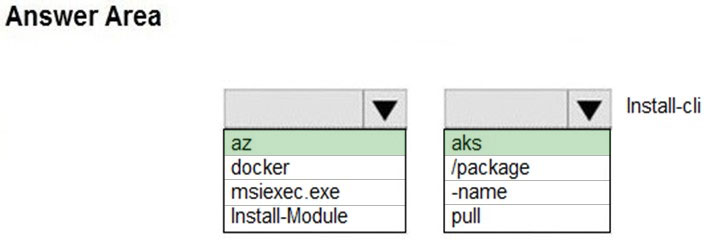

_Explanation:_
To install kubectl locally, use the az aks install-cli command: az aks install-cli
Reference:
https://docs.microsoft.com/en-us/azure/aks/kubernetes-walkthrough

---

### Question 263: Question #11 Topic 4

DRAG DROP -
You onboard 10 Azure virtual machines to Azure Automation State Configuration.
You need to use Azure Automation State Configuration to manage the ongoing consistency of the virtual machine configurations.
Which three actions should you perform in sequence? To answer, move the appropriate actions from the list of actions to the answer area and arrange them in the correct order.
NOTE: More than one order of answer choices is correct. You will receive credit for any of the correct orders you select.
Select and Place:
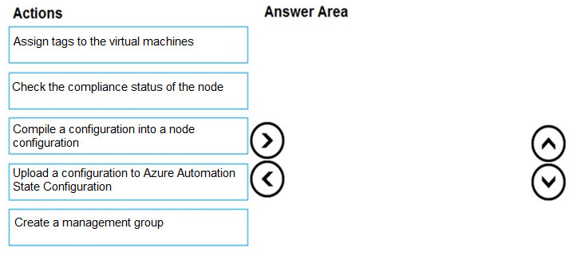

**Correct Answer:** 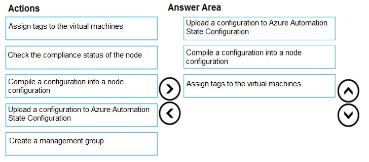

_Explanation:_
Step 1: Upload a configuration to Azure Automation State Configuration.
Import the configuration into the Automation account.
Step 2: Compile a configuration into a node configuration.
A DSC configuration defining that state must be compiled into one or more node configurations (MOF document), and placed on the Automation DSC Pull Server.
Step 3: Assign the node configuration
Then: Check the compliance status of the node
Each time Azure Automation State Configuration performs a consistency check on a managed node, the node sends a status report back to the pull server. You can view these reports on the page for that node.
On the blade for an individual report, you can see the following status information for the corresponding consistency check:
The report status ג€" whether the node is "Compliant", the configuration "Failed", or the node is "Not Compliant"
Reference:
https://docs.microsoft.com/en-us/azure/automation/automation-dsc-getting-started

---

### Question 264: Question #12 Topic 4

You have an Azure Resource Manager template named Template1 that is used to deploy an Azure virtual machine.
Template1 contains the following text:
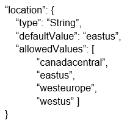
The variables section in Template1 contains the following text:
"location": "westeurope"
The resources section in Template1 contains the following text:
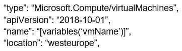
You need to deploy the virtual machine to the West US location by using Template1.
What should you do?

- A. Modify the location in the resources section to westus
- B. Select West US during the deployment
- C. Modify the location in the variables section to westus

**Correct Answer:** A

---

### Question 265: Question #13 Topic 4

You create an App Service plan named Plan1 and an Azure web app named webapp1.
You discover that the option to create a staging slot is unavailable.
You need to create a staging slot for Plan1.
What should you do first?

- A. From Plan1, scale up the App Service plan
- B. From webapp1, modify the Application settings
- C. From webapp1, add a custom domain
- D. From Plan1, scale out the App Service plan

**Correct Answer:** A

---

### Question 266: Question #14 Topic 4

You plan to move a distributed on-premises app named App1 to an Azure subscription.
After the planned move, App1 will be hosted on several Azure virtual machines.
You need to ensure that App1 always runs on at least eight virtual machines during planned Azure maintenance.
What should you create?

- A. one virtual machine scale set that has 10 virtual machines instances
- B. one Availability Set that has three fault domains and one update domain
- C. one Availability Set that has 10 update domains and one fault domain
- D. one virtual machine scale set that has 12 virtual machines instances

**Correct Answer:** A

---

### Question 267: Question #15 Topic 4

Note: This question is part of a series of questions that present the same scenario. Each question in the series contains a unique solution that might meet the stated goals. Some question sets might have more than one correct solution, while others might not have a correct solution.
After you answer a question in this section, you will NOT be able to return to it. As a result, these questions will not appear in the review screen.
You have an Azure virtual machine named VM1 that runs Windows Server 2016.
You need to create an alert in Azure when more than two error events are logged to the System event log on VM1 within an hour.
Solution: You create an event subscription on VM1. You create an alert in Azure Monitor and specify VM1 as the source
Does this meet the goal?

- A. Yes
- B. No

**Correct Answer:** B

---

### Question 268: Question #16 Topic 4

Note: This question is part of a series of questions that present the same scenario. Each question in the series contains a unique solution that might meet the stated goals. Some question sets might have more than one correct solution, while others might not have a correct solution.
After you answer a question in this section, you will NOT be able to return to it. As a result, these questions will not appear in the review screen.
You have an Azure virtual machine named VM1. VM1 was deployed by using a custom Azure Resource Manager template named ARM1.json.
You receive a notification that VM1 will be affected by maintenance.
You need to move VM1 to a different host immediately.
Solution: From the Overview blade, you move the virtual machine to a different subscription.
Does this meet the goal?

- A. Yes
- B. No

**Correct Answer:** B

---

### Question 269: Question #17 Topic 4

Note: This question is part of a series of questions that present the same scenario. Each question in the series contains a unique solution that might meet the stated goals. Some question sets might have more than one correct solution, while others might not have a correct solution.
After you answer a question in this section, you will NOT be able to return to it. As a result, these questions will not appear in the review screen.
You have an Azure virtual machine named VM1. VM1 was deployed by using a custom Azure Resource Manager template named ARM1.json.
You receive a notification that VM1 will be affected by maintenance.
You need to move VM1 to a different host immediately.
Solution: From the Redeploy blade, you click Redeploy.
Does this meet the goal?

- A. Yes
- B. No

**Correct Answer:** A

---

### Question 270: Question #18 Topic 4

Note: This question is part of a series of questions that present the same scenario. Each question in the series contains a unique solution that might meet the stated goals. Some question sets might have more than one correct solution, while others might not have a correct solution.
After you answer a question in this section, you will NOT be able to return to it. As a result, these questions will not appear in the review screen.
You have an Azure virtual machine named VM1. VM1 was deployed by using a custom Azure Resource Manager template named ARM1.json.
You receive a notification that VM1 will be affected by maintenance.
You need to move VM1 to a different host immediately.
Solution: From the Update management blade, you click Enable.
Does this meet the goal?

- A. Yes
- B. No

**Correct Answer:** B

---

### Question 271: Question #19 Topic 4

You have an Azure subscription that contains a web app named webapp1.
You need to add a custom domain named www.contoso.com to webapp1.
What should you do first?

- A. Create a DNS record
- B. Add a connection string
- C. Upload a certificate.
- D. Stop webapp1.

**Correct Answer:** A

---

### Question 272: Question #20 Topic 4

Note: This question is part of a series of questions that present the same scenario. Each question in the series contains a unique solution that might meet the stated goals. Some question sets might have more than one correct solution, while others might not have a correct solution.
After you answer a question in this section, you will NOT be able to return to it. As a result, these questions will not appear in the review screen.
You have an Azure subscription that contains the resources shown in the following table.
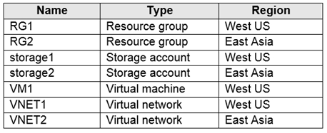
VM1 connects to VNET1.
You need to connect VM1 to VNET2.
Solution: You move VM1 to RG2, and then you add a new network interface to VM1.
Does this meet the goal?

- A. Yes
- B. No

**Correct Answer:** B

---

### Question 273: Question #21 Topic 4

Note: This question is part of a series of questions that present the same scenario. Each question in the series contains a unique solution that might meet the stated goals. Some question sets might have more than one correct solution, while others might not have a correct solution.
After you answer a question in this section, you will NOT be able to return to it. As a result, these questions will not appear in the review screen.
You have an Azure subscription that contains the resources shown in the following table.

VM1 connects to VNET1.
You need to connect VM1 to VNET2.
Solution: You delete VM1. You recreate VM1, and then you create a new network interface for VM1 and connect it to VNET2.
Does this meet the goal?

- A. Yes
- B. No

**Correct Answer:** A

---

### Question 274: Question #22 Topic 4

Note: This question is part of a series of questions that present the same scenario. Each question in the series contains a unique solution that might meet the stated goals. Some question sets might have more than one correct solution, while others might not have a correct solution.
After you answer a question in this section, you will NOT be able to return to it. As a result, these questions will not appear in the review screen.
You have an Azure subscription that contains the resources shown in the following table.

VM1 connects to VNET1.
You need to connect VM1 to VNET2.
Solution: You turn off VM1, and then you add a new network interface to VM1.
Does this meet the goal?

- A. Yes
- B. No

**Correct Answer:** B

---

### Question 275: Question #23 Topic 4

HOTSPOT -
You have an Azure subscription named Subscription1 that contains the quotas shown in the following table.

You deploy virtual machines to Subscription1 as shown in the following table.
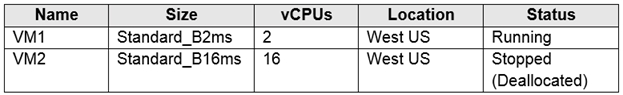
You plan to deploy the virtual machines shown in the following table.
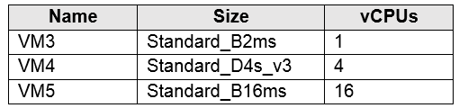
For each of the following statements, select Yes if the statement is true. Otherwise, select No.
NOTE: Each correct selection is worth one point.
Hot Area:
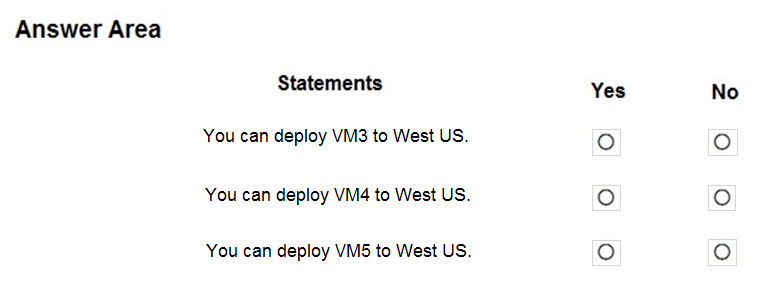

**Correct Answer:** 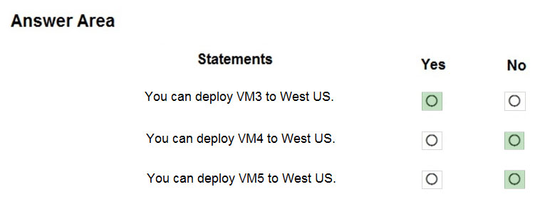

_Explanation:_
The total regional vCPUs is 20 so that means a maximum total of 20 vCPUs across all the different VM sizes. The deallocated VM with 16 vCPUs counts towards the total. VM20 and VM1 are using 18 of the maximum 20 vCPUs leaving only two vCPUs available.
Reference:
https://docs.microsoft.com/en-us/azure/virtual-machines/windows/quotas

---

### Question 276: Question #24 Topic 4

HOTSPOT -
You have an Azure subscription that contains an Azure Availability Set named WEBPROD-AS-USE2 as shown in the following exhibit.
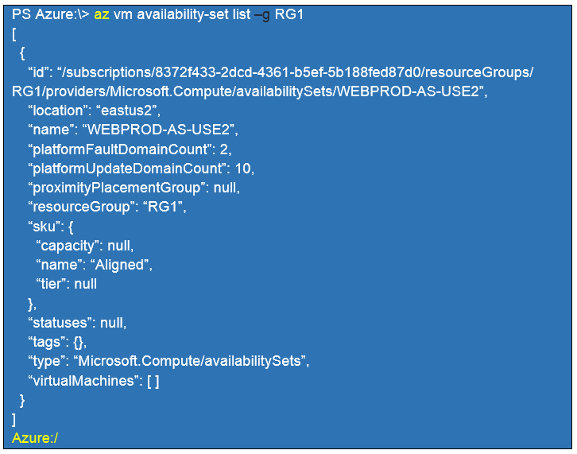
You add 14 virtual machines to WEBPROD-AS-USE2.
Use the drop-down menus to select the answer choice that completes each statement based on the information presented in the graphic.
NOTE: Each correct selection is worth one point.
Hot Area:
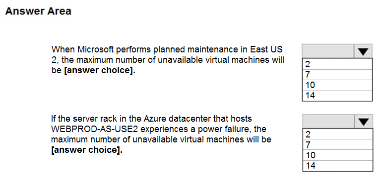

**Correct Answer:** 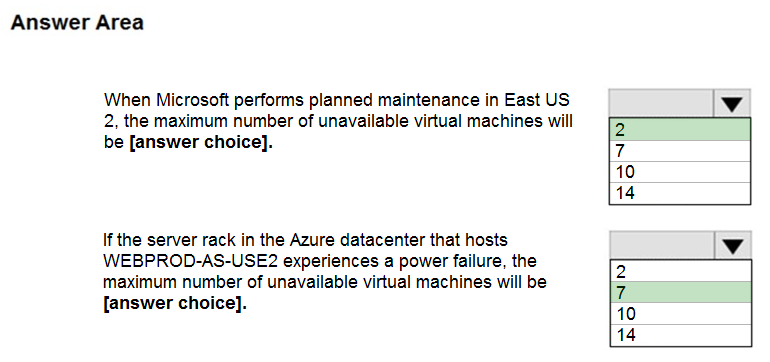

_Explanation:_
Box 1: 2 -
There are 10 update domains. The 14 VMs are shared across the 10 update domains so four update domains will have two VMs and six update domains will have one VM. Only one update domain is rebooted at a time. Therefore, a maximum of two VMs will be offline.
Box 2: 7 -
There are 2 fault domains. The 14 VMs are shared across the 2 fault domains, so 7 VMs in each fault domain. A rack failure will affect one fault domain so 7 VMs will be offline.
Reference:
https://docs.microsoft.com/en-us/azure/virtual-machines/windows/manage-availability

---

### Question 277: Question #25 Topic 4

You deploy an Azure Kubernetes Service (AKS) cluster named Cluster1 that uses the IP addresses shown in the following table.
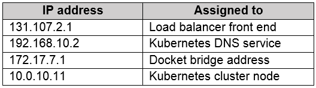
You need to provide internet users with access to the applications that run in Cluster1.
Which IP address should you include in the DNS record for Cluster1?

- A. 131.107.2.1
- B. 10.0.10.11
- C. 172.17.7.1
- D. 192.168.10.2

**Correct Answer:** A

---

### Question 278: Question #26 Topic 4

You have a deployment template named Template1 that is used to deploy 10 Azure web apps.
You need to identify what to deploy before you deploy Template1. The solution must minimize Azure costs.
What should you identify?

- A. five Azure Application Gateways
- B. one App Service plan
- C. 10 App Service plans
- D. one Azure Traffic Manager
- E. one Azure Application Gateway

**Correct Answer:** B

---

### Question 279: Question #27 Topic 4

HOTSPOT -
You plan to deploy an Azure container instance by using the following Azure Resource Manager template.

Use the drop-down menus to select the answer choice that completes each statement based on the information presented in the template.
NOTE: Each correct selection is worth one point.
Hot Area:
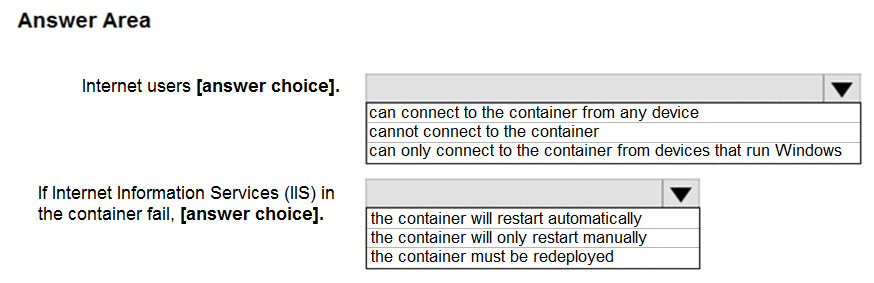

**Correct Answer:** 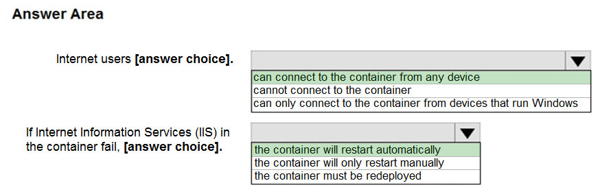

---

### Question 280: Question #28 Topic 4

You have an Azure subscription that contains a virtual machine named VM1. VM1 hosts a line-of-business application that is available 24 hours a day. VM1 has one network interface and one managed disk. VM1 uses the D4s v3 size.
You plan to make the following changes to VM1:
✑ Change the size to D8s v3.
✑ Add a 500-GB managed disk.
✑ Add the Puppet Agent extension.
✑ Enable Desired State Configuration Management.
Which change will cause downtime for VM1?

- A. Enable Desired State Configuration Management
- B. Add a 500-GB managed disk
- C. Change the size to D8s v3
- D. Add the Puppet Agent extension

**Correct Answer:** C

---

### Question 281: Question #29 Topic 4

You have an app named App1 that runs on an Azure web app named webapp1.
The developers at your company upload an update of App1 to a Git repository named Git1.
Webapp1 has the deployment slots shown in the following table.
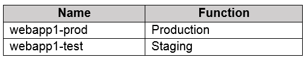
You need to ensure that the App1 update is tested before the update is made available to users.
Which two actions should you perform? Each correct answer presents part of the solution.
NOTE: Each correct selection is worth one point.

- A. Swap the slots
- B. Deploy the App1 update to webapp1-prod, and then test the update
- C. Stop webapp1-prod
- D. Deploy the App1 update to webapp1-test, and then test the update
- E. Stop webapp1-test

**Correct Answer:** AD

---

### Question 282: Question #30 Topic 4

You have an Azure subscription named Subscription1 that has the following providers registered:
✑ Authorization
✑ Automation
✑ Resources
✑ Compute
✑ KeyVault
✑ Network
✑ Storage
✑ Billing
✑ Web
Subscription1 contains an Azure virtual machine named VM1 that has the following configurations:
✑ Private IP address: 10.0.0.4 (dynamic)
✑ Network security group (NSG): NSG1
✑ Public IP address: None
✑ Availability set: AVSet
✑ Subnet: 10.0.0.0/24
✑ Managed disks: No
✑ Location: East US
You need to record all the successful and failed connection attempts to VM1.
Which three actions should you perform? Each correct answer presents part of the solution.
NOTE: Each correct selection is worth one point.

- A. Enable Azure Network Watcher in the East US Azure region.
- B. Add an Azure Network Watcher connection monitor.
- C. Register the MicrosoftLogAnalytics provider.
- D. Create an Azure Storage account.
- E. Register the Microsoft.Insights resource provider.
- F. Enable Azure Network Watcher flow logs.

**Correct Answer:** DEF

---

### Question 283: Question #31 Topic 4

You need to deploy an Azure virtual machine scale set that contains five instances as quickly as possible.
What should you do?

- A. Deploy five virtual machines. Modify the Availability Zones settings for each virtual machine.
- B. Deploy five virtual machines. Modify the Size setting for each virtual machine.
- C. Deploy one virtual machine scale set that is set to VM (virtual machines) orchestration mode.
- D. Deploy one virtual machine scale set that is set to ScaleSetVM orchestration mode.

**Correct Answer:** D

---

### Question 284: Question #32 Topic 4

You plan to create the Azure web apps shown in the following table.
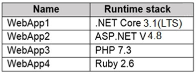
What is the minimum number of App Service plans you should create for the web apps?

- A. 1
- B. 2
- C. 3
- D. 4

**Correct Answer:** B

---

### Question 285: Question #33 Topic 4

HOTSPOT -
You have a pay-as-you-go Azure subscription that contains the virtual machines shown in the following table.

You create the budget shown in the following exhibit.
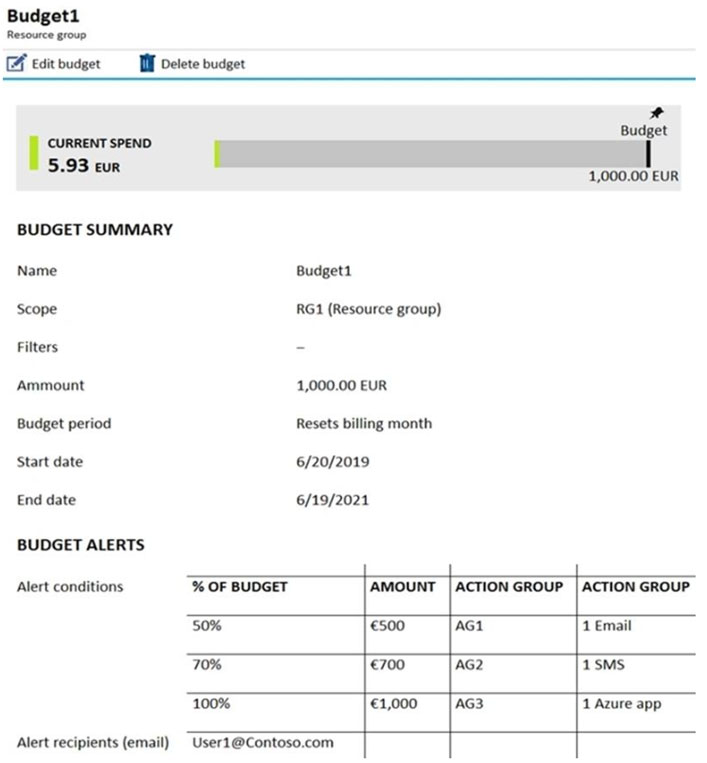
The AG1 action group contains a user named admin@contoso.com only.
Use the drop-down menus to select the answer choice that completes each statement based on the information presented in the graphic.
Hot Area:
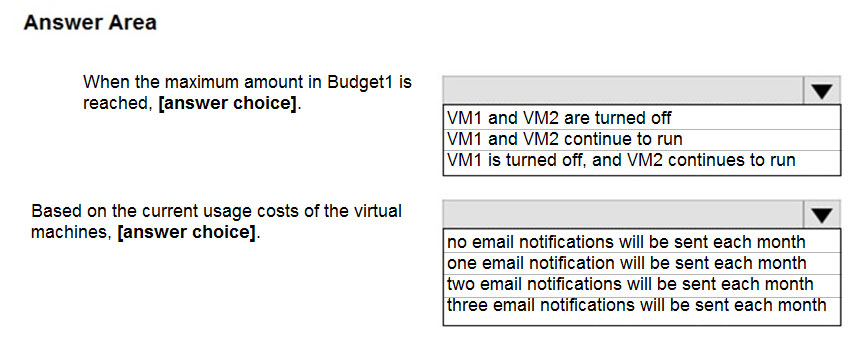

**Correct Answer:** 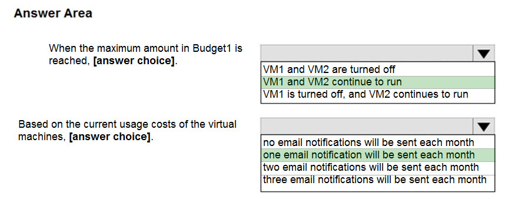

_Explanation:_
Box 1: VM1 and VM2 continue to run
The budget alerts are for Resource Group RG1, which include VM1, but not VM2. However, when the budget thresholds you've created are exceeded, only notifications are triggered. None of your resources are affected and your consumption isn't stopped.
Box 2: one email notification will be sent each month.
Budget alerts for Resource Group RG1, which include VM1, but not VM2.VM1 consumes 20 Euro/day. The 50%, 500 Euro limit, will be reached in 25 days, and an email will be sent.
The 70% and 100% alert conditions will not be reached within a month, and they don't trigger email actions anyway.
Credit alerts: Credit alerts are generated automatically at 90% and at 100% of your Azure credit balance. Whenever an alert is generated, it's reflected in cost alerts and in the email sent to the account owners. 90% and 100% will not be reached though.
Reference:
https://docs.microsoft.com/en-us/azure/cost-management-billing/costs/cost-mgt-alerts-monitor-usage-spending https://docs.microsoft.com/en-gb/azure/cost-management-billing/costs/tutorial-acm-create-budgets

---

### Question 286: Question #34 Topic 4

Note: This question is part of a series of questions that present the same scenario. Each question in the series contains a unique solution that might meet the stated goals. Some question sets might have more than one correct solution, while others might not have a correct solution.
After you answer a question in this section, you will NOT be able to return to it. As a result, these questions will not appear in the review screen.
You have an Azure subscription named Subscription1. Subscription1 contains a resource group named RG1. RG1 contains resources that were deployed by using templates.
You need to view the date and time when the resources were created in RG1.
Solution: From the Subscriptions blade, you select the subscription, and then click Programmatic deployment.
Does this meet the goal?

- A. Yes
- B. No

**Correct Answer:** B

---

### Question 287: Question #35 Topic 4

Note: This question is part of a series of questions that present the same scenario. Each question in the series contains a unique solution that might meet the stated goals. Some question sets might have more than one correct solution, while others might not have a correct solution.
After you answer a question in this section, you will NOT be able to return to it. As a result, these questions will not appear in the review screen.
You have an Azure subscription that contains the resources shown in the following table.
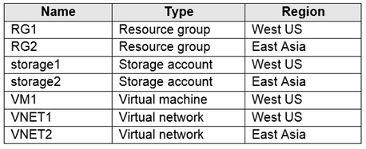
VM1 connects to VNET1.
You need to connect VM1 to VNET2.
Solution: You create a new network interface, and then you add the network interface to VM1.
Does this meet the goal?

- A. Yes
- B. No

**Correct Answer:** B

---

### Question 288: Question #36 Topic 4

You have an Azure Active Directory (Azure AD) tenant named adatum.com that contains the users shown in the following table.
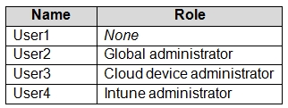
Adatum.com has the following configurations:
✑ Users may join devices to Azure AD is set to User1.
✑ Additional local administrators on Azure AD joined devices is set to None.
You deploy Windows 10 to a computer named Computer1. User1 joins Computer1 to adatum.com.
You need to identify the local Administrator group membership on Computer1.
Which users are members of the local Administrators group?

- A. User1 only
- B. User2 only
- C. User1 and User2 only
- D. User1, User2, and User3 only
- E. User1, User2, User3, and User4

**Correct Answer:** C

---

### Question 289: Question #37 Topic 4

HOTSPOT -
You have Azure subscriptions named Subscription1 and Subscription2.
Subscription1 has following resource groups:
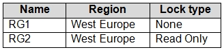
RG1 includes a web app named App1 in the West Europe location.
Subscription2 contains the following resource groups:
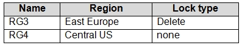
For each of the following statements, select Yes if the statement is true. Otherwise, select No.
NOTE: Each correct selection is worth one point.
Hot Area:
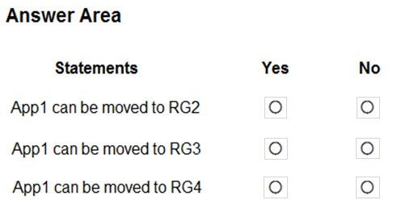

**Correct Answer:** 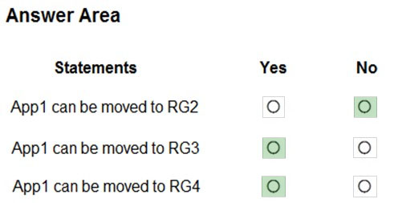

_Explanation:_
Box 1: No -
RG2 is read only. ReadOnly means authorized users can read a resource, but they cannot delete or update the resource.
Box 2: Yes -
Box 3: Yes -
Note:
App Service resources are region-specific and cannot be moved directly across regions. You can move the App Service resource by creating a copy of your existing App Service resource in the target region, then move your content over to the new app. You can then delete the source app and App Service plan.
To make copying your app easier, you can clone an individual App Service app into an App Service plan in another region.
Reference:
https://docs.microsoft.com/en-us/azure/app-service/manage-move-across-regions https://docs.microsoft.com/en-us/azure/azure-resource-manager/management/move-limitations/app-service-move-limitations

---

### Question 290: Question #38 Topic 4

HOTSPOT -
You have an Azure subscription named Subscription1 that contains the following resource group:
✑ Name: RG1
✑ Region: West US
✑ Tag: `tag1`: `value1`
You assign an Azure policy named Policy1 to Subscription1 by using the following configurations:
✑ Exclusions: None
✑ Policy definition: Append a tag and its value to resources
✑ Assignment name: Policy1
✑ Parameters:
✑ Tag name: tag2
Tag value: value2 -

After Policy1 is assigned, you create a storage account that has the following configuration:
✑ Name: storage1
✑ Location: West US
✑ Resource group: RG1
✑ Tags: `tag3`: `value3`
You need to identify which tags are assigned to each resource.
What should you identify? To answer, select the appropriate options in the answer area.
NOTE: Each correct selection is worth one point.
Hot Area:
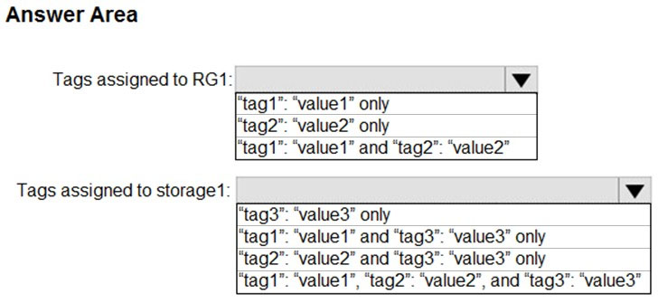

**Correct Answer:** 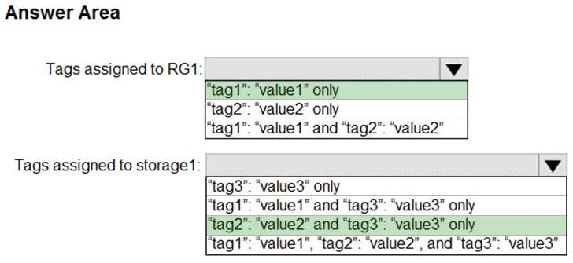

_Explanation:_
Box 1: "tag1": "value1" only -
Box 2: "tag2": "value2" and "tag3": "value3" only
Tags applied to the resource group are not inherited by the resources in that resource group.
Reference:
https://docs.microsoft.com/en-us/azure/azure-resource-manager/resource-group-using-tags

---

### Question 291: Question #39 Topic 4

HOTSPOT -
You have an Azure subscription named Subscription1.
In Subscription1, you create an alert rule named Alert1.
The Alert1 action group is configured as shown in the following exhibit.
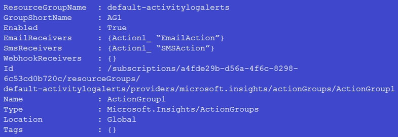
Alert1 alert criteria triggered every minute.
Use the drop-down menus to select the answer choice that completes each statement based on the information presented in the graphic.
NOTE: Each correct selection is worth one point.
Hot Area:
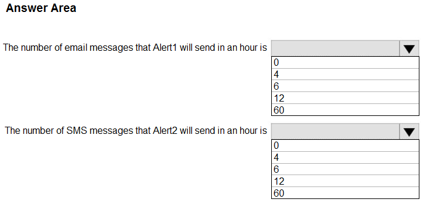

**Correct Answer:** 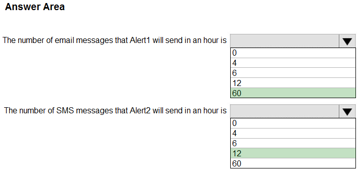

_Explanation:_
Box 1: 60 -
One alert per minute will trigger one email per minute.
Box 2: 12 -
No more than 1 SMS every 5 minutes can be send, which equals 12 per hour.
Note: Rate limiting is a suspension of notifications that occurs when too many are sent to a particular phone number, email address or device. Rate limiting ensures that alerts are manageable and actionable.
The rate limit thresholds are:
✑ SMS: No more than 1 SMS every 5 minutes.
✑ Voice: No more than 1 Voice call every 5 minutes.
✑ Email: No more than 100 emails in an hour.
✑ Other actions are not rate limited.
Reference:
https://docs.microsoft.com/en-us/azure/azure-monitor/platform/alerts-rate-limiting

---

### Question 292: Question #40 Topic 4

You have an Azure subscription named Subscription1 that contains the resources shown in the following table.
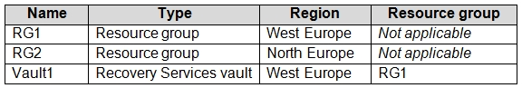
You create virtual machines in Subscription1 as shown in the following table.
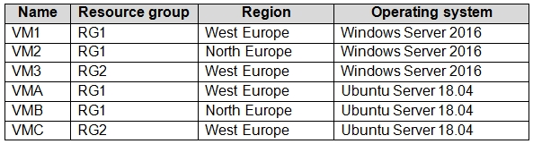
You plan to use Vault1 for the backup of as many virtual machines as possible.
Which virtual machines can be backed up to Vault1?

- A. VM1 only
- B. VM3 and VMC only
- C. VM1, VM2, VM3, VMA, VMB, and VMC
- D. VM1, VM3, VMA, and VMC only
- E. VM1 and VM3 only

**Correct Answer:** D

---

### Question 293: Question #41 Topic 4

You have an Azure Kubernetes Service (AKS) cluster named AKS1.
You need to configure cluster autoscaler for AKS1.
Which two tools should you use? Each correct answer presents a complete solution.
NOTE: Each correct selection is worth one point.

- A. the kubectl command
- B. the az aks command
- C. the Set-AzVm cmdlet
- D. the Azure portal
- E. the Set-AzAks cmdlet

**Correct Answer:** BD

---

### Question 294: Question #42 Topic 4

You create the following resources in an Azure subscription:
✑ An Azure Container Registry instance named Registry1
✑ An Azure Kubernetes Service (AKS) cluster named Cluster1
You create a container image named App1 on your administrative workstation.
You need to deploy App1 to Cluster1.
What should you do first?

- A. Run the docker push command.
- B. Create an App Service plan.
- C. Run the az acr build command.
- D. Run the az aks create command.

**Correct Answer:** A

---

### Question 295: Question #43 Topic 4

You have an Azure subscription that contains the resources shown in the following table.

You need to configure a proximity placement group for VMSS1.
Which proximity placement groups should you use?

- A. Proximity2 only
- B. Proximity1, Proximity2, and Proximity3
- C. Proximity1 only
- D. Proximity1 and Proximity3 only

**Correct Answer:** A

---

### Question 296: Question #44 Topic 4

Note: This question is part of a series of questions that present the same scenario. Each question in the series contains a unique solution that might meet the stated goals. Some question sets might have more than one correct solution, while others might not have a correct solution.
After you answer a question in this section, you will NOT be able to return to it. As a result, these questions will not appear in the review screen.
You have an Azure subscription named Subscription1. Subscription1 contains a resource group named RG1. RG1 contains resources that were deployed by using templates.
You need to view the date and time when the resources were created in RG1.
Solution: From the Subscriptions blade, you select the subscription, and then click Resource providers.
Does this meet the goal?

- A. Yes
- B. No

**Correct Answer:** B

---

### Question 297: Question #45 Topic 4

Note: This question is part of a series of questions that present the same scenario. Each question in the series contains a unique solution that might meet the stated goals. Some question sets might have more than one correct solution, while others might not have a correct solution.
After you answer a question in this section, you will NOT be able to return to it. As a result, these questions will not appear in the review screen.
You have an Azure subscription named Subscription1. Subscription1 contains a resource group named RG1. RG1 contains resources that were deployed by using templates.
You need to view the date and time when the resources were created in RG1.
Solution: From the RG1 blade, you click Automation script.
Does this meet the goal?

- A. Yes
- B. No

**Correct Answer:** B

---

### Question 298: Question #46 Topic 4

Note: This question is part of a series of questions that present the same scenario. Each question in the series contains a unique solution that might meet the stated goals. Some question sets might have more than one correct solution, while others might not have a correct solution.
After you answer a question in this section, you will NOT be able to return to it. As a result, these questions will not appear in the review screen.
You have an Azure subscription named Subscription1. Subscription1 contains a resource group named RG1. RG1 contains resources that were deployed by using templates.
You need to view the date and time when the resources were created in RG1.
Solution: From the RG1 blade, you click Deployments.
Does this meet the goal?

- A. Yes
- B. No

**Correct Answer:** A

---

### Question 299: Question #47 Topic 4

You have an Azure subscription named Subscription1.
You deploy a Linux virtual machine named VM1 to Subscription1.
You need to monitor the metrics and the logs of VM1.
What should you use?

- A. Azure HDInsight
- B. Linux Diagnostic Extension (LAD) 3.0
- C. the AzurePerformanceDiagnostics extension
- D. Azure Analysis Services

**Correct Answer:** B

---

### Question 300: Question #48 Topic 4

HOTSPOT -
You have an Azure subscription named Subscription1. Subscription1 contains a virtual machine named VM1.
You install and configure a web server and a DNS server on VM1.
VM1 has the effective network security rules shown in the following exhibit:
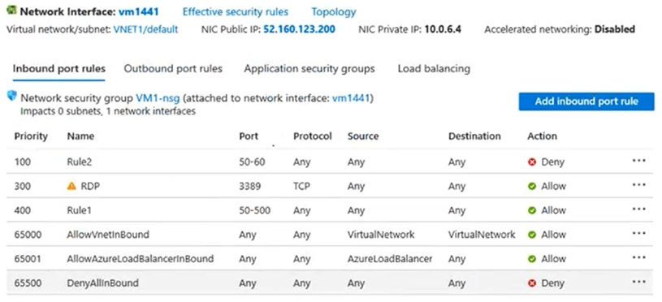
Use the drop-down menus to select the answer choice that completes each statement based on the information presented in the graphic.
NOTE: Each correct selection is worth one point.
Hot Area:
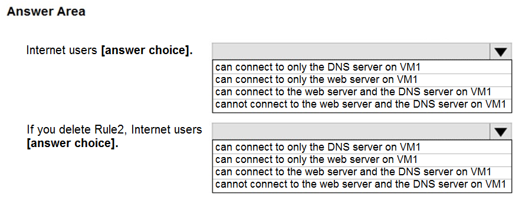

**Correct Answer:** 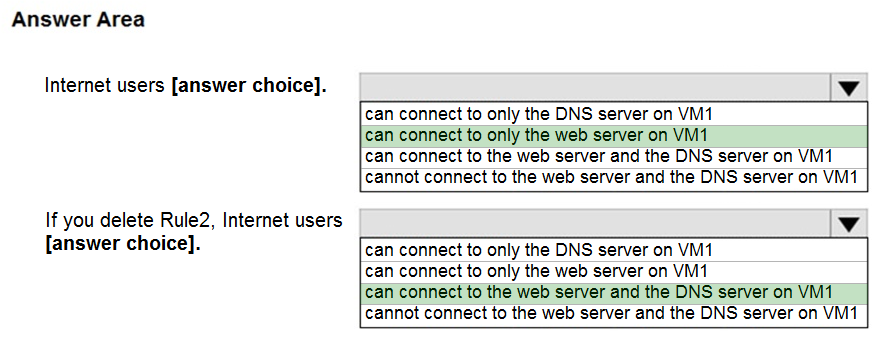

_Explanation:_
Box 1:
Rule2 blocks ports 50-60, which includes port 53, the DNS port. Internet users can reach to the Web server, since it uses port 80.
Box 2:
If Rule2 is removed internet users can reach the DNS server as well.
Note: Rules are processed in priority order, with lower numbers processed before higher numbers, because lower numbers have higher priority. Once traffic matches a rule, processing stops. As a result, any rules that exist with lower priorities (higher numbers) that have the same attributes as rules with higher priorities are not processed.
Reference:
https://docs.microsoft.com/en-us/azure/virtual-network/security-overview

---

### Question 301: Question #49 Topic 4

You plan to deploy three Azure virtual machines named VM1, VM2, and VM3. The virtual machines will host a web app named App1.
You need to ensure that at least two virtual machines are available if a single Azure datacenter becomes unavailable.
What should you deploy?

- A. all three virtual machines in a single Availability Zone
- B. all virtual machines in a single Availability Set
- C. each virtual machine in a separate Availability Zone
- D. each virtual machine in a separate Availability Set

**Correct Answer:** C

---

### Question 302: Question #50 Topic 4

You have an Azure virtual machine named VM1 that runs Windows Server 2019.
You save VM1 as a template named Template1 to the Azure Resource Manager library.
You plan to deploy a virtual machine named VM2 from Template1.
What can you configure during the deployment of VM2?

- A. operating system
- B. administrator username
- C. virtual machine size
- D. resource group

**Correct Answer:** D

---

### Question 303: Question #51 Topic 4

You have an Azure subscription that contains an Azure virtual machine named VM1. VM1 runs a financial reporting app named App1 that does not support multiple active instances.
At the end of each month, CPU usage for VM1 peaks when App1 runs.
You need to create a scheduled runbook to increase the processor performance of VM1 at the end of each month.
What task should you include in the runbook?

- A. Add the Azure Performance Diagnostics agent to VM1.
- B. Modify the VM size property of VM1.
- C. Add VM1 to a scale set.
- D. Increase the vCPU quota for the subscription.
- E. Add a Desired State Configuration (DSC) extension to VM1.

**Correct Answer:** B

---

### Question 304: Question #52 Topic 4

You plan to deploy several Azure virtual machines that will run Windows Server 2019 in a virtual machine scale set by using an Azure Resource Manager template.
You need to ensure that NGINX is available on all the virtual machines after they are deployed.
What should you use?

- A. Deployment Center in Azure App Service
- B. A Desired State Configuration (DSC) extension
- C. the New-AzConfigurationAssignment cmdlet
- D. a Microsoft Intune device configuration profile

**Correct Answer:** B

---

### Question 305: Question #53 Topic 4

HOTSPOT -
You deploy an Azure Kubernetes Service (AKS) cluster that has the network profile shown in the following exhibit.

Use the drop-down menus to select the answer choice that completes each statement based on the information presented in the graphic.
NOTE: Each correct selection is worth one point.
Hot Area:
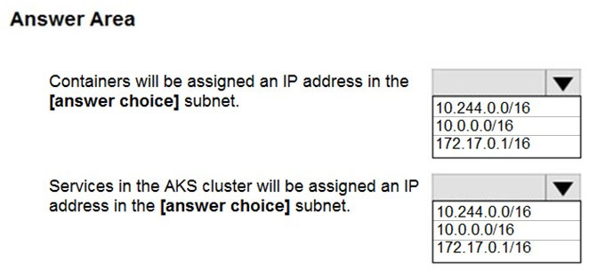

**Correct Answer:** 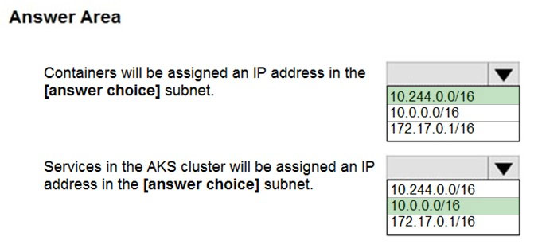

_Explanation:_
Box 1: 10.244.0.0/16 -
The Pod CIDR.
Note: The --pod-cidr should be a large address space that isn't in use elsewhere in your network environment. This range includes any on-premises network ranges if you connect, or plan to connect, your Azure virtual networks using Express Route or a Site-to-Site VPN connection.
This address range must be large enough to accommodate the number of nodes that you expect to scale up to. You can't change this address range once the cluster is deployed if you need more addresses for additional nodes.
Box 2: 10.0.0.0/16 -
The --service-cidr is used to assign internal services in the AKS cluster an IP address.
Reference:
https://docs.microsoft.com/en-us/azure/aks/configure-kubenet

---

### Question 306: Question #54 Topic 4

HOTSPOT -
You have the App Service plan shown in the following exhibit.

The scale-in settings for the App Service plan are configured as shown in the following exhibit.
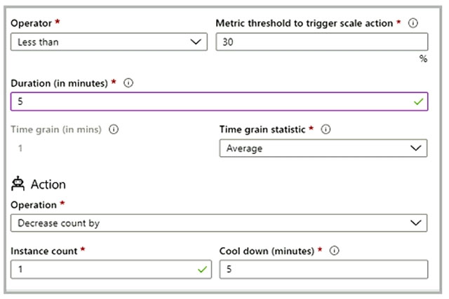
The scale out rule is configured with the same duration and cool down tile as the scale in rule.
Use the drop-down menus to select the answer choice that completes each statement based on the information presented in the graphic.
NOTE: Each correct selection is worth one point.
Hot Area:
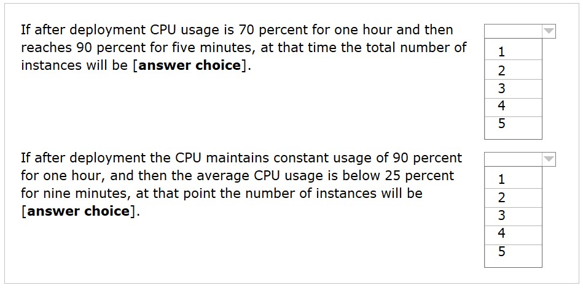

**Correct Answer:** 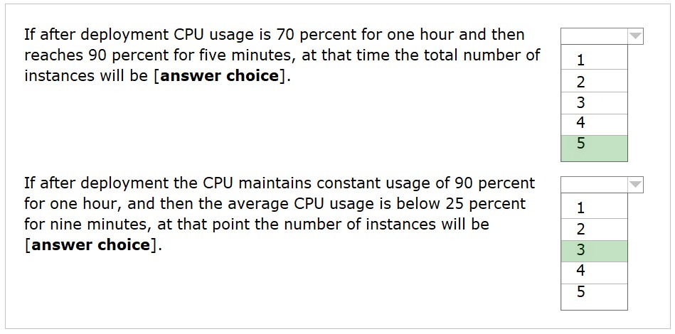

_Explanation:_
Box 1: 5 -
The maximum 5 will kept as the CPU Usage >= 30.
Box 2: 3 -
As soon as the average CPU usage drops below 30%, the count will decrease by 1. After the 5 minute cool-down it will decrease by another 1, reaching 3.
Reference:
https://docs.microsoft.com/en-us/azure/azure-monitor/learn/tutorial-autoscale-performance-schedule

---

### Question 307: Question #55 Topic 4

You have an Azure virtual machine named VM1 that runs Windows Server 2019. The VM was deployed using default drive settings.
You sign in to VM1 as a user named User1 and perform the following actions:
✑ Create files on drive C.
✑ Create files on drive D.
✑ Modify the screen saver timeout.
✑ Change the desktop background.
You plan to redeploy VM1.
Which changes will be lost after you redeploy VM1?

- A. the modified screen saver timeout
- B. the new desktop background
- C. the new files on drive D
- D. the new files on drive C

**Correct Answer:** C

---

### Question 308: Question #56 Topic 4

You have an Azure subscription.
You have an on-premises virtual machine named VM1. The settings for VM1 are shown in the exhibit. (Click the Exhibit tab.)
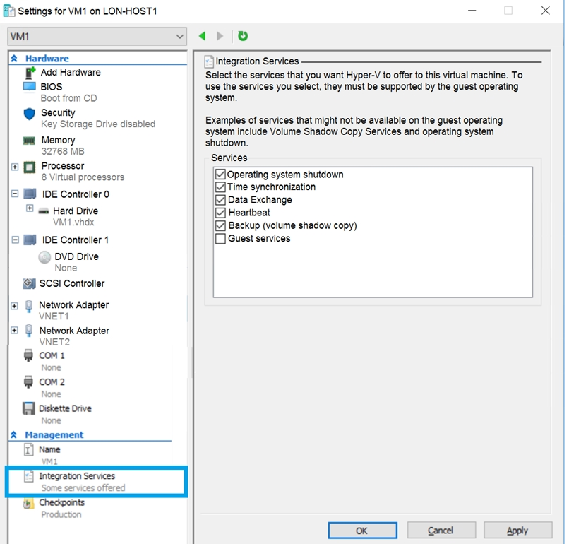
You need to ensure that you can use the disks attached to VM1 as a template for Azure virtual machines.
What should you modify on VM1?

- A. the memory
- B. the network adapters
- C. the hard drive
- D. the processor
- E. Integration Services

**Correct Answer:** C

---

### Question 309: Question #57 Topic 4

HOTSPOT -
You have an Azure subscription that contains a virtual machine scale set. The scale set contains four instances that have the following configurations:
✑ Operating system: Windows Server 2016
✑ Size: Standard_D1_v2
You run the get-azvmss cmdlet as shown in the following exhibit:
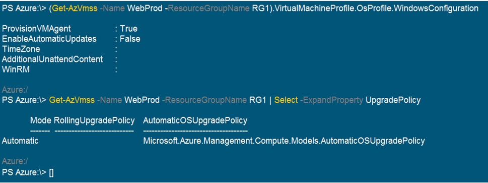
Use the drop-down menus to select the answer choice that completes each statement based on the information presented in the graphic.
NOTE: Each correct selection is worth one point.
Hot Area:
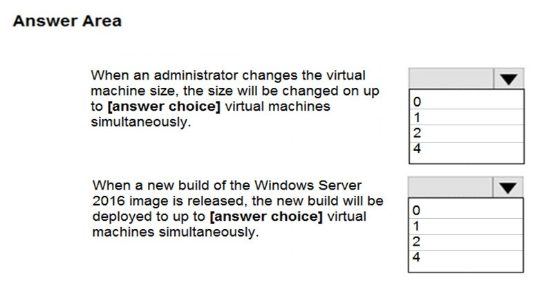

**Correct Answer:** 

_Explanation:_
The Get-AzVmssVM cmdlet gets the model view and instance view of a Virtual Machine Scale Set (VMSS) virtual machine.
Box 1: 0 -
The enableAutomaticUpdates parameter is set to false. To update existing VMs, you must do a manual upgrade of each existing VM.
Box 2: 4 -
Enabling automatic OS image upgrades on your scale set helps ease update management by safely and automatically upgrading the OS disk for all instances in the scale set.
Reference:
https://docs.microsoft.com/en-us/azure/virtual-machine-scale-sets/virtual-machine-scale-sets-upgrade-scale-set https://docs.microsoft.com/en-us/azure/virtual-machine-scale-sets/virtual-machine-scale-sets-automatic-upgrade

---

### Question 310: Question #58 Topic 4

You have an Azure subscription named Subscription1 that is used by several departments at your company. Subscription1 contains the resources in the following table:
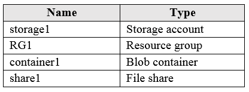
Another administrator deploys a virtual machine named VM1 and an Azure Storage account named storage2 by using a single Azure Resource Manager template.
You need to view the template used for the deployment.
From which blade can you view the template that was used for the deployment?

- A. VM1
- B. RG1
- C. storage2
- D. container1

**Correct Answer:** B

---

### Question 311: Question #59 Topic 4

You have an Azure web app named App1. App1 has the deployment slots shown in the following table:
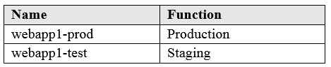
In webapp1-test, you test several changes to App1.
You back up App1.
You swap webapp1-test for webapp1-prod and discover that App1 is experiencing performance issues.
You need to revert to the previous version of App1 as quickly as possible.
What should you do?

- A. Redeploy App1
- B. Swap the slots
- C. Clone App1
- D. Restore the backup of App1

**Correct Answer:** B

---

### Question 312: Question #60 Topic 4

HOTSPOT -
You have an Azure subscription named Subscription1. Subscription1 contains two Azure virtual machines VM1 and VM2. VM1 and VM2 run Windows Server
2016.
VM1 is backed up daily by Azure Backup without using the Azure Backup agent.
VM1 is affected by ransomware that encrypts data.
You need to restore the latest backup of VM1.
To which location can you restore the backup? To answer, select the appropriate options in the answer area.
NOTE: Each correct selection is worth one point.
Hot Area:
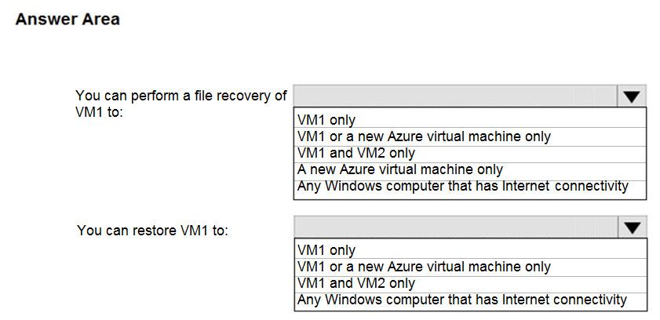

**Correct Answer:** 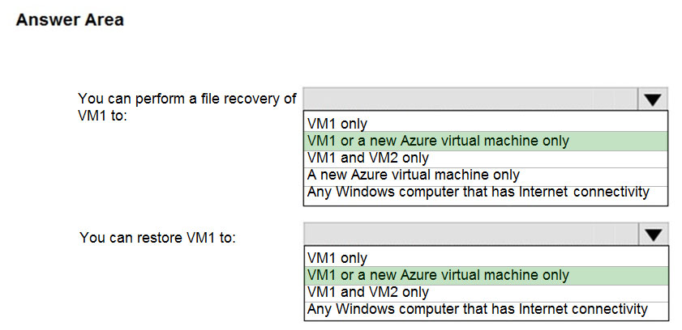

_Explanation:_
Note: The new VM must be in the same region.
Reference:
https://docs.microsoft.com/en-us/azure/backup/backup-azure-arm-restore-vms

---

### Question 313: Question #61 Topic 4

You plan to back up an Azure virtual machine named VM1.
You discover that the Backup Pre-Check status displays a status of Warning.
What is a possible cause of the Warning status?

- A. VM1 is stopped.
- B. VM1 does not have the latest version of the Azure VM Agent (WaAppAgent.exe) installed.
- C. VM1 has an unmanaged disk.
- D. A Recovery Services vault is unavailable.

**Correct Answer:** B

---

### Question 314: Question #62 Topic 4

Note: This question is part of a series of questions that present the same scenario. Each question in the series contains a unique solution that might meet the stated goals. Some question sets might have more than one correct solution, while others might not have a correct solution.
After you answer a question in this section, you will NOT be able to return to it. As a result, these questions will not appear in the review screen.
You have an Azure virtual machine named VM1. VM1 was deployed by using a custom Azure Resource Manager template named ARM1.json.
You receive a notification that VM1 will be affected by maintenance.
You need to move VM1 to a different host immediately.
Solution: From the Overview blade, you move the virtual machine to a different resource group.
Does this meet the goal?

- A. Yes
- B. No

**Correct Answer:** B

---

### Question 315: Question #63 Topic 4

HOTSPOT -
You have an Azure subscription.
You plan to use Azure Resource Manager templates to deploy 50 Azure virtual machines that will be part of the same availability set.
You need to ensure that as many virtual machines as possible are available if the fabric fails or during servicing.
How should you configure the template? To answer, select the appropriate options in the answer area.
NOTE: Each correct selection is worth one point.
Hot Area:
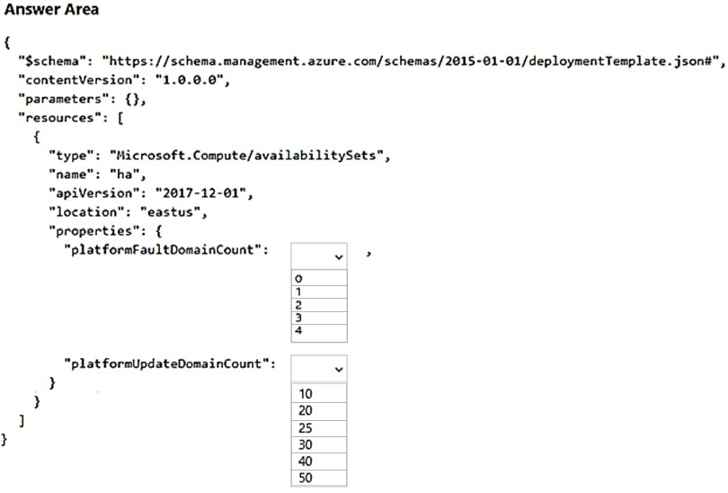

**Correct Answer:** 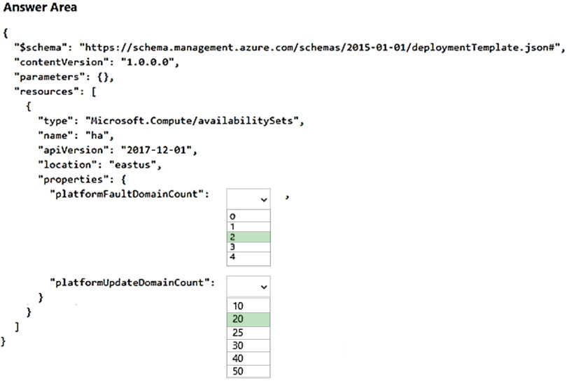

_Explanation:_
Box 1: 2 -
Use two fault domains.
2 or 3 is max, depending on which region you are in.
Box 2: 20 -
Use 20 for platformUpdateDomainCount
Increasing the update domain (platformUpdateDomainCount) helps with capacity and availability planning when the platform reboots nodes. A higher number for the pool (20 is max) means that fewer of their nodes in any given availability set would be rebooted at once.
Reference:
https://www.itprotoday.com/microsoft-azure/check-if-azure-region-supports-2-or-3-fault-domains-managed-disks https://github.com/Azure/acs-engine/issues/1030

---

### Question 316: Question #64 Topic 4

Note: This question is part of a series of questions that present the same scenario. Each question in the series contains a unique solution that might meet the stated goals. Some question sets might have more than one correct solution, while others might not have a correct solution.
After you answer a question in this section, you will NOT be able to return to it. As a result, these questions will not appear in the review screen.
You have an Azure virtual machine named VM1 that runs Windows Server 2016.
You need to create an alert in Azure when more than two error events are logged to the System event log on VM1 within an hour.
Solution: You create an Azure Log Analytics workspace and configure the Agent configuration settings. You install the Microsoft Monitoring Agent on VM1. You create an alert in Azure Monitor and specify the Log Analytics workspace as the source.
Does this meet the goal?

- A. Yes
- B. No

**Correct Answer:** A

---

### Question 317: Question #65 Topic 4

HOTSPOT -
You have an Azure subscription.
You deploy a virtual machine scale set that is configured as shown in the following exhibit.
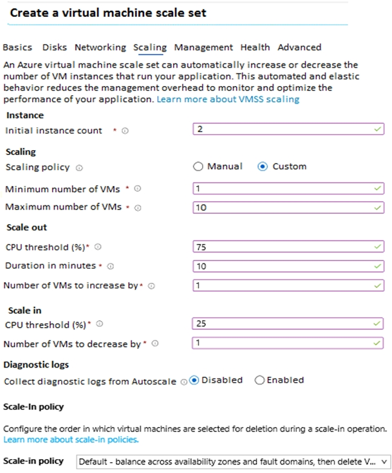
Use the drop-down menus to select the answer choice that answers each question based on the information presented in the graphic
NOTE: Each correct selection is worth one point.
Hot Area:
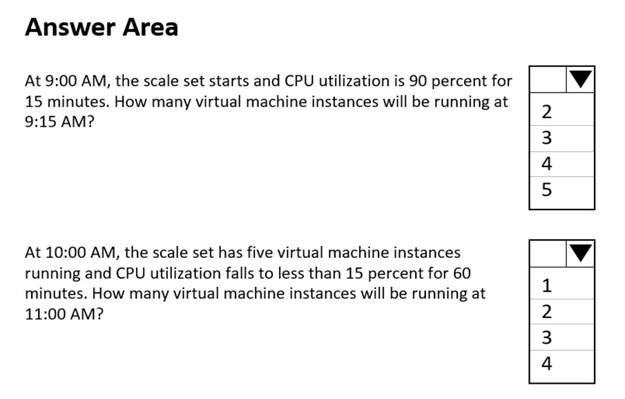

**Correct Answer:** 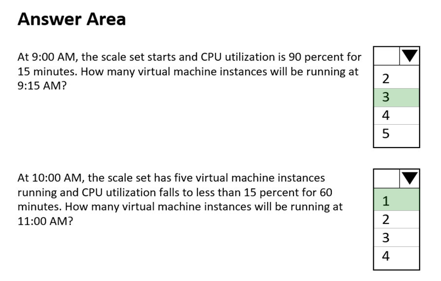

_Explanation:_
Reference:
https://docs.microsoft.com/en-us/azure/virtual-machine-scale-sets/virtual-machine-scale-sets-autoscale-portal

---

### Question 318: Question #66 Topic 4

You have web apps in the West US, Central US and East US Azure regions.
You have the App Service plans shown in the following table.

You plan to create an additional App Service plan named ASP5 that will use the Linux operating system.
You need to identify in which of the currently used locations you can deploy ASP5.
What should you recommend?

- A. West US, Central US, or East US
- B. Central US only
- C. East US only
- D. West US only

**Correct Answer:** A

---

### Question 319: Question #67 Topic 4

You plan to deploy several Azure virtual machines that will run Windows Server 2019 in a virtual machine scale set by using an Azure Resource Manager template.
You need to ensure that NGINX is available on all the virtual machines after they are deployed.
What should you use?

- A. the New-AzConfigurationAssignment cmdlet
- B. a Desired State Configuration (DSC) extension
- C. Azure Active Directory (Azure AD) Application Proxy
- D. Azure Application Insights

**Correct Answer:** B

---

### Question 320: Question #68 Topic 4

HOTSPOT -
You have an Azure subscription that contains the resources shown in the following table.
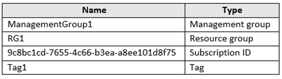
In Azure Cloud Shell, you need to create a virtual machine by using an Azure Resource Manager (ARM) template.
How should you complete the command? To answer, select the appropriate options in the answer area.
NOTE: Each correct selection is worth one point.
Hot Area:

**Correct Answer:** 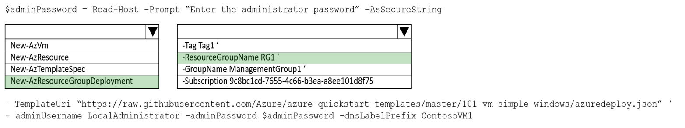

_Explanation:_
Reference:
https://docs.microsoft.com/en-us/powershell/module/az.resources/new-azresourcegroupdeployment?view=azps-6.6.0

---

### Question 321: Question #69 Topic 4

Note: This question is part of a series of questions that present the same scenario. Each question in the series contains a unique solution that might meet the stated goals. Some questions sets might have more than one correct solution, while others might not have a correct solution.
After you answer a question in this section, you will NOT be able to return to it. As a result, these questions will not appear in the review screen.
You deploy an Azure Kubernetes Service (AKS) cluster named AKS1.
You need to deploy a YAML file to AKS1.
Solution: From Azure Cloud Shell, you run az aks.
Does this meet the goal?

- A. Yes
- B. No

**Correct Answer:** B

---

### Question 322: Question #70 Topic 4

Note: This question is part of a series of questions that present the same scenario. Each question in the series contains a unique solution that might meet the stated goals. Some question sets might have more than one correct solution, while others might not have a correct solution.
After you answer a question in this section, you will NOT be able to return to it. As a result, these questions will not appear in the review screen.
You have an Azure virtual machine named VM1 that runs Windows Server 2016.
You need to create an alert in Azure when more than two error events are logged to the System event log on VM1 within an hour.
Solution: You create an Azure Log Analytics workspace and configure the data settings. You add the Microsoft Monitoring Agent VM extension to VM1. You create an alert in Azure Monitor and specify the Log Analytics workspace as the source.
Does this meet the goal?

- A. Yes
- B. No

**Correct Answer:** B

---

### Question 323: Question #71 Topic 4

Note: This question is part of a series of questions that present the same scenario. Each question in the series contains a unique solution that might meet the stated goals. Some question sets might have more than one correct solution, while others might not have a correct solution.
After you answer a question in this section, you will NOT be able to return to it. As a result, these questions will not appear in the review screen.
You have an Azure virtual machine named VM1 that runs Windows Server 2016.
You need to create an alert in Azure when more than two error events are logged to the System event log on VM1 within an hour.
Solution: You create an Azure Log Analytics workspace and configure the data settings. You install the Microsoft Monitoring Agent on VM1. You create an alert in
Azure Monitor and specify the Log Analytics workspace as the source.
Does this meet the goal?

- A. Yes
- B. No

**Correct Answer:** A

---

### Question 324: Question #72 Topic 4

You have an Azure subscription that contains the resources shown in the following table.

All virtual machines run Windows Server 2016.
On VM1, you back up a folder named Folder1 as shown in the following exhibit.
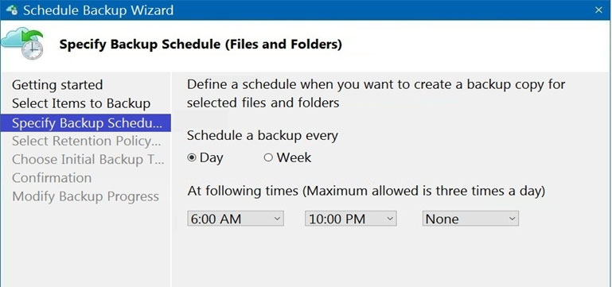
You plan to restore the backup to a different virtual machine.
You need to restore the backup to VM2.
What should you do first?

- A. From VM1, install the Windows Server Backup feature.
- B. From VM2, install the Microsoft Azure Recovery Services Agent.
- C. From VM1, install the Microsoft Azure Recovery Services Agent.
- D. From VM2, install the Windows Server Backup feature.

**Correct Answer:** B

---

### Question 325: Question #73 Topic 4

HOTSPOT -
You have an Azure subscription.
You need to use an Azure Resource Manager (ARM) template to create a virtual machine that will have multiple data disks.
How should you complete the template? To answer, select the appropriate options in the answer area.
NOTE: Each correct selection is worth one point.
Hot Area:
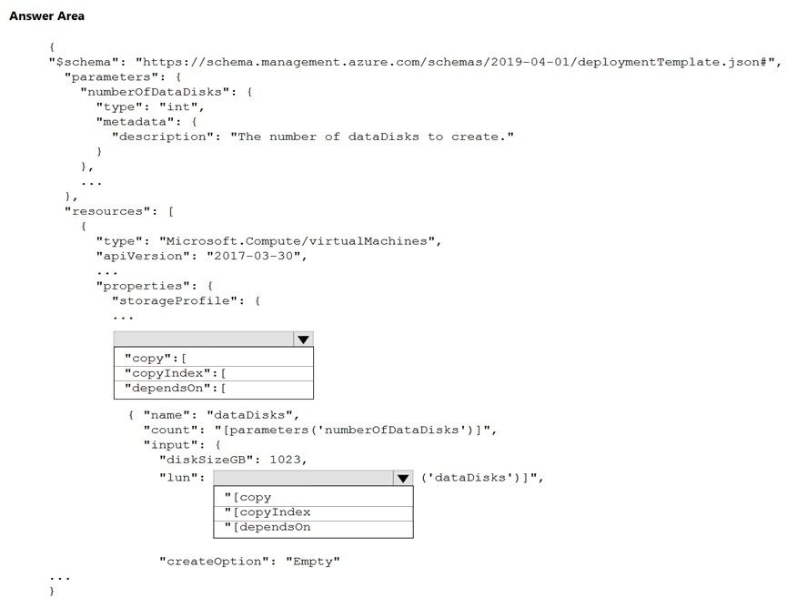

**Correct Answer:** 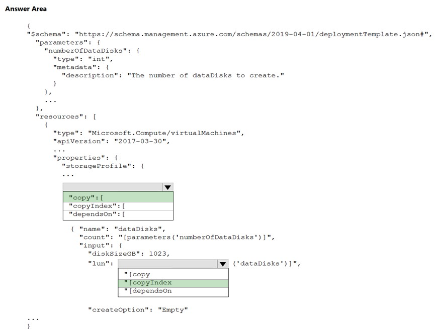

---

### Question 326: Question #74 Topic 4

Note: This question is part of a series of questions that present the same scenario. Each question in the series contains a unique solution that might meet the stated goals. Some question sets might have more than one correct solution, while others might not have a correct solution.
After you answer a question in this section, you will NOT be able to return to it. As a result, these questions will not appear in the review screen.
You have an Azure subscription named Subscription1 that contains the resources shown in the following table.

Subscription1 also includes a virtual network named VNET2. VM1 connects to a virtual network named VNET2 by using a network interface named NIC1.
You need to create a new network interface named NIC2 for VM1.
Solution: You create NIC2 in RG1 and West US.
Does this meet the goal?

- A. Yes
- B. No

**Correct Answer:** A

---

### Question 327: Question #75 Topic 4

Note: This question is part of a series of questions that present the same scenario. Each question in the series contains a unique solution that might meet the stated goals. Some question sets might have more than one correct solution, while others might not have a correct solution.
After you answer a question in this section, you will NOT be able to return to it. As a result, these questions will not appear in the review screen.
You have an Azure subscription named Subscription1 that contains the resources shown in the following table.

Subscription1 also includes a virtual network named VNET2. VM1 connects to a virtual network named VNET2 by using a network interface named NIC1.
You need to create a new network interface named NIC2 for VM1.
Solution: You create NIC2 in RG2 and Central US.
Does this meet the goal?

- A. Yes
- B. No

**Correct Answer:** B

---

### Question 328: Question #76 Topic 4

Note: This question is part of a series of questions that present the same scenario. Each question in the series contains a unique solution that might meet the stated goals. Some question sets might have more than one correct solution, while others might not have a correct solution.
After you answer a question in this section, you will NOT be able to return to it. As a result, these questions will not appear in the review screen.
You have an Azure subscription named Subscription1 that contains the resources shown in the following table.

Subscription1 also includes a virtual network named VNET2. VM1 connects to a virtual network named VNET2 by using a network interface named NIC1.
You need to create a new network interface named NIC2 for VM1.
Solution: You create NIC2 in RG2 and West US.
Does this meet the goal?

- A. Yes
- B. No

**Correct Answer:** A

---

### Question 329: Question #77 Topic 4

You develop the following Azure Resource Manager (ARM) template to create a resource group and deploy an Azure Storage account to the resource group.
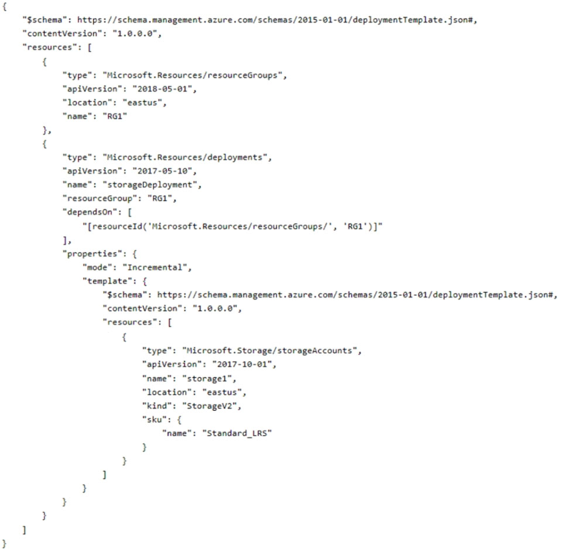
Which cmdlet should you run to deploy the template?

- A. New-AzResource
- B. New-AzResourceGroupDeployment
- C. New-AzTenantDeployment
- D. New-AzDeployment

**Correct Answer:** D

---

### Question 330: Question #78 Topic 4

HOTSPOT -
You have an Azure App Service app named WebApp1 that contains two folders named Folder1 and Folder2.
You need to configure a daily backup of WebApp1. The solution must ensure that Folder2 is excluded from the backup.
What should you create first, and what should you use to exclude Folder2? To answer, select the appropriate options in the answer area.
NOTE: Each correct selection is worth one point.
Hot Area:
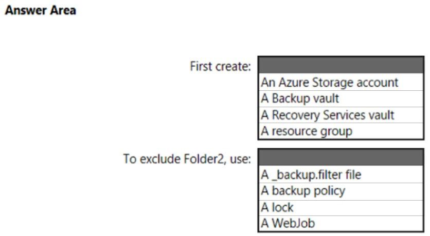

**Correct Answer:** 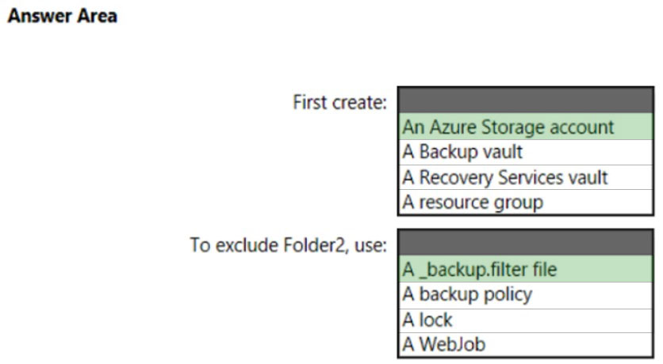

_Explanation:_
Box 1: An Azure Storage account -
App Service can back up the following information to an Azure storage account and container that you have configured your app to use.
App configuration -
File content -
Database connected to your app -
Note: Choose your backup destination by selecting a Storage Account and Container. The storage account must belong to the same subscription as the app you want to back up. If you wish, you can create a new storage account or a new container in the respective pages.
Box 2: A _backup.filter file -
Exclude files from your backup.
Suppose you have an app that contains log files and static images that have been backup once and are not going to change. In such cases, you can exclude those folders and files from being stored in your future backups. To exclude files and folders from your backups, create a _backup.filter file in the D:\home\site
\wwwroot folder of your app. Specify the list of files and folders you want to exclude in this file.
Reference:
https://docs.microsoft.com/en-us/azure/app-service/manage-backup

---

### Question 331: Question #79 Topic 4

You plan to deploy several Azure virtual machines that will run Windows Server 2019 in a virtual machine scale set by using an Azure Resource Manager template.
You need to ensure that NGINX is available on all the virtual machines after they are deployed.
What should you use?

- A. the Publish-AzVMDscConfiguration cmdlet
- B. Azure Application Insights
- C. Azure Custom Script Extension
- D. a Microsoft Endpoint Manager device configuration profile

**Correct Answer:** C

---

### Question 332: Question #80 Topic 4

HOTSPOT -
You have an Azure subscription. The subscription contains a virtual machine that runs Windows 10.
You need to join the virtual machine to an Active Directory domain.
How should you complete the Azure Resource Manager (ARM) template? To answer, select the appropriate options in the answer area.
NOTE: Each correct selection is worth one point.
Hot Area:
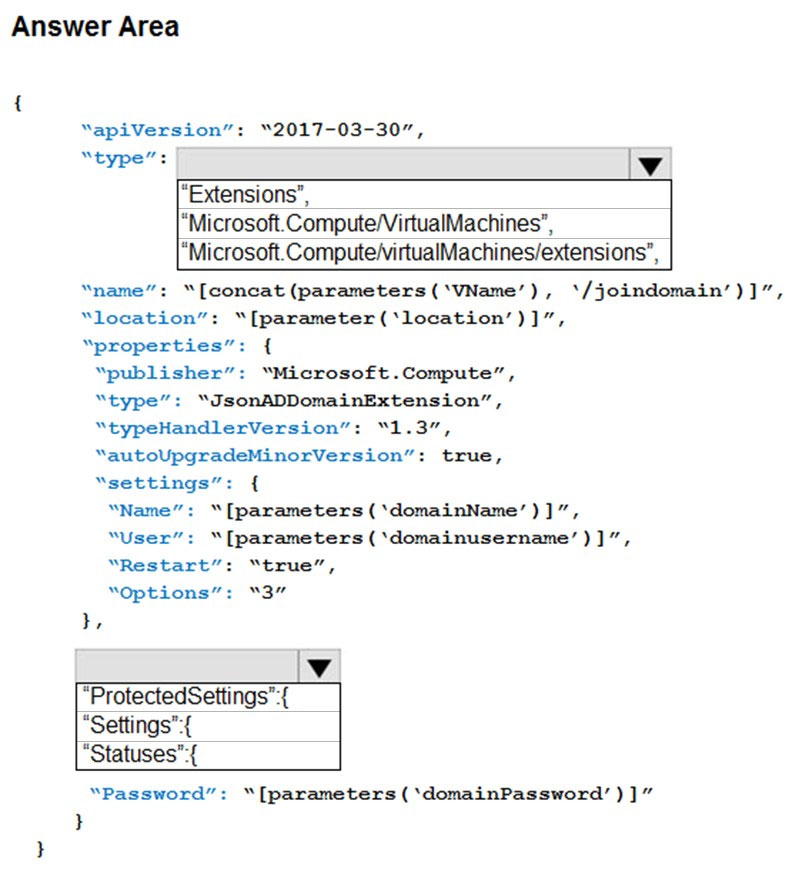

**Correct Answer:** 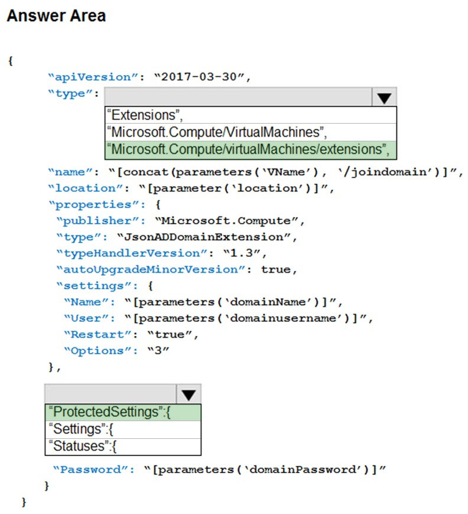

_Explanation:_
Box 1: "Microsoft.Compute/VirtualMachines/extensions",
The following JSON example uses the Microsoft.Compute/virtualMachines/extensions resource type to install the Active Directory domain join extension.
Parameters are used that you specify at deployment time. When the extension is deployed, the VM is joined to the specified managed domain.
Box 2: "ProtectedSettings":{
Example:
{
"apiVersion": "2015-06-15",
"type": "Microsoft.Compute/virtualMachines/extensions",
"name": "[concat(parameters('dnsLabelPrefix'),'/joindomain')]",
"location": "[parameters('location')]",
"dependsOn": [
"[concat('Microsoft.Compute/virtualMachines/', parameters('dnsLabelPrefix'))]"
],
"properties": {
"publisher": "Microsoft.Compute",
"type": "JsonADDomainExtension",
"typeHandlerVersion": "1.3",
"autoUpgradeMinorVersion": true,
"settings": {
"Name": "[parameters('domainToJoin')]",
"OUPath": "[parameters('ouPath')]",
"User": "[concat(parameters('domainToJoin'), '\\', parameters('domainUsername'))]",
"Restart": "true",
"Options": "[parameters('domainJoinOptions')]"
},
"protectedSettings": {
"Password": "[parameters('domainPassword')]"
}
}
}
Reference:
https://docs.microsoft.com/en-us/azure/active-directory-domain-services/join-windows-vm-template

---

### Question 333: Question #81 Topic 4

You have an Azure subscription that contains three virtual machines named VM1, VM2, and VM3. All the virtual machines are in an availability set named AVSet1.
You need to scale up VM1 to a new virtual machine size, but the intended size is unavailable.
What should you do first?

- A. Create a proximity placement group.
- B. Deallocate VM1.
- C. Convert AvSet1 into a managed availability set.
- D. Shut down VM3 and VM3.

**Correct Answer:** B

---

### Question 334: Question #82 Topic 4

HOTSPOT
-
You are creating an Azure Kubernetes Services (AKS) cluster as shown in the following exhibit.
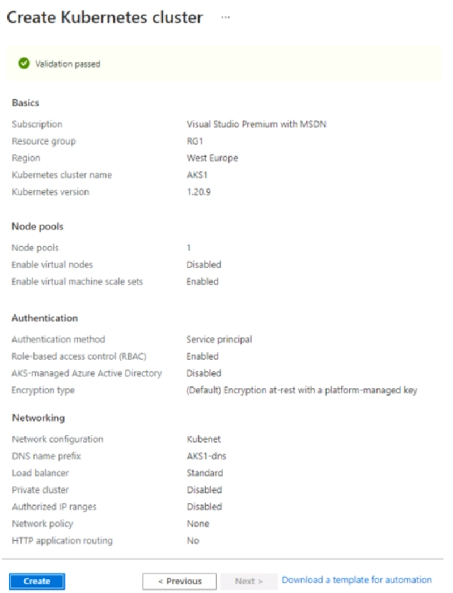
Use the drop-down menus to select the answer choice that completes each statement based on the information presented in the graphic.
NOTE: Each correct selection is worth one point.
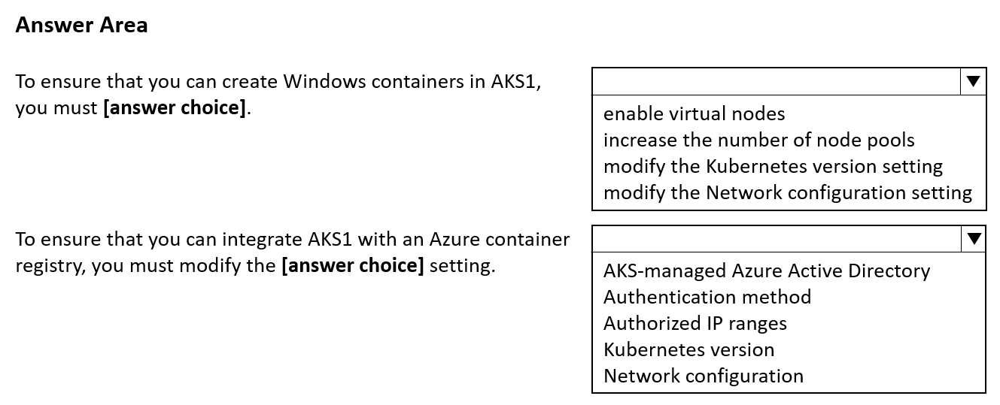

**Correct Answer:** 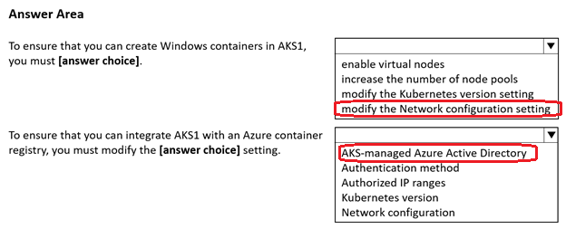

---

### Question 335: Question #83 Topic 4

HOTSPOT
-
You have an Azure subscription that contains an Azure Kubernetes Service (AKS) cluster named Cluster1. Cluster1 hosts a node pool named Pool1 that has four nodes.
You need to perform a coordinated upgrade of Cluster1. The solution must meet the following requirements:
•Deploy two new nodes to perform the upgrade.
•Minimize costs.
How should you complete the command? To answer, select the appropriate options in the answer area.
NOTE: Each correct selection is worth one point.
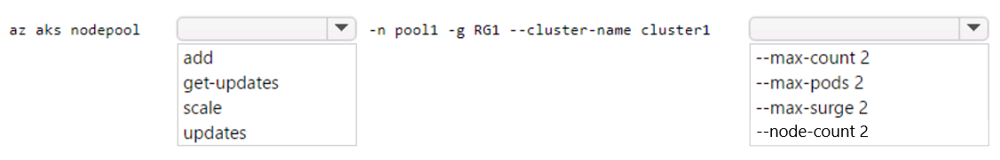

**Correct Answer:** 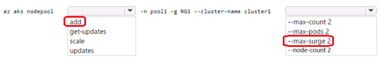

---

### Question 336: Question #84 Topic 4

HOTSPOT
-
You have an Azure subscription.
You create the following file named Deploy.json.
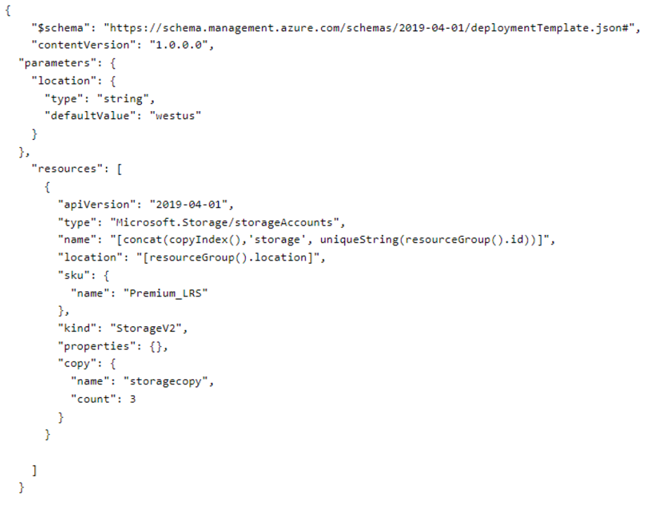
You connect to the subscription and run the following commands.
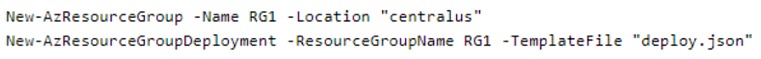
For each of the following statements, select Yes if the statement is true. Otherwise, select No.
NOTE: Each correct selection is worth one point.
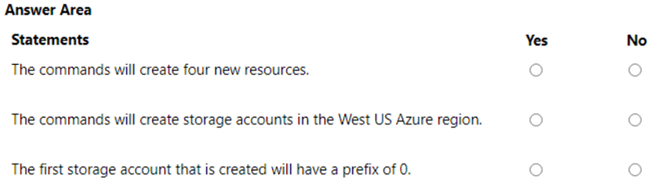

**Correct Answer:** 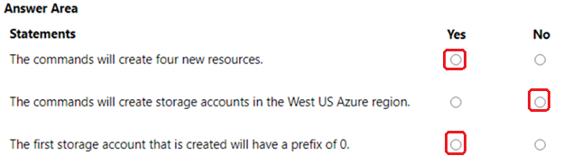

---

### Question 337: Question #85 Topic 4

Note: This question is part of a series of questions that present the same scenario. Each question in the series contains a unique solution that might meet the stated goals. Some question sets might have more than one correct solution, while others might not have a correct solution.
After you answer a question in this section, you will NOT be able to return to it. As a result, these questions will not appear in the review screen.
You have an Azure container registry named Registry1 that contains an image named image1.
You receive an error message when you attempt to deploy a container instance by using image1.
You need to be able to deploy a container instance by using image1.
Solution: You set Admin user to Enable for Registry1.
Does this meet the goal?

- A. Yes
- B. No

**Correct Answer:** A

---

### Question 338: Question #86 Topic 4

HOTSPOT
-
You have an Azure subscription that contains a resource group named RG1.
You plan to use an Azure Resource Manager (ARM) template named template1 to deploy resources. The solution must meet the following requirements:
•Deploy new resources to RG1.
•Remove all the existing resources from RG1 before deploying the new resources.
How should you complete the command? To answer, select the appropriate options in the answer area.
NOTE: Each correct selection is worth one point.
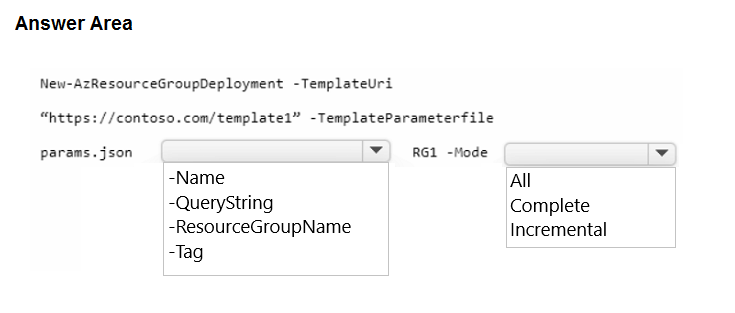

**Correct Answer:** 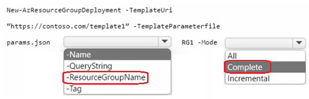

---

### Question 339: Question #87 Topic 4

HOTSPOT
-
You have an Azure App Service web app named app1.
You configure autoscaling as shown in following exhibit.
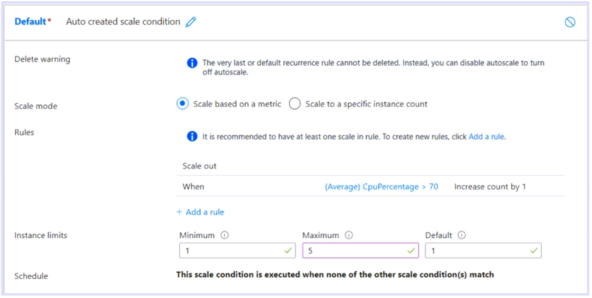
You configure the autoscale rule criteria as shown in the following exhibit.
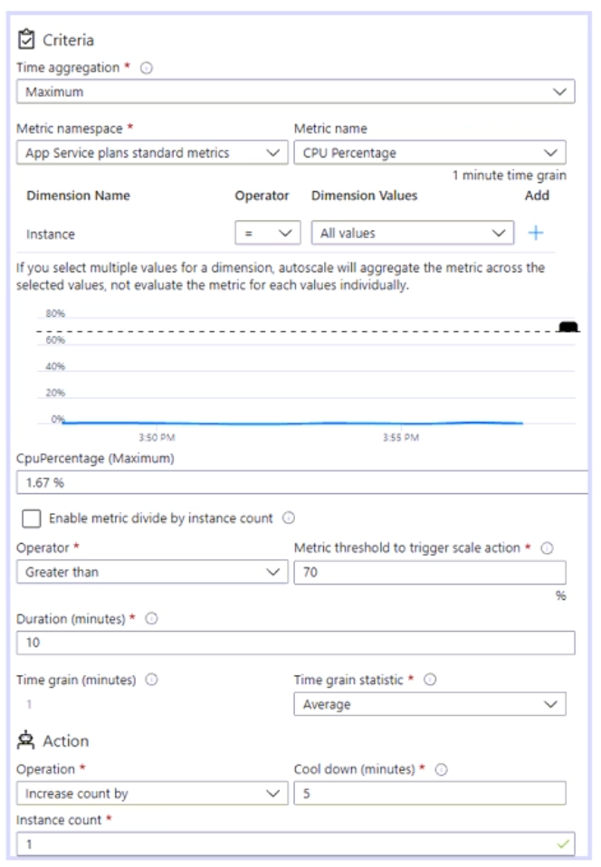
Use the drop-down menus to select the answer choice that answers each question based on the information presented in the graphic.
NOTE: Each correct selection is worth one point.
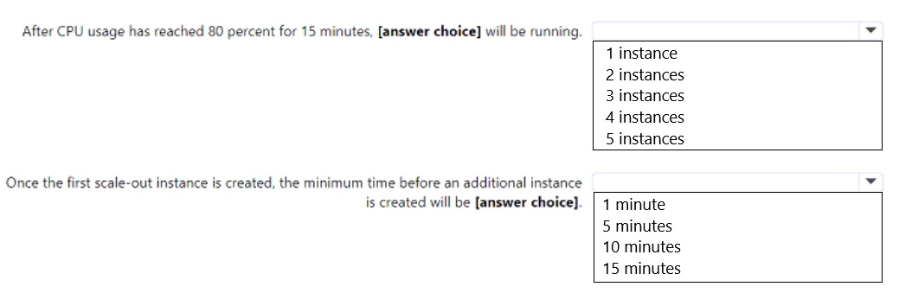

**Correct Answer:** 

---

### Question 340: Question #88 Topic 4

You have an Azure subscription.
You plan to deploy the Azure container instances shown in the following table.
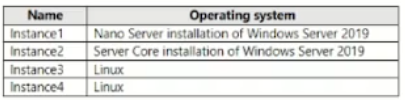
Which instances can you deploy to a container group?

- A. Instance1 only
- B. Instance2 only
- C. Instance1 and Instance2 only
- D. Instance3 and Instance4 only

**Correct Answer:** D

---

### Question 341: Question #89 Topic 4

HOTSPOT -
You have an Azure container registry named contoso2023 as shown in the following exhibit.
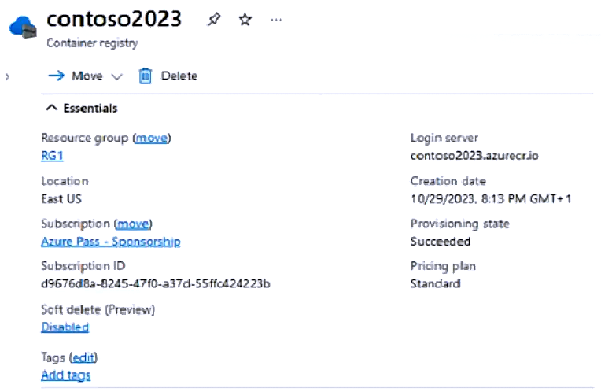
You need to enable contoso2023 to use a dedicated data endpoint.
Which two settings should you configure for contoso2023? To answer, select the appropriate settings in the answer area.
NOTE: Each correct answer is worth one point.
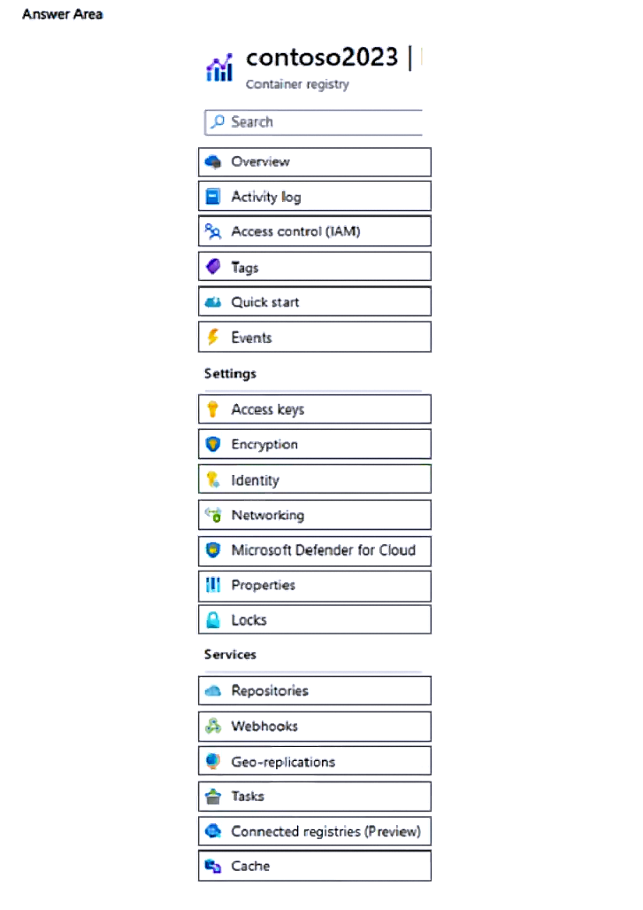

**Correct Answer:** 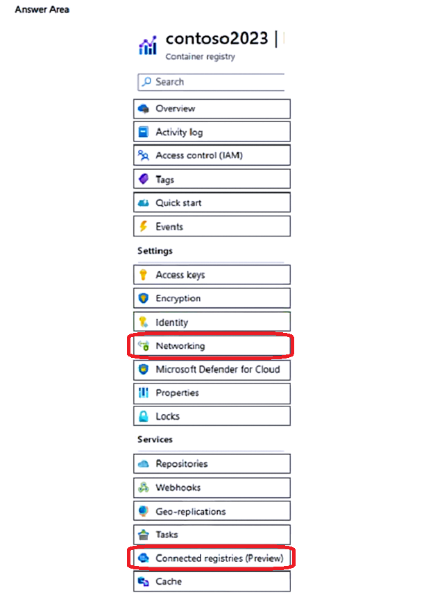

---

### Question 342: Question #90 Topic 4

You have an Azure subscription that has the public IP addresses shown in the following table.
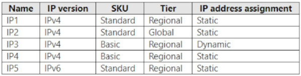
You plan to deploy an Instance of Azure Firewall Premium named FW1.
Which IP addresses can you use?

- A. IP2 only
- B. IP1 and IP2 only
- C. IP1, IP2, and IP5 only
- D. IP1, IP2, IP4, and IP5 only

**Correct Answer:** B

---

### Question 343: Question #91 Topic 4

HOTSPOT
-
You have an Azure subscription.
You need to deploy a virtual machine by using an Azure Resource Manager (ARM) template.
How should you complete the template? To answer, select the appropriate options in the answer area.
NOTE: Each correct selection is worth one point.
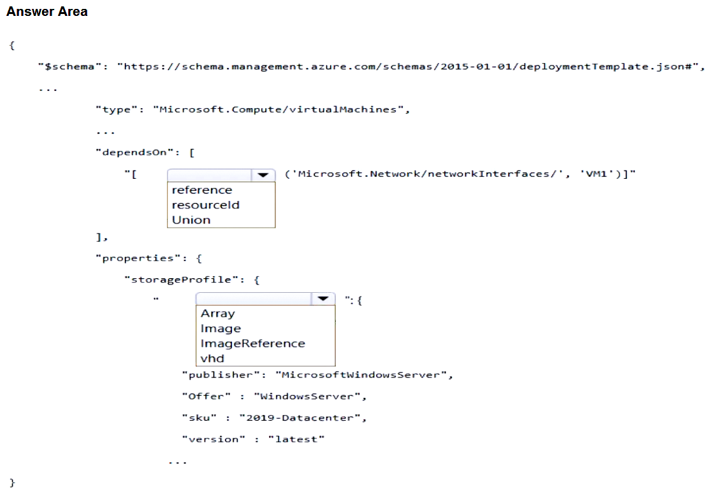

**Correct Answer:** 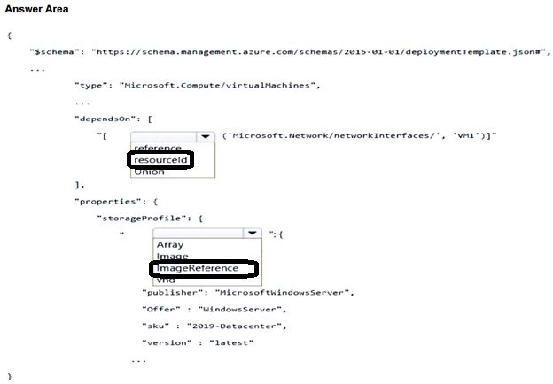

---

### Question 344: Question #92 Topic 4

HOTSPOT
-
You need to configure a new Azure App Service app named WebApp1. The solution must meet the following requirements:
•WebApp1 must be able to verify a custom domain name of app.contoso.com.
•WebApp1 must be able to automatically scale up to eight instances.
•Costs and administrative effort must be minimized.
Which pricing plan should you choose, and which type of record should you use to verify the domain? To answer, select the appropriate options in the answer area.
NOTE: Each correct answer is worth one point.
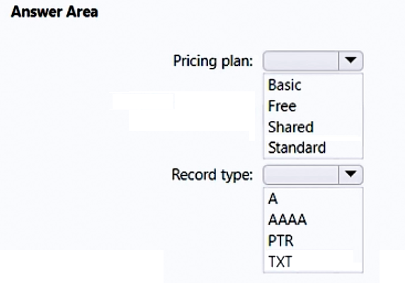

**Correct Answer:** 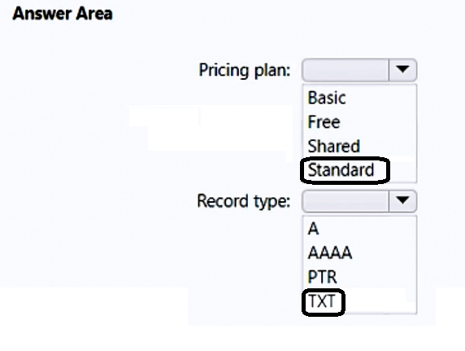

---

### Question 345: Question #93 Topic 4

HOTSPOT
-
You have an Azure subscription that contains the virtual machines shown in the following table.
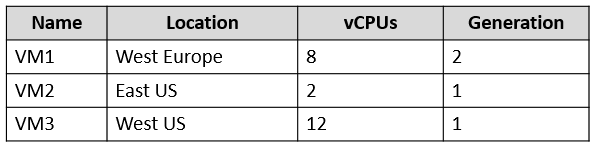
You create an Azure Compute Gallery named ComputeGallery1 as shown in the Azure Compute Gallery exhibit. (Click the Azure Compute Gallery tab.)
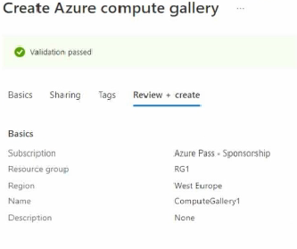
In ComputeGallery1, you create a virtual machine image definition named Image1 as shown in the image definition exhibit. (Click the Image Definition tab.)
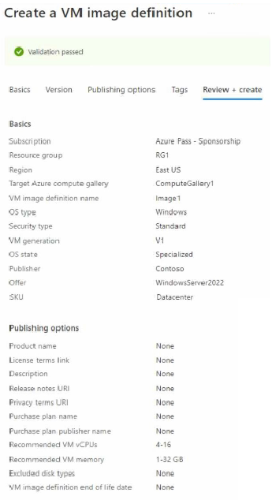
For each of the following statements, select Yes if the statement is true. Otherwise, select No,
NOTE: Each correct selection is worth one point.
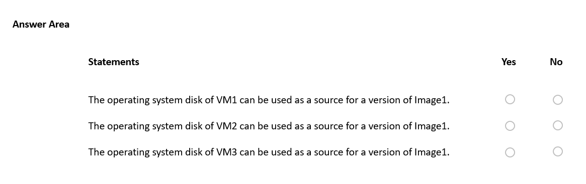

**Correct Answer:** 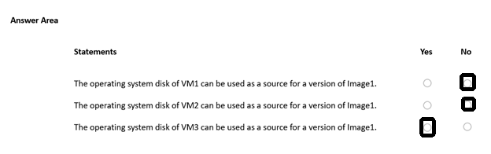

---

### Question 346: Question #94 Topic 4

You plan to create the Azure web apps shown in the following table.
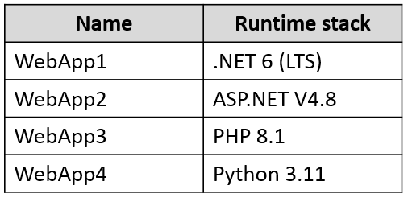
What is the minimum number of App Service plans you should create for the web apps?

- A. 1
- B. 2
- C. 3
- D. 4

**Correct Answer:** B

---

### Question 347: Question #95 Topic 4

HOTSPOT
-
You have an Azure subscription that contains the resource groups shown in the following table.
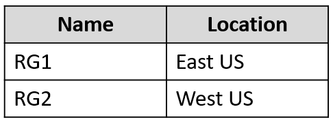
You create the following Azure Resource Manager (ARM) template named deploy.json.
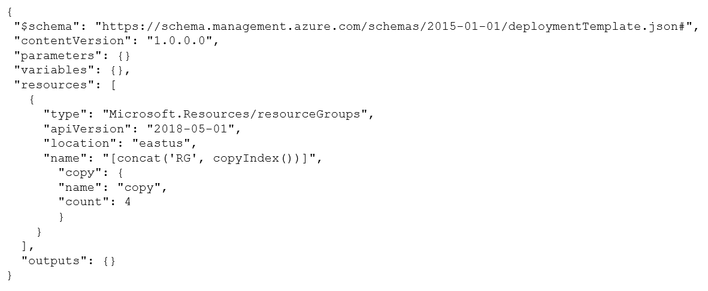
You deploy the template by running the following cmdlet.

For each of the following statements, select Yes if the statement is true. Otherwise, select No.
NOTE: Each correct selection is worth one point.
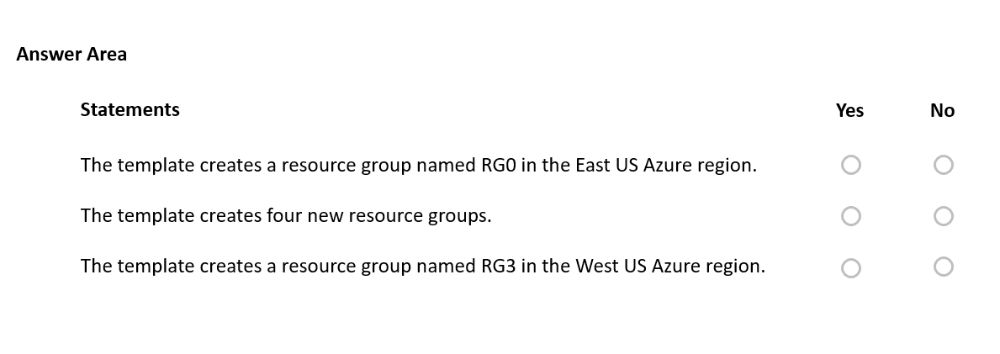

**Correct Answer:** 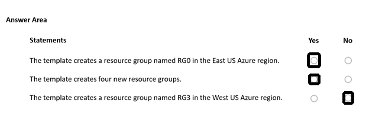

---

### Question 348: Question #96 Topic 4

You have an Azure App Service app named App1 that contains two running instances.
You have an autoscale rule configured as shown in the following exhibit.
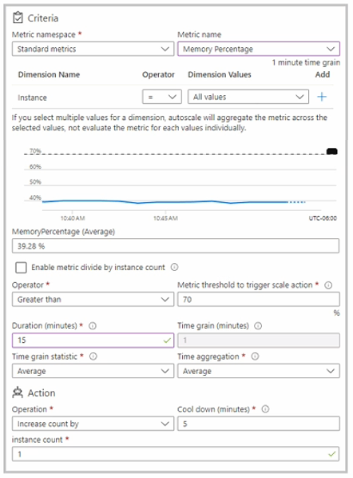
For the Instance limits scale condition setting, you set Maximum to 5.
During a 30-minute period, App1 uses 80 percent of the available memory.
What is the maximum number of instances for App1 during the 30-minute period?

- A. 2
- B. 3
- C. 4
- D. 5

**Correct Answer:** D

---

### Question 349: Question #97 Topic 4

HOTSPOT
-
You have an Azure subscription that contains the container images shown in the following table.
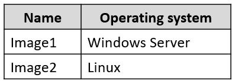
You plan to use the following services:
•Azure Container Instances
•Azure Container Apps
•Azure App Service
In which services can you run the images? To answer, select the options in the answer area.
NOTE: Each correct answer is worth one point.
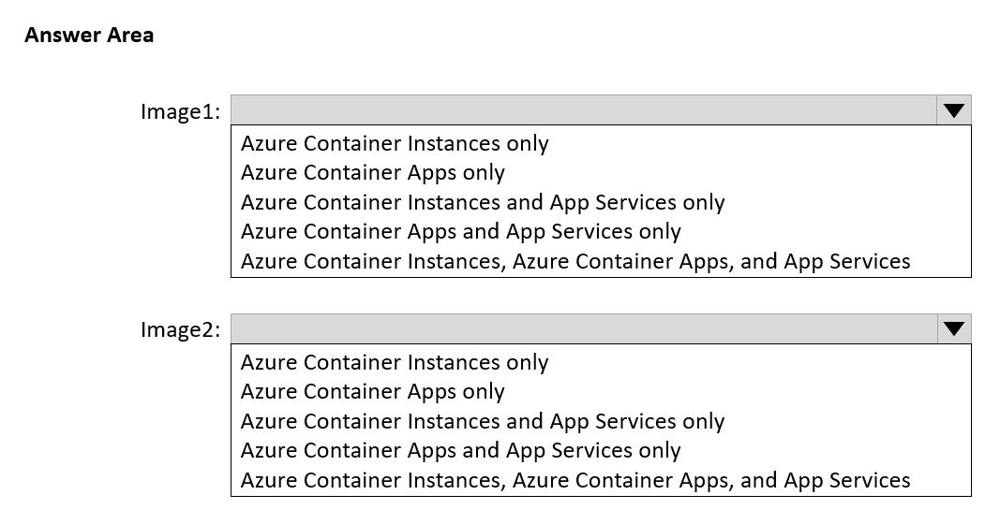

**Correct Answer:** 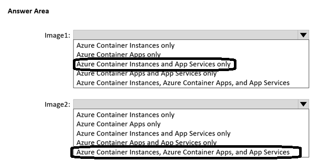

---

### Question 350: Question #98 Topic 4

You have an Azure AD tenant named contoso.com.
You have an Azure subscription that contains an Azure App Service web app named App1 and an Azure key vault named KV1. KV1 contains a wildcard certificate for contoso.com.
You have a user named user1@contoso.com that is assigned the Owner role for App1 and KV1.
You need to configure App1 to use the wildcard certificate of KV1.
What should you do first?

- A. Create an access policy for KV1 and assign the Microsoft Azure App Service principal to the policy.
- B. Assign a managed user identity to App1.
- C. Configure KV1 to use the role-based access control (RBAC) authorization system.
- D. Create an access policy for KV1 and assign the policy to User1.

**Correct Answer:** B

---

### Question 351: Question #99 Topic 4

You have an Azure subscription.
You plan to deploy the resources shown in the following table.
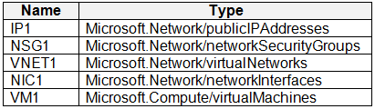
You need to create a single Azure Resource Manager (ARM) template that will be used to deploy the resources.
Which resource should be added to the dependsOn section for VM1?

- A. VNET1
- B. NIC1
- C. IP1
- D. NSG1

**Correct Answer:** B

---

### Question 352: Question #100 Topic 4

You have an Azure subscription.
You create the following Azure Resource Manager (ARM) template named Template.json.
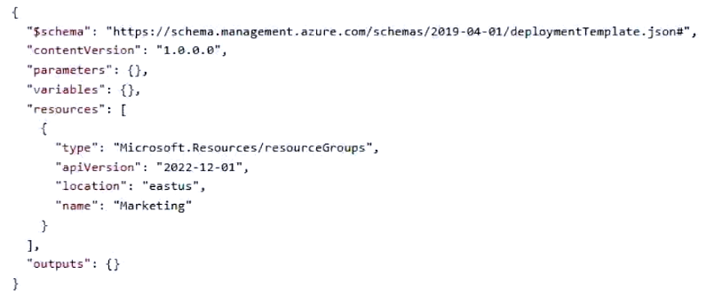
You need to deploy Template.json.
Which PowerShell cmdlet should you run from Azure Cloud Shell?

- A. New-AzSubscriptionDeployment
- B. New-AzManagementGroupDeployment
- C. New-AzResourceGroupDeployment
- D. New-AzTenantDeployment

**Correct Answer:** A

---

### Question 353: Question #101 Topic 4

You have an Azure subscription that contains a resource group named RG1.
You plan to create a storage account named storage1.
You have a Bicep file named File1.
You need to modify File1 so that it can be used to automate the deployment of storage1 to RG1.
Which property should you modify?

- A. kind
- B. scope
- C. sku
- D. location

**Correct Answer:** B

---

### Question 354: Question #102 Topic 4

HOTSPOT
-
Your company purchases a new Azure subscription.
You create a file named Deploy.json as shown in the following exhibit.
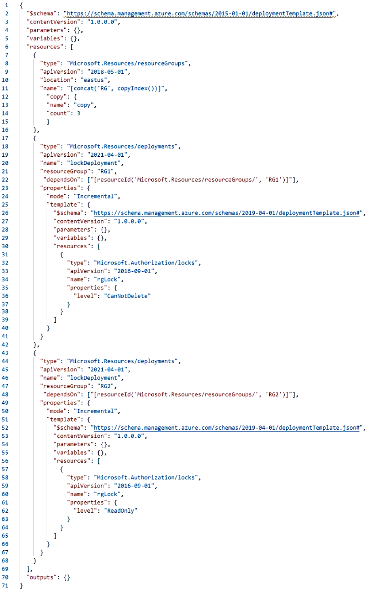
You connect to the subscription and run the following cmdlet.
New-AzDeployment -Location westus -TemplateFile “deploy.json”
For each of the following statements, select Yes if the statement is true. Otherwise, select No.
NOTE: Each correct selection is worth one point.
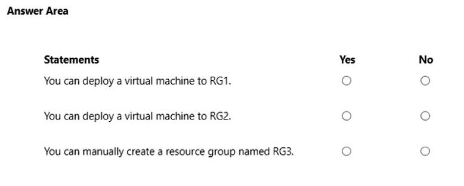

**Correct Answer:** 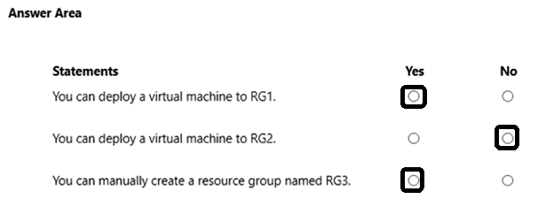

---

### Question 355: Question #103 Topic 4

You have an Azure subscription that contains the resources shown in the following table.
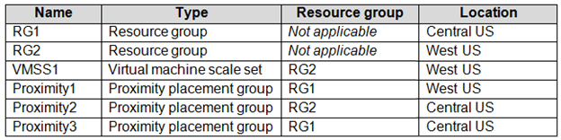
You need to configure a proximity placement group for VMSS1.
Which proximity placement groups should you use?

- A. Proximity2 only
- B. Proximity1, Proximity2, and Proximity3
- C. Proximity1 only
- D. Proximity1 and Proximity3 only

**Correct Answer:** C

---

### Question 356: Question #104 Topic 4

HOTSPOT
-
You have an Azure subscription that contains the virtual networks shown in the following table.
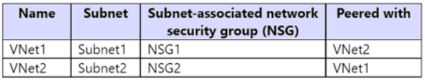
The subscription contains the virtual machines shown in the following table.
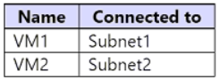
The subscription contains the Azure App Service web apps shown in the following table.
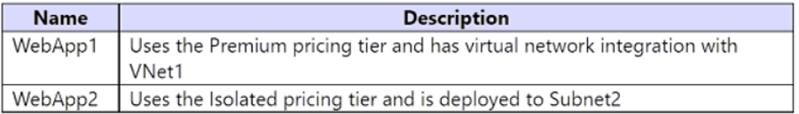
For each of the following statements, select Yes if the statement is true. Otherwise, select No.
NOTE: Each correct selection is worth one point.
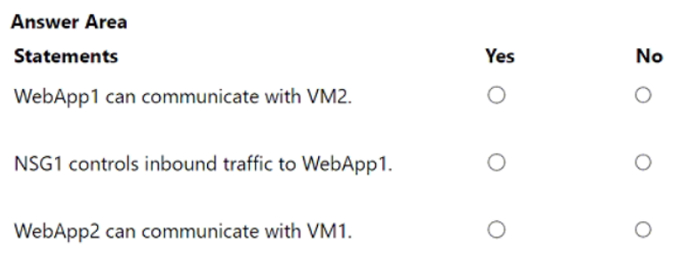

**Correct Answer:** 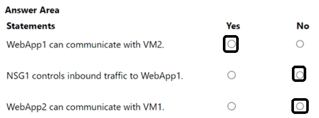

---

### Question 357: Question #105 Topic 4

You have an Azure subscription named Subscription1 that contains the resources shown in the following table.
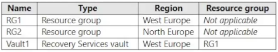
You create virtual machines in Subscription1 as shown in the following table.
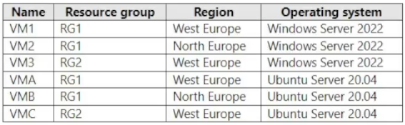
You plan to use Vault1 for the backup of as many virtual machines as possible.
Which virtual machines can be backed up to Vault1?

- A. VM1 only
- B. VM3 and VMC only
- C. VM1, VM2, VM3, VMA, VMB, and VMC
- D. VM1, VM3, VMA, and VMC only
- E. VM1 and VM3 only

**Correct Answer:** D

---

### Question 358: Question #106 Topic 4

You have an Azure subscription that contains an Azure container registry named ContReg1.
You enable the Admin user for ContReg1.
Which username can you use to sign in to ContReg1?

- A. root
- B. admin
- C. administrator
- D. ContReg1

**Correct Answer:** D

---

### Question 359: Question #107 Topic 4

You have an Azure subscription.
You plan to create an Azure container registry named ContReg1.
You need to ensure that you can push and pull signed images for ContReg1.
What should you do for ContReg1?

- A. Enable encryption by using a customer-managed key.
- B. Create a connected registry.
- C. Add a token.
- D. Enable content trust.

**Correct Answer:** D

---

### Question 360: Question #108 Topic 4

HOTSPOT
-
You have an Azure subscription that has the Azure container registries shown in the following table.
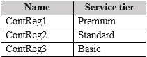
You plan to use ACR Tasks and configure private endpoint connections.
Which container registries support ACR Tasks and private endpoints? To answer, select the appropriate options in the answer area.
NOTE: Each correct selection is worth one point.
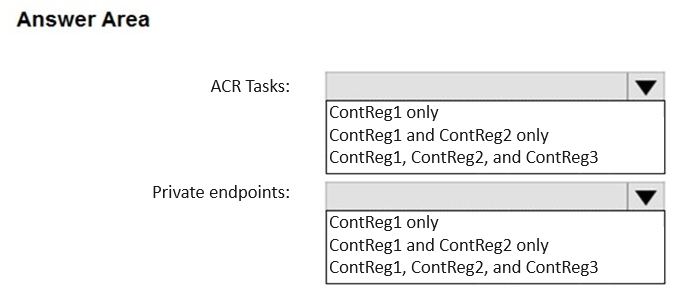

**Correct Answer:** 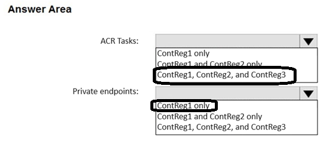

---

### Question 361: Question #109 Topic 4

You plan to deploy several Azure virtual machines that will run Windows Server 2022 in a virtual machine scale set by using an Azure Resource Manager template.
You need to ensure that NGINX is available on all the virtual machines after they are deployed.
What should you use?

- A. Azure Custom Script Extension
- B. Deployment Center in Azure App Service
- C. Microsoft Entra Application Proxy
- D. the Publish-AzVMDscConfiguration cmdlet

**Correct Answer:** A

---

### Question 362: Question #110 Topic 4

You have an Azure subscription that contains a container group named Group1. Group1 contains two Azure container instances as shown in the following table.
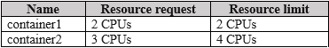
You need to ensure that container2 can use CPU resources without negatively affecting container1.
What should you do?

- A. Increase the resource limit of container1 to three CPUs.
- B. Increase the resource limit of container2 to six CPUs.
- C. Remove the resource limit for both containers.
- D. Decrease the resource limit of container2 to two CPUs.

**Correct Answer:** C

---

### Question 363: Question #111 Topic 4

You have an Azure subscription.
You plan to deploy a container.
You need to recommend which Azure services can scale the container automatically.
What should you recommend?

- A. Azure Container Apps only
- B. Azure Container Instances only
- C. Azure Container Apps or Azure App Service only
- D. Azure Container Instances or Azure App Service only
- E. Azure Container Apps, Azure Container Instances, or Azure App Service

**Correct Answer:** C

---

### Question 364: Question #112 Topic 4

HOTSPOT
-
You have an Azure subscription that uses Azure Container Instances.
You have a computer that has Azure Command-Line Interface (CLI) and Docker installed.
You create a container image named image1.
You need to provision a new Azure container registry and add image1 to the registry.
Which command should you run for each requirement? To answer, select the options in the answer area.
NOTE: Each correct answer is worth one point.
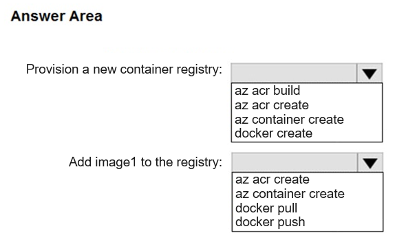

**Correct Answer:** 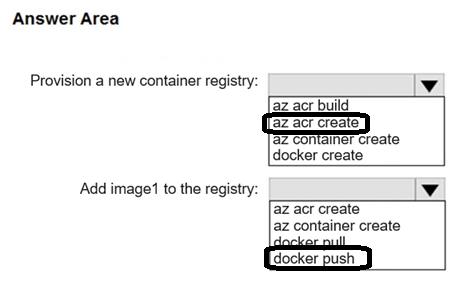

---

### Question 365: Question #113 Topic 4

Note: This question is part of a series of questions that present the same scenario. Each question in the series contains a unique solution that might meet the stated goals. Some question sets might have more than one correct solution, while others might not have a correct solution.
After you answer a question in this section, you will NOT be able to return to it. As a result, these questions will not appear in the review screen.
You have an Azure container registry named Registry1 that contains an image named image1.
You receive an error message when you attempt to deploy a container instance by using image1.
You need to be able to deploy a container instance by using image1.
Solution: You assign the AcrPull role to ACR-Tasks-Network for Registry1.
Does this meet the goal?

- A. Yes
- B. No

**Correct Answer:** B

---

### Question 366: Question #114 Topic 4

Note: This question is part of a series of questions that present the same scenario. Each question in the series contains a unique solution that might meet the stated goals. Some question sets might have more than one correct solution, while others might not have a correct solution.
After you answer a question in this section, you will NOT be able to return to it. As a result, these questions will not appear in the review screen.
You have an Azure container registry named Registry1 that contains an image named image1.
You receive an error message when you attempt to deploy a container instance by using image1.
You need to be able to deploy a container instance by using image1.
Solution: You select Use dedicated data endpoint for Registry1.
Does this meet the goal?

- A. Yes
- B. No

**Correct Answer:** B

---

### Question 367: Question #115 Topic 4

Note: This question is part of a series of questions that present the same scenario. Each question in the series contains a unique solution that might meet the stated goals. Some question sets might have more than one correct solution, while others might not have a correct solution.
After you answer a question in this section, you will NOT be able to return to it. As a result, these questions will not appear in the review screen.
You have an Azure container registry named Registry1 that contains an image named image1.
You receive an error message when you attempt to deploy a container instance by using image1.
You need to be able to deploy a container instance by using image1.
Solution: You create a private endpoint connection for Registry1.
Does this meet the goal?

- A. Yes
- B. No

**Correct Answer:** B

---

### Question 368: Question #116 Topic 4

You have a Standard Azure App Service plan named Plan1.
You need to ensure that Plan1 will scale automatically when the CPU usage of the web app exceeds 80 percent.
What should you select for Plan1?

- A. Automatic in the Scale out method settings
- B. Rules Based in the Scale out method settings
- C. Premium P1 in the Scale up (App Service plan) settings
- D. Standard S1 in the Scale up (App Service plan) settings
- E. Manual in the Scale out method settings

**Correct Answer:** B

---

### Question 369: Question #117 Topic 4

Case study -
This is a case study. Case studies are not timed separately. You can use as much exam time as you would like to complete each case. However, there may be additional case studies and sections on this exam. You must manage your time to ensure that you are able to complete all questions included on this exam in the time provided.
To answer the questions included in a case study, you will need to reference information that is provided in the case study. Case studies might contain exhibits and other resources that provide more information about the scenario that is described in the case study. Each question is independent of the other questions in this case study.
At the end of this case study, a review screen will appear. This screen allows you to review your answers and to make changes before you move to the next section of the exam. After you begin a new section, you cannot return to this section.
To start the case study -
To display the first question in this case study, click the Next button. Use the buttons in the left pane to explore the content of the case study before you answer the questions. Clicking these buttons displays information such as business requirements, existing environment, and problem statements. If the case study has an All Information tab, note that the information displayed is identical to the information displayed on the subsequent tabs. When you are ready to answer a question, click the Question button to return to the question.
Overview -
ADatum Corporation is consulting firm that has a main office in Montreal and branch offices in Seattle and New York.
Existing Environment -
Azure Environment -
ADatum has an Azure subscription that contains three resource groups named RG1, RG2, and RG3.
The subscription contains the storage accounts shown in the following table.

The subscription contains the virtual machines shown in the following table.

The subscription has an Azure container registry that contains the images shown in the following table.

The subscription contains the resources shown in the following table.

Azure Key Vault -
The subscription contains an Azure key vault named Vault1.
Vault1 contains the certificates shown in the following table.

Vault1 contains the keys shown in the following table.

Microsoft Entra Environment -
ADatum has a Microsoft Entra tenant named adatum.com that is linked to the Azure subscription and contains the users shown in the following table.

The tenant contains the groups shown in the following table.

The adatum.com tenant has a custom security attribute named Attribute1.
Planned Changes -
ADatum plans to implement the following changes:
•Configure a data collection rule (DCR) named DCR1 to collect only system events that have an event ID of 4648 from VM2 and VM4.
•In storage1, create a new container named cont2 that has the following access policies: oThree stored access policies named Stored1, Stored2, and Stored3 oA legal hold for immutable blob storage
•Whenever possible, use directories to organize storage account content.
•Grant User1 the permissions required to link Zone1 to VNet1.
•Assign Attribute1 to supported adatum.com resources.
•In storage2, create an encryption scope named Scope1.
•Deploy new containers by using Image1 or Image2.
Technical Requirements -
ADatum must meet the following technical requirements:
•Use TLS for WebApp1.
•Follow the principle of least privilege.
•Grant permissions at the required scope only.
•Ensure that Scope1 is used to encrypt storage services.
•Use Azure Backup to back up cont1 and share1 as frequently as possible.
•Whenever possible, use Azure Disk Encryption and a key encryption key (KEK) to encrypt the virtual machines.
You need to configure WebApp1 to meet the technical requirements.
Which certificate can you use from Vault1?

- A. Cert1 only
- B. Cert1 or Cert2 only
- C. Cert1 or Cert3 only
- D. Cert3 or Cert4 only
- E. Cert1, Cert2 Cert3, or Cert4

**Correct Answer:** B

---

### Question 370: Question #118 Topic 4

Note: This question is part of a series of questions that present the same scenario. Each question in the series contains a unique solution that might meet the stated goals. Some question sets might have more than one correct solution, while others might not have a correct solution.
After you answer a question in this section, you will NOT be able to return to it. As a result, these questions will not appear in the review screen.
You have an Azure virtual machine named VM1. VM1 was deployed by using a custom Azure Resource Manager template named ARM1.json.
You receive a notification that VM1 will be affected by maintenance.
You need to move VM1 to a different host immediately.
Solution: From the resource group blade, move VM1 to another subscription.
Does this meet the goal?

- A. Yes
- B. No

**Correct Answer:** B

---

### Question 371: Question #119 Topic 4

Note: This question is part of a series of questions that present the same scenario. Each question in the series contains a unique solution that might meet the stated goals. Some question sets might have more than one correct solution, while others might not have a correct solution.
After you answer a question in this section, you will NOT be able to return to it. As a result, these questions will not appear in the review screen.
You have an Azure virtual machine named VM1. VM1 was deployed by using a custom Azure Resource Manager template named ARM1.json.
You receive a notification that VM1 will be affected by maintenance.
You need to move VM1 to a different host immediately.
Solution: From the VM1 Redeploy + reapply blade, you select Redeploy.
Does this meet the goal?

- A. Yes
- B. No

**Correct Answer:** A

---

### Question 372: Question #120 Topic 4

Note: This question is part of a series of questions that present the same scenario. Each question in the series contains a unique solution that might meet the stated goals. Some question sets might have more than one correct solution, while others might not have a correct solution.
After you answer a question in this section, you will NOT be able to return to it. As a result, these questions will not appear in the review screen.
You have an Azure virtual machine named VM1. VM1 was deployed by using a custom Azure Resource Manager template named ARM1.json.
You receive a notification that VM1 will be affected by maintenance.
You need to move VM1 to a different host immediately.
Solution: From the VM1 Updates blade, select One-time update.
Does this meet the goal?

- A. Yes
- B. No

**Correct Answer:** B

---

### Question 373: Question #121 Topic 4

Case study -
This is a case study. Case studies are not timed separately. You can use as much exam time as you would like to complete each case. However, there may be additional case studies and sections on this exam. You must manage your time to ensure that you are able to complete all questions included on this exam in the time provided.
To answer the questions included in a case study, you will need to reference information that is provided in the case study. Case studies might contain exhibits and other resources that provide more information about the scenario that is described in the case study. Each question is independent of the other questions in this case study.
At the end of this case study, a review screen will appear. This screen allows you to review your answers and to make changes before you move to the next section of the exam. After you begin a new section, you cannot return to this section.
To start the case study -
To display the first question in this case study, click the Next button. Use the buttons in the left pane to explore the content of the case study before you answer the questions. Clicking these buttons displays information such as business requirements, existing environment, and problem statements. If the case study has an All Information tab, note that the information displayed is identical to the information displayed on the subsequent tabs. When you are ready to answer a question, click the Question button to return to the question.
Overview -
ADatum Corporation is consulting firm that has a main office in Montreal and branch offices in Seattle and New York.
Existing Environment -
Azure Environment -
ADatum has an Azure subscription that contains three resource groups named RG1, RG2, and RG3.
The subscription contains the storage accounts shown in the following table.

The subscription contains the virtual machines shown in the following table.

The subscription has an Azure container registry that contains the images shown in the following table.

The subscription contains the resources shown in the following table.

Azure Key Vault -
The subscription contains an Azure key vault named Vault1.
Vault1 contains the certificates shown in the following table.

Vault1 contains the keys shown in the following table.

Microsoft Entra Environment -
ADatum has a Microsoft Entra tenant named adatum.com that is linked to the Azure subscription and contains the users shown in the following table.

The tenant contains the groups shown in the following table.

The adatum.com tenant has a custom security attribute named Attribute1.
Planned Changes -
ADatum plans to implement the following changes:
•Configure a data collection rule (DCR) named DCR1 to collect only system events that have an event ID of 4648 from VM2 and VM4.
•In storage1, create a new container named cont2 that has the following access policies: oThree stored access policies named Stored1, Stored2, and Stored3 oA legal hold for immutable blob storage
•Whenever possible, use directories to organize storage account content.
•Grant User1 the permissions required to link Zone1 to VNet1.
•Assign Attribute1 to supported adatum.com resources.
•In storage2, create an encryption scope named Scope1.
•Deploy new containers by using Image1 or Image2.
Technical Requirements -
ADatum must meet the following technical requirements:
•Use TLS for WebApp1.
•Follow the principle of least privilege.
•Grant permissions at the required scope only.
•Ensure that Scope1 is used to encrypt storage services.
•Use Azure Backup to back up cont1 and share1 as frequently as possible.
•Whenever possible, use Azure Disk Encryption and a key encryption key (KEK) to encrypt the virtual machines.
You need to meet the technical requirements for the KEK.
Which PowerShell cmdlet and key should you use?

- A. Set-AzVMDiskEncryptionExtension and Key2.
- B. Set-AzDiskEncryptionKey and Key2.
- C. Set-AzDiskDiskEncryptionKey and Key1.
- D. Set-AzVMDiskEncryptionExtension and Key1.

**Correct Answer:** D

---

### Question 374: Question #1 Topic 5

HOTSPOT -
You have an Azure subscription named Sub1.
You plan to deploy a multi-tiered application that will contain the tiers shown in the following table.
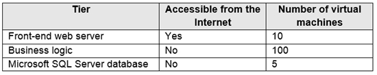
You need to recommend a networking solution to meet the following requirements:
✑ Ensure that communication between the web servers and the business logic tier spreads equally across the virtual machines.
✑ Protect the web servers from SQL injection attacks.
Which Azure resource should you recommend for each requirement? To answer, select the appropriate options in the answer area.
NOTE: Each correct selection is worth one point.
Hot Area:
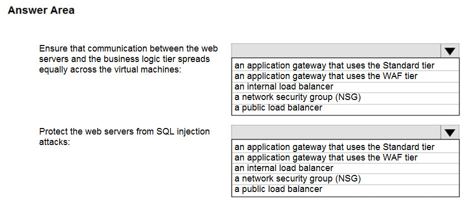

**Correct Answer:** 

_Explanation:_
Box 1: an internal load balancer
Azure Internal Load Balancer (ILB) provides network load balancing between virtual machines that reside inside a cloud service or a virtual network with a regional scope.
Box 2: an application gateway that uses the WAF tier
Azure Web Application Firewall (WAF) on Azure Application Gateway provides centralized protection of your web applications from common exploits and vulnerabilities. Web applications are increasingly targeted by malicious attacks that exploit commonly known vulnerabilities.
Reference:
https://docs.microsoft.com/en-us/azure/web-application-firewall/ag/ag-overview

---

### Question 375: Question #2 Topic 5

Your company has three offices. The offices are located in Miami, Los Angeles, and New York. Each office contains datacenter.
You have an Azure subscription that contains resources in the East US and West US Azure regions. Each region contains a virtual network. The virtual networks are peered.
You need to connect the datacenters to the subscription. The solution must minimize network latency between the datacenters.
What should you create?

- A. three Azure Application Gateways and one On-premises data gateway
- B. three virtual hubs and one virtual WAN
- C. three virtual WANs and one virtual hub
- D. three On-premises data gateways and one Azure Application Gateway

**Correct Answer:** B

---

### Question 376: Question #3 Topic 5

HOTSPOT -
You plan to deploy five virtual machines to a virtual network subnet.
Each virtual machine will have a public IP address and a private IP address.
Each virtual machine requires the same inbound and outbound security rules.
What is the minimum number of network interfaces and network security groups that you require? To answer, select the appropriate options in the answer area.
NOTE: Each correct selection is worth one point.
Hot Area:

**Correct Answer:** 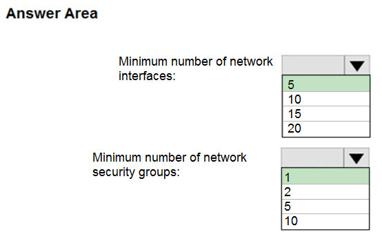

_Explanation:_
Box 1: 5 -
A public and a private IP address can be assigned to a single network interface.
Box 2: 1 -
You can associate zero, or one, network security group to each virtual network subnet and network interface in a virtual machine. The same network security group can be associated to as many subnets and network interfaces as you choose.
Reference:
https://docs.microsoft.com/en-us/azure/virtual-network/virtual-network-network-interface-addresses

---

### Question 377: Question #4 Topic 5

You have an Azure subscription that contains the resources shown in the following table.
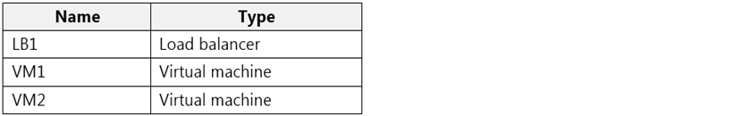
LB1 is configured as shown in the following table.

You plan to create new inbound NAT rules that meet the following requirements:
✑ Provide Remote Desktop access to VM1 from the internet by using port 3389.
✑ Provide Remote Desktop access to VM2 from the internet by using port 3389.
What should you create on LB1 before you can create the new inbound NAT rules?

- A. a frontend IP address
- B. a load balancing rule
- C. a health probe
- D. a backend pool

**Correct Answer:** A

---

### Question 378: Question #5 Topic 5

HOTSPOT -
You have Azure virtual machines that run Windows Server 2019 and are configured as shown in the following table.
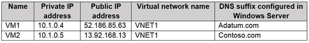
You create a private Azure DNS zone named adatum.com. You configure the adatum.com zone to allow auto registration from VNET1.
Which A records will be added to the adatum.com zone for each virtual machine? To answer, select the appropriate options in the answer area.
NOTE: Each correct selection is worth one point.
Hot Area:
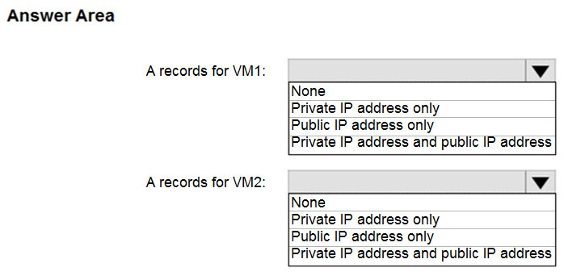

**Correct Answer:** 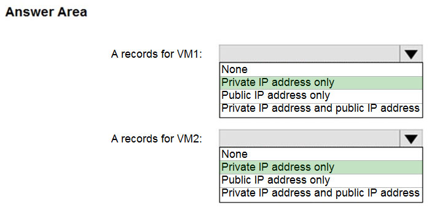

_Explanation:_
The virtual machines are registered (added) to the private zone as A records pointing to their private IP addresses.
Reference:
https://docs.microsoft.com/en-us/azure/dns/private-dns-overview https://docs.microsoft.com/en-us/azure/dns/private-dns-scenarios

---

### Question 379: Question #6 Topic 5

HOTSPOT -
You have an Azure virtual network named VNet1 that connects to your on-premises network by using a site-to-site VPN. VNet1 contains one subnet named
Sunet1.
Subnet1 is associated to a network security group (NSG) named NSG1. Subnet1 contains a basic internal load balancer named ILB1. ILB1 has three Azure virtual machines in the backend pool.
You need to collect data about the IP addresses that connects to ILB1. You must be able to run interactive queries from the Azure portal against the collected data.
What should you do? To answer, select the appropriate options in the answer area.
NOTE: Each correct selection is worth one point.
Hot Area:
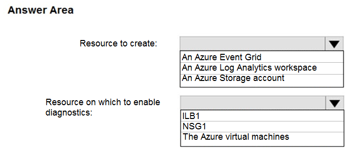

**Correct Answer:** 

_Explanation:_
Box 1: An Azure Log Analytics workspace
In the Azure portal you can set up a Log Analytics workspace, which is a unique Log Analytics environment with its own data repository, data sources, and solutions
Box 2: ILB1 -
Reference:
https://docs.microsoft.com/en-us/azure/log-analytics/log-analytics-quick-create-workspace https://docs.microsoft.com/en-us/azure/load-balancer/load-balancer-standard-diagnostics

---

### Question 380: Question #7 Topic 5

You have the Azure virtual networks shown in the following table.
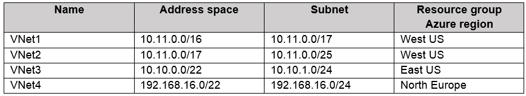
To which virtual networks can you establish a peering connection from VNet1?

- A. VNet2 andVNet3 only
- B. VNet2 only
- C. VNet3 and VNet4 only
- D. VNet2, VNet3, and VNet4

**Correct Answer:** C

---

### Question 381: Question #8 Topic 5

You have an Azure subscription that contains a virtual network named VNet1. VNet1 contains four subnets named Gateway, Perimeter, NVA, and Production.
The NVA subnet contains two network virtual appliances (NVAs) that will perform network traffic inspection between the Perimeter subnet and the Production subnet.
You need to implement an Azure load balancer for the NVAs. The solution must meet the following requirements:
✑ The NVAs must run in an active-active configuration that uses automatic failover.
✑ The load balancer must load balance traffic to two services on the Production subnet. The services have different IP addresses.
Which three actions should you perform? Each correct answer presents part of the solution.
NOTE: Each correct selection is worth one point.

- A. Deploy a basic load balancer
- B. Deploy a standard load balancer
- C. Add two load balancing rules that have HA Ports and Floating IP enabled
- D. Add two load balancing rules that have HA Ports enabled and Floating IP disabled
- E. Add a frontend IP configuration, a backend pool, and a health probe
- F. Add a frontend IP configuration, two backend pools, and a health probe

**Correct Answer:** BCF

---

### Question 382: Question #9 Topic 5

You have an Azure subscription named Subscription1 that contains two Azure virtual networks named VNet1 and VNet2. VNet1 contains a VPN gateway named
VPNGW1 that uses static routing. There is a site-to-site VPN connection between your on-premises network and VNet1.
On a computer named Client1 that runs Windows 10, you configure a point-to-site VPN connection to VNet1.
You configure virtual network peering between VNet1 and VNet2. You verify that you can connect to VNet2 from the on-premises network. Client1 is unable to connect to VNet2.
You need to ensure that you can connect Client1 to VNet2.
What should you do?

- A. Download and re-install the VPN client configuration package on Client1.
- B. Select Allow gateway transit on VNet1.
- C. Select Allow gateway transit on VNet2.
- D. Enable BGP on VPNGW1

**Correct Answer:** A

---

### Question 383: Question #10 Topic 5

HOTSPOT -
You have an Azure subscription. The subscription contains virtual machines that run Windows Server 2016 and are configured as shown in the following table.
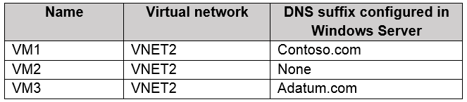
You create a public Azure DNS zone named adatum.com and a private Azure DNS zone named contoso.com.
You create a virtual network link for contoso.com as shown in the following exhibit.
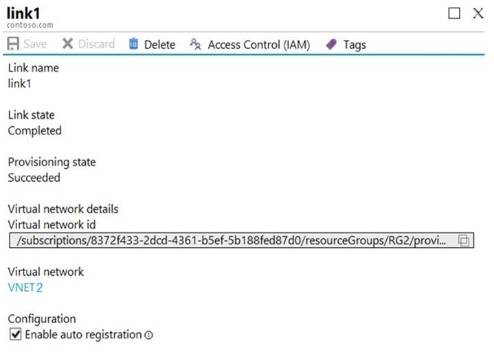
For each of the following statements, select Yes if the statement is true. Otherwise, select No.
NOTE: Each correct selection is worth one point.
Hot Area:
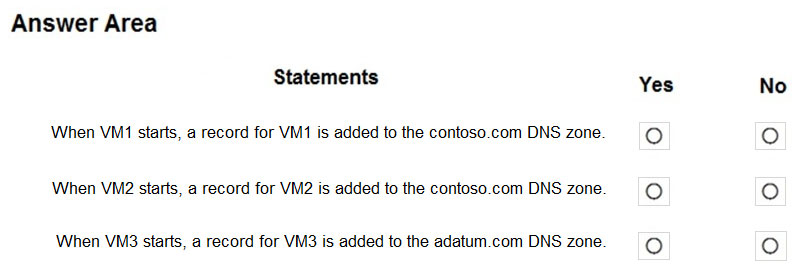

**Correct Answer:** 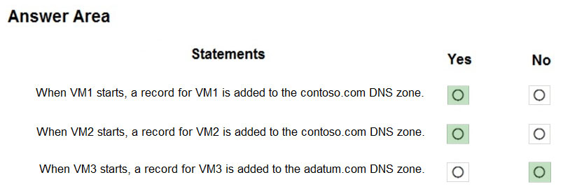

_Explanation:_
Reference:
https://docs.microsoft.com/en-us/azure/virtual-network/virtual-networks-name-resolution-for-vms-and-role-instances https://docs.microsoft.com/en-us/azure/dns/private-dns-autoregistration

---

### Question 384: Question #11 Topic 5

You have an Azure subscription that contains the resources in the following table.

To which subnets can you apply NSG1?

- A. the subnets on VNet1 only
- B. the subnets on VNet2 and VNet3 only
- C. the subnets on VNet2 only
- D. the subnets on VNet3 only
- E. the subnets on VNet1, VNet2, and VNet3

**Correct Answer:** D

---

### Question 385: Question #12 Topic 5

DRAG DROP -
You have an Azure subscription that contains two virtual networks named VNet1 and VNet2. Virtual machines connect to the virtual networks.
The virtual networks have the address spaces and the subnets configured as shown in the following table.

You need to add the address space of 10.33.0.0/16 to VNet1. The solution must ensure that the hosts on VNet1 and VNet2 can communicate.
Which three actions should you perform in sequence? To answer, move the appropriate actions from the list of actions to the answer area and arrange them in the correct order.
Select and Place:
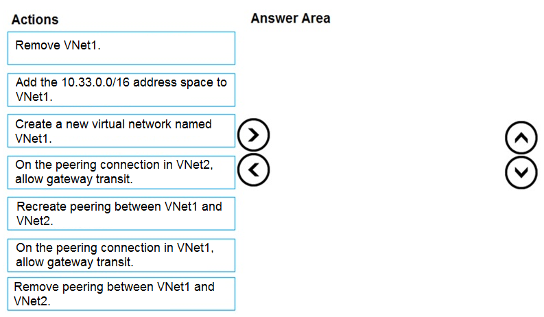

**Correct Answer:** 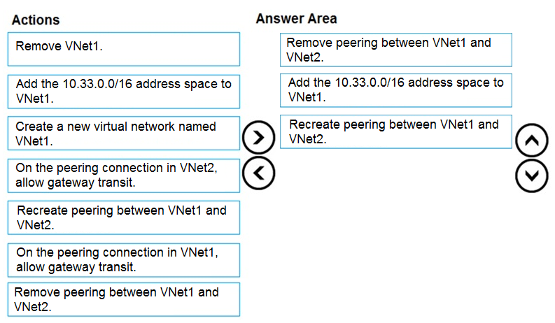

_Explanation:_
Step 1: Remove peering between Vnet1 and VNet2.
You can't add address ranges to, or delete address ranges from a virtual network's address space once a virtual network is peered with another virtual network.
To add or remove address ranges, delete the peering, add or remove the address ranges, then re-create the peering.
Step 2: Add the 10.44.0.0/16 address space to VNet1.
Step 3: Recreate peering between VNet1 and VNet2
Reference:
https://docs.microsoft.com/en-us/azure/virtual-network/virtual-network-manage-peering

---

### Question 386: Question #13 Topic 5

HOTSPOT -
You have an Azure subscription that contains the resource groups shown in the following table.

RG1 contains the resources shown in the following table.
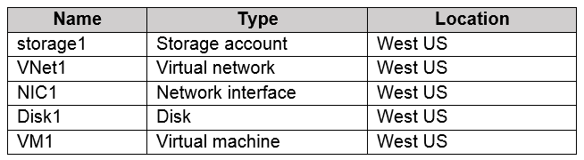
VM1 is running and connects to NIC1 and Disk1. NIC1 connects to VNET1.
RG2 contains a public IP address named IP2 that is in the East US location. IP2 is not assigned to a virtual machine.
For each of the following statements, select Yes if the statement is true. Otherwise, select No.
NOTE: Each correct selection is worth one point.
Hot Area:
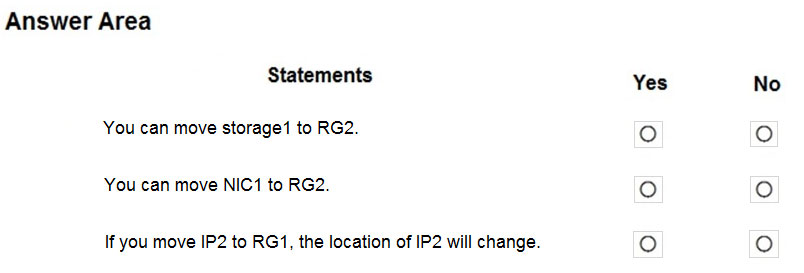

**Correct Answer:** 

_Explanation:_
Box 1: Yes -
You can move storage -
Box 2: No -
You can't move to a new resource group a NIC that is attached to a virtual machine.
Box 3: No -
Azure Public IPs are region specific and can't be moved from one region to another.
Reference:
https://docs.microsoft.com/en-us/azure/azure-resource-manager/management/move-support-resources https://docs.microsoft.com/en-us/azure/virtual-network/move-across-regions-publicip-powershell

---

### Question 387: Question #14 Topic 5

You have an Azure web app named webapp1.
You have a virtual network named VNET1 and an Azure virtual machine named VM1 that hosts a MySQL database. VM1 connects to VNET1.
You need to ensure that webapp1 can access the data hosted on VM1.
What should you do?

- A. Deploy an internal load balancer
- B. Peer VNET1 to another virtual network
- C. Connect webapp1 to VNET1
- D. Deploy an Azure Application Gateway

**Correct Answer:** C

---

### Question 388: Question #15 Topic 5

You create an Azure VM named VM1 that runs Windows Server 2019.
VM1 is configured as shown in the exhibit. (Click the Exhibit tab.)

You need to enable Desired State Configuration for VM1.
What should you do first?

- A. Connect to VM1.
- B. Start VM1.
- C. Capture a snapshot of VM1.
- D. Configure a DNS name for VM1.

**Correct Answer:** B

---

### Question 389: Question #16 Topic 5

You have five Azure virtual machines that run Windows Server 2016. The virtual machines are configured as web servers.
You have an Azure load balancer named LB1 that provides load balancing services for the virtual machines.
You need to ensure that visitors are serviced by the same web server for each request.
What should you configure?

- A. Floating IP (direct server return) to Disabled
- B. Session persistence to None
- C. Floating IP (direct server return) to Enabled
- D. Session persistence to Client IP

**Correct Answer:** D

---

### Question 390: Question #17 Topic 5

Note: This question is part of a series of questions that present the same scenario. Each question in the series contains a unique solution that might meet the stated goals. Some question sets might have more than one correct solution, while others might not have a correct solution.
After you answer a question in this section, you will NOT be able to return to it. As a result, these questions will not appear in the review screen.
You have an Azure subscription that contains the following resources:
✑ A virtual network that has a subnet named Subnet1
✑ Two network security groups (NSGs) named NSG-VM1 and NSG-Subnet1
✑ A virtual machine named VM1 that has the required Windows Server configurations to allow Remote Desktop connections
NSG-Subnet1 has the default inbound security rules only.
NSG-VM1 has the default inbound security rules and the following custom inbound security rule:
✑ Priority: 100
✑ Source: Any
✑ Source port range: *
✑ Destination: *
✑ Destination port range: 3389
✑ Protocol: UDP
✑ Action: Allow
VM1 has a public IP address and is connected to Subnet1. NSG-VM1 is associated to the network interface of VM1. NSG-Subnet1 is associated to Subnet1.
You need to be able to establish Remote Desktop connections from the internet to VM1.
Solution: You add an inbound security rule to NSG-Subnet1 that allows connections from the Any source to the *destination for port range 3389 and uses the TCP protocol. You remove NSG-VM1 from the network interface of VM1.
Does this meet the goal?

- A. Yes
- B. No

**Correct Answer:** A

---

### Question 391: Question #18 Topic 5

Note: This question is part of a series of questions that present the same scenario. Each question in the series contains a unique solution that might meet the stated goals. Some question sets might have more than one correct solution, while others might not have a correct solution.
After you answer a question in this section, you will NOT be able to return to it. As a result, these questions will not appear in the review screen.
You have an Azure subscription that contains the following resources:
✑ A virtual network that has a subnet named Subnet1
✑ Two network security groups (NSGs) named NSG-VM1 and NSG-Subnet1
✑ A virtual machine named VM1 that has the required Windows Server configurations to allow Remote Desktop connections
NSG-Subnet1 has the default inbound security rules only.
NSG-VM1 has the default inbound security rules and the following custom inbound security rule:
✑ Priority: 100
✑ Source: Any
✑ Source port range: *
✑ Destination: *
✑ Destination port range: 3389
Protocol: UDP -

✑ Action: Allow
VM1 has a public IP address and is connected to Subnet1. NSG-VM1 is associated to the network interface of VM1. NSG-Subnet1 is associated to Subnet1.
You need to be able to establish Remote Desktop connections from the internet to VM1.
Solution: You add an inbound security rule to NSG-Subnet1 that allows connections from the internet source to the VirtualNetwork destination for port range 3389 and uses the UDP protocol.
Does this meet the goal?

- A. Yes
- B. No

**Correct Answer:** B

---

### Question 392: Question #19 Topic 5

Note: This question is part of a series of questions that present the same scenario. Each question in the series contains a unique solution that might meet the stated goals. Some question sets might have more than one correct solution, while others might not have a correct solution.
After you answer a question in this section, you will NOT be able to return to it. As a result, these questions will not appear in the review screen.
You have an Azure subscription that contains the following resources:
✑ A virtual network that has a subnet named Subnet1
✑ Two network security groups (NSGs) named NSG-VM1 and NSG-Subnet1
✑ A virtual machine named VM1 that has the required Windows Server configurations to allow Remote Desktop connections
NSG-Subnet1 has the default inbound security rules only.
NSG-VM1 has the default inbound security rules and the following custom inbound security rule:
✑ Priority: 100
✑ Source: Any
✑ Source port range: *
✑ Destination: *
✑ Destination port range: 3389
✑ Protocol: UDP
✑ Action: Allow
VM1 has a public IP address and is connected to Subnet1. NSG-VM1 is associated to the network interface of VM1. NSG-Subnet1 is associated to Subnet1.
You need to be able to establish Remote Desktop connections from the internet to VM1.
Solution: You add an inbound security rule to NSG-Subnet1 and NSG-VM1 that allows connections from the internet source to the VirtualNetwork destination for port range 3389 and uses the TCP protocol.
Does this meet the goal?

- A. Yes
- B. No

**Correct Answer:** A

---

### Question 393: Question #20 Topic 5

HOTSPOT -
You have a virtual network named VNet1 that has the configuration shown in the following exhibit.
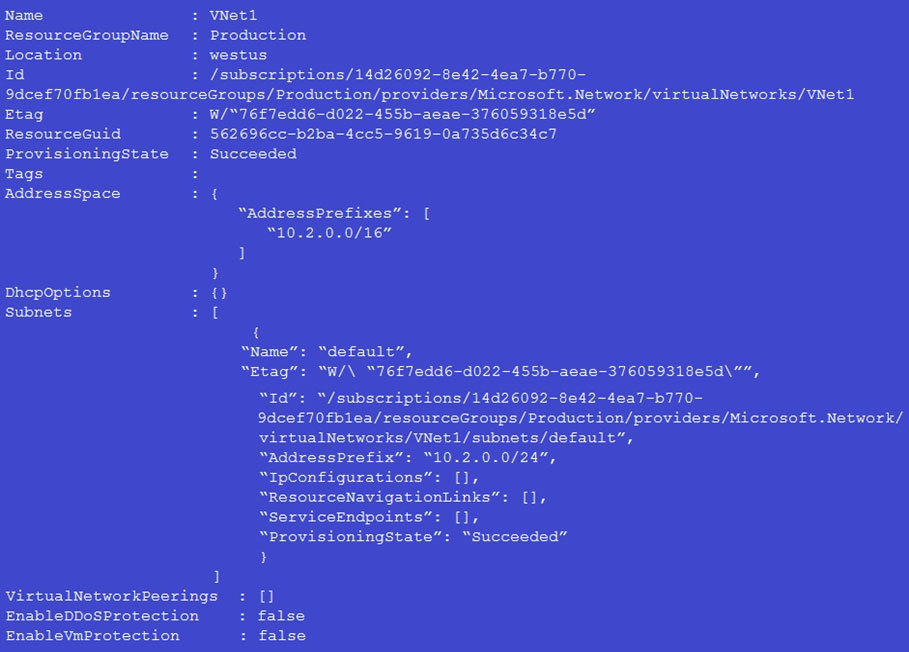
Use the drop-down menus to select the answer choice that completes each statement based on the information presented in the graphic.
NOTE: Each correct selection is worth one point.
Hot Area:
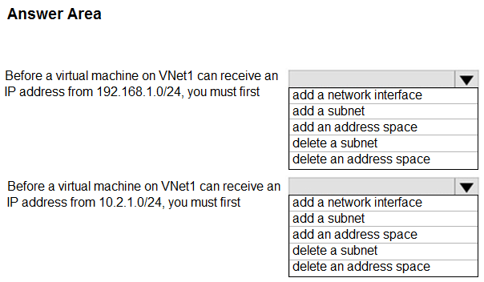

**Correct Answer:** 

_Explanation:_
Box 1: add an address space -
Your IaaS virtual machines (VMs) and PaaS role instances in a virtual network automatically receive a private IP address from a range that you specify, based on the address space of the subnet they are connected to. We need to add the 192.168.1.0/24 address space.
Box 2: add a network interface -
The 10.2.1.0/24 network exists. We need to add a network interface.
Reference:
https://docs.microsoft.com/en-us/office365/enterprise/designing-networking-for-microsoft-azure-iaas

---

### Question 394: Question #21 Topic 5

You have an Azure subscription that contains a virtual network named VNET1. VNET1 contains the subnets shown in the following table.
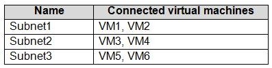
Each virtual machine uses a static IP address.
You need to create network security groups (NSGs) to meet following requirements:
✑ Allow web requests from the internet to VM3, VM4, VM5, and VM6.
✑ Allow all connections between VM1 and VM2.
✑ Allow Remote Desktop connections to VM1.
✑ Prevent all other network traffic to VNET1.
What is the minimum number of NSGs you should create?

- A. 1
- B. 3
- C. 4
- D. 12

**Correct Answer:** A

---

### Question 395: Question #22 Topic 5

You have an Azure subscription that contains the resources shown in the following table.
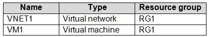
The Not allowed resource types Azure policy that has policy enforcement enabled is assigned to RG1 and uses the following parameters:
Microsoft.Network/virtualNetworks
Microsoft.Compute/virtualMachines
In RG1, you need to create a new virtual machine named VM2, and then connect VM2 to VNET1.
What should you do first?

- A. Remove Microsoft.Compute/virtualMachines from the policy.
- B. Create an Azure Resource Manager template
- C. Add a subnet to VNET1.
- D. Remove Microsoft.Network/virtualNetworks from the policy.

**Correct Answer:** A

---

### Question 396: Question #23 Topic 5

Your company has an Azure subscription named Subscription1.
The company also has two on-premises servers named Server1 and Server2 that run Windows Server 2016. Server1 is configured as a DNS server that has a primary DNS zone named adatum.com. Adatum.com contains 1,000 DNS records.
You manage Server1 and Subscription1 from Server2. Server2 has the following tools installed:
✑ The DNS Manager console
✑ Azure PowerShell
✑ Azure CLI 2.0
You need to move the adatum.com zone to an Azure DNS zone in Subscription1. The solution must minimize administrative effort.
What should you use?

- A. Azure CLI
- B. Azure PowerShell
- C. the Azure portal
- D. the DNS Manager console

**Correct Answer:** A

---

### Question 397: Question #24 Topic 5

You have a public load balancer that balances ports 80 and 443 across three virtual machines named VM1, VM2, and VM3.
You need to direct all the Remote Desktop Protocol (RDP) connections to VM3 only.
What should you configure?

- A. an inbound NAT rule
- B. a new public load balancer for VM3
- C. a frontend IP configuration
- D. a load balancing rule

**Correct Answer:** A

---

### Question 398: Question #25 Topic 5

HOTSPOT -
You have an Azure subscription named Subscription1 that contains the virtual networks in the following table.
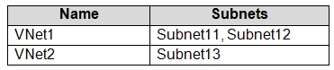
Subscription1 contains the virtual machines in the following table.
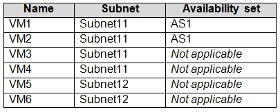
In Subscription1, you create a load balancer that has the following configurations:
✑ Name: LB1
✑ SKU: Basic
✑ Type: Internal
✑ Subnet: Subnet12
✑ Virtual network: VNET1
For each of the following statements, select Yes if the statement is true. Otherwise, select No.
NOTE: Each correct selection is worth one point.
Hot Area:
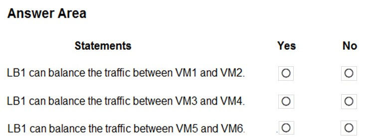

**Correct Answer:** 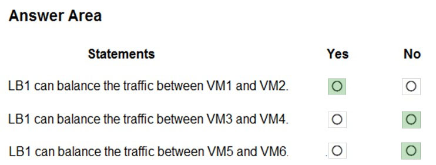

_Explanation:_
Reference:
https://docs.microsoft.com/en-us/azure/load-balancer/load-balancer-standard-overview

---

### Question 399: Question #26 Topic 5

HOTSPOT -
You have an Azure virtual machine that runs Windows Server 2019 and has the following configurations:
✑ Name: VM1
✑ Location: West US
✑ Connected to: VNET1
✑ Private IP address: 10.1.0.4
✑ Public IP addresses: 52.186.85.63
✑ DNS suffix in Windows Server: Adatum.com
You create the Azure DNS zones shown in the following table.
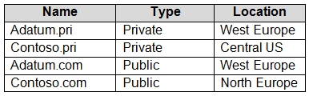
You need to identify which DNS zones you can link to VNET1 and the DNS zones to which VM1 can automatically register.
Which zones should you identify? To answer, select the appropriate options in the answer area.
NOTE: Each correct selection is worth one point.
Hot Area:
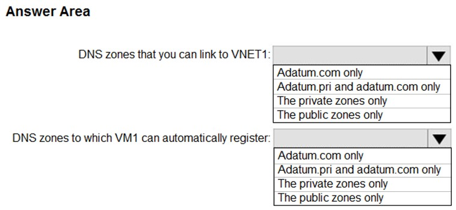

**Correct Answer:** 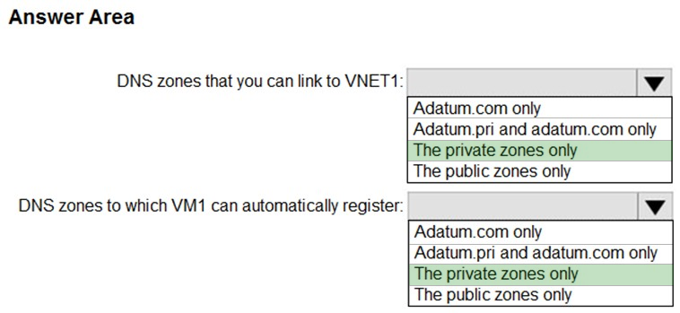

_Explanation:_
Reference:
https://docs.microsoft.com/en-us/azure/dns/private-dns-overview

---

### Question 400: Question #27 Topic 5

DRAG DROP -
You have an on-premises network that you plan to connect to Azure by using a site-so-site VPN.
In Azure, you have an Azure virtual network named VNet1 that uses an address space of 10.0.0.0/16 VNet1 contains a subnet named Subnet1 that uses an address space of 10.0.0.0/24.
You need to create a site-to-site VPN to Azure.
Which four actions should you perform in sequence? To answer, move the appropriate actions from the list of actions to the answer area and arrange them in the correct order.
NOTE: More than one order of answer choice is correct. You will receive credit for any of the correct orders you select.
Select and Place:

**Correct Answer:** 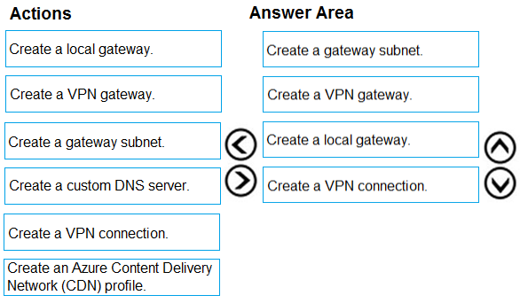

---

### Question 401: Question #28 Topic 5

You have an Azure subscription that contains the resources in the following table.
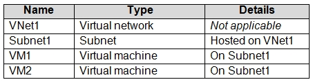
VM1 and VM2 are deployed from the same template and host line-of-business applications.
You configure the network security group (NSG) shown in the exhibit. (Click the Exhibit tab.)

You need to prevent users of VM1 and VM2 from accessing websites on the Internet over TCP port 80.
What should you do?

- A. Disassociate the NSG from a network interface
- B. Change the Port_80 inbound security rule.
- C. Associate the NSG to Subnet1.
- D. Change the DenyWebSites outbound security rule.

**Correct Answer:** C

---

### Question 402: Question #29 Topic 5

You have two subscriptions named Subscription1 and Subscription2. Each subscription is associated to a different Azure AD tenant.
Subscription1 contains a virtual network named VNet1. VNet1 contains an Azure virtual machine named VM1 and has an IP address space of 10.0.0.0/16.
Subscription2 contains a virtual network named VNet2. VNet2 contains an Azure virtual machine named VM2 and has an IP address space of 10.10.0.0/24.
You need to connect VNet1 to VNet2.
What should you do first?

- A. Move VM1 to Subscription2.
- B. Move VNet1 to Subscription2.
- C. Modify the IP address space of VNet2.
- D. Provision virtual network gateways.

**Correct Answer:** D

---

### Question 403: Question #30 Topic 5

You plan to create an Azure virtual machine named VM1 that will be configured as shown in the following exhibit.
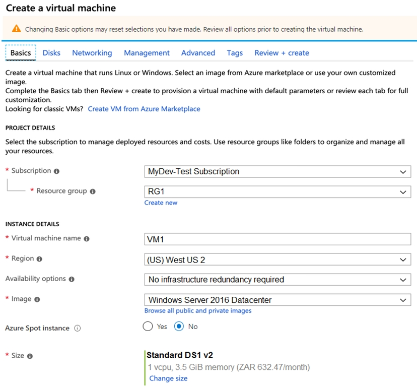
The planned disk configurations for VM1 are shown in the following exhibit.
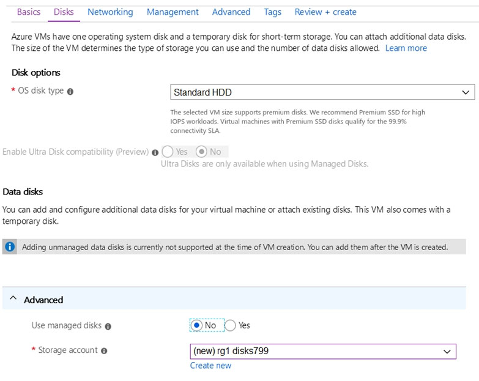
You need to ensure that VM1 can be created in an Availability Zone.
Which two settings should you modify? Each correct answer presents part of the solution.
NOTE: Each correct selection is worth one point.

- A. Use managed disks
- B. OS disk type
- C. Availability options
- D. Size
- E. Image

**Correct Answer:** AC

---

### Question 404: Question #31 Topic 5

HOTSPOT -
You have an Azure subscription that contains the resources shown in the following table.
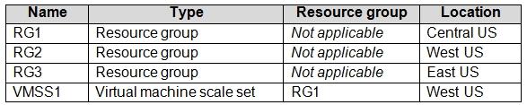
VMSS1 is set to VM (virtual machines) orchestration mode.
You need to deploy a new Azure virtual machine named VM1, and then add VM1 to VMSS1.
Which resource group and location should you use to deploy VM1? To answer, select the appropriate options in the answer area.
NOTE: Each correct selection is worth one point.
Hot Area:
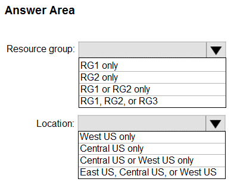

**Correct Answer:** 

_Explanation:_
Box 1: RG1, RG2, or RG3 -
The resource group stores metadata about the resources. When you specify a location for the resource group, you're specifying where that metadata is stored.
Box 2: West US only -
Note: Virtual machine scale sets will support 2 distinct orchestration modes:
ScaleSetVM ג€" Virtual machine instances added to the scale set are based on the scale set configuration model. The virtual machine instance lifecycle - creation, update, deletion - is managed by the scale set.
VM (virtual machines) ג€" Virtual machines created outside of the scale set can be explicitly added to the scaleset.
Reference:
https://docs.microsoft.com/en-us/azure/azure-resource-manager/management/overview

---

### Question 405: Question #32 Topic 5

HOTSPOT -
You have an Azure subscription that contains three virtual networks named VNET1, VNET2, and VNET3.
Peering for VNET1 is configured as shown in the following exhibit.
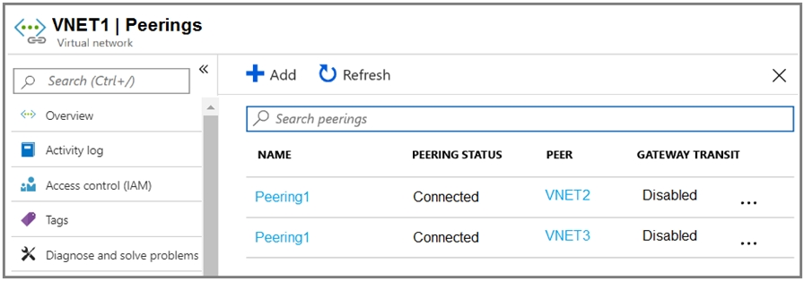
Peering for VNET2 is configured as shown in the following exhibit.
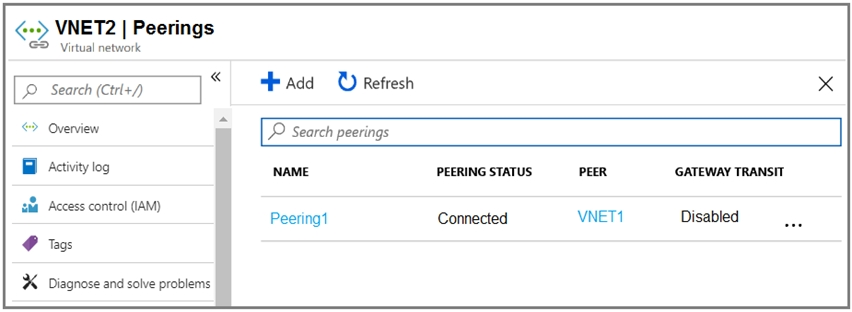
Peering for VNET3 is configured as shown in the following exhibit.

How can packets be routed between the virtual networks? To answer, select the appropriate options in the answer area.
NOTE: Each correct selection is worth one point.
Hot Area:

**Correct Answer:** 

_Explanation:_
Box 1. VNET2 and VNET3 -
Box 2: VNET1 -
Gateway transit is disabled.
Reference:
https://docs.microsoft.com/en-us/azure/virtual-network/virtual-network-peering-overview

---

### Question 406: Question #33 Topic 5

Note: This question is part of a series of questions that present the same scenario. Each question in the series contains a unique solution that might meet the stated goals. Some question sets might have more than one correct solution, while others might not have a correct solution.
After you answer a question in this section, you will NOT be able to return to it. As a result, these questions will not appear in the review screen.
You have a computer named Computer1 that has a point-to-site VPN connection to an Azure virtual network named VNet1. The point-to-site connection uses a self-signed certificate.
From Azure, you download and install the VPN client configuration package on a computer named Computer2.
You need to ensure that you can establish a point-to-site VPN connection to VNet1 from Computer2.
Solution: You modify the Azure Active Directory (Azure AD) authentication policies.
Does this meet the goal?

- A. Yes
- B. No

**Correct Answer:** B

---

### Question 407: Question #34 Topic 5

Note: This question is part of a series of questions that present the same scenario. Each question in the series contains a unique solution that might meet the stated goals. Some question sets might have more than one correct solution, while others might not have a correct solution.
After you answer a question in this section, you will NOT be able to return to it. As a result, these questions will not appear in the review screen.
You have a computer named Computer1 that has a point-to-site VPN connection to an Azure virtual network named VNet1. The point-to-site connection uses a self-signed certificate.
From Azure, you download and install the VPN client configuration package on a computer named Computer2.
You need to ensure that you can establish a point-to-site VPN connection to VNet1 from Computer2.
Solution: You join Computer2 to Azure Active Directory (Azure AD).
Does this meet the goal?

- A. Yes
- B. No

**Correct Answer:** B

---

### Question 408: Question #35 Topic 5

Note: This question is part of a series of questions that present the same scenario. Each question in the series contains a unique solution that might meet the stated goals. Some question sets might have more than one correct solution, while others might not have a correct solution.
After you answer a question in this section, you will NOT be able to return to it. As a result, these questions will not appear in the review screen.
You have an Azure subscription that contains 10 virtual networks. The virtual networks are hosted in separate resource groups.
Another administrator plans to create several network security groups (NSGs) in the subscription.
You need to ensure that when an NSG is created, it automatically blocks TCP port 8080 between the virtual networks.
Solution: You create a resource lock, and then you assign the lock to the subscription.
Does this meet the goal?

- A. Yes
- B. No

**Correct Answer:** B

---

### Question 409: Question #36 Topic 5

You have an Azure subscription named Subscription1. Subscription1 contains a virtual machine named VM1.
You have a computer named Computer1 that runs Windows 10. Computer1 is connected to the Internet.
You add a network interface named vm1173 to VM1 as shown in the exhibit. (Click the Exhibit tab.)
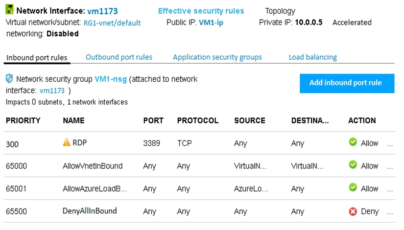
From Computer1, you attempt to connect to VM1 by using Remote Desktop, but the connection fails.
You need to establish a Remote Desktop connection to VM1.
What should you do first?

- A. Change the priority of the RDP rule
- B. Attach a network interface
- C. Delete the DenyAllInBound rule
- D. Start VM1

**Correct Answer:** D

---

### Question 410: Question #37 Topic 5

You have the Azure virtual machines shown in the following table.

A DNS service is installed on VM1.
You configure the DNS servers settings for each virtual network as shown in the following exhibit.
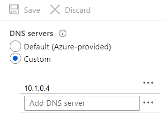
You need to ensure that all the virtual machines can resolve DNS names by using the DNS service on VM1.
What should you do?

- A. Configure a conditional forwarder on VM1
- B. Add service endpoints on VNET1
- C. Add service endpoints on VNET2 and VNET3
- D. Configure peering between VNET1, VNET2, and VNET3

**Correct Answer:** D

---

### Question 411: Question #38 Topic 5

HOTSPOT -
You have an Azure subscription that contains the Azure virtual machines shown in the following table.

You add inbound security rules to a network security group (NSG) named NSG1 as shown in the following table.
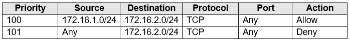
You run Azure Network Watcher as shown in the following exhibit.
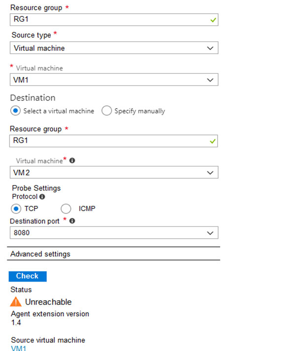
You run Network Watcher again as shown in the following exhibit.
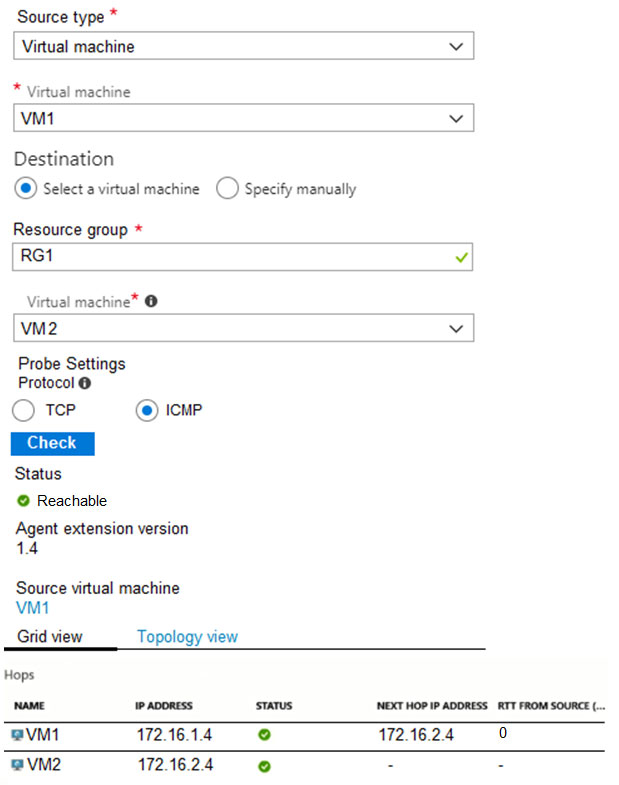
For each of the following statements, select Yes if the statement is true. Otherwise, select No.
NOTE: Each correct selection is worth one point.
Hot Area:
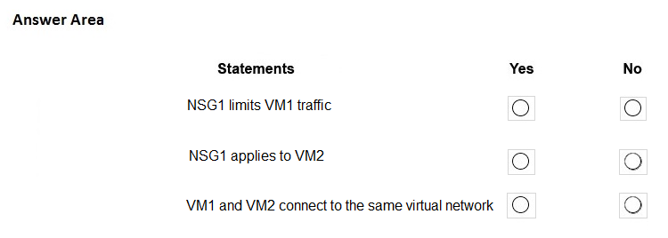

**Correct Answer:** 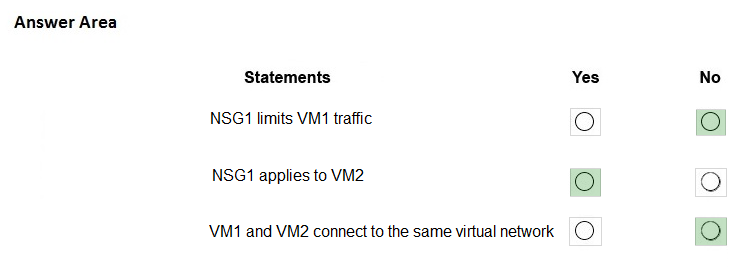

_Explanation:_
Box 1: No -
It limits traffic to VM2, but not VM1 traffic.
Box 2: Yes -
Yes, the destination is VM2.
Box 3: No -
Reference:
https://docs.microsoft.com/en-us/azure/virtual-network/network-security-group-how-it-works

---

### Question 412: Question #39 Topic 5

You have the Azure virtual network named VNet1 that contains a subnet named Subnet1. Subnet1 contains three Azure virtual machines. Each virtual machine has a public IP address.
The virtual machines host several applications that are accessible over port 443 to users on the Internet.
Your on-premises network has a site-to-site VPN connection to VNet1.
You discover that the virtual machines can be accessed by using the Remote Desktop Protocol (RDP) from the Internet and from the on-premises network.
You need to prevent RDP access to the virtual machines from the Internet, unless the RDP connection is established from the on-premises network. The solution must ensure that all the applications can still be accessed by the Internet users.
What should you do?

- A. Modify the address space of the local network gateway
- B. Create a deny rule in a network security group (NSG) that is linked to Subnet1
- C. Remove the public IP addresses from the virtual machines
- D. Modify the address space of Subnet1

**Correct Answer:** B

---

### Question 413: Question #40 Topic 5

You have an Azure subscription that contains the resources in the following table.
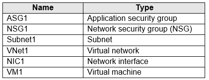
Subnet1 is associated to VNet1. NIC1 attaches VM1 to Subnet1.
You need to apply ASG1 to VM1.
What should you do?

- A. Associate NIC1 to ASG1
- B. Modify the properties of ASG1
- C. Modify the properties of NSG1

**Correct Answer:** A

---

### Question 414: Question #41 Topic 5

You have an Azure subscription named Subscription1 that contains an Azure virtual network named VNet1. VNet1 connects to your on-premises network by using
Azure ExpressRoute.
You plan to prepare the environment for automatic failover in case of ExpressRoute failure.
You need to connect VNet1 to the on-premises network by using a site-to-site VPN. The solution must minimize cost.
Which three actions should you perform? Each correct answer presents part of the solution.
NOTE: Each correct selection is worth one point.

- A. Create a connection
- B. Create a local site VPN gateway
- C. Create a VPN gateway that uses the VpnGw1 SKU
- D. Create a gateway subnet
- E. Create a VPN gateway that uses the Basic SKU

**Correct Answer:** ABC

---

### Question 415: Question #42 Topic 5

HOTSPOT -
You have peering configured as shown in the following exhibit.

Use the drop-down menus to select the answer choice that completes each statement based on the information presented in the graphic.
NOTE: Each correct selection is worth one point.
Hot Area:

**Correct Answer:** 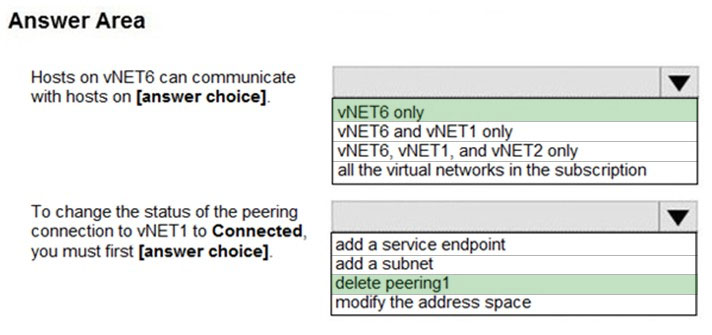

_Explanation:_
Box 1: vNET6 only -
Peering status to both VNet1 and Vnet2 are disconnected.
Box 2: delete peering1 -
Peering to Vnet1 is Enabled but disconnected. We need to update or re-create the remote peering to get it back to Initiated state.
Reference:
https://blog.kloud.com.au/2018/10/19/address-space-maintenance-with-vnet-peering/

---

### Question 416: Question #43 Topic 5

HOTSPOT -
You have an Azure subscription that contains the resources in the following table.
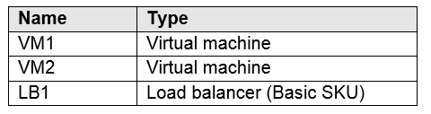
You install the Web Server server role (IIS) on VM1 and VM2, and then add VM1 and VM2 to LB1.
LB1 is configured as shown in the LB1 exhibit. (Click the LB1 tab.)
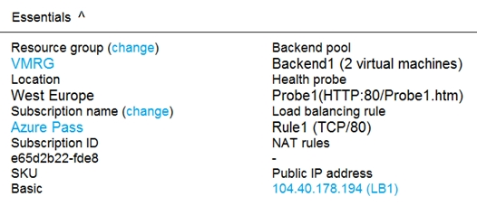
Rule1 is configured as shown in the Rule1 exhibit. (Click the Rule1 tab.)
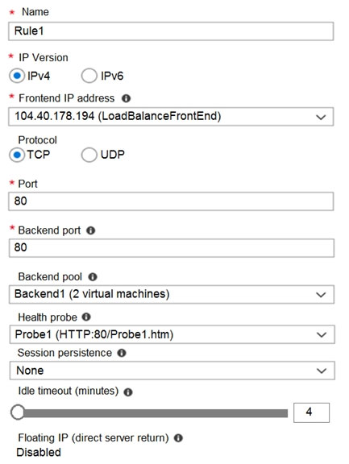
For each of the following statements, select Yes if the statement is true. Otherwise, select No.
NOTE: Each correct selection is worth one point.
Hot Area:
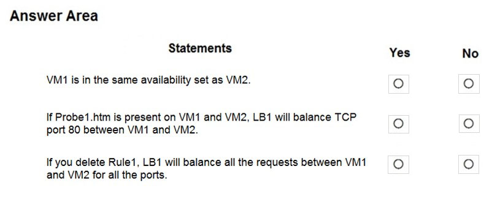

**Correct Answer:** 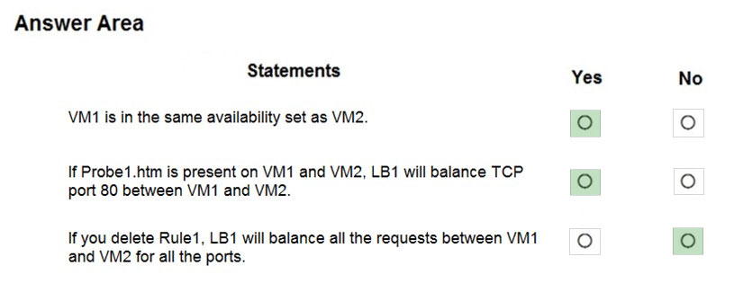

_Explanation:_
Box 1: Yes -
A Basic Load Balancer supports virtual machines in a single availability set or virtual machine scale set.
Box 2: Yes -
When using load-balancing rules with Azure Load Balancer, you need to specify health probes to allow Load Balancer to detect the backend endpoint status. The configuration of the health probe and probe responses determine which backend pool instances will receive new flows. You can use health probes to detect the failure of an application on a backend endpoint. You can also generate a custom response to a health probe and use the health probe for flow control to manage load or planned downtime. When a health probe fails, Load Balancer will stop sending new flows to the respective unhealthy instance. Outbound connectivity is not impacted, only inbound connectivity is impacted.
Box 3: No -
Reference:
https://docs.microsoft.com/en-us/azure/load-balancer/skus
https://docs.microsoft.com/en-us/azure/load-balancer/load-balancer-custom-probe-overview

---

### Question 417: Question #44 Topic 5

HOTSPOT -
You have an Azure virtual machine named VM1 that connects to a virtual network named VNet1. VM1 has the following configurations:
✑ Subnet: 10.0.0.0/24
✑ Availability set: AVSet
✑ Network security group (NSG): None
✑ Private IP address: 10.0.0.4 (dynamic)
✑ Public IP address: 40.90.219.6 (dynamic)
You deploy a standard, Internet-facing load balancer named slb1.
You need to configure slb1 to allow connectivity to VM1.
Which changes should you apply to VM1 as you configure slb1? To answer, select the appropriate options in the answer area.
NOTE: Each correct selection is worth one point.
Hot Area:

**Correct Answer:** 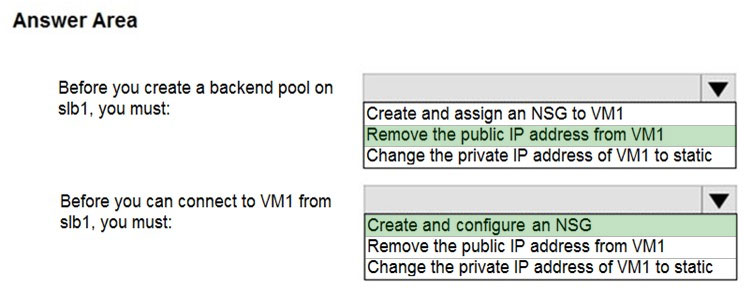

_Explanation:_
Change the private IP address of VM1 to static
Box 1: Remove the public IP address from VM1
Note: A public load balancer can provide outbound connections for virtual machines (VMs) inside your virtual network. These connections are accomplished by translating their private IP addresses to public IP addresses. Public Load Balancers are used to load balance internet traffic to your VMs.
Box 2: Create and configure an NSG
NSGs are used to explicitly permit allowed traffic. If you do not have an NSG on a subnet or NIC of your virtual machine resource, traffic is not allowed to reach this resource.
Reference:
https://docs.microsoft.com/en-us/azure/load-balancer/load-balancer-overview

---

### Question 418: Question #45 Topic 5

You have an Azure subscription that contains the resources shown in the following table.
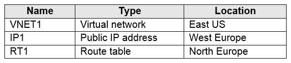
You need to create a network interface named NIC1.
In which location can you create NIC1?

- A. East US and North Europe only
- B. East US only
- C. East US, West Europe, and North Europe
- D. East US and West Europe only

**Correct Answer:** B

---

### Question 419: Question #46 Topic 5

You have Azure virtual machines that run Windows Server 2019 and are configured as shown in the following table.
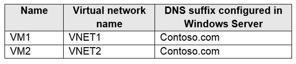
You create a public Azure DNS zone named adatum.com and a private Azure DNS zone named contoso.com.
For controso.com, you create a virtual network link named link1 as shown in the exhibit. (Click the Exhibit tab.)

You discover that VM1 can resolve names in contoso.com but cannot resolve names in adatum.com. VM1 can resolve other hosts on the Internet.
You need to ensure that VM1 can resolve host names in adatum.com.
What should you do?

- A. Update the DNS suffix on VM1 to be adatum.com
- B. Configure the name servers for adatum.com at the domain registrar
- C. Create an SRV record in the contoso.com zone
- D. Modify the Access control (IAM) settings for link1

**Correct Answer:** B

---

### Question 420: Question #47 Topic 5

HOTSPOT -
You plan to use Azure Network Watcher to perform the following tasks:
✑ Task1: Identify a security rule that prevents a network packet from reaching an Azure virtual machine.
✑ Task2: Validate outbound connectivity from an Azure virtual machine to an external host.
Which feature should you use for each task? To answer, select the appropriate options in the answer area.
NOTE: Each correct selection is worth one point.
Hot Area:
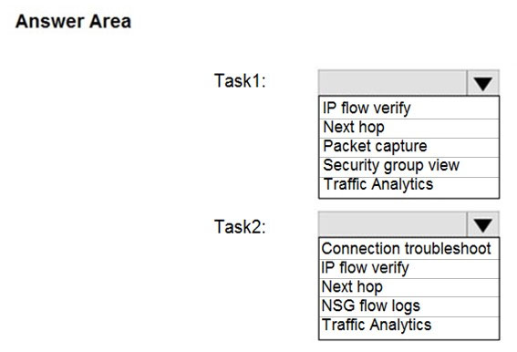

**Correct Answer:** 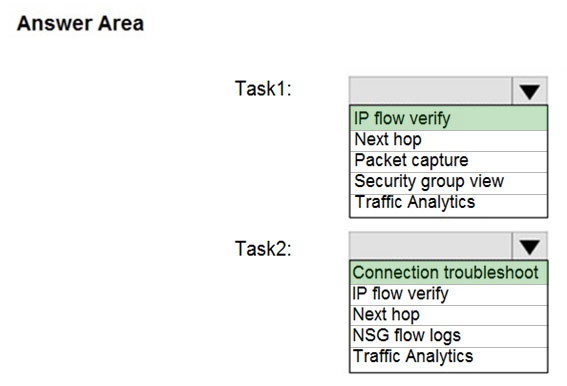

_Explanation:_
Box 1: IP flow verify -
At some point, a VM may become unable to communicate with other resources, because of a security rule. The IP flow verify capability enables you to specify a source and destination IPv4 address, port, protocol (TCP or UDP), and traffic direction (inbound or outbound). IP flow verify then tests the communication and informs you if the connection succeeds or fails. If the connection fails, IP flow verify tells you which.
Box 2: Connection troubleshoot -
Diagnose outbound connections from a VM: The connection troubleshoot capability enables you to test a connection between a VM and another VM, an FQDN, a
URI, or an IPv4 address. The test returns similar information returned when using the connection monitor capability, but tests the connection at a point in time, rather than monitoring it over time, as connection monitor does. Learn more about how to troubleshoot connections using connection-troubleshoot.
Reference:
https://docs.microsoft.com/en-us/azure/network-watcher/network-watcher-monitoring-overview

---

### Question 421: Question #48 Topic 5

HOTSPOT -
You have an Azure subscription that contains the Azure virtual machines shown in the following table.
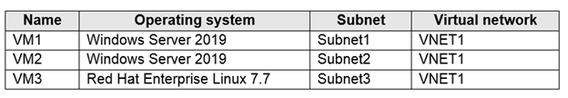
You configure the network interfaces of the virtual machines to use the settings shown in the following table.
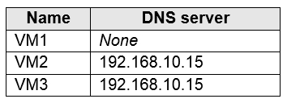
From the settings of VNET1 you configure the DNS servers shown in the following exhibit.
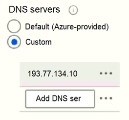
The virtual machines can successfully connect to the DNS server that has an IP address of 192.168.10.15 and the DNS server that has an IP address of
193.77.134.10.
For each of the following statements, select Yes if the statement is true. Otherwise, select No.
NOTE: Each correct selection is worth one point.
Hot Area:
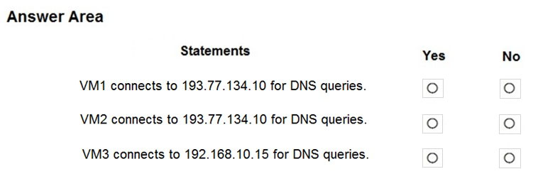

**Correct Answer:** 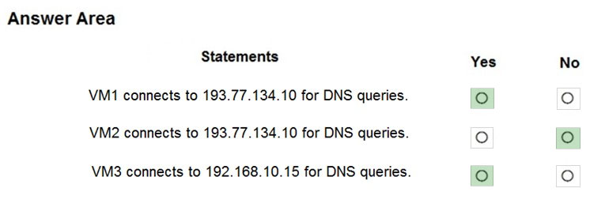

_Explanation:_
Box 1: Yes -
You can specify DNS server IP addresses in the VNet settings. The setting is applied as the default DNS server(s) for all VMs in the VNet.
Box 2: No -
You can set DNS servers per VM or cloud service to override the default network settings.
Box 3: Yes -
You can set DNS servers per VM or cloud service to override the default network settings.
Reference:
https://docs.microsoft.com/en-us/azure/virtual-network/virtual-networks-faq#name-resolution-dns

---

### Question 422: Question #49 Topic 5

HOTSPOT -
You have an Azure subscription that contains the resource groups shown in the following table.
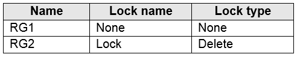
RG1 contains the resources shown in the following table.
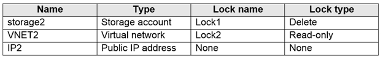
You need to identify which resources you can move from RG1 to RG2, and which resources you can move from RG2 to RG1.
Which resources should you identify? To answer, select the appropriate options in the answer area.
NOTE: Each correct selection is worth one point.
Hot Area:

**Correct Answer:** 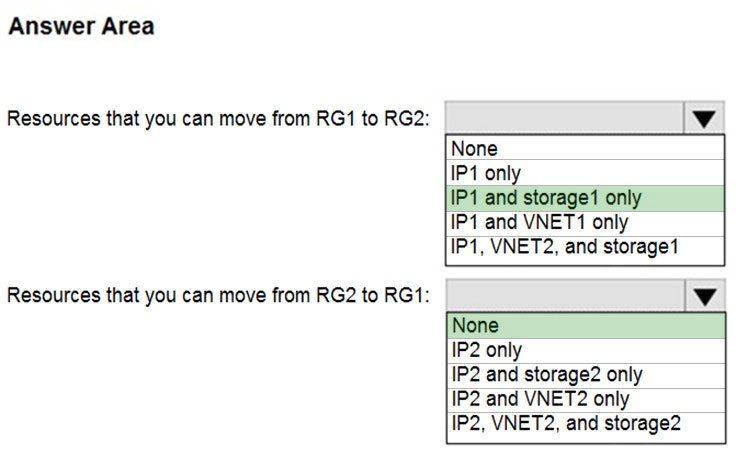

_Explanation:_
Box 1: IP1, Storage1 -
IP addresses and storage accounts can be moved.
Virtual networks cannot be moved.
There is no lock on RG1.
Box 2: None -
There is a delete lock on RG2.
Note: When you apply a lock at a parent scope, all resources within that scope inherit the same lock. Even resources you add later inherit the lock from the parent.
The most restrictive lock in the inheritance takes precedence.
CanNotDelete means authorized users can still read and modify a resource, but they can't delete the resource.
ReadOnly means authorized users can read a resource, but they can't delete or update the resource. Applying this lock is similar to restricting all authorized users to the permissions granted by the Reader role.
Reference:
https://docs.microsoft.com/en-us/azure/azure-resource-manager/management/lock-resources https://docs.microsoft.com/en-us/azure/azure-resource-manager/management/move-support-resources

---

### Question 423: Question #50 Topic 5

Note: This question is part of a series of questions that present the same scenario. Each question in the series contains a unique solution that might meet the stated goals. Some question sets might have more than one correct solution, while others might not have a correct solution.
After you answer a question in this section, you will NOT be able to return to it. As a result, these questions will not appear in the review screen.
You have an Azure subscription that contains the virtual machines shown in the following table.

You deploy a load balancer that has the following configurations:
✑ Name: LB1
✑ Type: Internal
✑ SKU: Standard
✑ Virtual network: VNET1
You need to ensure that you can add VM1 and VM2 to the backend pool of LB1.
Solution: You create a Basic SKU public IP address, associate the address to the network interface of VM1, and then start VM1.
Does this meet the goal?

- A. Yes
- B. No

**Correct Answer:** B

---

### Question 424: Question #51 Topic 5

Note: This question is part of a series of questions that present the same scenario. Each question in the series contains a unique solution that might meet the stated goals. Some question sets might have more than one correct solution, while others might not have a correct solution.
After you answer a question in this section, you will NOT be able to return to it. As a result, these questions will not appear in the review screen.
You have an Azure subscription that contains the virtual machines shown in the following table.

You deploy a load balancer that has the following configurations:
✑ Name: LB1
✑ Type: Internal
✑ SKU: Standard
✑ Virtual network: VNET1
You need to ensure that you can add VM1 and VM2 to the backend pool of LB1.
Solution: You create a Standard SKU public IP address, associate the address to the network interface of VM1, and then stop VM2.
Does this meet the goal?

- A. Yes
- B. No

**Correct Answer:** B

_Explanation:_
A Backend Pool configured by IP address has the following limitations:
✑ Standard load balancer only
Reference:
https://docs.microsoft.com/en-us/azure/load-balancer/backend-pool-management

---

### Question 425: Question #52 Topic 5

Note: This question is part of a series of questions that present the same scenario. Each question in the series contains a unique solution that might meet the stated goals. Some question sets might have more than one correct solution, while others might not have a correct solution.
After you answer a question in this section, you will NOT be able to return to it. As a result, these questions will not appear in the review screen.
You have an Azure subscription that contains the virtual machines shown in the following table.
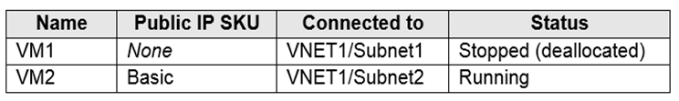
You deploy a load balancer that has the following configurations:
✑ Name: LB1
✑ Type: Internal
✑ SKU: Standard
✑ Virtual network: VNET1
You need to ensure that you can add VM1 and VM2 to the backend pool of LB1.
Solution: You create two Standard SKU public IP addresses and associate a Standard SKU public IP address to the network interface of each virtual machine.
Does this meet the goal?

- A. Yes
- B. No

**Correct Answer:** A

---

### Question 426: Question #53 Topic 5

Note: This question is part of a series of questions that present the same scenario. Each question in the series contains a unique solution that might meet the stated goals. Some question sets might have more than one correct solution, while others might not have a correct solution.
After you answer a question in this section, you will NOT be able to return to it. As a result, these questions will not appear in the review screen.
You have a computer named Computer1 that has a point-to-site VPN connection to an Azure virtual network named VNet1. The point-to-site connection uses a self-signed certificate.
From Azure, you download and install the VPN client configuration package on a computer named Computer2.
You need to ensure that you can establish a point-to-site VPN connection to VNet1 from Computer2.
Solution: You export the client certificate from Computer1 and install the certificate on Computer2.
Does this meet the goal?

- A. Yes
- B. No

**Correct Answer:** A

---

### Question 427: Question #54 Topic 5

You have an Azure virtual machine named VM1.
The network interface for VM1 is configured as shown in the exhibit. (Click the Exhibit tab.)
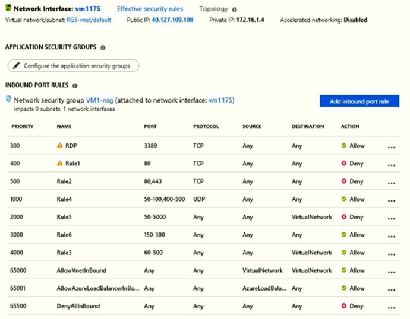
You deploy a web server on VM1, and then create a secure website that is accessible by using the HTTPS protocol. VM1 is used as a web server only.
You need to ensure that users can connect to the website from the Internet.
What should you do?

- A. Modify the protocol of Rule4
- B. Delete Rule1
- C. For Rule5, change the Action to Allow and change the priority to 401
- D. Create a new inbound rule that allows TCP protocol 443 and configure the rule to have a priority of 501.

**Correct Answer:** C

---

### Question 428: Question #55 Topic 5

Note: This question is part of a series of questions that present the same scenario. Each question in the series contains a unique solution that might meet the stated goals. Some question sets might have more than one correct solution, while others might not have a correct solution.
After you answer a question in this section, you will NOT be able to return to it. As a result, these questions will not appear in the review screen.
You have an Azure subscription that contains 10 virtual networks. The virtual networks are hosted in separate resource groups.
Another administrator plans to create several network security groups (NSGs) in the subscription.
You need to ensure that when an NSG is created, it automatically blocks TCP port 8080 between the virtual networks.
Solution: From the Resource providers blade, you unregister the Microsoft.ClassicNetwork provider.
Does this meet the goal?

- A. Yes
- B. No

**Correct Answer:** B

---

### Question 429: Question #56 Topic 5

HOTSPOT -
You manage two Azure subscriptions named Subscription1 and Subscription2.
Subscription1 has following virtual networks:
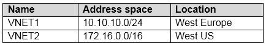
The virtual networks contain the following subnets:
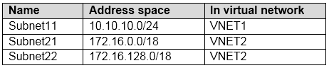
Subscription2 contains the following virtual network:
✑ Name: VNETA
✑ Address space: 10.10.128.0/17
✑ Location: Canada Central
VNETA contains the following subnets:

For each of the following statements, select Yes if the statement is true. Otherwise, select No.
NOTE: Each correct selection is worth one point.
Hot Area:
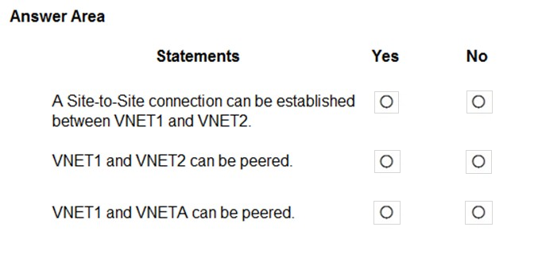

**Correct Answer:** 

_Explanation:_
Box 1: Yes -
With VNet-to-VNet you can connect Virtual Networks in Azure across different regions.
Box 2: Yes -
Azure supports the following types of peering:
✑ Virtual network peering: Connect virtual networks within the same Azure region.
✑ Global virtual network peering: Connecting virtual networks across Azure regions.
Box 3: No -
The virtual networks you peer must have non-overlapping IP address spaces.
Reference:
https://azure.microsoft.com/en-us/blog/vnet-to-vnet-connecting-virtual-networks-in-azure-across-different-regions/ https://docs.microsoft.com/en-us/azure/virtual-network/virtual-network-manage-peering#requirements-and-constraints

---

### Question 430: Question #57 Topic 5

Note: This question is part of a series of questions that present the same scenario. Each question in the series contains a unique solution that might meet the stated goals. Some question sets might have more than one correct solution, while others might not have a correct solution.
After you answer a question in this section, you will NOT be able to return to it. As a result, these questions will not appear in the review screen.
You have an app named App1 that is installed on two Azure virtual machines named VM1 and VM2. Connections to App1 are managed by using an Azure Load
Balancer.
The effective network security configurations for VM2 are shown in the following exhibit.

You discover that connections to App1 from 131.107.100.50 over TCP port 443 fail.
You verify that the Load Balancer rules are configured correctly.
You need to ensure that connections to App1 can be established successfully from 131.107.100.50 over TCP port 443.
Solution: You create an inbound security rule that denies all traffic from the 131.107.100.50 source and has a cost of 64999.
Does this meet the goal?

- A. Yes
- B. No

**Correct Answer:** B

---

### Question 431: Question #58 Topic 5

Note: This question is part of a series of questions that present the same scenario. Each question in the series contains a unique solution that might meet the stated goals. Some question sets might have more than one correct solution, while others might not have a correct solution.
After you answer a question in this section, you will NOT be able to return to it. As a result, these questions will not appear in the review screen.
You have an app named App1 that is installed on two Azure virtual machines named VM1 and VM2. Connections to App1 are managed by using an Azure Load
Balancer.
The effective network security configurations for VM2 are shown in the following exhibit.

You discover that connections to App1 from 131.107.100.50 over TCP port 443 fail.
You verify that the Load Balancer rules are configured correctly.
You need to ensure that connections to App1 can be established successfully from 131.107.100.50 over TCP port 443.
Solution: You delete the BlockAllOther443 inbound security rule.
Does this meet the goal?

- A. Yes
- B. No

**Correct Answer:** B

---

### Question 432: Question #59 Topic 5

Note: This question is part of a series of questions that present the same scenario. Each question in the series contains a unique solution that might meet the stated goals. Some question sets might have more than one correct solution, while others might not have a correct solution.
After you answer a question in this section, you will NOT be able to return to it. As a result, these questions will not appear in the review screen.
You have an app named App1 that is installed on two Azure virtual machines named VM1 and VM2. Connections to App1 are managed by using an Azure Load
Balancer.
The effective network security configurations for VM2 are shown in the following exhibit.
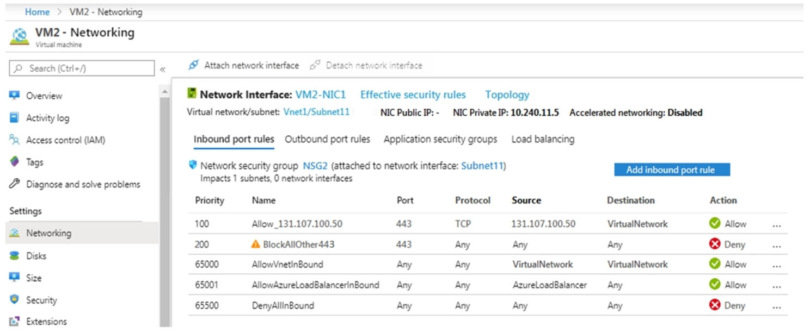
You discover that connections to App1 from 131.107.100.50 over TCP port 443 fail.
You verify that the Load Balancer rules are configured correctly.
You need to ensure that connections to App1 can be established successfully from 131.107.100.50 over TCP port 443.
Solution: You modify the priority of the Allow_131.107.100.50 inbound security rule.
Does this meet the goal?

- A. Yes
- B. No

**Correct Answer:** B

---

### Question 433: Question #60 Topic 5

Note: This question is part of a series of questions that present the same scenario. Each question in the series contains a unique solution that might meet the stated goals. Some question sets might have more than one correct solution, while others might not have a correct solution.
After you answer a question in this section, you will NOT be able to return to it. As a result, these questions will not appear in the review screen.
You have an Azure subscription that contains 10 virtual networks. The virtual networks are hosted in separate resource groups.
Another administrator plans to create several network security groups (NSGs) in the subscription.
You need to ensure that when an NSG is created, it automatically blocks TCP port 8080 between the virtual networks.
Solution: You assign a built-in policy definition to the subscription.
Does this meet the goal?

- A. Yes
- B. No

**Correct Answer:** B

---

### Question 434: Question #61 Topic 5

You have an Azure subscription.
You plan to deploy an Azure Kubernetes Service (AKS) cluster to support an app named App1. On-premises clients connect to App1 by using the IP address of the pod.
For the AKS cluster, you need to choose a network type that will support App1.
What should you choose?

- A. kubenet
- B. Azure Container Networking Interface (CNI)
- C. Hybrid Connection endpoints
- D. Azure Private Link

**Correct Answer:** B

---

### Question 435: Question #62 Topic 5

Note: This question is part of a series of questions that present the same scenario. Each question in the series contains a unique solution that might meet the stated goals. Some question sets might have more than one correct solution, while others might not have a correct solution.
After you answer a question in this section, you will NOT be able to return to it. As a result, these questions will not appear in the review screen.
You have an Azure subscription that contains the virtual machines shown in the following table.

You deploy a load balancer that has the following configurations:
✑ Name: LB1
✑ Type: Internal
✑ SKU: Standard
✑ Virtual network: VNET1
You need to ensure that you can add VM1 and VM2 to the backend pool of LB1.
Solution: You disassociate the public IP address from the network interface of VM2.
Does this meet the goal?

- A. Yes
- B. No

**Correct Answer:** A

---

### Question 436: Question #63 Topic 5

Note: This question is part of a series of questions that present the same scenario. Each question in the series contains a unique solution that might meet the stated goals. Some question sets might have more than one correct solution, while others might not have a correct solution.
After you answer a question in this section, you will NOT be able to return to it. As a result, these questions will not appear in the review screen.
You have an Azure subscription that contains 10 virtual networks. The virtual networks are hosted in separate resource groups.
Another administrator plans to create several network security groups (NSGs) in the subscription.
You need to ensure that when an NSG is created, it automatically blocks TCP port 8080 between the virtual networks.
Solution: You configure a custom policy definition, and then you assign the policy to the subscription.
Does this meet the goal?

- A. Yes
- B. No

**Correct Answer:** A

---

### Question 437: Question #64 Topic 5

You have two Azure virtual networks named VNet1 and VNet2. VNet1 contains an Azure virtual machine named VM1. VNet2 contains an Azure virtual machine named VM2.
VM1 hosts a frontend application that connects to VM2 to retrieve data.
Users report that the frontend application is slower than usual.
You need to view the average round-trip time (RTT) of the packets from VM1 to VM2.
Which Azure Network Watcher feature should you use?

- A. IP flow verify
- B. Connection troubleshoot
- C. Connection monitor
- D. NSG flow logs

**Correct Answer:** C

---

### Question 438: Question #65 Topic 5

HOTSPOT -
You have an Azure subscription that contains the public load balancers shown in the following table.
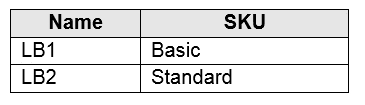
You plan to create six virtual machines and to load balance requests to the virtual machines. Each load balancer will load balance three virtual machines.
You need to create the virtual machines for the planned solution.
How should you create the virtual machines? To answer, select the appropriate options in the answer area.
NOTE: Each correct selection is worth one point.
Hot Area:
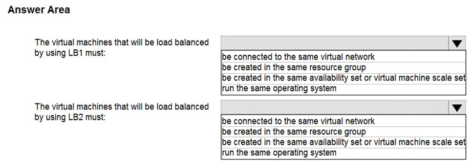

**Correct Answer:** 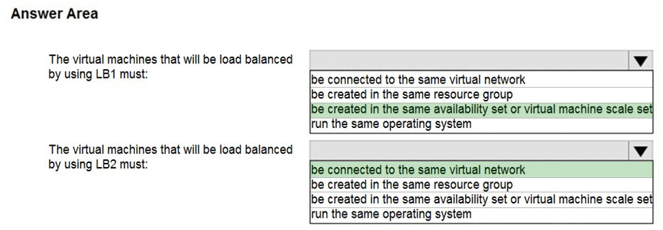

_Explanation:_
Box 1: be created in the same availability set or virtual machine scale set.
The Basic tier is quite restrictive. A load balancer is restricted to a single availability set, virtual machine scale set, or a single machine.
Box 2: be connected to the same virtual network
The Standard tier can span any virtual machine in a single virtual network, including blends of scale sets, availability sets, and machines.
Reference:
https://www.petri.com/comparing-basic-standard-azure-load-balancers

---

### Question 439: Question #66 Topic 5

HOTSPOT -
You have an on-premises data center and an Azure subscription. The data center contains two VPN devices. The subscription contains an Azure virtual network named VNet1. VNet1 contains a gateway subnet.
You need to create a site-to-site VPN. The solution must ensure that if a single instance of an Azure VPN gateway fails, or a single on-premises VPN device fails, the failure will not cause an interruption that is longer than two minutes.
What is the minimum number of public IP addresses, virtual network gateways, and local network gateways required in Azure? To answer, select the appropriate options in the answer area.
NOTE: Each correct selection is worth one point.
Hot Area:

**Correct Answer:** 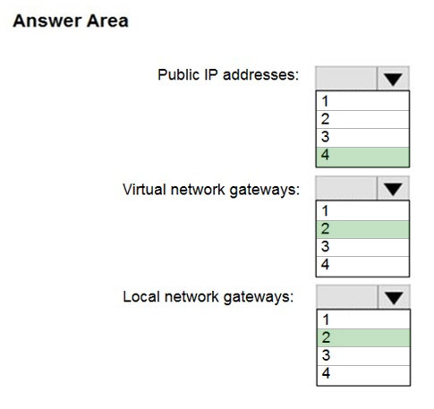

_Explanation:_
Box 1: 4 -
Two public IP addresses in the on-premises data center, and two public IP addresses in the VNET.
The most reliable option is to combine the active-active gateways on both your network and Azure, as shown in the diagram below.
Box 2: 2 -
Every Azure VPN gateway consists of two instances in an active-standby configuration. For any planned maintenance or unplanned disruption that happens to the active instance, the standby instance would take over (failover) automatically, and resume the S2S VPN or VNet-to-VNet connections.
Box 3: 2 -
Dual-redundancy: active-active VPN gateways for both Azure and on-premises networks
Reference:
https://docs.microsoft.com/en-us/azure/vpn-gateway/vpn-gateway-highlyavailable

---

### Question 440: Question #67 Topic 5

You have an Azure subscription that contains two virtual machines as shown in the following table.
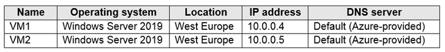
You perform a reverse DNS lookup for 10.0.0.4 from VM2.
Which FQDN will be returned?

- A. vm1.core.windows.net
- B. vm1.azure.com
- C. vm1.westeurope.cloudapp.azure.com
- D. vm1.internal.cloudapp.net

**Correct Answer:** D

---

### Question 441: Question #68 Topic 5

Note: This question is part of a series of questions that present the same scenario. Each question in the series contains a unique solution that might meet the stated goals. Some question sets might have more than one correct solution, while others might not have a correct solution.
After you answer a question in this section, you will NOT be able to return to it. As a result, these questions will not appear in the review screen.
You have an app named App1 that is installed on two Azure virtual machines named VM1 and VM2. Connections to App1 are managed by using an Azure Load
Balancer.
The effective network security configurations for VM2 are shown in the following exhibit.

You discover that connections to App1 from 131.107.100.50 over TCP port 443 fail.
You verify that the Load Balancer rules are configured correctly.
You need to ensure that connections to App1 can be established successfully from 131.107.100.50 over TCP port 443.
Solution: You create an inbound security rule that allows any traffic from the AzureLoadBalancer source and has a cost of 150.
Does this meet the goal?

- A. Yes
- B. No

**Correct Answer:** B

---

### Question 442: Question #69 Topic 5

You have an Azure subscription that contains a policy-based virtual network gateway named GW1 and a virtual network named VNet1.
You need to ensure that you can configure a point-to-site connection from an on-premises computer to VNet1.
Which two actions should you perform? Each correct answer presents part of the solution.
NOTE: Each correct selection is worth one point.

- A. Add a service endpoint to VNet1
- B. Reset GW1
- C. Create a route-based virtual network gateway
- D. Add a connection to GW1
- E. Delete GW1
- F. Add a public IP address space to VNet1

**Correct Answer:** CE

---

### Question 443: Question #70 Topic 5

HOTSPOT -
You have an Azure subscription that contains the resources in the following table:
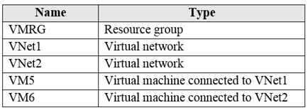
In Azure, you create a private DNS zone named adatum.com. You set the registration virtual network to VNet2. The adatum.com zone is configured as shown in the following exhibit:

For each of the following statements, select Yes if the statement is true. Otherwise, select No.
NOTE: Each correct selection is worth one point.
Hot Area:
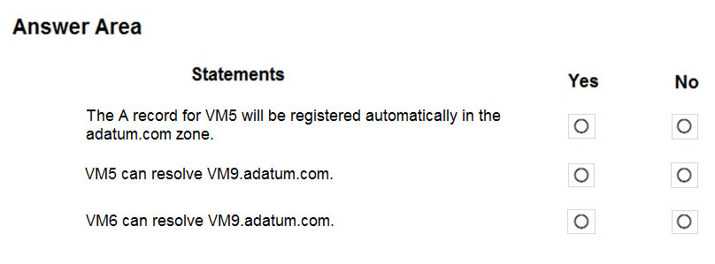

**Correct Answer:** 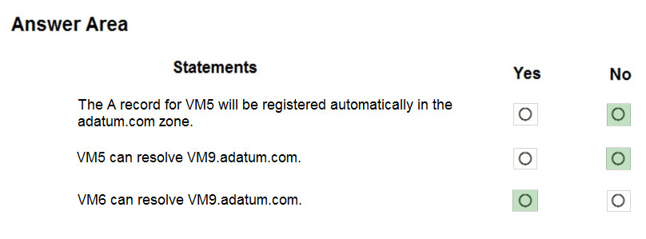

_Explanation:_
Box 1: No -
Azure DNS provides automatic registration of virtual machines from a single virtual network that's linked to a private zone as a registration virtual network. VM5 does not belong to the registration virtual network though.
Box 2: No -
Forward DNS resolution is supported across virtual networks that are linked to the private zone as resolution virtual networks. VM5 does belong to a resolution virtual network.
Box 3: Yes -
VM6 belongs to registration virtual network, and an A (Host) record exists for VM9 in the DNS zone.
By default, registration virtual networks also act as resolution virtual networks, in the sense that DNS resolution against the zone works from any of the virtual machines within the registration virtual network.
Reference:
https://docs.microsoft.com/en-us/azure/dns/private-dns-overview

---

### Question 444: Question #71 Topic 5

HOTSPOT -
You have an Azure subscription that contains the virtual networks shown in the following table.
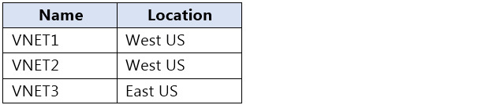
The subscription contains the private DNS zones shown in the following table.
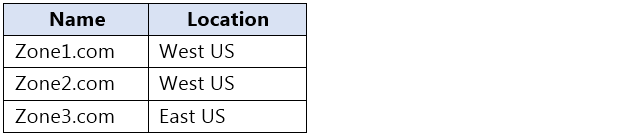
You add virtual network links to the private DNS zones as shown in the following table.
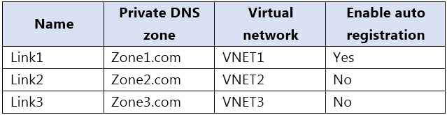
For each of the following statements, select Yes if the statement is true. Otherwise, select No.
NOTE: Each correct selection is worth one point.
Hot Area:
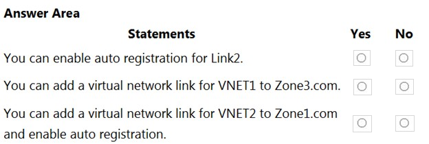

**Correct Answer:** 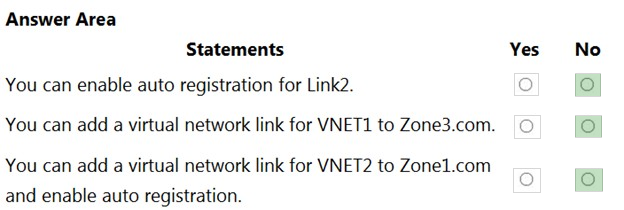

_Explanation:_
Reference:
https://docs.microsoft.com/en-us/azure/dns/private-dns-virtual-network-links https://docs.microsoft.com/en-us/azure/dns/private-dns-autoregistration

---

### Question 445: Question #72 Topic 5

HOTSPOT -
You have an Azure subscription.
You plan to use an Azure Resource Manager template to deploy a virtual network named VNET1 that will use Azure Bastion.
How should you complete the template? To answer, select the appropriate options in the answer area.
NOTE: Each correct selection is worth one point.
Hot Area:
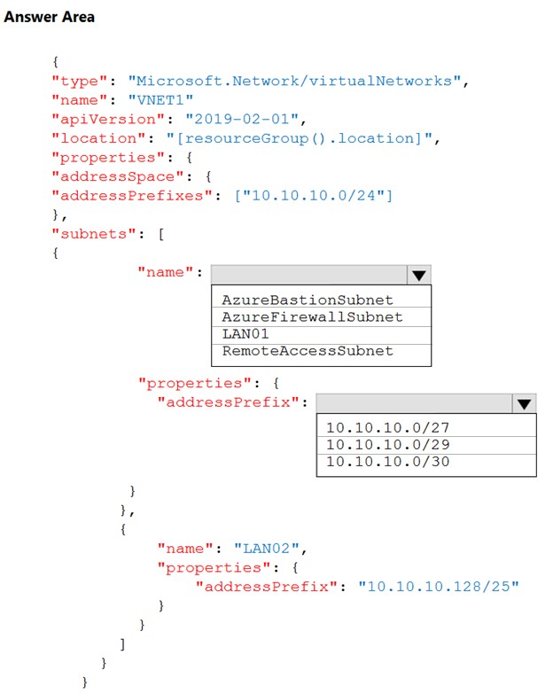

**Correct Answer:** 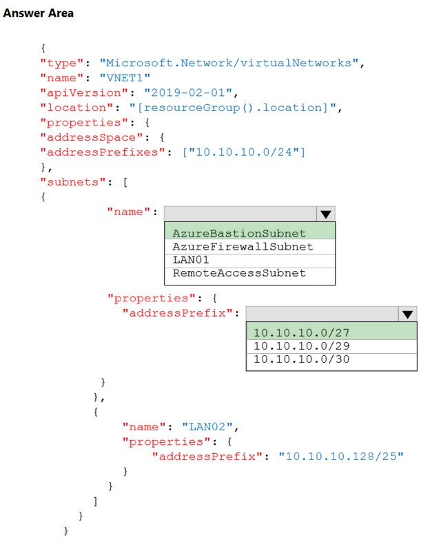

_Explanation:_
Reference:
https://medium.com/charot/deploy-azure-bastion-preview-using-an-arm-template-15e3010767d6

---

### Question 446: Question #73 Topic 5

Note: This question is part of a series of questions that present the same scenario. Each question in the series contains a unique solution that might meet the stated goals. Some question sets might have more than one correct solution, while others might not have a correct solution.
After you answer a question in this section, you will NOT be able to return to it. As a result, these questions will not appear in the review screen.
You manage a virtual network named VNet1 that is hosted in the West US Azure region.
VNet1 hosts two virtual machines named VM1 and VM2 that run Windows Server.
You need to inspect all the network traffic from VM1 to VM2 for a period of three hours.
Solution: From Azure Network Watcher, you create a packet capture.
Does this meet the goal?

- A. Yes
- B. No

**Correct Answer:** A

---

### Question 447: Question #74 Topic 5

Note: This question is part of a series of questions that present the same scenario. Each question in the series contains a unique solution that might meet the stated goals. Some question sets might have more than one correct solution, while others might not have a correct solution.
After you answer a question in this section, you will NOT be able to return to it. As a result, these questions will not appear in the review screen.
You manage a virtual network named VNet1 that is hosted in the West US Azure region.
VNet1 hosts two virtual machines named VM1 and VM2 that run Windows Server.
You need to inspect all the network traffic from VM1 to VM2 for a period of three hours.
Solution: From Azure Network Watcher, you create a connection monitor.
Does this meet the goal?

- A. Yes
- B. No

**Correct Answer:** B

---

### Question 448: Question #75 Topic 5

Note: This question is part of a series of questions that present the same scenario. Each question in the series contains a unique solution that might meet the stated goals. Some question sets might have more than one correct solution, while others might not have a correct solution.
After you answer a question in this section, you will NOT be able to return to it. As a result, these questions will not appear in the review screen.
You manage a virtual network named VNet1 that is hosted in the West US Azure region.
VNet1 hosts two virtual machines named VM1 and VM2 that run Windows Server.
You need to inspect all the network traffic from VM1 to VM2 for a period of three hours.
Solution: From Performance Monitor, you create a Data Collector Set (DCS).
Does this meet the goal?

- A. Yes
- B. No

**Correct Answer:** B

---

### Question 449: Question #76 Topic 5

DRAG DROP -
You have an Azure subscription that contains the resources shown in the following table.
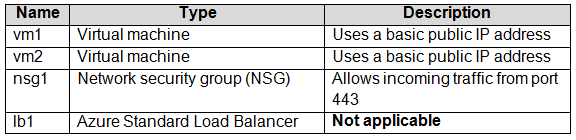
You need to load balance HTTPS connections to vm1 and vm2 by using lb1.
Which three actions should you perform in sequence? To answer, move the appropriate actions from the list of actions to the answer area and arrange them in the correct order.
Select and Place:
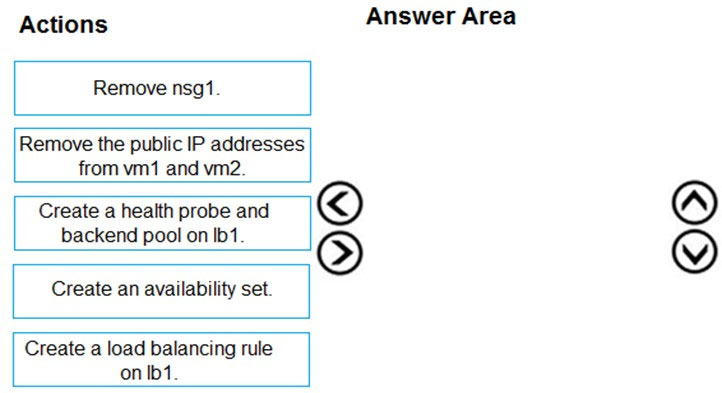

**Correct Answer:** 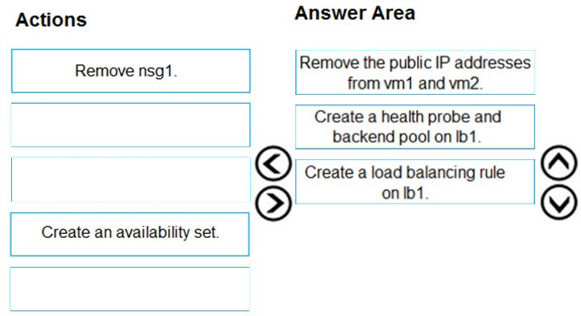

_Explanation:_
Reference:
https://docs.microsoft.com/en-us/azure/load-balancer/tutorial-load-balancer-standard-public-zone-redundant-portal

---

### Question 450: Question #77 Topic 5

Note: This question is part of a series of questions that present the same scenario. Each question in the series contains a unique solution that might meet the stated goals. Some question sets might have more than one correct solution, while others might not have a correct solution.
After you answer a question in this section, you will NOT be able to return to it. As a result, these questions will not appear in the review screen.
You manage a virtual network named VNet1 that is hosted in the West US Azure region.
VNet1 hosts two virtual machines named VM1 and VM2 that run Windows Server.
You need to inspect all the network traffic from VM1 to VM2 for a period of three hours.
Solution: From Azure Monitor, you create a metric on Network In and Network Out.
Does this meet the goal?

- A. Yes
- B. No

**Correct Answer:** B

---

### Question 451: Question #78 Topic 5

Note: This question is part of a series of questions that present the same scenario. Each question in the series contains a unique solution that might meet the stated goals. Some question sets might have more than one correct solution, while others might not have a correct solution.
After you answer a question in this section, you will NOT be able to return to it. As a result, these questions will not appear in the review screen.
You have an app named App1 that is installed on two Azure virtual machines named VM1 and VM2. Connections to App1 are managed by using an Azure Load
Balancer.
The effective network security configurations for VM2 are shown in the following exhibit.
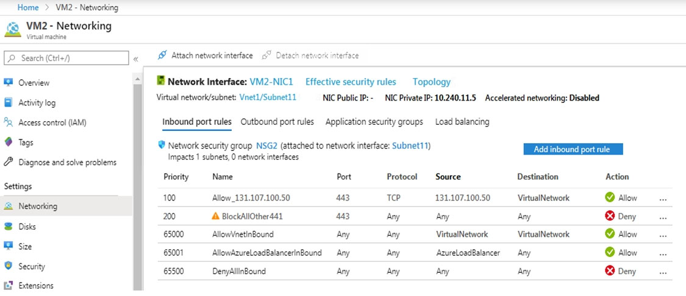
You discover that connections to App1 from 131.107.100.50 over TCP port 443 fail.
You verify that the Load Balancer rules are configured correctly.
You need to ensure that connections to App1 can be established successfully from 131.107.100.50 over TCP port 443.
Solution: You create an inbound security rule that denies all traffic from the 131.107.100.50 source and has a priority of 64999.
Does this meet the goal?

- A. Yes
- B. No

**Correct Answer:** B

---

### Question 452: Question #79 Topic 5

DRAG DROP -
You have an Azure subscription that contains two on-premises locations named site1 and site2.
You need to connect site1 and site2 by using an Azure Virtual WAN.
Which four actions should you perform in sequence? To answer, move the appropriate actions from the list of actions to the answer area and arrange them in the correct order.
Select and Place:
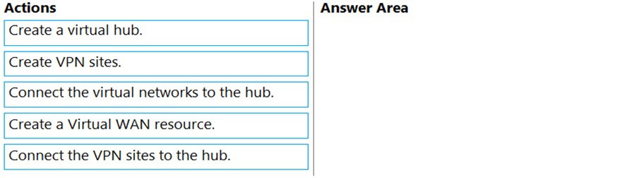

**Correct Answer:** 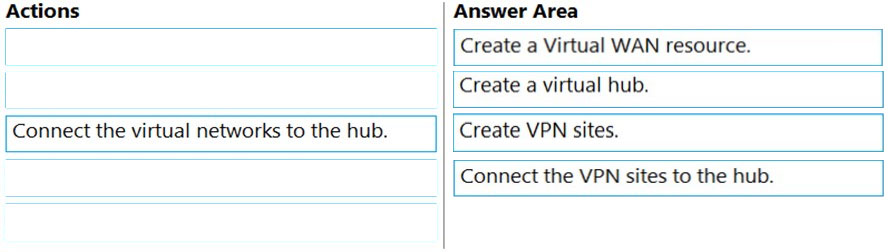

_Explanation:_
Reference:
https://docs.microsoft.com/en-us/azure/virtual-wan/virtual-wan-site-to-site-portal

---

### Question 453: Question #80 Topic 5

HOTSPOT -
You have an Azure subscription that contains the virtual networks shown in the following table.
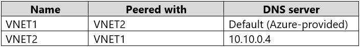
You have the virtual machines shown in the following table.
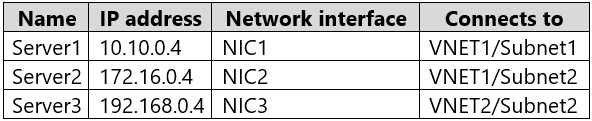
You have the virtual network interfaces shown in the following table.
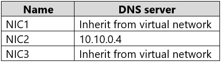
Server1 is a DNS server that contains the resources shown in the following table.
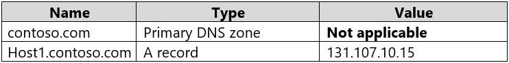
You have an Azure private DNS zone named contoso.com that has a virtual network link to VNET2 and the records shown in the following table.
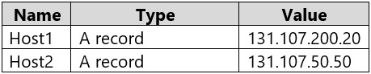
For each of the following statements, select Yes if the statement is true. Otherwise, select No.
NOTE: Each correct selection is worth one point.
Hot Area:

**Correct Answer:** 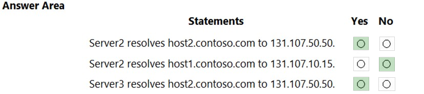

---

### Question 454: Question #81 Topic 5

You have a virtual network named VNet1 as shown in the exhibit. (Click the Exhibit tab.)
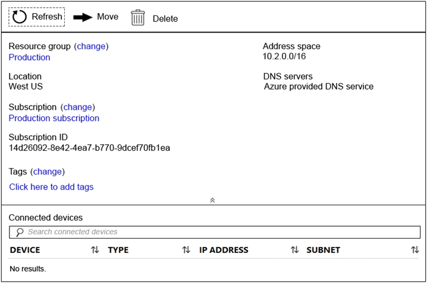
No devices are connected to VNet1.
You plan to peer VNet1 to another virtual network named VNet2. VNet2 has an address space of 10.2.0.0/16.
You need to create the peering.
What should you do first?

- A. Modify the address space of VNet1.
- B. Add a gateway subnet to VNet1.
- C. Create a subnet on VNet1 and VNet2.
- D. Configure a service endpoint on VNet2.

**Correct Answer:** A

---

### Question 455: Question #82 Topic 5

You have the Azure virtual machines shown in the following table.
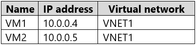
VNET1 is linked to a private DNS zone named contoso.com that contains the records shown in the following table.
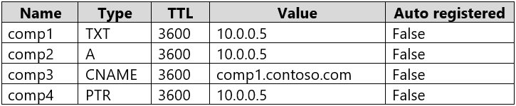
You need to ping VM2 from VM1.
Which DNS names can you use to ping VM2?

- A. comp2.contoso.com and comp4.contoso.com only
- B. comp1.contoso.com, comp2.contoso.com, comp3.contoso.com, and comp4.contoso.com
- C. comp2.contoso.com only
- D. comp1.contoso.com and comp2.contoso.com only
- E. comp1.contoso.com, comp2.contoso.com, and comp4.contoso.com only

**Correct Answer:** C

---

### Question 456: Question #83 Topic 5

HOTSPOT -
You have a network security group (NSG) named NSG1 that has the rules defined in the exhibit. (Click the Exhibit tab.)
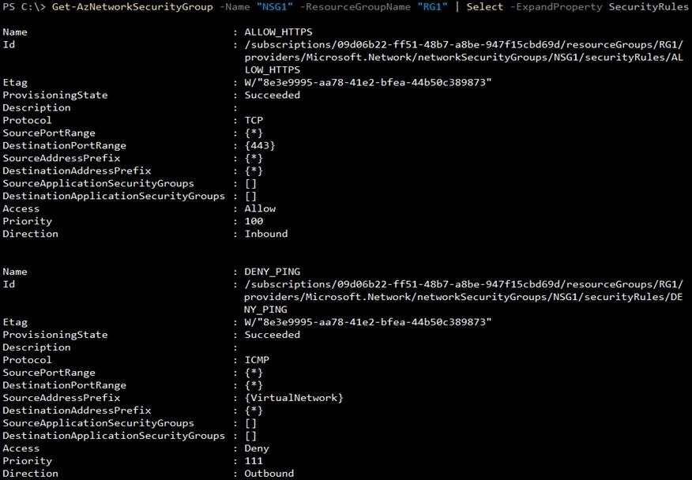
NSG1 is associated to a subnet named Subnet1. Subnet1 contains the virtual machines shown in the following table.
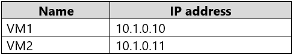
You need to add a rule to NSG1 to ensure that VM1 can ping VM2. The solution must use the principle of least privilege.
How should you configure the rule? To answer, select the appropriate options in the answer area.
NOTE: Each correct selection is worth one point.
Hot Area:

**Correct Answer:** 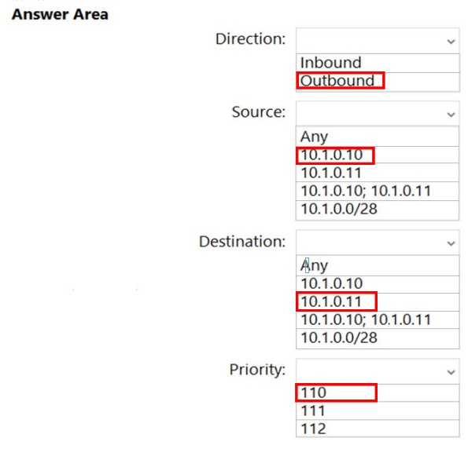

_Explanation:_
Reference:
https://www.thomasmaurer.ch/2019/09/how-to-enable-ping-icmp-echo-on-an-azure-vm/

---

### Question 457: Question #84 Topic 5

Note: This question is part of a series of questions that present the same scenario. Each question in the series contains a unique solution that might meet the stated goals. Some question sets might have more than one correct solution, while others might not have a correct solution.
After you answer a question in this section, you will NOT be able to return to it. As a result, these questions will not appear in the review screen.
You have a computer named Computer1 that has a point-to-site VPN connection to an Azure virtual network named VNet1. The point-to-site connection uses a self-signed certificate.
From Azure, you download and install the VPN client configuration package on a computer named Computer2.
You need to ensure that you can establish a point-to-site VPN connection to VNet1 from Computer2.
Solution: On Computer2, you set the Startup type for the IPSec Policy Agent service to Automatic.
Does this meet the goal?

- A. Yes
- B. No

**Correct Answer:** B

---

### Question 458: Question #85 Topic 5

You have five Azure virtual machines that run Windows Server 2016. The virtual machines are configured as web servers.
You have an Azure load balancer named LB1 that provides load balancing services for the virtual machines.
You need to ensure that visitors are serviced by the same web server for each request.
What should you configure?

- A. Session persistence to Client IP and protocol
- B. Protocol to UDP
- C. Session persistence to None
- D. Floating IP (direct server return) to Enabled

**Correct Answer:** A

---

### Question 459: Question #86 Topic 5

You have an Azure subscription that uses the public IP addresses shown in the following table.
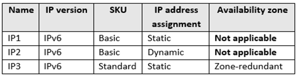
You need to create a public Azure Standard Load Balancer.
Which public IP addresses can you use?

- A. IP1, IP2, and IP3
- B. IP2 only
- C. IP3 only
- D. IP1 and IP3 only

**Correct Answer:** C

---

### Question 460: Question #87 Topic 5

You have an Azure subscription.
You are deploying an Azure Kubernetes Service (AKS) cluster that will contain multiple pods. The pods will use kubernet networking.
You need to restrict network traffic between the pods.
What should you configure on the AKS cluster?

- A. the Azure network policy
- B. the Calico network policy
- C. pod security policies
- D. an application security group

**Correct Answer:** B

---

### Question 461: Question #88 Topic 5

HOTSPOT -
You have an Azure subscription that contains a virtual network named VNet1. VNet1 uses an IP address space of 10.0.0.0/16 and contains the VPN Gateway and subnets in the following table:

Subnet1 contains a virtual appliance named VM1 that operates as a router.
You create a routing table named RT1.
You need to route all inbound traffic from the VPN gateway to VNet1 through VM1.
How should you configure RT1? To answer, select the appropriate options in the answer area.
NOTE: Each correct selection is worth one point.
Hot Area:

**Correct Answer:** 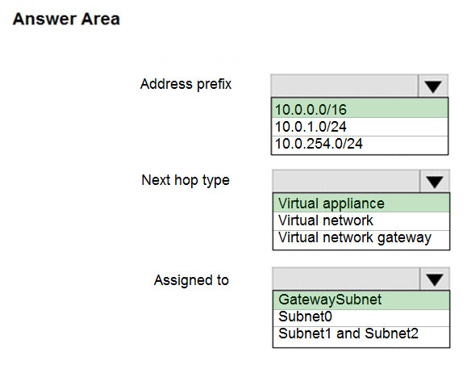

---

### Question 462: Question #89 Topic 5

You have five Azure virtual machines that run Windows Server 2016. The virtual machines are configured as web servers.
You have an Azure load balancer named LB1 that provides load balancing services for the virtual machines.
You need to ensure that visitors are serviced by the same web server for each request.
What should you configure?

- A. Floating IP (direct server return) to Enabled
- B. Floating IP (direct server return) to Disabled
- C. a health probe
- D. Session persistence to Client IP and Protocol

**Correct Answer:** D

---

### Question 463: Question #90 Topic 5

HOTSPOT -
You have an Azure subscription that contains the virtual machines shown in the following table:

VM1 and VM2 use public IP addresses. From Windows Server 2019 on VM1 and VM2, you allow inbound Remote Desktop connections.
Subnet1 and Subnet2 are in a virtual network named VNET1.
The subscription contains two network security groups (NSGs) named NSG1 and NSG2. NSG1 uses only the default rules.
NSG2 uses the default rules and the following custom incoming rule:
✑ Priority: 100
✑ Name: Rule1
✑ Port: 3389
✑ Protocol: TCP
✑ Source: Any
✑ Destination: Any
✑ Action: Allow
NSG1 is associated to Subnet1. NSG2 is associated to the network interface of VM2.
For each of the following statements, select Yes if the statement is true. Otherwise, select No.
NOTE: Each correct selection is worth one point.
Hot Area:
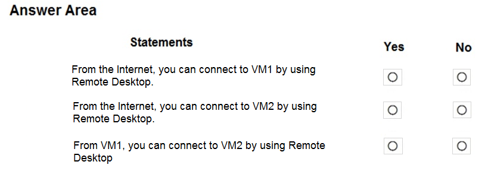

**Correct Answer:** 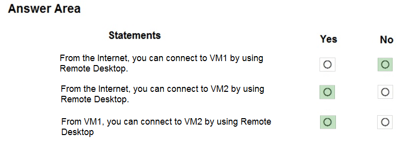

---

### Question 464: Question #91 Topic 5

You have an Azure subscription that contains two virtual machines named VM1 and VM2.
You create an Azure load balancer.
You plan to create a load balancing rule that will load balance HTTPS traffic between VM1 and VM2.
Which two additional load balancer resources should you create before you can create the load balancing rule? Each correct answer presents part of the solution.
NOTE: Each correct selection is worth one point.

- A. a frontend IP address
- B. an inbound NAT rule
- C. a virtual network
- D. a backend pool
- E. a health probe

**Correct Answer:** DE

---

### Question 465: Question #92 Topic 5

You have an on-premises network that contains a database server named dbserver1.
You have an Azure subscription.
You plan to deploy three Azure virtual machines. Each virtual machine will be deployed to a separate availability zone.
You need to configure an Azure VPN gateway for a site-to-site VPN. The solution must ensure that the virtual machines can connect to dbserver1.
Which type of public IP address SKU and assignment should you use for the gateway?

- A. a basic SKU and a static IP address assignment
- B. a standard SKU and a static IP address assignment
- C. a basic SKU and a dynamic IP address assignment

**Correct Answer:** B

---

### Question 466: Question #93 Topic 5

HOTSPOT -
You have an Azure subscription that contains the virtual machines shown in the following table.
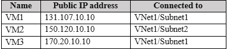
The subscription contains a storage account named contoso2024 as shown in the following exhibit.
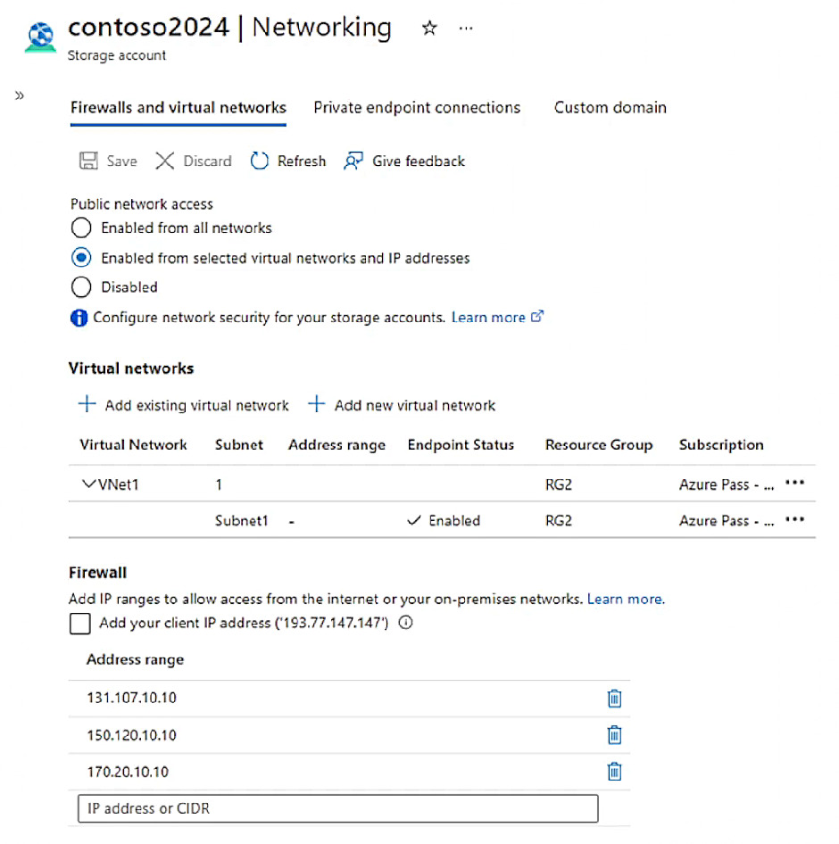
For each of the following statements, select Yes if the statement is true. Otherwise, select No.
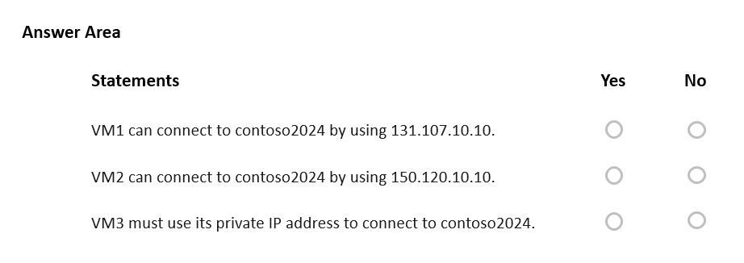

**Correct Answer:** 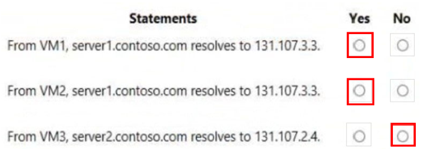

---

### Question 467: Question #94 Topic 5

HOTSPOT -
You have two Azure virtual machines as shown in the following table.
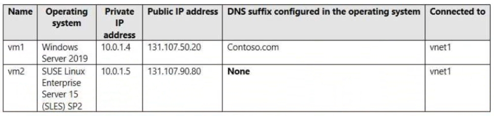
You create the Azure DNS zones shown in the following table.
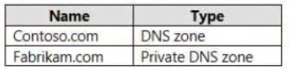
You perform the following actions:
✑ ׀¢׀¾ fabrikam.com, you add a virtual network link to vnet1 and enable auto registration.
✑ For contoso.com, you assign vm1 and vm2 the Owner role.
For each of the following statements, select Yes if the statement is true. Otherwise, select No.
NOTE: Each correct selection is worth one point.
Hot Area:
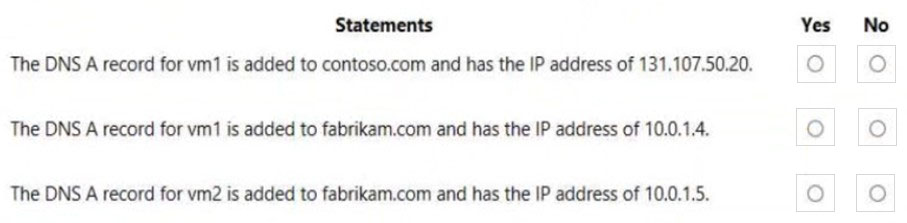

**Correct Answer:** 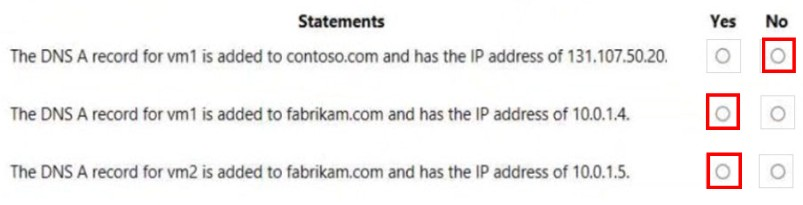

_Explanation:_
Box 1: Yes -
The DNS zone uses the Public IP address of vm1.
Box 2: Yes -
Fabrikam.com is a Private DNS zone. The private IP address is used.
Note: The Azure DNS private zones auto registration feature manages DNS records for virtual machines deployed in a virtual network. When you link a virtual network with a private DNS zone with this setting enabled, a DNS record gets created for each virtual machine deployed in the virtual network.
For each virtual machine, an A record and a PTR record are created. DNS records for newly deployed virtual machines are also automatically created in the linked private DNS zone.
Note: If you use Azure Provided DNS then appropriate DNS suffix will be automatically applied to your virtual machines. For all other options you must either use
Fully Qualified Domain Names (FQDN) or manually apply appropriate DNS suffix to your virtual machines.
Box 3: Yes -
Reference:
https://docs.microsoft.com/en-us/azure/dns/dns-zones-records
https://docs.microsoft.com/en-us/azure/virtual-network/virtual-networks-name-resolution-for-vms-and-role-instances

---

### Question 468: Question #95 Topic 5

You have an on-premises datacenter and an Azure subscription.
You plan to connect the datacenter to Azure by using ExpressRoute.
You need to deploy an ExpressRoute gateway. The solution must meet the following requirements:
✑ Support up to 10 Gbps of traffic.
✑ Support availability zones.
✑ Support FastPath.
✑ Minimize costs.
Which SKU should you deploy?

- A. ERGw1AZ
- B. ERGw2
- C. ErGw3
- D. ErGw3AZ

**Correct Answer:** D

---

### Question 469: Question #96 Topic 5

HOTSPOT -
You have a virtual network named VNET1 that contains the subnets shown in the following table:
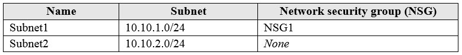
You have Azure virtual machines that have the network configurations shown in the following table:
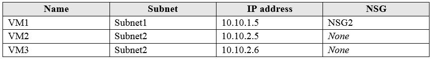
For NSG1, you create the inbound security rule shown in the following table:
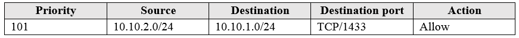
For NSG2, you create the inbound security rule shown in the following table:
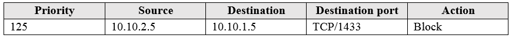
For each of the following statements, select Yes if the statement is true. Otherwise, select No.
NOTE: Each correct selection is worth one point.
Hot Area:
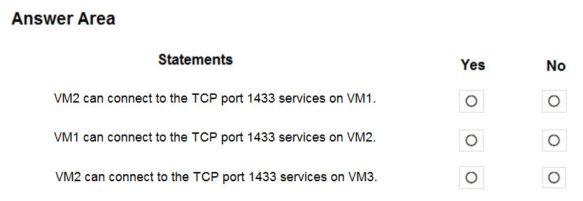

**Correct Answer:** 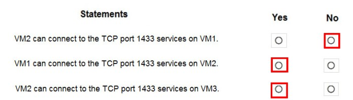

_Explanation:_
Box 1: Yes -
The inbound security rule for NSG1 allows TCP port 1433 from 10.10.2.0/24 (or Subnet2 where VM2 and VM3 are located) to 10.10.1.0/24 (or Subnet1 where
VM1 is located) while the inbound security rule for NSG2 blocks TCP port 1433 from 10.10.2.5 (or VM2) to 10.10.1.5 (or VM1). However, the NSG1 rule has a higher priority (or lower value) than the NSG2 rule.
Box 2: Yes -
No rule explicitly blocks communication from VM1. The default rules, which allow communication, are thus applied.
Box 3: Yes -
No rule explicitly blocks communication between VM2 and VM3 which are both on Subnet2. The default rules, which allow communication, are thus applied.
Reference:
https://docs.microsoft.com/en-us/azure/virtual-network/security-overview

---

### Question 470: Question #97 Topic 5

HOTSPOT -
You have an Azure subscription named Subscription1.
Subscription1 contains the virtual machines in the following table:
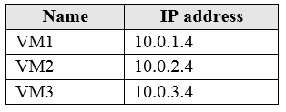
Subscription1 contains a virtual network named VNet1 that has the subnets in the following table:
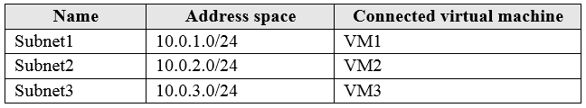
VM3 has multiple network adapters, including a network adapter named NIC3. IP forwarding is enabled on NIC3. Routing is enabled on VM3.
You create a route table named RT1 that contains the routes in the following table:
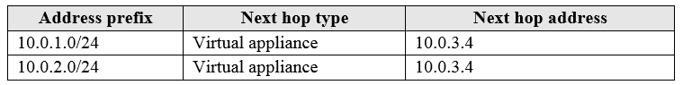
You apply RT1 to Subnet1 and Subnet2.
For each of the following statements, select Yes if the statement is true. Otherwise, select No.
NOTE: Each correct selection is worth one point.
Hot Area:
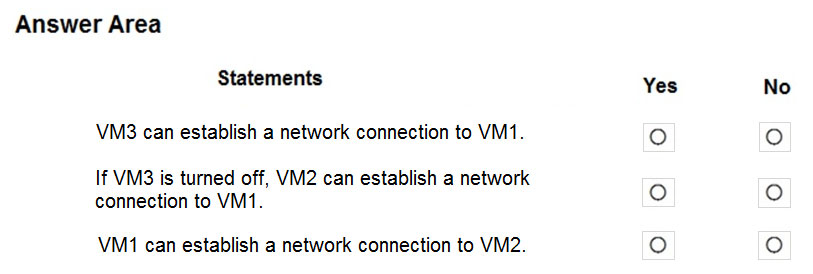

**Correct Answer:** 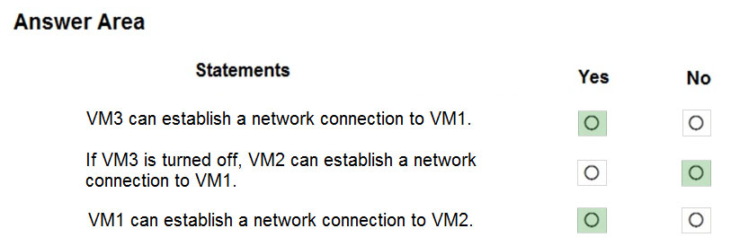

_Explanation:_
IP forwarding enables the virtual machine a network interface is attached to:
✑ Receive network traffic not destined for one of the IP addresses assigned to any of the IP configurations assigned to the network interface.
Send network traffic with a different source IP address than the one assigned to one of a network interface's IP configurations.
The setting must be enabled for every network interface that is attached to the virtual machine that receives traffic that the virtual machine needs to forward. A virtual machine can forward traffic whether it has multiple network interfaces or a single network interface attached to it.
Box 1: Yes -
The routing table allows connections from VM3 to VM1 and VM2. And as IP forwarding is enabled on VM3, VM3 can connect to VM1.
Box 2: No -
VM3, which has IP forwarding, must be turned on, in order for VM2 to connect to VM1.
Box 3: Yes -
The routing table allows connections from VM1 and VM2 to VM3. IP forwarding on VM3 allows VM1 to connect to VM2 via VM3.
Reference:
https://docs.microsoft.com/en-us/azure/virtual-network/virtual-networks-udr-overview https://www.quora.com/What-is-IP-forwarding

---

### Question 471: Question #98 Topic 5

Your on-premises network contains an SMB share named Share1.
You have an Azure subscription that contains the following resources:
✑ A web app named webapp1
✑ A virtual network named VNET1
You need to ensure that webapp1 can connect to Share1.
What should you deploy?

- A. an Azure Application Gateway
- B. an Azure Active Directory (Azure AD) Application Proxy
- C. an Azure Virtual Network Gateway

**Correct Answer:** C

---

### Question 472: Question #99 Topic 5

You have an Azure subscription that contains the resources shown in the following table.
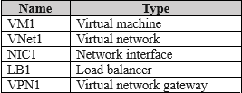
You create a public IP address named IP1.
Which two resources can you associate to IP1? Each correct answer presents a complete solution.
NOTE: Each correct selection is worth one point.

- A. VM1
- B. LB1
- C. NIC1
- D. VPN1
- E. VNet1

**Correct Answer:** BC

---

### Question 473: Question #100 Topic 5

You have an Azure subscription that contains a storage account named storage1.
You need to allow access to storage1 from selected networks and your home office. The solution must minimize administrative effort.
What should you do first for storage1?

- A. Add a private endpoint.
- B. Modify the Public network access settings.
- C. Select Internet routing.
- D. Modify the Access Control (IAM) settings.

**Correct Answer:** B

---

### Question 474: Question #101 Topic 5

You plan to deploy route-based Site-to-Site VPN connections between several on-premises locations and an Azure virtual network.
Which tunneling protocol should you use?

- A. IKEv1
- B. PPTP
- C. IKEv2
- D. L2TP

**Correct Answer:** C

---

### Question 475: Question #102 Topic 5

You have an Azure subscription that contains the resources shown in the following table.
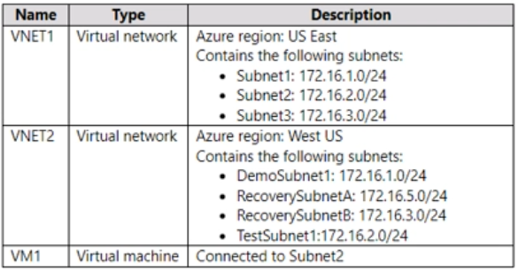
You configure Azure Site Recovery to replicate VM1 between the US East and West US regions.
You perform a test failover of VM1 and specify VNET2 as the target virtual network.
When the test version of VM1 is created, to which subnet will the virtual machine be connected?

- A. TestSubnet1
- B. DemoSubnet1
- C. RecoverySubnetA
- D. RecoverySubnetB

**Correct Answer:** B

---

### Question 476: Question #103 Topic 5

You have five Azure virtual machines that run Windows Server 2016. The virtual machines are configured as web servers.
You have an Azure load balancer named LB1 that provides load balancing services for the virtual machines.
You need to ensure that visitors are serviced by the same web server for each request.
What should you configure?

- A. Protocol to UDP
- B. Session persistence to None
- C. Floating IP (direct server return) to Disabled
- D. Session persistence to Client IP

**Correct Answer:** D

---

### Question 477: Question #104 Topic 5

HOTSPOT -
You have an Azure subscription that contains the virtual networks shown in the following table.
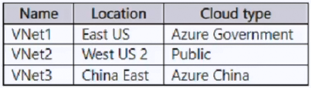
You have the peering options shown in the following exhibit.
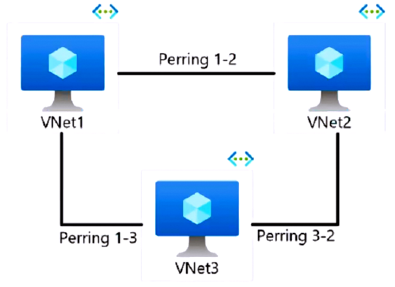
You need to design a communication strategy for the resources on the virtual networks.
For each of the following statements, select Yes if the statement is true. Otherwise, select No.
NOTE: Each correct selection is worth one point.
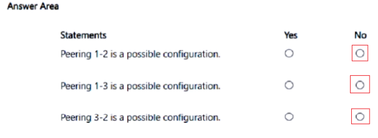

**Correct Answer:** 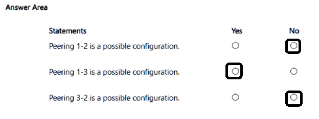

---

### Question 478: Question #105 Topic 5

You have five Azure virtual machines that run Windows Server 2016. The virtual machines are configured as web servers.
You have an Azure load balancer named LB1 that provides load balancing services for the virtual machines.
You need to ensure that visitors are serviced by the same web server for each request.
What should you configure?

- A. Floating IP (direct server return) to Disabled
- B. Session persistence to Client IP
- C. Protocol to UDP
- D. Idle Time-out (minutes) to 20

**Correct Answer:** B

---

### Question 479: Question #106 Topic 5

You have an Azure subscription that contains 20 virtual machines, a network security group (NSG) named NSG1, and two virtual networks named VNET1 and VNET2 that are peered.
You plan to deploy an Azure Bastion Basic SKU host named Bastion1 to VNET1.
You need to configure NSG1 to allow inbound access to the virtual machines via Bastion1.
Which port should you configure for the inbound security rule?

- A. 22
- B. 443
- C. 389
- D. 8080

**Correct Answer:** B

---

### Question 480: Question #107 Topic 5

HOTSPOT
-
Your network contains an on-premises Active Directory Domain Services (AD DS) domain named contoso.com. The domain contains the servers shown in the following table.

You plan to migrate contoso.com to Azure.
You create an Azure virtual network named VNET1 that has the following settings:
•Address space: 10.0.0.0/16
•Subnet:
o Name: Subnet1
o IPv4: 10.0.1.0/24
You need to move DC1 to VNET1. The solution must ensure that the member servers in contoso.com can resolve AD DS DNS names.
How should you configure DC1? To answer, select the appropriate options in the answer area.
NOTE: Each correct selection is worth one point.
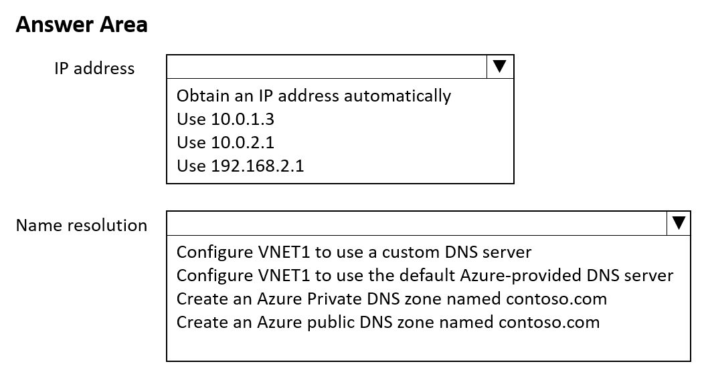

**Correct Answer:** 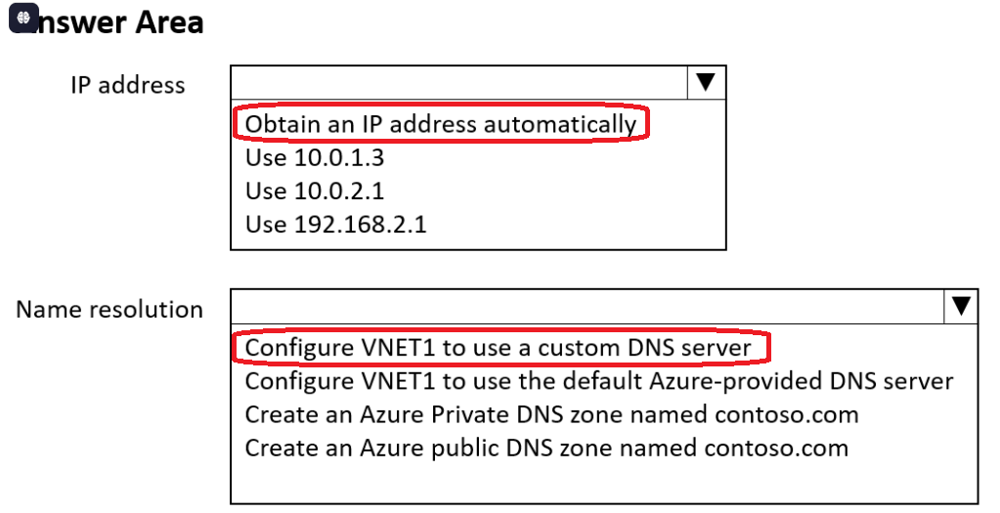

---

### Question 481: Question #108 Topic 5

You have five Azure virtual machines that run Windows Server 2016. The virtual machines are configured as web servers.
You have an Azure load balancer named LB1 that provides load balancing services for the virtual machines.
You need to ensure that visitors are serviced by the same web server for each request.
What should you configure?

- A. Session persistence to None
- B. a health probe
- C. Session persistence to Client IP
- D. Idle Time-out (minutes) to 20

**Correct Answer:** C

---

### Question 482: Question #109 Topic 5

You have an Azure subscription that contains the virtual networks shown in the following table.
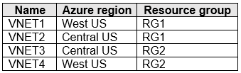
You need to deploy an Azure firewall named AF1 to RG1 in the West US Azure region.
To which virtual networks can you deploy AF1?

- A. VNET1, VNET2, VNET3, and VNET4
- B. VNET1 and VNET2 only
- C. VNET1 only
- D. VNET1, VNET2, and VNET4 only
- E. VNET1 and VNET4 only

**Correct Answer:** C

---

### Question 483: Question #110 Topic 5

You have an on-premises network.
You have an Azure subscription that contains three virtual networks named VNET1. VNET2. and VNET3. The virtual networks are peered and connected to the on-premises network. The subscription contains the virtual machines shown in the following table.
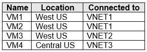
You need to monitor connectivity between the virtual machines and the on-premises network by using Connection Monitor.
What is the minimum number of connection monitors you should deploy?

- A. 1
- B. 2
- C. 3
- D. 4

**Correct Answer:** B

---

### Question 484: Question #111 Topic 5

HOTSPOT
-
You plan to deploy the following Azure Resource Manager (ARM) template.
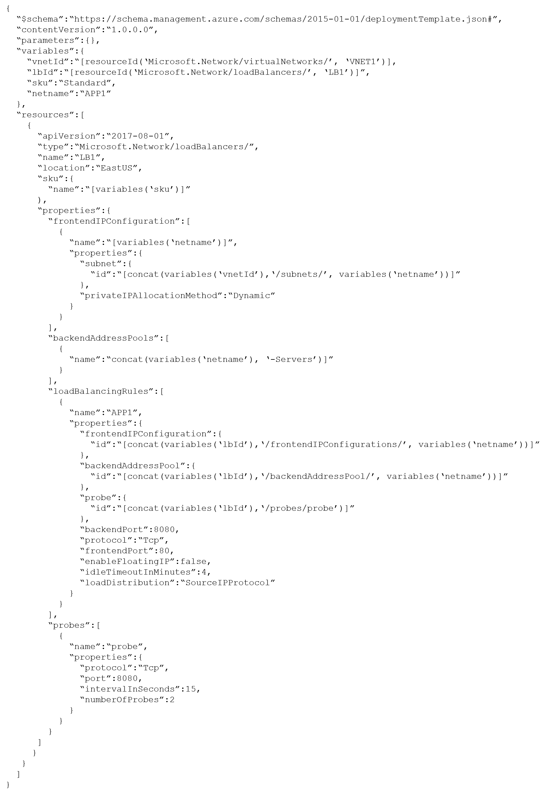
For each of the following statements, select Yes if the statement is true. Otherwise, select No.
NOTE: Each correct selection is worth one point.
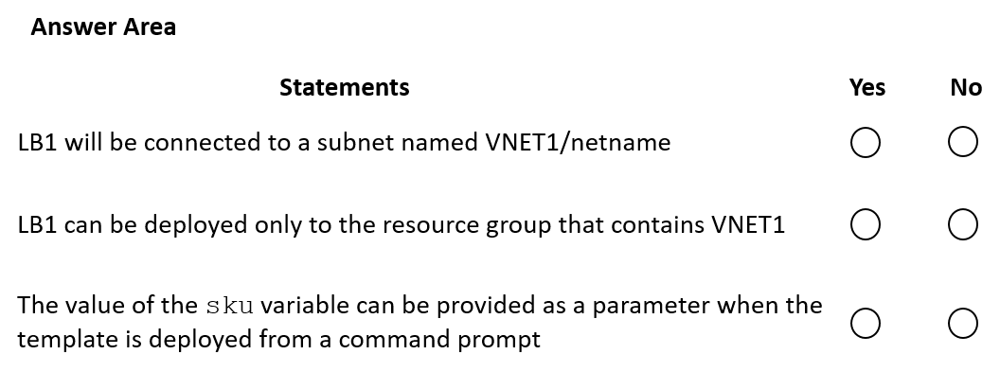

**Correct Answer:** 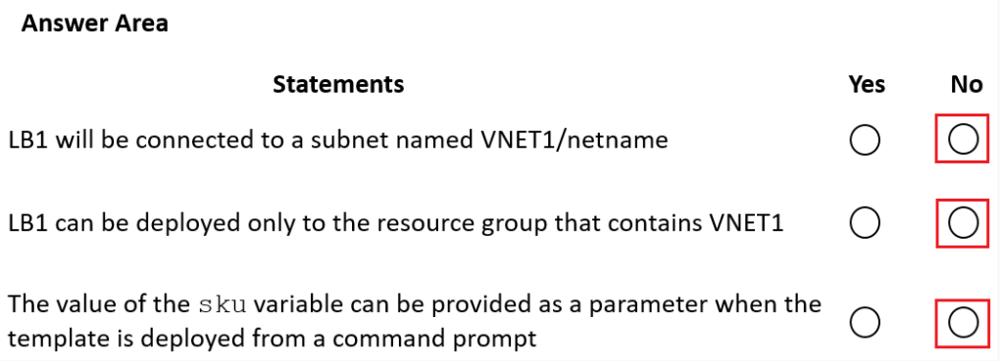

---

### Question 485: Question #112 Topic 5

You have an Azure subscription that contains a storage account. The account stores website data.
You need to ensure that inbound user traffic uses the Microsoft point-of-presence (POP) closest to the user's location.
What should you configure?

- A. private endpoints
- B. Azure Firewall rules
- C. Routing preference
- D. load balancing

**Correct Answer:** C

---

### Question 486: Question #113 Topic 5

You have two Azure virtual machines named VM1 and VM2 that run Windows Server. The virtual machines are in a subnet named Subnet1. Subnet1 is in a virtual network named VNet1.
You need to prevent VM1 from accessing VM2 on port 3389.
What should you do?

- A. Create a network security group (NSG) that has an outbound security rule to deny destination port 3389 and apply the NSG to the network interface of VM1.
- B. Configure Azure Bastion in VNet1.
- C. Create a network security group (NSG) that has an outbound security rule to deny source port 3389 and apply the NSG to Subnet1.
- D. Create a network security group (NSG) that has an inbound security rule to deny source port 3389 and apply the NSG to Subnet1.

**Correct Answer:** A

---

### Question 487: Question #114 Topic 5

You have an Azure subscription that contains the resources shown in the following table.
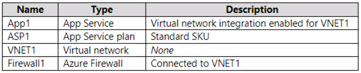
You need to manage outbound traffic from VNET1 by using Firewall1.
What should you do first?

- A. Configure the Hybrid Connection Manager.
- B. Upgrade ASP1 to the Premium SKU.
- C. Create a route table.
- D. Create an Azure Network Watcher.

**Correct Answer:** C

---

### Question 488: Question #115 Topic 5

You have an Azure subscription that contains the resources shown in the following table.
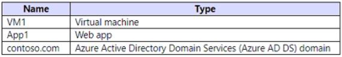
All the resources connect to a virtual network named VNet1.
You plan to deploy an Azure Bastion host named Bastion1 to VNet1.
Which resources can be protected by using Bastion1?

- A. VM1 only
- B. contoso.com only
- C. App1 and contoso.com only
- D. VM1 and contoso.com only
- E. VM1, App1, and contoso.com

**Correct Answer:** A

---

### Question 489: Question #116 Topic 5

You have five Azure virtual machines that run Windows Server 2016. The virtual machines are configured as web servers.
You have an Azure load balancer named LB1 that provides load balancing services for the virtual machines.
You need to ensure that visitors are serviced by the same web server for each request.
What should you configure?

- A. Session persistence to None
- B. a health probe
- C. Session persistence to Client IP and protocol
- D. Idle Time-out (minutes) to 20

**Correct Answer:** C

---

### Question 490: Question #117 Topic 5

You have five Azure virtual machines that run Windows Server 2016. The virtual machines are configured as web servers.
You have an Azure load balancer named LB1 that provides load balancing services for the virtual machines.
You need to ensure that visitors are serviced by the same web server for each request.
What should you configure?

- A. a health probe
- B. Floating IP (direct server return) to Enabled
- C. Session persistence to Client IP and protocol
- D. Protocol to UDP

**Correct Answer:** C

---

### Question 491: Question #118 Topic 5

You have an Azure subscription that contains 10 virtual machines and the resources shown in the following table.
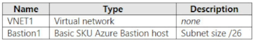
You need to ensure that Bastion1 can support 100 concurrent SSH users. The solution must minimize administrative effort.
What should you do first?

- A. Resize the subnet of Bastion1
- B. Configure host scaling.
- C. Create a network security group (NSG)
- D. Upgrade Bastion1 to the Standard SKU

**Correct Answer:** D

---

### Question 492: Question #119 Topic 5

You have five Azure virtual machines that run Windows Server 2016. The virtual machines are configured as web servers.
You have an Azure load balancer named LB1 that provides load balancing services for the virtual machines.
You need to ensure that visitors are serviced by the same web server for each request.
What should you configure?

- A. Session persistence to Client IP and protocol
- B. Protocol to UDP
- C. Session persistence to None
- D. Floating IP (direct server return) to Disabled

**Correct Answer:** A

---

### Question 493: Question #120 Topic 5

DRAG DROP
-
You have a Windows 11 device named Device and an Azure subscription that contains the resources shown in the following table.
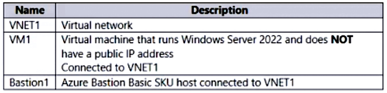
Device1 has Azure PowerShell and Azure Command-Line Interface (CLI) installed.
From Device1, you need to establish a Remote Desktop connection to VM1.
Which three actions should you perform in sequence? To answer, move the appropriate actions from the list of actions to the answer area and arrange them in the correct order.
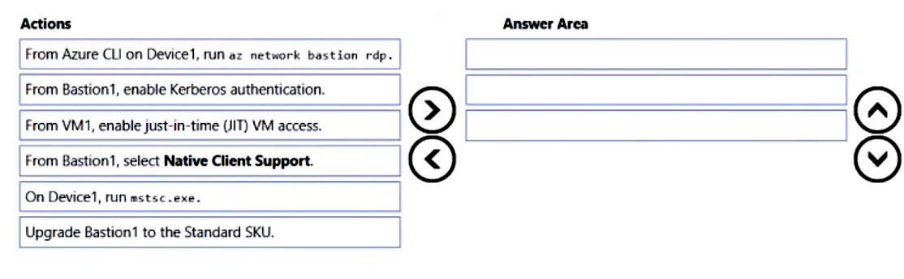

**Correct Answer:** 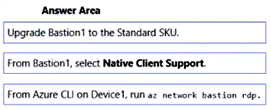

---

### Question 494: Question #121 Topic 5

You have five Azure virtual machines that run Windows Server 2016. The virtual machines are configured as web servers.
You have an Azure load balancer named LB1 that provides load balancing services for the virtual machines.
You need to ensure that visitors are serviced by the same web server for each request.
What should you configure?

- A. Floating IP (direct server return) to Enabled
- B. Session persistence to Client IP
- C. Protocol to UDP
- D. Idle Time-out (minutes) to 20

**Correct Answer:** B

---

### Question 495: Question #122 Topic 5

You have an Azure subscription that has the public IP addresses shown in the following table.
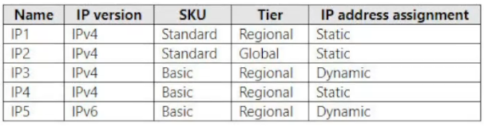
You plan to deploy an Azure Bastion Basic SKU host named Bastion1.
Which IP addresses can you use?

- A. IP1 only
- B. IP1 and IP2 only
- C. IP3, IP4, and IP5 only
- D. IP1, IP2, IP4, and IP5 only
- E. IP1, IP2, IP3, IP4, and IP5

**Correct Answer:** A

---

### Question 496: Question #123 Topic 5

You have five Azure virtual machines that run Windows Server 2016. The virtual machines are configured as web servers.
You have an Azure load balancer named LB1 that provides load balancing services for the virtual machines.
You need to ensure that visitors are serviced by the same web server for each request.
What should you configure?

- A. Floating IP (direct server return) to Disabled
- B. Floating IP (direct server return) to Enabled
- C. a health probe
- D. Session persistence to Client IP

**Correct Answer:** D

---

### Question 497: Question #124 Topic 5

You have five Azure virtual machines that run Windows Server 2016. The virtual machines are configured as web servers.
You have an Azure load balancer named LB1 that provides load balancing services for the virtual machines.
You need to ensure that visitors are serviced by the same web server for each request.
What should you configure?

- A. Floating IP (direct server return) to Enabled
- B. Idle Time-out (minutes) to 20
- C. a health probe
- D. Session persistence to Client IP

**Correct Answer:** D

---

### Question 498: Question #125 Topic 5

You have two Azure subscriptions named Sub1 and Sub2.
Sub1 contains a virtual machine named VM1 and a storage account named storage1.
VM1 is associated to the resources shown in the following table.
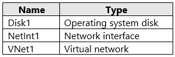
You need to move VM1 to Sub2.
Which resources should you move to Sub2?

- A. VM1, Disk1, and NetInt1 only
- B. VM1, Disk1, and VNet1 only
- C. VM1, Disk1, and storage1 only
- D. VM1, Disk1, NetInt1, and VNet1

**Correct Answer:** D

---

### Question 499: Question #126 Topic 5

You have five Azure virtual machines that run Windows Server 2016. The virtual machines are configured as web servers.
You have an Azure load balancer named LB1 that provides load balancing services for the virtual machines.
You need to ensure that visitors are serviced by the same web server for each request.
What should you configure?

- A. Session persistence to Client IP and protocol
- B. Idle Time-out (minutes) to 20
- C. Session persistence to None
- D. Floating IP (direct server return) to Enabled

**Correct Answer:** A

---

### Question 500: Question #127 Topic 5

You have five Azure virtual machines that run Windows Server 2016. The virtual machines are configured as web servers.
You have an Azure load balancer named LB1 that provides load balancing services for the virtual machines.
You need to ensure that visitors are serviced by the same web server for each request.
What should you configure?

- A. Floating IP (direct server return) to Disabled
- B. Idle Time-out (minutes) to 20
- C. a health probe
- D. Session persistence to Client IP

**Correct Answer:** D

---

### Question 501: Question #128 Topic 5

You have five Azure virtual machines that run Windows Server 2016. The virtual machines are configured as web servers.
You have an Azure load balancer named LB1 that provides load balancing services for the virtual machines.
You need to ensure that visitors are serviced by the same web server for each request.
What should you configure?

- A. Session persistence to Client IP
- B. Idle Time-out (minutes) to 20
- C. Session persistence to None
- D. Protocol to UDP

**Correct Answer:** A

---

### Question 502: Question #129 Topic 5

You have an Azure subscription.
You create a routing table named RT1.
You need to add a route to RT1 that specifies the next hop IP address.
Which next hop type should you select?

- A. Internet
- B. Virtual network gateway
- C. Virtual network
- D. Virtual appliance

**Correct Answer:** D

---

### Question 503: Question #130 Topic 5

You have two Azure subscriptions named Sub1 and Sub2 that are linked to separate Microsoft Entra tenants.
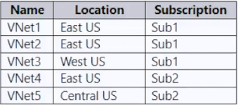
You have the virtual networks shown in the following table.
Which virtual networks can you peer with VNet1?

- A. VNet2 only
- B. VNet2 and VNet3 only
- C. VNet2 and VNet4 only
- D. VNet2, VNet3, and VNet4 only
- E. VNet2, VNet3, VNet4, and VNet5

**Correct Answer:** E

---

### Question 504: Question #131 Topic 5

You have an Azure subscription that contains a Recovery Services vault named Vault1.
You need to enable multi-user authorization (MAU) for Vault1.
Which resource should you create first?

- A. an administrative unit
- B. a managed identity
- C. a resource guard
- D. a custom Azure role

**Correct Answer:** C

---

### Question 505: Question #132 Topic 5

Note: This question is part of a series of questions that present the same scenario. Each question in the series contains a unique solution that might meet the stated goals. Some question sets might have more than one correct solution, while others might not have a correct solution.
After you answer a question in this section, you will NOT be able to return to it. As a result, these questions will not appear in the review screen.
You have an app named App1 that is installed on two Azure virtual machines named VM1 and VM2. Connections to App1 are managed by using an Azure Load Balancer.
The effective network security configurations for VM2 are shown in the following exhibit.
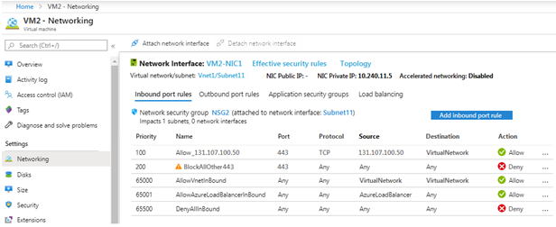
You discover that connections to App1 from 131.107.100.50 over TCP port 443 fail.
You verify that the Load Balancer rules are configured correctly.
You need to ensure that connections to App1 can be established successfully from 131.107.100.50 over TCP port 443.
Solution: You create an inbound security rule that allows any traffic from the AzureLoadBalancer source and has a priority of 150.
Does this meet the goal?

- A. Yes
- B. No

**Correct Answer:** A

---

### Question 506: Question #133 Topic 5

You have an Azure subscription that contains the resources shown in the following table.
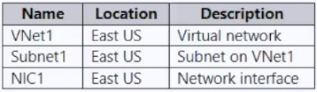
You create a route table named RT1 in the East US Azure region.
To which resources can you associate RT1?

- A. VNet1 only
- B. Subnet1 only
- C. VNet1 and NIC1 only
- D. Subnet1 and NIC1 only
- E. VNet1, Subnet1, and NIC1

**Correct Answer:** B

---

### Question 507: Question #134 Topic 5

You create an Azure VM named VM1 that runs Windows Server 2019.
VM1 is configured as shown in the exhibit. (Click the Exhibit tab.)
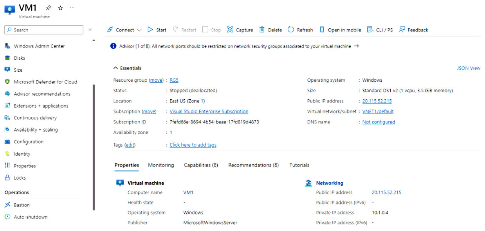
You need to enable Desired State Configuration for VM1.
What should you do first?

- A. Connect to VM1.
- B. Start VM1.
- C. Capture a snapshot of VM1.
- D. Configure a DNS name for VM1.

**Correct Answer:** B

---

### Question 508: Question #135 Topic 5

HOTSPOT
-
You have an Azure subscription that contains the virtual networks shown in the following table.
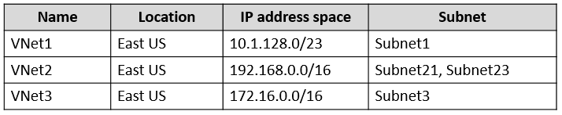
The subnets have the IP address spaces shown in the following table.
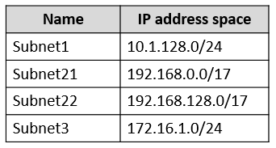
You plan to create a container app named contapp1 in the East US Azure region.
You need to create a container app environment named con-env1 that meets the following requirements:
•Uses its own virtual network.
•Uses its own subnet.
•Is connected to the smallest possible subnet.
To which virtual networks can you connect con-env1, and which subnet mask should you use? To answer, select the appropriate options in the answer area.
NOTE: Each correct selection is worth one point.
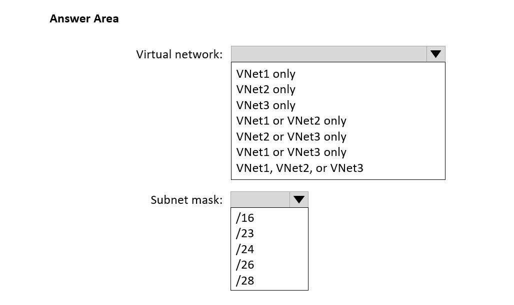

**Correct Answer:** 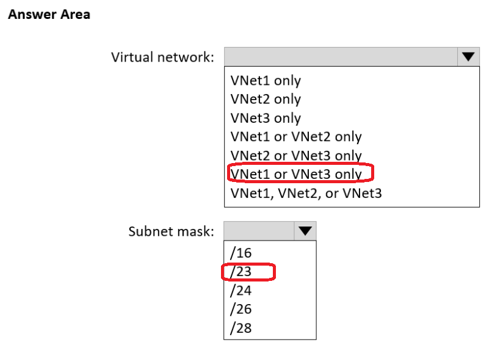

---

### Question 509: Question #136 Topic 5

You have an Azure subscription that contains the virtual networks shown in the following table.
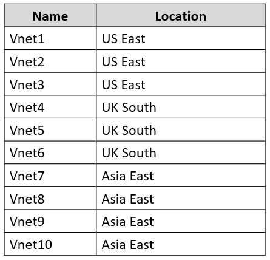
All the virtual networks are peered. Each virtual network contains nine virtual machines.
You need to configure secure RDP connections to the virtual machines by using Azure Bastion.
What is the minimum number of Bastion hosts required?

- A. 1
- B. 3
- C. 9
- D. 10

**Correct Answer:** A

---

### Question 510: Question #137 Topic 5

HOTSPOT
-
You have an Azure subscription that contains the virtual networks shown in the following table.
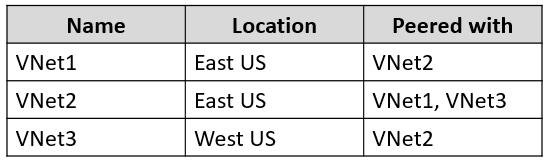
The subscription contains the virtual machines shown in the following table.
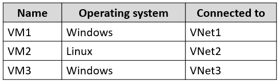
Each virtual machine contains only a private IP address.
You create an Azure bastion for VNet1 as shown in the following exhibit.
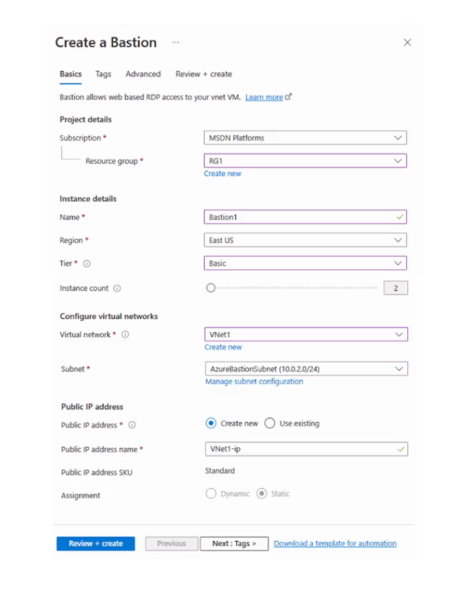
For each of the following statements, select Yes if the statement is true. Otherwise, select No.
NOTE: Each correct selection is worth one point.
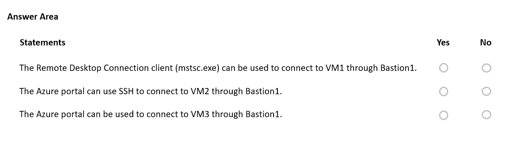

**Correct Answer:** 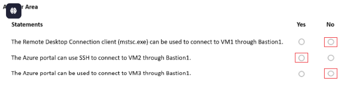

---

### Question 511: Question #138 Topic 5

HOTSPOT
-
You have an Azure subscription that contains the virtual networks shown in the following table.
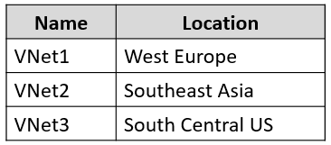
The subscription contains the subnets shown in the following table.
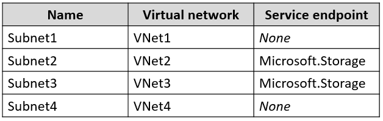
The subscription contains the storage accounts shown in the following table.
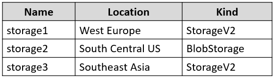
You create a service endpoint policy named Policy1 in the South Central US Azure region to allow connectivity to all the storage accounts in the subscription.
For each of the following statements, select Yes if the statement is true. Otherwise, select No.
NOTE: Each correct selection is worth one point.
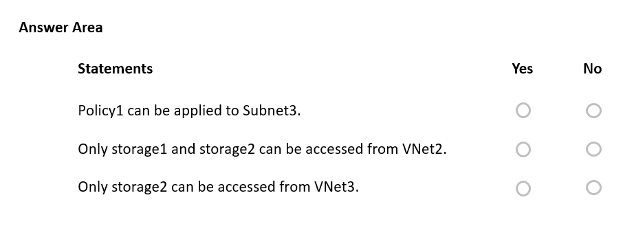

**Correct Answer:** 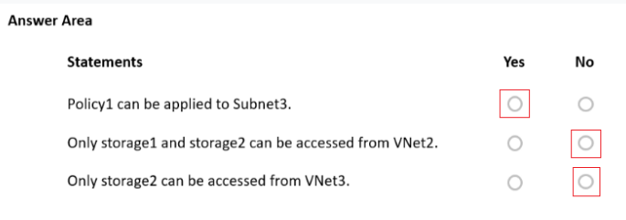

---

### Question 512: Question #139 Topic 5

You have an Azure virtual network named VNet1 that contains the following settings:
•IPv4 address space: 172.16.10.0/24
•Subnet name: Subnet1
•Subnet address range: 172.16.10.0/25
What is the maximum number of virtual machines that can connect to Subnet1?

- A. 24
- B. 25
- C. 123
- D. 128
- E. 251

**Correct Answer:** C

---

### Question 513: Question #140 Topic 5

You have an Azure subscription that contains a resource group named RG1 and a virtual network named VNet1.
You plan to create an Azure container instance named container1.
You need to be able to configure DNS name label scope reuse for container1.
What should you configure for container1?

- A. the private networking type
- B. the public networking type
- C. a new subnet on VNet1
- D. a confidential SKU

**Correct Answer:** B

---

### Question 514: Question #141 Topic 5

HOTSPOT
-
You have the Azure virtual machines shown in the following table.
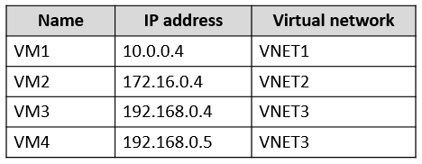
VNET1, VNET2, and VNET3 are peered.
VM4 has a DNS server that is authoritative for a zone named contoso.com and contains the records shown in the following table.
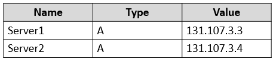
The virtual networks are configured to use the DNS servers shown in the following table.
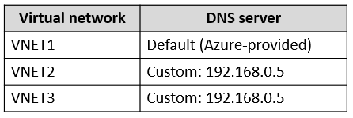
For each of the following statements, select Yes if the statement is true. Otherwise, select No.
NOTE: Each correct selection is worth one point.
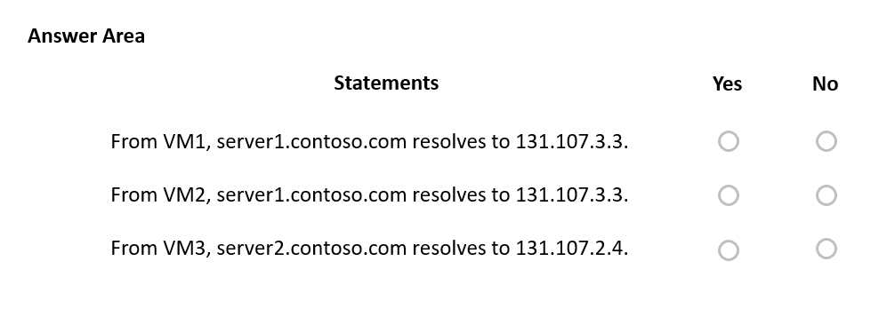

**Correct Answer:** 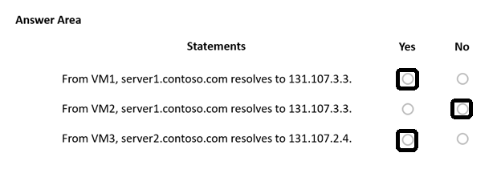

---

### Question 515: Question #142 Topic 5

DRAG DROP
-
You have an Azure subscription that contains a resource group named RG1.
You plan to create an Azure Resource Manager (ARM) template to deploy a new virtual machine named VM1. VM1 must support the capture of performance data.
You need to specify resource dependencies for the ARM template.
In which order should you deploy the resources? To answer, move all resources from the list of resources to the answer area and arrange them in the correct order.
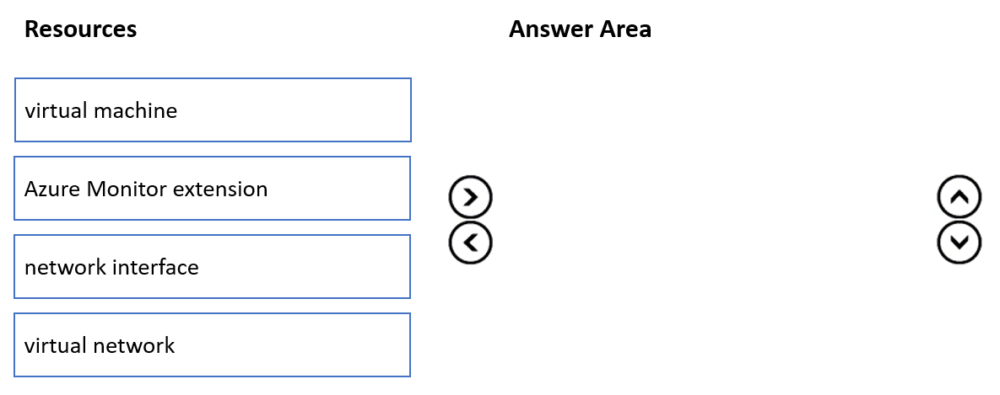

**Correct Answer:** 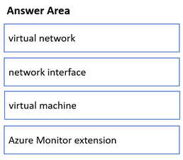

---

### Question 516: Question #143 Topic 5

You have an Azure subscription.
You are creating a new Azure container instance that will have the following settings:
•Container name: cont1
•SKU: Standard
•OS type: Windows
•Networking type: Public
•Memory (GiB): 2.5
•Number of CPU cores: 2
You discover that the Private setting for Networking type is unavailable.
You need to ensure that cont1 can be configured to use private networking.
Which setting should you change?

- A. Memory (GiB)
- B. Networking type
- C. Number of CPU cores
- D. OS type
- E. SKU

**Correct Answer:** D

---

### Question 517: Question #144 Topic 5

You have an Azure subscription that contains the virtual networks shown in the following table.
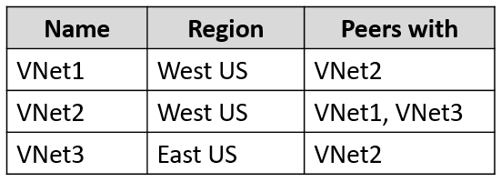
The subscription contains the virtual machines shown in the following table.
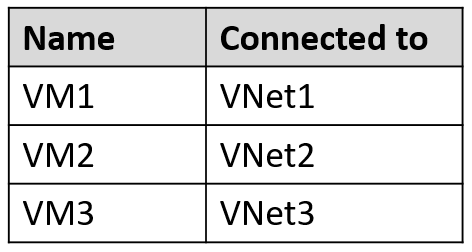
All the virtual machines have only private IP addresses.
You deploy an Azure Bastion host named Bastion1 to VNet1.
To which virtual machines can you connect through Bastion1?

- A. VM1 only
- B. VM1 and VM2 only
- C. VM1 and VM3 only
- D. VM1, VM2, and VM3

**Correct Answer:** B

---

### Question 518: Question #145 Topic 5

You have the Azure virtual networks shown in the following table.
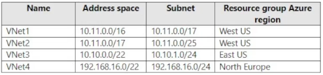
Which virtual networks can you peer with VNet1?

- A. VNet2, VNet3, and VNet4
- B. VNet2 only
- C. VNet3 and VNet4 only
- D. VNet2 and VNet3 only

**Correct Answer:** C

---

### Question 519: Question #146 Topic 5

You have an Azure subscription.
You plan to migrate 50 virtual machines from VMware vSphere to the subscription.
You create a Recovery Services vault.
What should you do next?

- A. Configure an extended network.
- B. Create a recovery plan.
- C. Deploy an Open Virtualization Application (OVA) template to vSphere.
- D. Configure a virtual network.

**Correct Answer:** D

---

### Question 520: Question #147 Topic 5

HOTSPOT
-
You have an Azure subscription that contains the virtual networks shown in the following table.
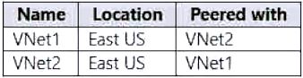
Each virtual network has 50 connected virtual machines.
You need to implement Azure Bastion. The solution must meet the fallowing requirements:
•Support host scaling.
•Support uploading and downloading files.
•Support the virtual machines on both VNet1 and VNet2.
•Minimize the number of addresses on the Azure Bastion subnet.
How should you configure Azure Bastion? To answer, select the options in the answer area.
NOTE: Each correct answer is worth one point.
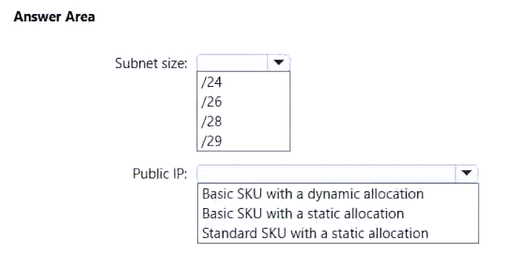

**Correct Answer:** 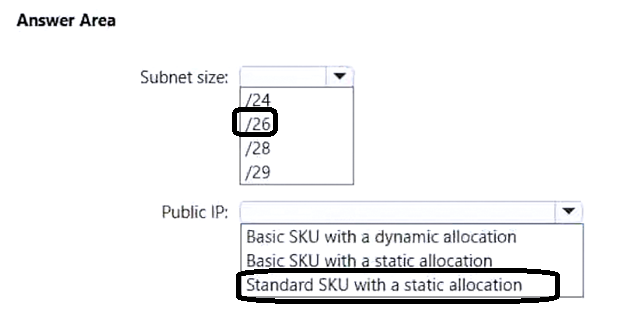

---

### Question 521: Question #148 Topic 5

You have an Azure subscription that contains the virtual networks shown in the following table.
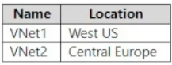
You need to ensure that all the traffic between VNet1 and VNet2 traverses the Microsoft backbone network.
What should you configure?

- A. a private endpoint
- B. peering
- C. Express Route
- D. a route table

**Correct Answer:** B

---

### Question 522: Question #149 Topic 5

You have an Azure subscription that contains two peered virtual networks named VNet1 and VNet2. VNet1 has a VPN gateway that uses static routing,
The on-premises network has a VPN connection that uses the VPN gateway of VNet1.
You need to configure access for users on the on-premises network to connect to a virtual machine on VNet2. The solution must minimize costs.
Which type of connectivity should you use?

- A. Azure Firewall with a private IP address
- B. service chaining and user-defined routes (UDRs)
- C. Azure Application Gateway
- D. ExpressRoute circuits to VNet2

**Correct Answer:** B

---

### Question 523: Question #150 Topic 5

You have an Azure subscription that contains two peered virtual networks named VNet1 and VNet2.
You have a Network Virtual Appliance (NVA) named NetVA1.
You need to ensure that the traffic from VNet1 to VNet2 is inspected by using NetVA1.
What should you use?

- A. a local network gateway
- B. a route table that has custom routes
- C. a service endpoint
- D. IP address reservations

**Correct Answer:** B

---

### Question 524: Question #1 Topic 6

You have an Azure subscription that has a Recovery Services vault named Vault1. The subscription contains the virtual machines shown in the following table:
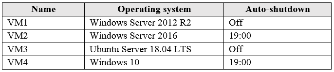
You plan to schedule backups to occur every night at 23:00.
Which virtual machines can you back up by using Azure Backup?

- A. VM1 and VM3 only
- B. VM1, VM2, VM3 and VM4
- C. VM1 and VM2 only
- D. VM1 only

**Correct Answer:** B

---

### Question 525: Question #2 Topic 6

You have an Azure subscription that contains a virtual machine named VM1.
You plan to deploy an Azure Monitor alert rule that will trigger an alert when CPU usage on VM1 exceeds 80 percent.
You need to ensure that the alert rule sends an email message to two users named User1 and User2.
What should you create for Azure Monitor?

- A. an action group
- B. a mail-enabled security group
- C. a distribution group
- D. a Microsoft 365 group

**Correct Answer:** A

---

### Question 526: Question #3 Topic 6

You have the Azure virtual machines shown in the following table:
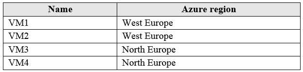
You have a Recovery Services vault that protects VM1 and VM2.
You need to protect VM3 and VM4 by using Recovery Services.
What should you do first?

- A. Create a new Recovery Services vault
- B. Create a storage account
- C. Configure the extensions for VM3 and VM4
- D. Create a new backup policy

**Correct Answer:** A

---

### Question 527: Question #4 Topic 6

HOTSPOT -
You have an Azure subscription that contains an Azure Storage account named storage1 and the users shown in the following table.
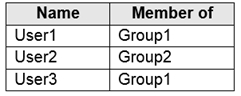
You plan to monitor storage1 and to configure email notifications for the signals shown in the following table.

You need to identify the minimum number of alert rules and action groups required for the planned monitoring.
How many alert rules and action groups should you identify? To answer, select the appropriate options in the answer area.
NOTE: Each correct selection is worth one point.
Hot Area:

**Correct Answer:** 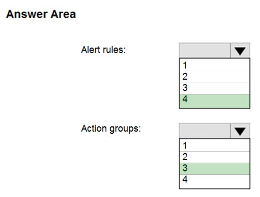

---

### Question 528: Question #5 Topic 6

You have an Azure subscription that contains the identities shown in the following table.
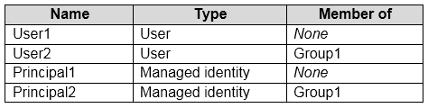
User1, Principal1, and Group1 are assigned the Monitoring Reader role.
An action group named AG1 has the Email Azure Resource Manager Role notification type and is configured to email the Monitoring Reader role.
You create an alert rule named Alert1 that uses AG1.
You need to identity who will receive an email notification when Alert1 is triggered.
Who should you identify?

- A. User1 and Principal1 only
- B. User1, User2, Principal1, and Principal2
- C. User1 only
- D. User1 and User2 only

**Correct Answer:** D

---

### Question 529: Question #6 Topic 6

HOTSPOT -
You have an Azure virtual machine named VM1 and a Recovery Services vault named Vault1.
You create a backup policy named Policy1 as shown in the exhibit. (Click the Exhibit tab.)

You configure the backup of VM1 to use Policy1 on Thursday, January 1 at 1:00 AM.
You need to identify the number of available recovery points for VM1.
How many recovery points are available on January 8 and January 15? To answer, select the appropriate options in the answer area.
NOTE: Each correct selection is worth one point.
Hot Area:
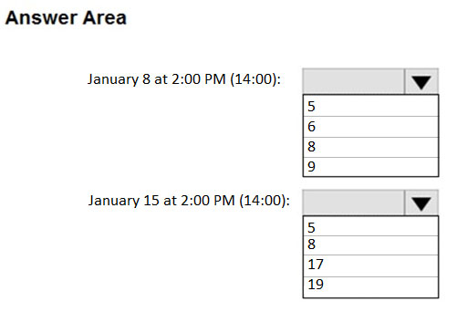

**Correct Answer:** 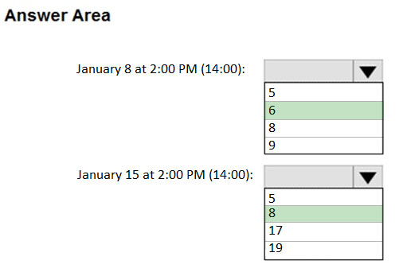

_Explanation:_
Box 1: 6 -
5 latest daily recovery points, which includes the weekly backup from the previous Sunday, plus the monthly recovery point.
Box 2: 8 -
5 latest daily recovery points, plus two weekly backups, plus the monthly recovery point.
Reference:
https://social.technet.microsoft.com/Forums/en-US/854ab6ae-79aa-4bad-ac65-471c4d422e94/daily-monthly-yearly-recovery-points-and-storage-used? forum=windowsazureonlinebackup

---

### Question 530: Question #7 Topic 6

HOTSPOT -
You have the web apps shown in the following table.
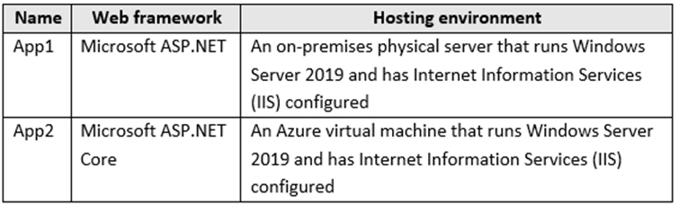
You need to monitor the performance and usage of the apps by using Azure Application Insights. The solution must minimize modifications to the application code.
What should you do on each app? To answer, select the appropriate options in the answer area.
NOTE: Each correct selection is worth one point.
Hot Area:
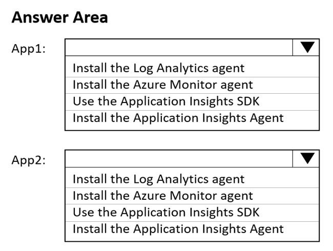

**Correct Answer:** 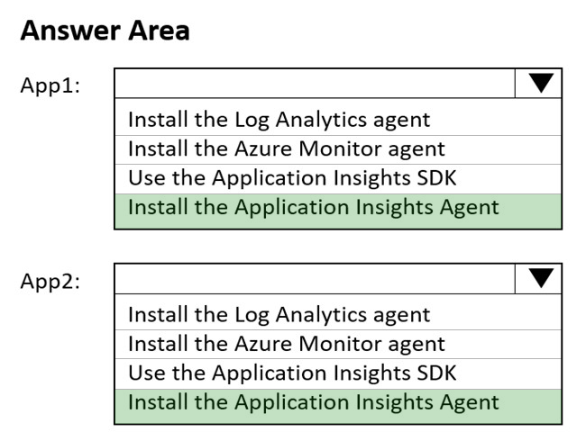

_Explanation:_
Reference:
https://docs.microsoft.com/en-us/azure/azure-monitor/app/azure-web-apps

---

### Question 531: Question #8 Topic 6

You have an Azure virtual machine named VM1.
You use Azure Backup to create a backup of VM1 named Backup1.
After creating Backup1, you perform the following changes to VM1:
✑ Modify the size of VM1.
✑ Copy a file named Budget.xls to a folder named Data.
✑ Reset the password for the built-in administrator account.
✑ Add a data disk to VM1.
An administrator uses the Replace existing option to restore VM1 from Backup1.
You need to ensure that all the changes to VM1 are restored.
Which change should you perform again?

- A. Modify the size of VM1.
- B. Reset the password for the built-in administrator account.
- C. Add a data disk.
- D. Copy Budget.xls to Data.

**Correct Answer:** D

---

### Question 532: Question #9 Topic 6

HOTSPOT -
You have an Azure Active Directory (Azure AD) tenant named contoso.onmicrosoft.com that contains the users shown in the following table.
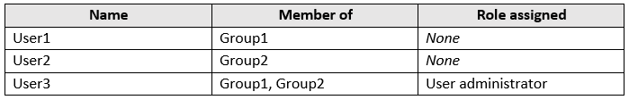
You enable password reset for contoso.onmicrosoft.com as shown in the Password Reset exhibit. (Click the Password Reset tab.)

You configure the authentication methods for password reset as shown in the Authentication Methods exhibit. (Click the Authentication Methods tab.)
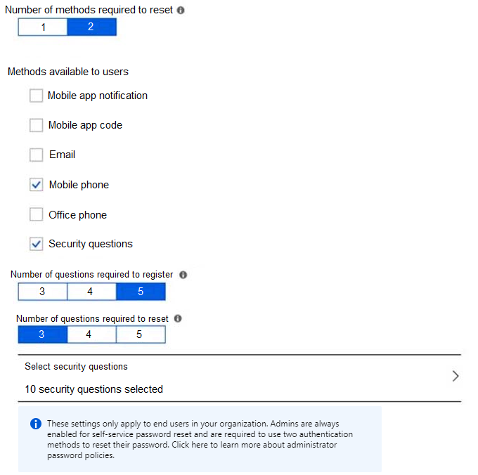
For each of the following statements, select Yes if the statement is true. Otherwise, select No.
NOTE: Each correct selection is worth one point.
Hot Area:
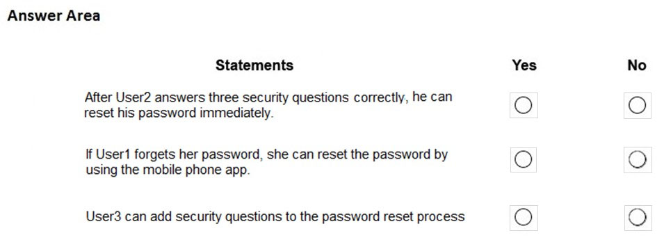

**Correct Answer:** 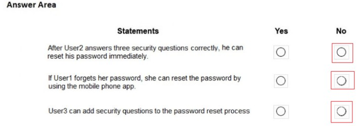

_Explanation:_
Box 1: No -
Two methods are required.
Box 2: No -
Self-service password reset is only enabled for Group2, and User1 is not a member of Group2.
Box 3: Yes -
As a User Administrator, User3 can add security questions to the reset process.
Reference:
https://docs.microsoft.com/en-us/azure/active-directory/authentication/quickstart-sspr https://docs.microsoft.com/en-us/azure/active-directory/authentication/active-directory-passwords-faq

---

### Question 533: Question #10 Topic 6

Your company has a main office in London that contains 100 client computers.
Three years ago, you migrated to Azure Active Directory (Azure AD).
The company's security policy states that all personal devices and corporate-owned devices must be registered or joined to Azure AD.
A remote user named User1 is unable to join a personal device to Azure AD from a home network.
You verify that User1 was able to join devices to Azure AD in the past.
You need to ensure that User1 can join the device to Azure AD.
What should you do?

- A. Assign the User administrator role to User1.
- B. From the Device settings blade, modify the Maximum number of devices per user setting.
- C. Create a point-to-site VPN from the home network of User1 to Azure.
- D. From the Device settings blade, modify the Users may join devices to Azure AD setting.

**Correct Answer:** B

---

### Question 534: Question #11 Topic 6

HOTSPOT -
You have two Azure App Service app named App1 and App2. Each app has a production deployment slot and a test deployment slot.
The Backup Configuration settings for the production slots are shown in the following table.

For each of the following statements, select Yes if the statement is true. Otherwise, select No.
NOTE: Each correct selection is worth one point.
Hot Area:
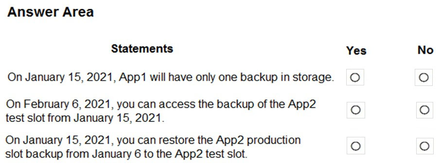

**Correct Answer:** 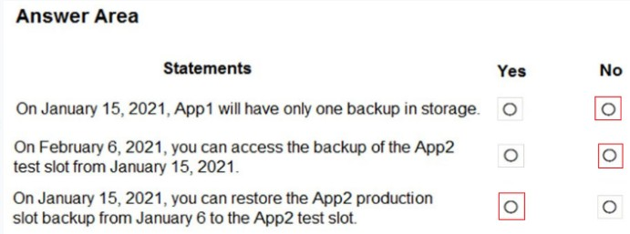

---

### Question 535: Question #12 Topic 6

HOTSPOT -
You have an Azure subscription that contains an Azure Active Directory (Azure AD) tenant named contoso.com. The tenant is synced to the on-premises Active
Directory domain. The domain contains the users shown in the following table.
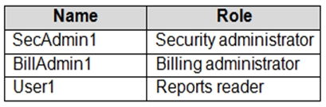
You enable self-service password reset (SSPR) for all users and configure SSPR to have the following authentication methods:
✑ Number of methods required to reset: 2
✑ Methods available to users: Mobile phone, Security questions
✑ Number of questions required to register: 3
✑ Number of questions required to reset: 3
You select the following security questions:
✑ What is your favorite food?
✑ In what city was your first job?
✑ What was the name of your first pet?
For each of the following statements, select Yes if the statement is true. Otherwise, select No.
NOTE: Each correct selection is worth one point.
Hot Area:
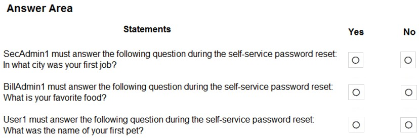

**Correct Answer:** 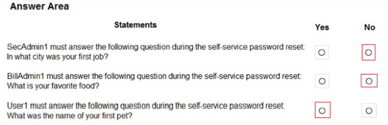

_Explanation:_
Box 1: No -
Administrator accounts are special accounts with elevated permissions. To secure them, the following restrictions apply to changing passwords of administrators:
On-premises enterprise administrators or domain administrators cannot reset their password through Self-service password reset (SSPR). They can only change their password in their on-premises environment. Thus, we recommend not syncing on-prem AD admin accounts to Azure AD. An administrator cannot use secret
Questions & Answers as a method to reset password.
Box 2: Yes -
Self-service password reset (SSPR) is an Azure Active Directory feature that enables employees to reset their passwords without needing to contact IT staff.
Box 3: Yes -
Reference:
https://docs.microsoft.com/en-us/azure/active-directory/authentication/howto-sspr-deployment

---

### Question 536: Question #13 Topic 6

Note: This question is part of a series of questions that present the same scenario. Each question in the series contains a unique solution that might meet the stated goals. Some question sets might have more than one correct solution, while others might not have a correct solution.
After you answer a question in this section, you will NOT be able to return to it. As a result, these questions will not appear in the review screen.
You have an Azure subscription that contains the following users in an Azure Active Directory tenant named contoso.onmicrosoft.com:
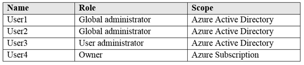
User1 creates a new Azure Active Directory tenant named external.contoso.onmicrosoft.com.
You need to create new user accounts in external.contoso.onmicrosoft.com.
Solution: You instruct User1 to create the user accounts.
Does that meet the goal?

- A. Yes
- B. No

**Correct Answer:** A

---

### Question 537: Question #14 Topic 6

You have an existing Azure subscription that contains 10 virtual machines.
You need to monitor the latency between your on-premises network and the virtual machines.
What should you use?

- A. Service Map
- B. Connection troubleshoot
- C. Network Performance Monitor
- D. Effective routes

**Correct Answer:** C

---

### Question 538: Question #15 Topic 6

HOTSPOT -
You have an Azure App Service plan named ASP1.
CPU usage for ASP1 is shown in the following exhibit.
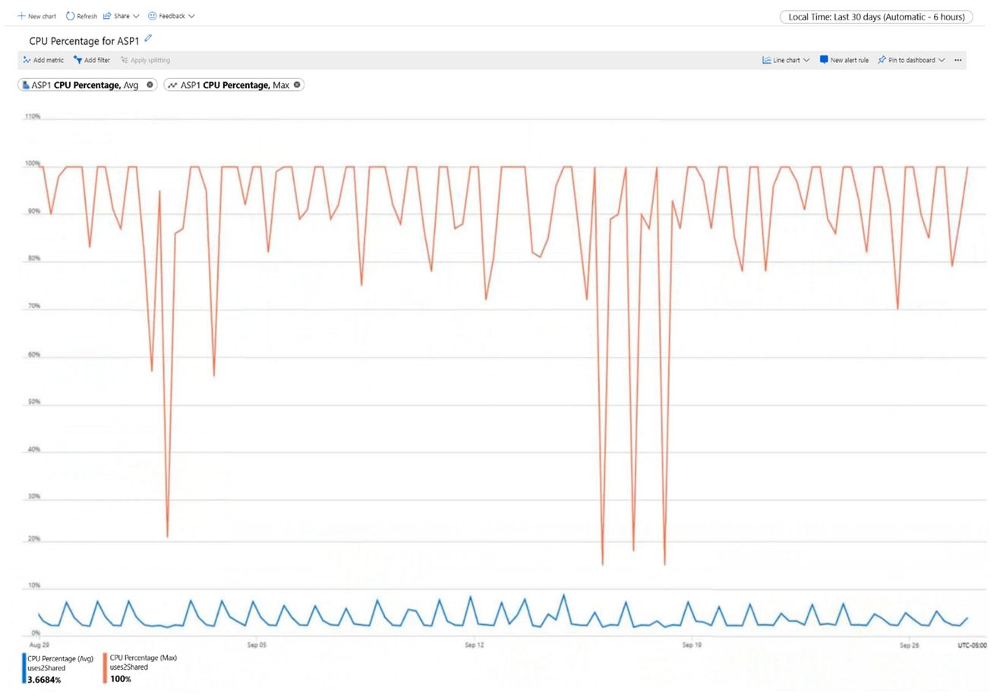
Use the drop-down menus to select the answer choice that completes each statement based on the information presented in the graphic.
NOTE: Each correct selection is worth one point.
Hot Area:

**Correct Answer:** 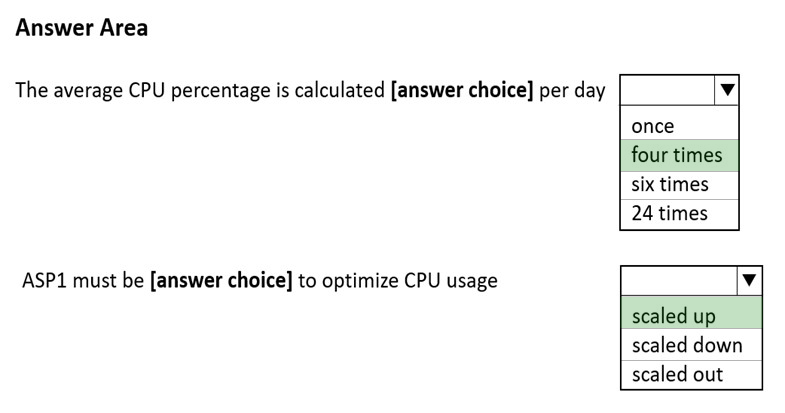

_Explanation:_
Box 1: four times -
From the exhibit we see that the time granularity is 6 hours: Last 30 days (Automatic - 6 hours).
CPU Percentage Last days Automatic - hours
Box 2: scaled up -
Scale up when:
* You see that your workloads are hitting some performance limit such as CPU or I/O limits.
* You need to quickly react to fix performance issues that can't be solved with classic database optimization.
* You need a solution that allows you to change service tiers to adapt to changing latency requirements.
Reference:
https://docs.microsoft.com/en-us/azure/azure-monitor/essentials/metrics-troubleshoot https://azure.microsoft.com/en-us/overview/scaling-out-vs-scaling-up

---

### Question 539: Question #16 Topic 6

DRAG DROP -
You have an Azure Linux virtual machine that is protected by Azure Backup.
One week ago, two files were deleted from the virtual machine.
You need to restore the deleted files to an on-premises Windows Server 2016 computer as quickly as possible.
Which four actions should you perform in sequence? To answer, move the appropriate actions from the list of actions to the answer area and arrange them in the correct order.
Select and Place:
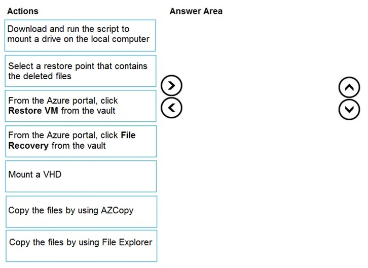

**Correct Answer:** 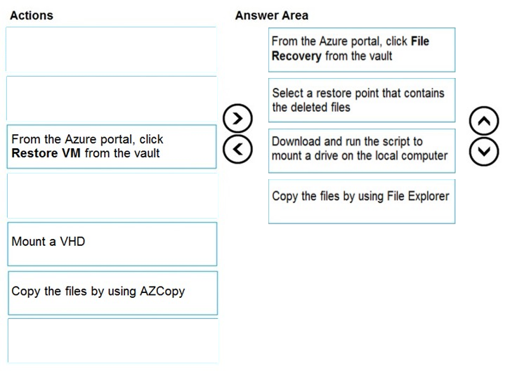

_Explanation:_
Step 1: From the Azure portal, click File Recovery from the vault
Step 2. Select a restore point that contains the deleted files
Step 3: Download and run the script to mount a drive on the local computer
Generate and download script to browse and recover files:
Step 4: Copy the files using File Explorer!
After the disks are attached, use Windows File Explorer to browse the new volumes and files. The restore files functionality provides access to all files in a recovery point. Manage the files via File Explorer as you would for normal files.
Step 1-3 below:
To restore files or folders from the recovery point, go to the virtual machine and perform the following steps:
1. Sign in to the Azure portal and in the left pane, select Virtual machines. From the list of virtual machines, select the virtual machine to open that virtual machine's dashboard.
2. In the virtual machine's menu, select Backup to open the Backup dashboard.
3. In the Backup dashboard menu, select File Recovery.
The File Recovery menu opens.
4. From the Select recovery point drop-down menu, select the recovery point that holds the files you want. By default, the latest recovery point is already selected.
5. Select Download Executable (for Windows Azure VMs) or Download Script (for Linux Azure VMs, a python script is generated) to download the software used to copy files from the recovery point.
Running the script and identifying volumes:
For Linux machines, a python script is generated. Download the script and copy it to the relevant/compatible Linux server.
Reference:
https://docs.microsoft.com/en-us/azure/backup/backup-azure-restore-files-from-vm https://docs.microsoft.com/en-us/azure/backup/backup-azure-vms-automation#restore-files-from-an-azure-vm-backup

---

### Question 540: Question #17 Topic 6

HOTSPOT -
You purchase a new Azure subscription named Subscription1.
You create a virtual machine named VM1 in Subscription1. VM1 is not protected by Azure Backup.
You need to protect VM1 by using Azure Backup. Backups must be created at 01:00 and stored for 30 days.
What should you do? To answer, select the appropriate options in the answer area.
NOTE: Each correct selection is worth one point.
Hot Area:
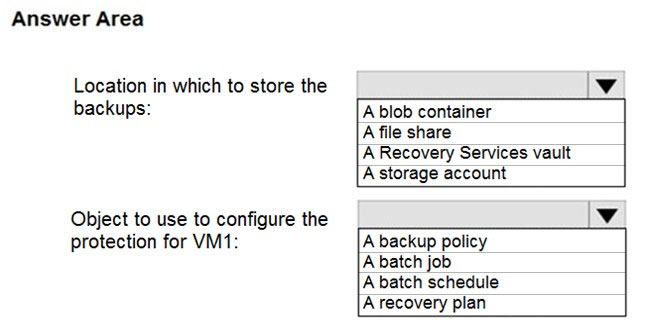

**Correct Answer:** 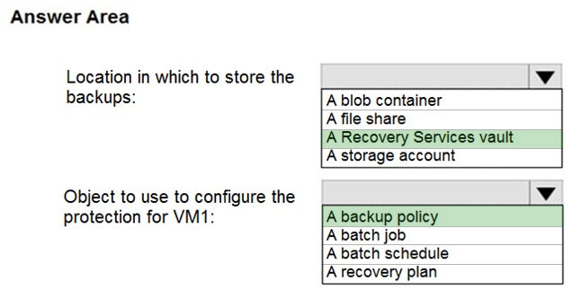

_Explanation:_
Box 1: A Recovery Services vault
You can set up a Recovery Services vault and configure backup for multiple Azure VMs.
Box 2: A backup policy -
In Choose backup policy, do one of the following:
✑ Leave the default policy. This backs up the VM once a day at the time specified, and retains backups in the vault for 30 days.
✑ Select an existing backup policy if you have one.
✑ Create a new policy, and define the policy settings.
Reference:
https://docs.microsoft.com/en-us/azure/backup/backup-azure-vms-first-look-arm

---

### Question 541: Question #18 Topic 6

You have an Azure virtual machine named VM1.
Azure collects events from VM1.
You are creating an alert rule in Azure Monitor to notify an administrator when an error is logged in the System event log of VM1.
Which target resource should you monitor in the alert rule?

- A. virtual machine extension
- B. virtual machine
- C. metric alert
- D. Azure Log Analytics workspace

**Correct Answer:** D

---

### Question 542: Question #19 Topic 6

You have an Azure subscription that contains 100 virtual machines.
You regularly create and delete virtual machines.
You need to identify unattached disks that can be deleted.
What should you do?

- A. From Azure Cost Management, view Cost Analysis
- B. From Azure Advisor, modify the Advisor configuration
- C. From Microsoft Azure Storage Explorer, view the Account Management properties
- D. From Azure Cost Management, view Advisor Recommendations

**Correct Answer:** D

---

### Question 543: Question #20 Topic 6

You have an Azure web app named webapp1.
Users report that they often experience HTTP 500 errors when they connect to webapp1.
You need to provide the developers of webapp1 with real-time access to the connection errors. The solution must provide all the connection error details.
What should you do first?

- A. From webapp1, enable Web server logging
- B. From Azure Monitor, create a workbook
- C. From Azure Monitor, create a Service Health alert
- D. From webapp1, turn on Application Logging

**Correct Answer:** A

---

### Question 544: Question #21 Topic 6

You have an Azure web app named App1.
You need to monitor the availability of App1 by using a multi-step web test.
What should you use in Azure Monitor?

- A. Azure Service Health
- B. Azure Application Insights
- C. the Diagnostic settings
- D. metrics

**Correct Answer:** B

---

### Question 545: Question #22 Topic 6

HOTSPOT -
You have an Azure subscription that has diagnostic logging enabled and is configured to send logs to a Log Analytics workspace.
You are investigating a service outage.
You need to view the event time, the event name, and the affected resources.
How should you complete the query? To answer, select the appropriate options in the answer area.
NOTE: Each correct selection is worth one point.
Hot Area:
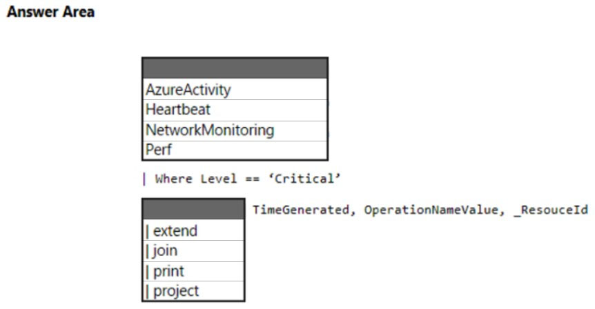

**Correct Answer:** 

_Explanation:_
Box 1: AzureActivity -
The AzureActivity table has entries from the Azure activity log, which provides insight into subscription-level or management group-level events occuring in Azure.
Let's see only Critical entries during a specific week.
The where operator is common in the Kusto Query Language. where filters a table to rows that match specific criteria. The following example uses multiple commands. First, the query retrieves all records for the table. Then, it filters the data for only records that are in the time range. Finally, it filters those results for only records that have a Critical level.
AzureActivity -
| where TimeGenerated > datetime(10-01-2020) and TimeGenerated < datetime(10-07-2020)
| where Level == 'Critical'
Incorrect:
not Perf: The Perf table has performance data that's collected from virtual machines that run the Log Analytics agent.
Box 2: | project -
Select a subset of columns: project.
Use project to include only the columns you want. Building on the preceding example, let's limit the output to certain columns:
AzureActivity -
| where TimeGenerated > datetime(10-01-2020) and TimeGenerated < datetime(10-07-2020)
| where Level == 'Critical'
| project TimeGenerated, Level, OperationNameValue, ResourceGroup, _ResourceId
Reference:
https://github.com/MicrosoftDocs/dataexplorer-docs/blob/main/data-explorer/kusto/query/tutorial.md

---

### Question 546: Question #23 Topic 6

You have a Recovery Services vault named RSV1. RSV1 has a backup policy that retains instant snapshots for five days and daily backup for 14 days.
RSV1 performs daily backups of VM1. VM1 hosts a static website that was updated eight days ago.
You need to recover VM1 to a point eight days ago. The solution must minimize downtime.
What should you do first?

- A. Deallocate VM1.
- B. Restore VM1 by using the Replace existing restore configuration option.
- C. Delete VM1.
- D. Restore VM1 by using the Create new restore configuration option.

**Correct Answer:** D

---

### Question 547: Question #24 Topic 6

HOTSPOT -
You have an Azure subscription that contains the resources shown in the following table.
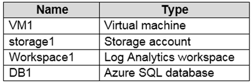
You plan to create a data collection rule named DCR1 in Azure Monitor.
Which resources can you set as data sources in DCR1, and which resources can you set as destinations in DCR1? To answer, select the appropriate options in the answer area.
NOTE: Each correct selection is worth one point.
Hot Area:
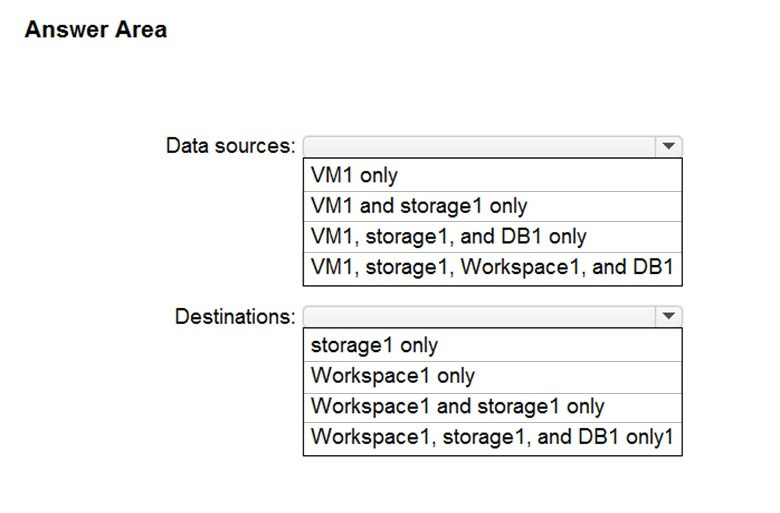

**Correct Answer:** 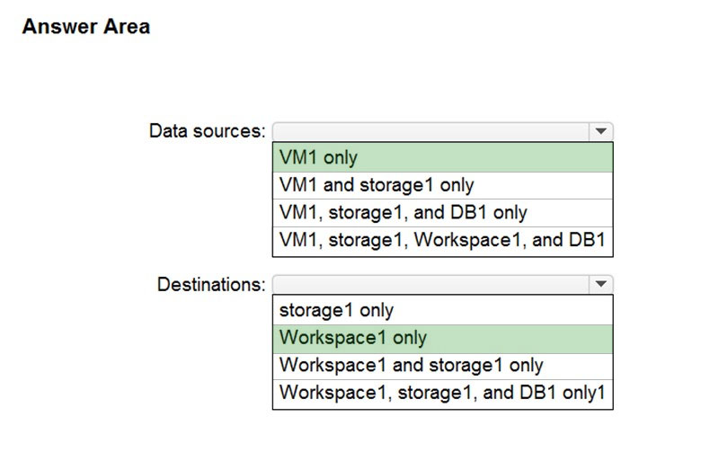

_Explanation:_
Box 1: VM1 only -
A virtual machine may have an association to multiple DCRs, and a DCR may have multiple virtual machines associated to it.
In the Resources tab, add the resources (virtual machines, virtual machine scale sets, Arc for servers) that should have the Data Collection Rule applied.
Box 2: Workspace1 only -
On the Destination tab, add one or more destinations for the data source. You can select multiple destinations of same of different types, for instance multiple Log
Analytics workspaces (i.e. "multi-homing").
Note: The Data Collection Rules (or DCR) improve on a few key areas of data collection from VMs including like better control and scoping of data collection (e.g. collect from a subset of VMs for a single workspace), collect once and send to both Log Analytics and Azure Monitor Metrics, send to multiple workspaces (multi- homing for Linux), improved Windows event filtering, and improved extension management.
Reference:
https://docs.microsoft.com/en-us/azure/azure-monitor/agents/data-collection-rule-azure-monitor-agent

---

### Question 548: Question #25 Topic 6

HOTSPOT -
You have the role assignment file shown in the following exhibit.
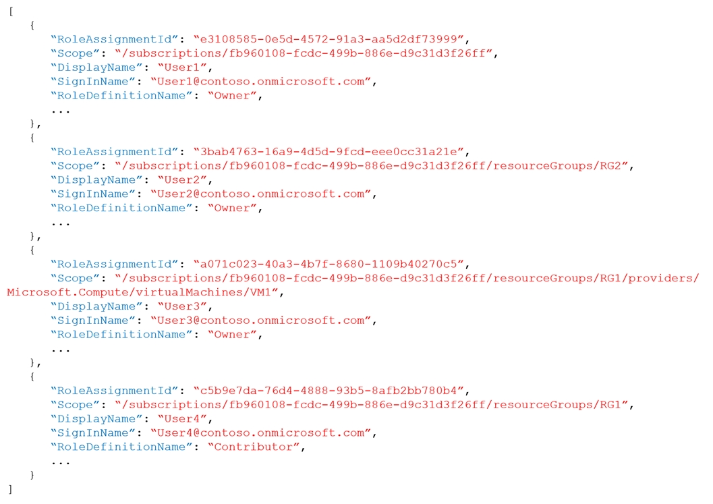
Use the drop-down menus to select the answer choice that completes each statement based on the information presented in the graphic.
NOTE: Each correct selection is worth one point.
Hot Area:
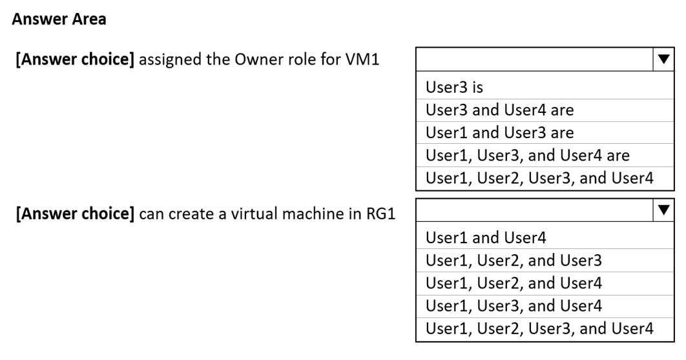

**Correct Answer:** 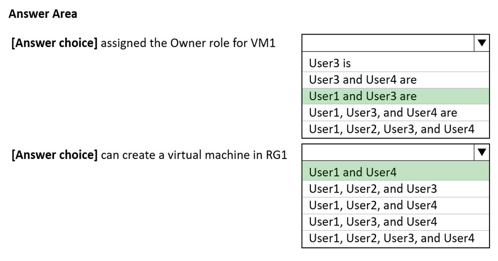

---

### Question 549: Question #26 Topic 6

HOTSPOT -
You have the following custom role-based access control (RBAC) role.

For each of the following statements, select Yes if the statement is true. Otherwise, select No.
NOTE: Each correct selection is worth one point.
Hot Area:
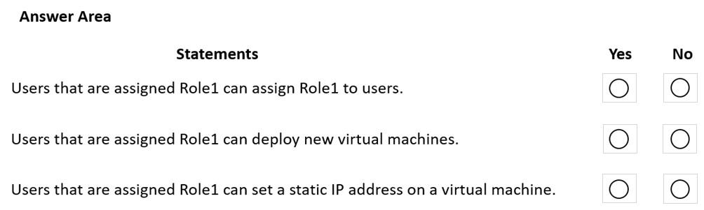

**Correct Answer:** 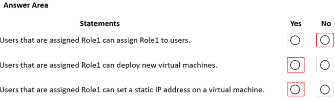

---

### Question 550: Question #27 Topic 6

HOTSPOT -
You have an Azure subscription that contains the resources shown in the following table.
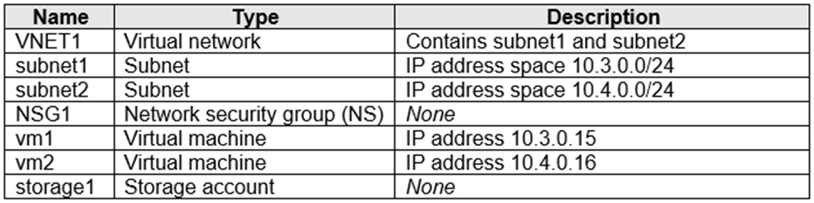
NSG1 is configured as shown in the following exhibit.
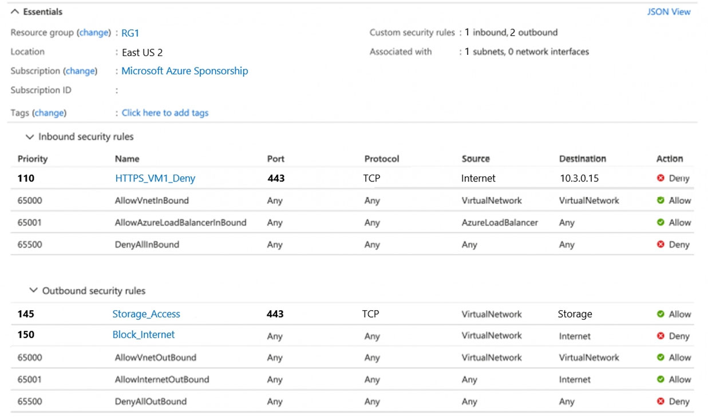
For each of the following statements, select Yes if the statement is true. Otherwise, select No.
NOTE: Each correct selection is worth one point.
Hot Area:
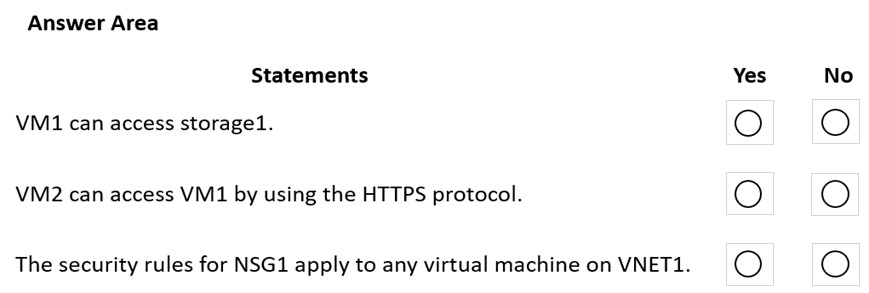

**Correct Answer:** 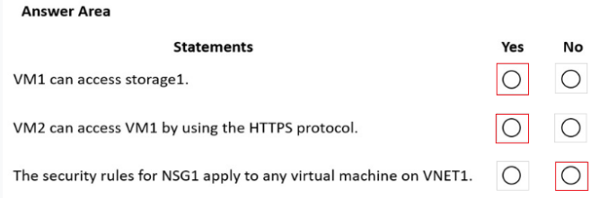

---

### Question 551: Question #28 Topic 6

You have an Azure subscription named Subscription1 that contains two Azure virtual networks named VNet1 and VNet2. VNet1 contains a VPN gateway named
VPNGW1 that uses static routing. There is a site-to-site VPN connection between your on-premises network and VNet1.
On a computer named Client1 that runs Windows 10, you configure a point-to-site VPN connection to VNet1.
You configure virtual network peering between VNet1 and VNet2. You verify that you can connect to VNet2 from the on-premises network. Client1 is unable to connect to VNet2.
You need to ensure that you can connect Client1 to VNet2.
What should you do?

- A. Select Use the remote virtual network's gateway or Route Server on VNet1 to VNet2 peering.
- B. Select Use the remote virtual network s gateway or Route Server on VNet2 to VNet1 peering.
- C. Download and re-install the VPN client configuration package on Client1.
- D. Enable BGP on VPNGW1.

**Correct Answer:** C

---

### Question 552: Question #29 Topic 6

HOTSPOT -
You have two Azure subscriptions named Sub1 and Sub2. Sub1 is in a management group named MG1. Sub2 is in a management group named MG2.
You have the resource groups shown in the following table.
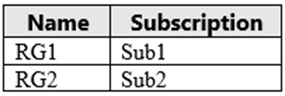
You have the virtual machines shown in the following table.
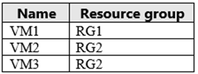
You assign roles to users as shown in the following table.
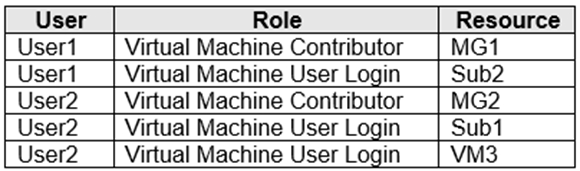
For each of the following statements, select Yes if the statement is true. Otherwise, select No.
NOTE: Each correct selection is worth one point.
Hot Area:
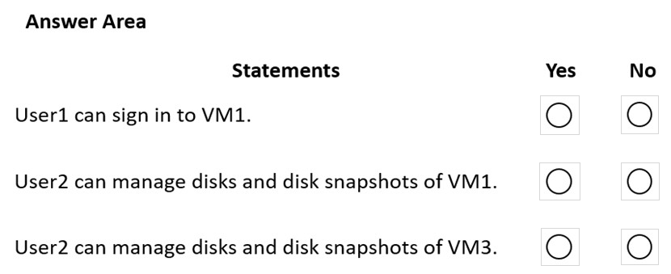

**Correct Answer:** 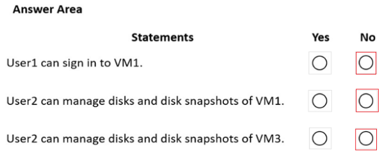

---

### Question 553: Question #30 Topic 6

You have an Azure Active Directory (Azure AD) tenant that is linked to 10 Azure subscriptions.
You need to centrally monitor user activity across all the subscriptions.
What should you use?

- A. Azure Application Insights Profiler
- B. access reviews
- C. Activity log filters
- D. a Log Analytics workspace

**Correct Answer:** D

---

### Question 554: Question #31 Topic 6

DRAG DROP -
You have an Azure subscription that contains a virtual machine name VM1.
VM1 has an operating system disk named Disk1 and a data disk named Disk2.
You need to back up Disk2 by using Azure Backup.
Which three actions should you perform in sequence? To answer, move the appropriate actions from the list of actions to the answer area and arrange them in the correct order.
Select and Place:
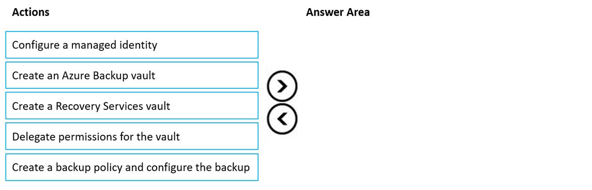

**Correct Answer:** 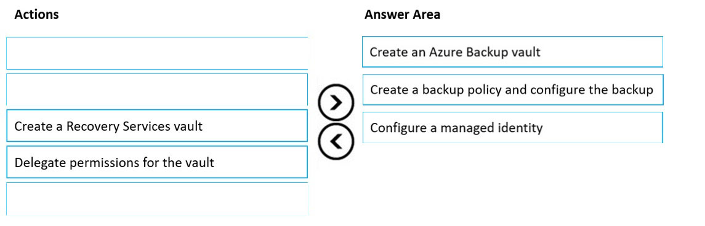

---

### Question 555: Question #32 Topic 6

You have a subnet named Subnet1 that contains Azure virtual machines. A network security group (NSG) named NSG1 is associated to Subnet1. NSG1 only contains the default rules.
You need to create a rule in NSG1 to prevent the hosts on Subnet1 form connecting to the Azure portal. The hosts must be able to connect to other internet hosts.
To what should you set Destination in the rule?

- A. Application security group
- B. IP Addresses
- C. Service Tag
- D. Any

**Correct Answer:** C

---

### Question 556: Question #33 Topic 6

You have an Azure subscription named Subscription1 that contains an Azure Log Analytics workspace named Workspace1.
You need to view the error events from a table named Event.
Which query should you run in Workspace1?

- A. search in (Event) "error"
- B. Event | where EventType is "error"
- C. select * from Event where EventType == "error"
- D. Get-Event Event | where {$_.EventType == "error"}

**Correct Answer:** A

---

### Question 557: Question #34 Topic 6

You have an Azure App Service web app named App1.
You need to collect performance traces for App1.
What should you use?

- A. Azure Application Insights Profiler
- B. the Activity log
- C. the Deployment center
- D. the Diagnose and solve problems settings

**Correct Answer:** A

---

### Question 558: Question #35 Topic 6

You have an Azure subscription that contains the storage accounts shown in the following table.
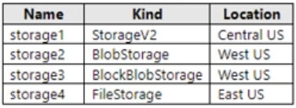
You deploy a web app named App1 to the West US Azure region.
You need to back up App1. The solution must minimize costs.
Which storage account should you use as the target for the backup?

- A. storage1
- B. storage2
- C. storage3
- D. storage4

**Correct Answer:** B

---

### Question 559: Question #36 Topic 6

HOTSPOT
-
You have an Azure subscription that is linked to an Azure AD tenant. The tenant contains two users named User1 and User2.
The subscription contains the resources shown in the following table.
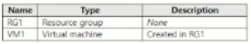
The subscription contains the alert rules shown in the following table.

The users perform the following action:
•User1 creates a new virtual disk and attaches the disk to VM1
•User2 creates a new resource tag and assigns the tag to RG1 and VM1
Which alert rules are triggered by each user? To answer, select the appropriate options in the answer area.
NOTE: Each correct selection is worth one point.

**Correct Answer:** 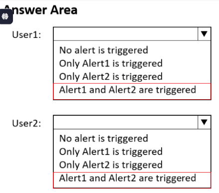

---

### Question 560: Question #37 Topic 6

You have an Azure subscription that contains multiple virtual machines in the West US Azure region.
You need to use Traffic Analytics in Azure Network Watcher to monitor virtual machine traffic.
Which two resources should you create? Each correct answer presents part of the solution.
NOTE: Each correct selection is worth one point.

- A. a Log Analytics workspace
- B. an Azure Monitor workbook
- C. a storage account
- D. a Microsoft Sentinel workspace
- E. a Data Collection Rule (DCR) in Azure Monitor

**Correct Answer:** AC

---

### Question 561: Question #38 Topic 6

You have an Azure subscription that contains eight virtual machines and the resources shown in the following table.
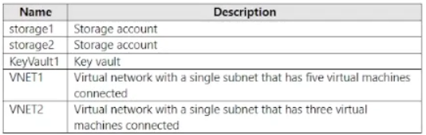
You need to configure access for VNET1. The solution must meet the following requirements:
• The virtual machines connected to VNET1 must be able to communicate with the virtual machines connected to VNET2 by using the Microsoft backbone.
• The virtual machines connected to VNET1 must be able to access storage1, storage2, and Azure AD by using the Microsoft backbone.
What is the minimum number of service endpoints you should add to VNET1?

- A. 1
- B. 2
- C. 3
- D. 5

**Correct Answer:** B

---

### Question 562: Question #39 Topic 6

You need to configure an Azure web app named contoso.azurewebsites.net to host www.contoso.com.
What should you do first?

- A. Create A records named www.contoso.com and asuid.contoso.com.
- B. Create a TXT record named asuid that contains the domain verification ID.
- C. Create a CNAME record named asuid that contains the domain verification ID.
- D. Create a TXT record named www.contoso.com that has a value of contoso.azurewebsites.net.

**Correct Answer:** B

---

### Question 563: Question #40 Topic 6

You have an Azure subscription that contains 10 network security groups (NSGs), 10 virtual machines, and a Log Analytics workspace named Workspace1. Each NSG is connected to a virtual machine.
You need to configure an Azure Monitor Network Insights alert that will be triggered when suspicious network traffic is detected.
What should you do first?

- A. Deploy Connection Monitor.
- B. Configure data collection endpoints.
- C. Configure a private link.
- D. Configure NSG flow logs.

**Correct Answer:** D

---

### Question 564: Question #41 Topic 6

HOTSPOT
-
You have an Azure subscription named Sub1 that contains the resources shown in the following table.

Sub1 contains the following alert rule:
•Name: Alert1
•Scope: All resource groups in Sub1
o Include all future resources
•Condition: All administrative operations
•Actions: Action1
Sub1 contains the following alert processing rule:
•Name: Rule1
•Scope: Sub1
•Rule type: Suppress notifications
•Apply the rule: On a specific time
o Start: August 10, 2022
o End: August 13, 2022
For each of the following statements, select Yes if the statement is true. Otherwise, select No.
NOTE: Each correct selection is worth one point.
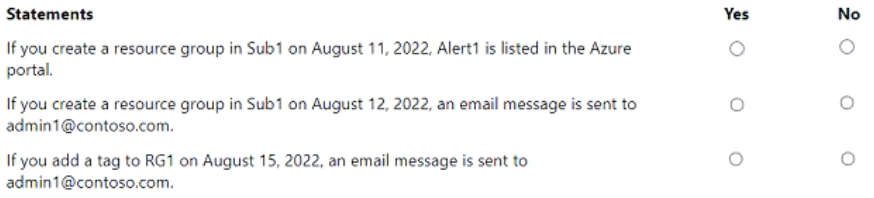

**Correct Answer:** 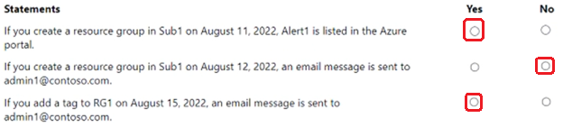

---

### Question 565: Question #42 Topic 6

You have an Azure subscription that contains a storage account named storage1 in the North Europe Azure region.
You need to ensure that when blob data is added to storage1, a secondary copy is created in the East US region. The solution must minimize administrative effort.
What should you configure?

- A. operational backup
- B. object replication
- C. geo-redundant storage (GRS)
- D. a lifecycle management rule

**Correct Answer:** B

---

### Question 566: Question #43 Topic 6

You have an Azure subscription that contains two Log Analytics workspaces named Workspace1 and Workspace2 and 100 virtual machines that run Windows Server.
You need to collect performance data and events from the virtual machines. The solution must meet the following requirements:
•Logs must be sent to Workspace1 and Workspace 2.
•All Windows events must be captured.
•All security events must be captured.
What should you install and configure on each virtual machine?

- A. the Azure Monitor agent
- B. the Windows Azure diagnostics extension (WAD)
- C. the Windows VM agent

**Correct Answer:** A

---

### Question 567: Question #44 Topic 6

You have an Azure subscription that contains a virtual machine named VM1 and an Azure function named App1.
You need to create an alert rule that will run App1 if VM1 stops.
What should you create for the alert rule?

- A. an application security group
- B. a security group that has dynamic device membership
- C. an action group
- D. an application group

**Correct Answer:** C

---

### Question 568: Question #45 Topic 6

You have an Azure subscription that contains a virtual network named VNet1.
VNet1 uses two ExpressRoute circuits that connect to two separate on-premises datacenters.
You need to create a dashboard to display detailed metrics and a visual representation of the network topology.
What should you use?

- A. Azure Monitor Network Insights
- B. a Data Collection Rule (DCR)
- C. Azure Virtual Network Watcher
- D. Log Analytics

**Correct Answer:** A

---

### Question 569: Question #46 Topic 6

You deploy Azure virtual machines to three Azure regions
Each region contains a virtual network. Each virtual network contains multiple subnets peered in a full mesh topology.
Each subnet contains a network security group (NSG) that has defined rules.
A user reports that he cannot use port 33000 to connect from a virtual machine in one region to a virtual machine in another region.
Which two options can you use to diagnose the issue? Each correct answer presents a complete solution.
NOTE: Each correct selection is worth one point.

- A. Azure Virtual Network Manager
- B. IP flow verify
- C. Azure Monitor Network Insights
- D. Connection troubleshoot
- E. elective security rules

**Correct Answer:** BD

---

### Question 570: Question #47 Topic 6

You have an Azure subscription.
You need to receive an email alert when a resource lock is removed from any resource in the subscription.
What should you use to create an activity log alert in Azure Monitor?

- A. a resource, a condition, and an action group
- B. a resource, a condition, and a Microsoft 365 group
- C. a Log Analytics workspace, a resource, and an action group
- D. a data collection endpoint, an application security group, and a resource group

**Correct Answer:** A

---

### Question 571: Question #48 Topic 6

HOTSPOT
-
You have an Azure subscription that contains the alerts shown in the following exhibit.
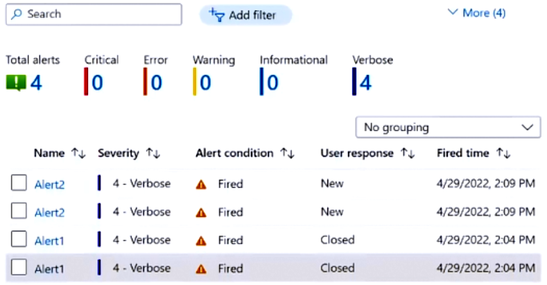
Use the drop-down menus to select the answer choice that completes each statement based on the information presented in the graphic.
NOTE: Each correct selection is worth one point.
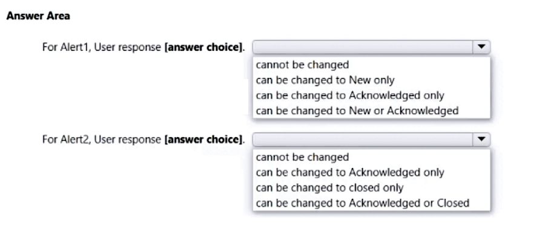

**Correct Answer:** 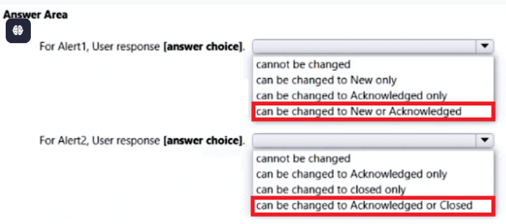

---

### Question 572: Question #49 Topic 6

HOTSPOT
-
You create a Recovery Services vault backup policy named Policy1 as shown in the following exhibit:
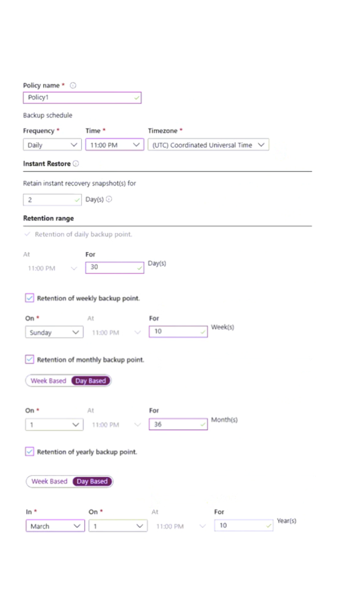
Use the drop-down menus to select the answer choice that completes each statement based on the information presented in the graphic.
NOTE: Each correct selection is worth one point.
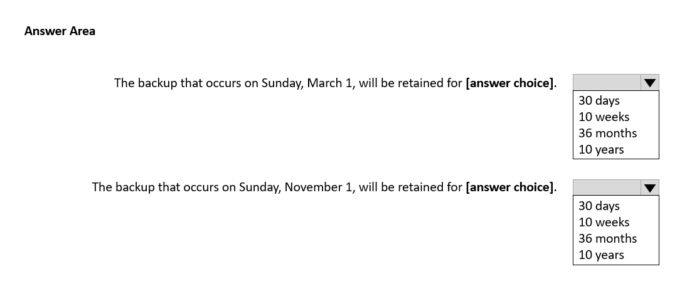

**Correct Answer:** 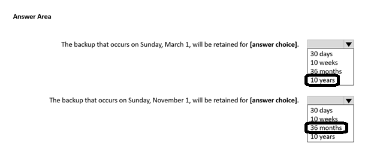

---

### Question 573: Question #50 Topic 6

HOTSPOT
-
You have an Azure subscription that contains the vaults shown in the following table.
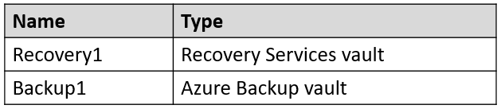
You deploy the virtual machines shown in the following table.
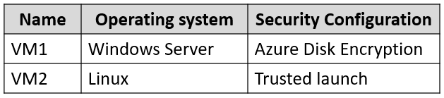
You have the backup policies shown in the following table.
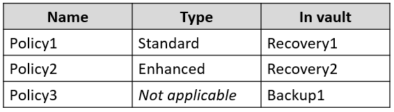
For each of the following statements, select Yes if the statement is true. Otherwise, select No.
NOTE: Each correct selection is worth one point.
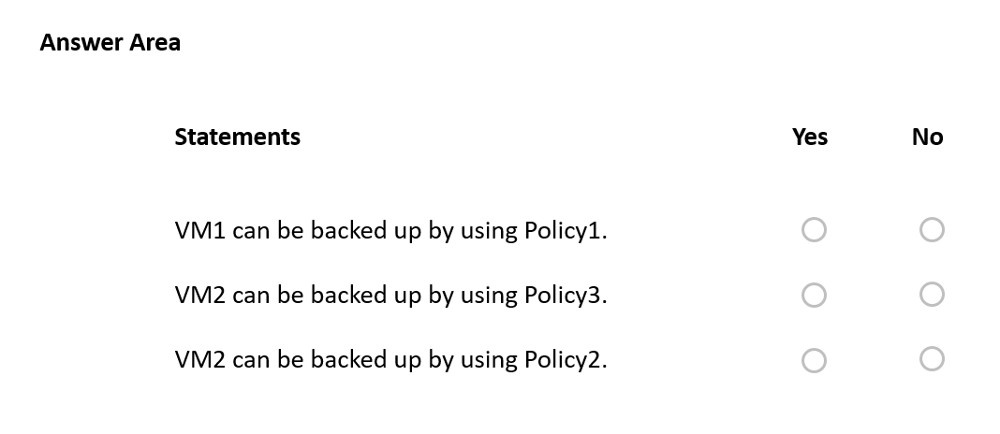

**Correct Answer:** 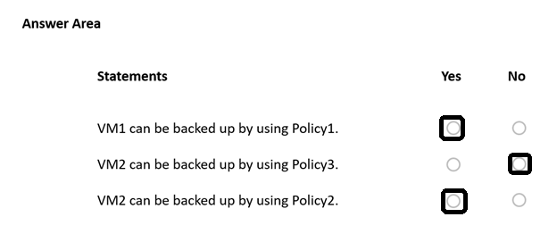

---

### Question 574: Question #51 Topic 6

You have an Azure subscription. The subscription contains virtual machines that connect to a virtual network named VNet1.
You plan to configure Azure Monitor for VM Insights.
You need to ensure that all the virtual machines only communicate with Azure Monitor through VNet1.
What should you create first?

- A. a data collection rule (DCR)
- B. a Log Analytics workspace
- C. an Azure Monitor Private Link Scope (AMPLS)
- D. a private endpoint

**Correct Answer:** C

---

### Question 575: Question #52 Topic 6

HOTSPOT
-
You have an Azure subscription that contains the vaults shown in the following table.
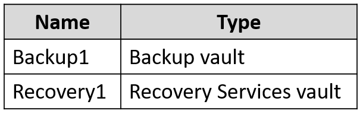
You create a storage account that contains the resources shown in the following table.
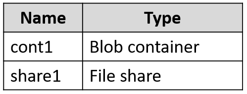
To which vault can you back up cont1 and share1? To answer, select the appropriate options in the answer area.
NOTE: Each correct answer is worth one point.
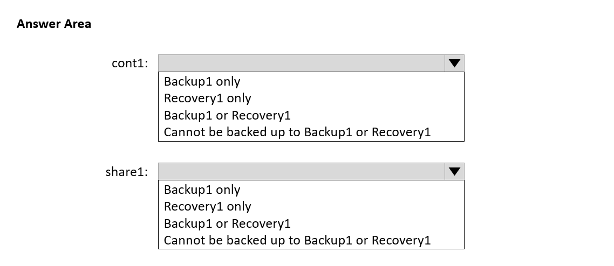

**Correct Answer:** 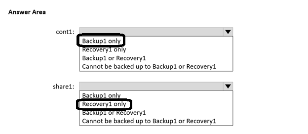

---

### Question 576: Question #53 Topic 6

You have an Azure subscription that contains an Azure Stream Analytics job named Job1.
You need to monitor input events for Job1 to identify the number of events that were NOT processed.
Which metric should you use?

- A. Out-of-Order Events
- B. Output Events
- C. Late Input Events
- D. Backlogged Input Events

**Correct Answer:** D

---

### Question 577: Question #54 Topic 6

You have an Azure subscription that contains an Azure SQL database named DB1.
You plan to use Azure Monitor to monitor the performance of DB1. You must be able to run queries to analyze log data.
Which destination should you configure in the Diagnostic settings of DB1?

- A. Send to a Log Analytics workspace.
- B. Archive to a storage account.
- C. Stream to an Azure event hub.

**Correct Answer:** A

---

### Question 578: Question #55 Topic 6

You have an Azure subscription. The subscription contains virtual machines that run Windows Server.
You have a data collection rule (DCR) named Rule1.
You plan to use the Azure Monitor Agent to collect events from Windows System event logs.
You only need to collect system events that have an ID of 1001.
Which type of query should you use for the data source in Rule1?

- A. SQL
- B. XPath
- C. KQL

**Correct Answer:** B

---

### Question 579: Question #56 Topic 6

You have an Azure subscription that contains a virtual machine named VM1.
You have an on-premises datacenter that contains a domain controller named DC1. ExpressRoute is used to connect the on-premises datacenter to Azure.
You need to use Connection Monitor to identify network latency between VM1 and DC1.
What should you install on DC1?

- A. the Azure Connected Machine agent for Azure Arc-enabled servers
- B. the Azure Network Watcher Agent virtual machine extension
- C. the Log Analytics agent
- D. an Azure Monitor agent extension

**Correct Answer:** D

---

### Question 580: Question #57 Topic 6

You have an Azure subscription that has Traffic Analytics configured.
You deploy a new virtual machine named VM1 that has the following settings:
•Region: East US
•Virtual network: VNet1
•NIC network security group: NSG1
You need to monitor VM1 traffic by using Traffic Analytics.
Which settings should you configure?

- A. Diagnostic settings for VM1
- B. NSG flow logs for NSG1
- C. Diagnostic settings for NSG1
- D. Insights for VM1

**Correct Answer:** B

---

### Question 581: Question #58 Topic 6

You have an Azure subscription. The subscription contains 10 virtual machines that run Windows Server. Each virtual machine hosts a website in IIS and has the Azure Monitor Agent installed.
You need to collect the IIS logs from each virtual machine and store them in a Log Analytics workspace.
What should you configure first?

- A. a data collection endpoint
- B. an Azure Monitor Private Link Scope (AMPLS)
- C. Diagnostic settings
- D. VM insights
- E. a private endpoint

**Correct Answer:** C

---

### Question 582: Question #59 Topic 6

HOTSPOT
-
You have an Azure subscription that contains two storage accounts named contoso101 and contoso102.
The subscription contains the virtual machines shown in the following table.
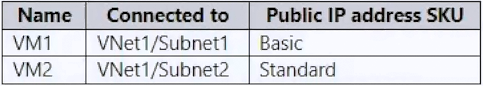
VNet1 has service endpoints configured as shown in the Service endpoints exhibit. (Click the Service endpoints tab.)
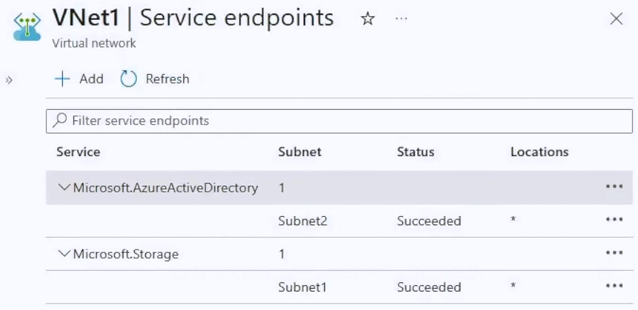
The Microsoft.Storage service endpoint has the service endpoint policy shown in the Microsoft.Storage exhibit. (Click the Microsoft.Storage tab.)
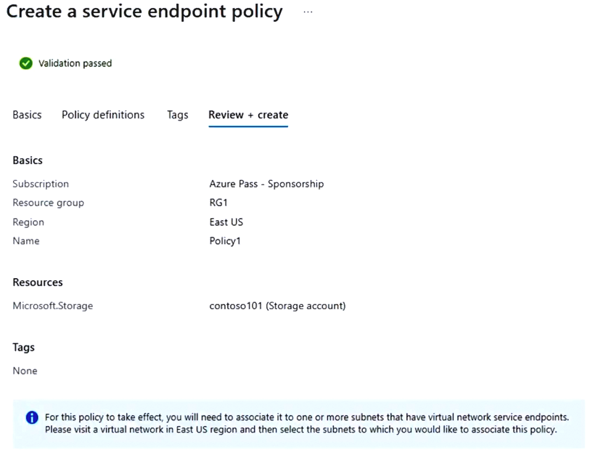
For each of the following statements, select Yes if the statement is true. Otherwise, select No.
NOTE: Each correct selection is worth one point.
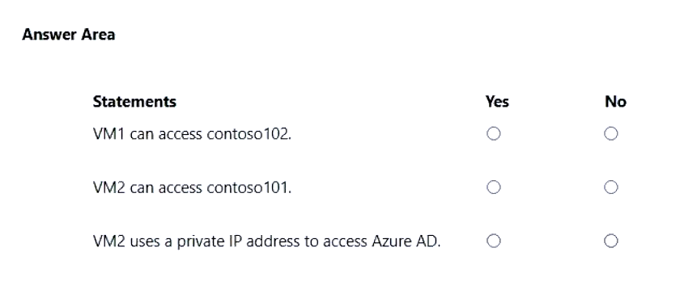

**Correct Answer:** 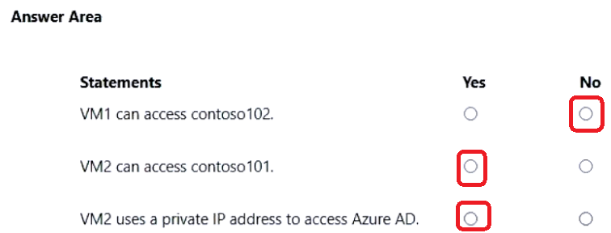

---

### Question 583: Question #60 Topic 6

HOTSPOT
-
You have an Azure subscription that contains an Azure Backup vault named Backup1, a Recovery Services vault named Recovery1, and the resources shown in the following table.
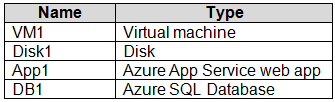
You plan to back up the resources.
Which resource can be backed up to Backup1, and which resource can be backed up to Recovery1? To answer, select the appropriate options in the answer area.
NOTE: Each correct selection is worth one point.
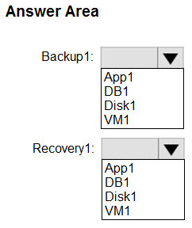

**Correct Answer:** 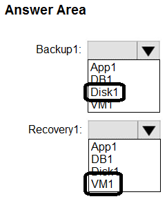

---

### Question 584: Question #61 Topic 6

HOTSPOT
-
Case study
-
This is a case study. Case studies are not timed separately. You can use as much exam time as you would like to complete each case. However, there may be additional case studies and sections on this exam. You must manage your time to ensure that you are able to complete all questions included on this exam in the time provided.
To answer the questions included in a case study, you will need to reference information that is provided in the case study. Case studies might contain exhibits and other resources that provide more information about the scenario that is described in the case study. Each question is independent of the other questions in this case study.
At the end of this case study, a review screen will appear. This screen allows you to review your answers and to make changes before you move to the next section of the exam. After you begin a new section, you cannot return to this section.
To start the case study
-
To display the first question in this case study, click the Next button. Use the buttons in the left pane to explore the content of the case study before you answer the questions. Clicking these buttons displays information such as business requirements, existing environment, and problem statements. If the case study has an All Information tab, note that the information displayed is identical to the information displayed on the subsequent tabs. When you are ready to answer a question, click the Question button to return to the question.
Overview
-
ADatum Corporation is consulting firm that has a main office in Montreal and branch offices in Seattle and New York.
Existing Environment
-
Azure Environment
-
ADatum has an Azure subscription that contains three resource groups named RG1, RG2, and RG3.
The subscription contains the storage accounts shown in the following table.

The subscription contains the virtual machines shown in the following table.

The subscription has an Azure container registry that contains the images shown in the following table.

The subscription contains the resources shown in the following table.

Azure Key Vault
-
The subscription contains an Azure key vault named Vault1.
Vault1 contains the certificates shown in the following table.

Vault1 contains the keys shown in the following table.

Microsoft Entra Environment
-
ADatum has a Microsoft Entra tenant named adatum.com that is linked to the Azure subscription and contains the users shown in the following table.

The tenant contains the groups shown in the following table.

The adatum.com tenant has a custom security attribute named Attribute1.
Planned Changes
-
ADatum plans to implement the following changes:
•Configure a data collection rule (DCR) named DCR1 to collect only system events that have an event ID of 4648 from VM2 and VM4.
•In storage1, create a new container named cont2 that has the following access policies:
oThree stored access policies named Stored1, Stored2, and Stored3
oA legal hold for immutable blob storage
•Whenever possible, use directories to organize storage account content.
•Grant User1 the permissions required to link Zone1 to VNet1.
•Assign Attribute1 to supported adatum.com resources.
•In storage2, create an encryption scope named Scope1.
•Deploy new containers by using Image1 or Image2.
Technical Requirements
-
ADatum must meet the following technical requirements:
•Use TLS for WebApp1.
•Follow the principle of least privilege.
•Grant permissions at the required scope only.
•Ensure that Scope1 is used to encrypt storage services.
•Use Azure Backup to back up cont1 and share1 as frequently as possible.
•Whenever possible, use Azure Disk Encryption and a key encryption key (KEK) to encrypt the virtual machines.
You need to configure Azure Backup to meet the technical requirements for cont1 and share1.
To what should you set the backup frequency for each resource? To answer, select the appropriate options in the answer area.
NOTE: Each correct selection is worth one point.
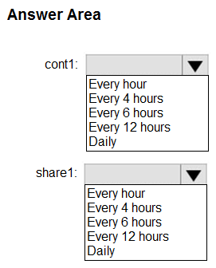

**Correct Answer:** 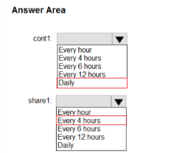

---

### Question 585: Question #1 Topic 7

Introductory Info
Case study -
This is a case study. Case studies are not timed separately. You can use as much exam time as you would like to complete each case. However, there may be additional case studies and sections on this exam. You must manage your time to ensure that you are able to complete all questions included on this exam in the time provided.
To answer the questions included in a case study, you will need to reference information that is provided in the case study. Case studies might contain exhibits and other resources that provide more information about the scenario that is described in the case study. Each question is independent of the other questions in this case study.
At the end of this case study, a review screen will appear. This screen allows you to review your answers and to make changes before you move to the next section of the exam. After you begin a new section, you cannot return to this section.
To start the case study -
To display the first question in this case study, click the Next button. Use the buttons in the left pane to explore the content of the case study before you answer the questions. Clicking these buttons displays information such as business requirements, existing environment, and problem statements. If the case study has an All Information tab, note that the information displayed is identical to the information displayed on the subsequent tabs. When you are ready to answer a question, click the Question button to return to the question.
Overview -
Contoso, Ltd. is a manufacturing company that has offices worldwide. Contoso works with partner organizations to bring products to market.
Contoso products are manufactured by using blueprint files that the company authors and maintains.
Existing Environment -
Currently, Contoso uses multiple types of servers for business operations, including the following:
File servers
Domain controllers
Microsoft SQL Server servers
Your network contains an Active Directory forest named contoso.com. All servers and client computers are joined to Active Directory.
You have a public-facing application named App1. App1 is comprised of the following three tiers:
A SQL database
A web front end
A processing middle tier -

Each tier is comprised of five virtual machines. Users access the web front end by using HTTPS only.
Requirements -
Planned Changes -
Contoso plans to implement the following changes to the infrastructure:
Move all the tiers of App1 to Azure.
Move the existing product blueprint files to Azure Blob storage.
Create a hybrid directory to support an upcoming Microsoft 365 migration project.
Technical Requirements -
Contoso must meet the following technical requirements:
Move all the virtual machines for App1 to Azure.
Minimize the number of open ports between the App1 tiers.
Ensure that all the virtual machines for App1 are protected by backups.
Copy the blueprint files to Azure over the Internet.
Ensure that the blueprint files are stored in the archive storage tier.
Ensure that partner access to the blueprint files is secured and temporary.
Prevent user passwords or hashes of passwords from being stored in Azure.
Use unmanaged standard storage for the hard disks of the virtual machines.
Ensure that when users join devices to Azure Active Directory (Azure AD), the users use a mobile phone to verify their identity.
Minimize administrative effort whenever possible.
User Requirements -
Contoso identifies the following requirements for users:
Ensure that only users who are part of a group named Pilot can join devices to Azure AD.
Designate a new user named Admin1 as the service admin for the Azure subscription.
Admin1 must receive email alerts regarding service outages.
Ensure that a new user named User3 can create network objects for the Azure subscription.
Question
HOTSPOT -
You need to configure the Device settings to meet the technical requirements and the user requirements.
Which two settings should you modify? To answer, select the appropriate settings in the answer area.
Hot Area:
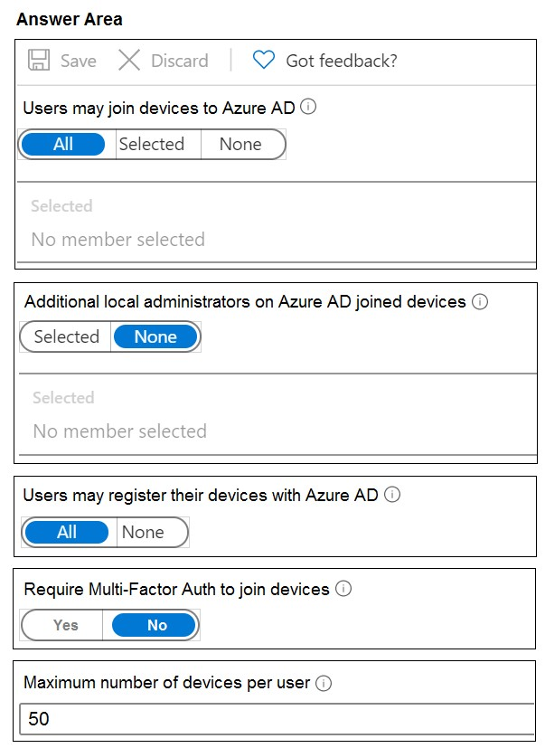

**Correct Answer:** 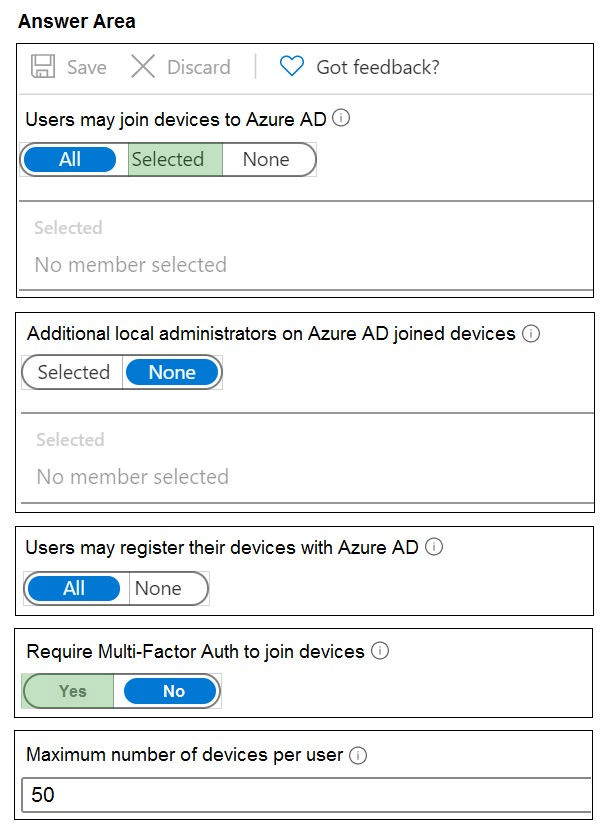

_Explanation:_
Box 1: Selected -
Only selected users should be able to join devices
Box 2: Yes -
Ensure that when users join devices to Azure Active Directory (Azure AD), the users use a mobile phone to verify their identity.

---

### Question 586: Question #2 Topic 7

Introductory Info
Case study -
This is a case study. Case studies are not timed separately. You can use as much exam time as you would like to complete each case. However, there may be additional case studies and sections on this exam. You must manage your time to ensure that you are able to complete all questions included on this exam in the time provided.
To answer the questions included in a case study, you will need to reference information that is provided in the case study. Case studies might contain exhibits and other resources that provide more information about the scenario that is described in the case study. Each question is independent of the other questions in this case study.
At the end of this case study, a review screen will appear. This screen allows you to review your answers and to make changes before you move to the next section of the exam. After you begin a new section, you cannot return to this section.
To start the case study -
To display the first question in this case study, click the Next button. Use the buttons in the left pane to explore the content of the case study before you answer the questions. Clicking these buttons displays information such as business requirements, existing environment, and problem statements. If the case study has an All Information tab, note that the information displayed is identical to the information displayed on the subsequent tabs. When you are ready to answer a question, click the Question button to return to the question.
Overview -
Contoso, Ltd. is a manufacturing company that has offices worldwide. Contoso works with partner organizations to bring products to market.
Contoso products are manufactured by using blueprint files that the company authors and maintains.
Existing Environment -
Currently, Contoso uses multiple types of servers for business operations, including the following:
File servers
Domain controllers
Microsoft SQL Server servers
Your network contains an Active Directory forest named contoso.com. All servers and client computers are joined to Active Directory.
You have a public-facing application named App1. App1 is comprised of the following three tiers:
A SQL database
A web front end
A processing middle tier -

Each tier is comprised of five virtual machines. Users access the web front end by using HTTPS only.
Requirements -
Planned Changes -
Contoso plans to implement the following changes to the infrastructure:
Move all the tiers of App1 to Azure.
Move the existing product blueprint files to Azure Blob storage.
Create a hybrid directory to support an upcoming Microsoft 365 migration project.
Technical Requirements -
Contoso must meet the following technical requirements:
Move all the virtual machines for App1 to Azure.
Minimize the number of open ports between the App1 tiers.
Ensure that all the virtual machines for App1 are protected by backups.
Copy the blueprint files to Azure over the Internet.
Ensure that the blueprint files are stored in the archive storage tier.
Ensure that partner access to the blueprint files is secured and temporary.
Prevent user passwords or hashes of passwords from being stored in Azure.
Use unmanaged standard storage for the hard disks of the virtual machines.
Ensure that when users join devices to Azure Active Directory (Azure AD), the users use a mobile phone to verify their identity.
Minimize administrative effort whenever possible.
User Requirements -
Contoso identifies the following requirements for users:
Ensure that only users who are part of a group named Pilot can join devices to Azure AD.
Designate a new user named Admin1 as the service admin for the Azure subscription.
Admin1 must receive email alerts regarding service outages.
Ensure that a new user named User3 can create network objects for the Azure subscription.
Question
You need to meet the user requirement for Admin1.
What should you do?

- A. From the Azure Active Directory blade, modify the Groups
- B. From the Azure Active Directory blade, modify the Properties
- C. From the Subscriptions blade, select the subscription, and then modify the Access control (IAM) settings
- D. From the Subscriptions blade, select the subscription, and then modify the Properties

**Correct Answer:** D

---

### Question 587: Question #1 Topic 8

Introductory Info
Case study -
This is a case study. Case studies are not timed separately. You can use as much exam time as you would like to complete each case. However, there may be additional case studies and sections on this exam. You must manage your time to ensure that you are able to complete all questions included on this exam in the time provided.
To answer the questions included in a case study, you will need to reference information that is provided in the case study. Case studies might contain exhibits and other resources that provide more information about the scenario that is described in the case study. Each question is independent of the other questions in this case study.
At the end of this case study, a review screen will appear. This screen allows you to review your answers and to make changes before you move to the next section of the exam. After you begin a new section, you cannot return to this section.
To start the case study -
To display the first question in this case study, click the Next button. Use the buttons in the left pane to explore the content of the case study before you answer the questions. Clicking these buttons displays information such as business requirements, existing environment, and problem statements. If the case study has an All Information tab, note that the information displayed is identical to the information displayed on the subsequent tabs. When you are ready to answer a question, click the Question button to return to the question.
Overview -
General Overview -
Contoso, Ltd. is a consulting company that has a main office in Montreal and branch offices in Seattle and New York.
Environment -
Existing Environment -
Contoso has an Azure subscription named Sub1 that is linked to an Azure Active Directory (Azure AD) tenant. The network contains an on-premises Active
Directory domain that syncs to the Azure AD tenant.
The Azure AD tenant contains the users shown in the following table.

Sub1 contains two resource groups named RG1 and RG2 and the virtual networks shown in the following table.

User1 manages the resources in RG1. User4 manages the resources in RG2.
Sub1 contains virtual machines that run Windows Server 2019 as shown in the following table

No network security groups (NSGs) are associated to the network interfaces or the subnets.
Sub1 contains the storage accounts shown in the following table.

Requirements -
Planned Changes -
Contoso plans to implement the following changes:
Create a blob container named container1 and a file share named share1 that will use the Cool storage tier.
Create a storage account named storage5 and configure storage replication for the Blob service.
Create an NSG named NSG1 that will have the custom inbound security rules shown in the following table.

Associate NSG1 to the network interface of VM1.
Create an NSG named NSG2 that will have the custom outbound security rules shown in the following table.

Associate NSG2 to VNET1/Subnet2.
Technical Requirements -
Contoso must meet the following technical requirements:
Create container1 and share1.
Use the principle of least privilege.
Create an Azure AD security group named Group4.
Back up the Azure file shares and virtual machines by using Azure Backup.
Trigger an alert if VM1 or VM2 has less than 20 GB of free space on volume C.
Enable User1 to create Azure policy definitions and User2 to assign Azure policies to RG1.
Create an internal Basic Azure Load Balancer named LB1 and connect the load balancer to VNET1/Subnet1
Enable flow logging for IP traffic from VM5 and retain the flow logs for a period of eight months.
Whenever possible, grant Group4 Azure role-based access control (Azure RBAC) read-only permissions to the Azure file shares.
Question
HOTSPOT -
You need to configure Azure Backup to back up the file shares and virtual machines.
What is the minimum number of Recovery Services vaults and backup policies you should create? To answer, select the appropriate options in the answer area.
NOTE: Each correct selection is worth one point.
Hot Area:
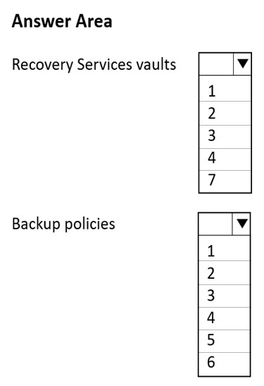

**Correct Answer:** 

_Explanation:_
Box 1: 3 -
If you have data sources in multiple regions, create a Recovery Services vault for each region.
The File Shares and VMs are located in three Regions: West US, East US, Central US.
Box 2: 6 -
A backup policy is scoped to a vault. For each vault we need one backup policy for File Shares and one backup policy for VM.
Note:
Back up the Azure file shares and virtual machines by using Azure Backup
Reference:
https://docs.microsoft.com/en-us/azure/backup/backup-create-rs-vault https://docs.microsoft.com/en-us/azure/backup/guidance-best-practices

---

### Question 588: Question #2 Topic 8

Introductory Info
Case study -
This is a case study. Case studies are not timed separately. You can use as much exam time as you would like to complete each case. However, there may be additional case studies and sections on this exam. You must manage your time to ensure that you are able to complete all questions included on this exam in the time provided.
To answer the questions included in a case study, you will need to reference information that is provided in the case study. Case studies might contain exhibits and other resources that provide more information about the scenario that is described in the case study. Each question is independent of the other questions in this case study.
At the end of this case study, a review screen will appear. This screen allows you to review your answers and to make changes before you move to the next section of the exam. After you begin a new section, you cannot return to this section.
To start the case study -
To display the first question in this case study, click the Next button. Use the buttons in the left pane to explore the content of the case study before you answer the questions. Clicking these buttons displays information such as business requirements, existing environment, and problem statements. If the case study has an All Information tab, note that the information displayed is identical to the information displayed on the subsequent tabs. When you are ready to answer a question, click the Question button to return to the question.
Overview -
General Overview -
Contoso, Ltd. is a consulting company that has a main office in Montreal and branch offices in Seattle and New York.
Environment -
Existing Environment -
Contoso has an Azure subscription named Sub1 that is linked to an Azure Active Directory (Azure AD) tenant. The network contains an on-premises Active
Directory domain that syncs to the Azure AD tenant.
The Azure AD tenant contains the users shown in the following table.

Sub1 contains two resource groups named RG1 and RG2 and the virtual networks shown in the following table.

User1 manages the resources in RG1. User4 manages the resources in RG2.
Sub1 contains virtual machines that run Windows Server 2019 as shown in the following table

No network security groups (NSGs) are associated to the network interfaces or the subnets.
Sub1 contains the storage accounts shown in the following table.

Requirements -
Planned Changes -
Contoso plans to implement the following changes:
Create a blob container named container1 and a file share named share1 that will use the Cool storage tier.
Create a storage account named storage5 and configure storage replication for the Blob service.
Create an NSG named NSG1 that will have the custom inbound security rules shown in the following table.

Associate NSG1 to the network interface of VM1.
Create an NSG named NSG2 that will have the custom outbound security rules shown in the following table.

Associate NSG2 to VNET1/Subnet2.
Technical Requirements -
Contoso must meet the following technical requirements:
Create container1 and share1.
Use the principle of least privilege.
Create an Azure AD security group named Group4.
Back up the Azure file shares and virtual machines by using Azure Backup.
Trigger an alert if VM1 or VM2 has less than 20 GB of free space on volume C.
Enable User1 to create Azure policy definitions and User2 to assign Azure policies to RG1.
Create an internal Basic Azure Load Balancer named LB1 and connect the load balancer to VNET1/Subnet1
Enable flow logging for IP traffic from VM5 and retain the flow logs for a period of eight months.
Whenever possible, grant Group4 Azure role-based access control (Azure RBAC) read-only permissions to the Azure file shares.
Question
DRAG DROP -
You need to configure the alerts for VM1 and VM2 to meet the technical requirements.
Which three actions should you perform in sequence? To answer, move all actions from the list of actions to the answer area and arrange them in the correct order.
Select and Place:
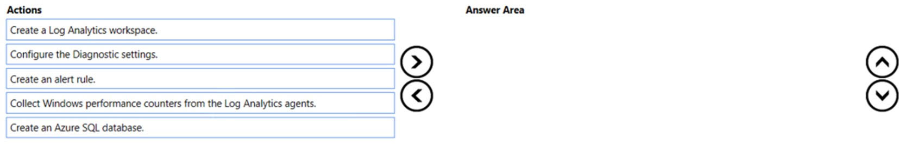

**Correct Answer:** 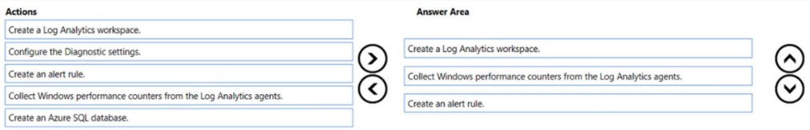

---

### Question 589: Question #1 Topic 9

Introductory Info
Case study -
This is a case study. Case studies are not timed separately. You can use as much exam time as you would like to complete each case. However, there may be additional case studies and sections on this exam. You must manage your time to ensure that you are able to complete all questions included on this exam in the time provided.
To answer the questions included in a case study, you will need to reference information that is provided in the case study. Case studies might contain exhibits and other resources that provide more information about the scenario that is described in the case study. Each question is independent of the other questions in this case study.
At the end of this case study, a review screen will appear. This screen allows you to review your answers and to make changes before you move to the next section of the exam. After you begin a new section, you cannot return to this section.
To start the case study -
To display the first question in this case study, click the Next button. Use the buttons in the left pane to explore the content of the case study before you answer the questions. Clicking these buttons displays information such as business requirements, existing environment, and problem statements. If the case study has an All Information tab, note that the information displayed is identical to the information displayed on the subsequent tabs. When you are ready to answer a question, click the Question button to return to the question.
Overview -
General Overview -
Contoso, Ltd. is a consulting company that has a main office in Montreal and branch offices in Seattle and New York.
Environment -
Existing Environment -
Contoso has an Azure subscription named Sub1 that is linked to an Azure Active Directory (Azure AD) tenant. The network contains an on-premises Active
Directory domain that syncs to the Azure AD tenant.
The Azure AD tenant contains the users shown in the following table.

Sub1 contains two resource groups named RG1 and RG2 and the virtual networks shown in the following table.
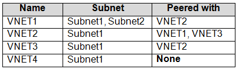
User1 manages the resources in RG1. User4 manages the resources in RG2.
Sub1 contains virtual machines that run Windows Server 2019 as shown in the following table
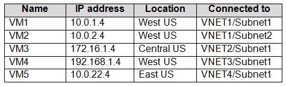
No network security groups (NSGs) are associated to the network interfaces or the subnets.
Sub1 contains the storage accounts shown in the following table.

Requirements -
Planned Changes -
Contoso plans to implement the following changes:
Create a blob container named container1 and a file share named share1 that will use the Cool storage tier.
Create a storage account named storage5 and configure storage replication for the Blob service.
Create an NSG named NSG1 that will have the custom inbound security rules shown in the following table.

Associate NSG1 to the network interface of VM1.
Create an NSG named NSG2 that will have the custom outbound security rules shown in the following table.

Associate NSG2 to VNET1/Subnet2.
Technical Requirements -
Contoso must meet the following technical requirements:
Create container1 and share1.
Use the principle of least privilege.
Create an Azure AD security group named Group4.
Back up the Azure file shares and virtual machines by using Azure Backup.
Trigger an alert if VM1 or VM2 has less than 20 GB of free space on volume C.
Enable User1 to create Azure policy definitions and User2 to assign Azure policies to RG1.
Create an internal Basic Azure Load Balancer named LB1 and connect the load balancer to VNET1/Subnet1
Enable flow logging for IP traffic from VM5 and retain the flow logs for a period of eight months.
Whenever possible, grant Group4 Azure role-based access control (Azure RBAC) read-only permissions to the Azure file shares.
Question
HOTSPOT -
You need to ensure that User1 can create initiative definitions, and User4 can assign initiatives to RG2. The solution must meet the technical requirements.
Which role should you assign to each user? To answer, select the appropriate options in the answer area.
NOTE: Each correct selection is worth one point.
Hot Area:

**Correct Answer:** 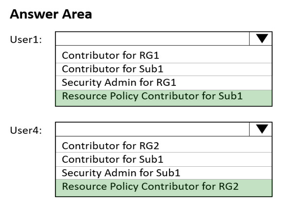

_Explanation:_
Reference:
https://docs.microsoft.com/en-us/azure/governance/policy/overview

---

### Question 590: Question #2 Topic 9

Introductory Info
Case study -
This is a case study. Case studies are not timed separately. You can use as much exam time as you would like to complete each case. However, there may be additional case studies and sections on this exam. You must manage your time to ensure that you are able to complete all questions included on this exam in the time provided.
To answer the questions included in a case study, you will need to reference information that is provided in the case study. Case studies might contain exhibits and other resources that provide more information about the scenario that is described in the case study. Each question is independent of the other questions in this case study.
At the end of this case study, a review screen will appear. This screen allows you to review your answers and to make changes before you move to the next section of the exam. After you begin a new section, you cannot return to this section.
To start the case study -
To display the first question in this case study, click the Next button. Use the buttons in the left pane to explore the content of the case study before you answer the questions. Clicking these buttons displays information such as business requirements, existing environment, and problem statements. If the case study has an All Information tab, note that the information displayed is identical to the information displayed on the subsequent tabs. When you are ready to answer a question, click the Question button to return to the question.
Overview -
General Overview -
Contoso, Ltd. is a consulting company that has a main office in Montreal and branch offices in Seattle and New York.
Environment -
Existing Environment -
Contoso has an Azure subscription named Sub1 that is linked to an Azure Active Directory (Azure AD) tenant. The network contains an on-premises Active
Directory domain that syncs to the Azure AD tenant.
The Azure AD tenant contains the users shown in the following table.

Sub1 contains two resource groups named RG1 and RG2 and the virtual networks shown in the following table.

User1 manages the resources in RG1. User4 manages the resources in RG2.
Sub1 contains virtual machines that run Windows Server 2019 as shown in the following table

No network security groups (NSGs) are associated to the network interfaces or the subnets.
Sub1 contains the storage accounts shown in the following table.

Requirements -
Planned Changes -
Contoso plans to implement the following changes:
Create a blob container named container1 and a file share named share1 that will use the Cool storage tier.
Create a storage account named storage5 and configure storage replication for the Blob service.
Create an NSG named NSG1 that will have the custom inbound security rules shown in the following table.

Associate NSG1 to the network interface of VM1.
Create an NSG named NSG2 that will have the custom outbound security rules shown in the following table.

Associate NSG2 to VNET1/Subnet2.
Technical Requirements -
Contoso must meet the following technical requirements:
Create container1 and share1.
Use the principle of least privilege.
Create an Azure AD security group named Group4.
Back up the Azure file shares and virtual machines by using Azure Backup.
Trigger an alert if VM1 or VM2 has less than 20 GB of free space on volume C.
Enable User1 to create Azure policy definitions and User2 to assign Azure policies to RG1.
Create an internal Basic Azure Load Balancer named LB1 and connect the load balancer to VNET1/Subnet1
Enable flow logging for IP traffic from VM5 and retain the flow logs for a period of eight months.
Whenever possible, grant Group4 Azure role-based access control (Azure RBAC) read-only permissions to the Azure file shares.
Question
You need to ensure that you can grant Group4 Azure RBAC read only permissions to all the Azure file shares.
What should you do?

- A. On storage2, enable identity-based access for the file shares.
- B. Recreate storage2 and set Hierarchical namespace to Enabled.
- C. On storage1 and storage4, change the Account kind type to StorageV2 (general purpose v2).
- D. Create a shared access signature (SAS) for storage1, storage2, and storage4.

**Correct Answer:** A

---

### Question 591: Question #1 Topic 10

Introductory Info
Case study -
This is a case study. Case studies are not timed separately. You can use as much exam time as you would like to complete each case. However, there may be additional case studies and sections on this exam. You must manage your time to ensure that you are able to complete all questions included on this exam in the time provided.
To answer the questions included in a case study, you will need to reference information that is provided in the case study. Case studies might contain exhibits and other resources that provide more information about the scenario that is described in the case study. Each question is independent of the other questions in this case study.
At the end of this case study, a review screen will appear. This screen allows you to review your answers and to make changes before you move to the next section of the exam. After you begin a new section, you cannot return to this section.
To start the case study -
To display the first question in this case study, click the Next button. Use the buttons in the left pane to explore the content of the case study before you answer the questions. Clicking these buttons displays information such as business requirements, existing environment, and problem statements. If the case study has an All Information tab, note that the information displayed is identical to the information displayed on the subsequent tabs. When you are ready to answer a question, click the Question button to return to the question.
Overview -
Contoso, Ltd. is a manufacturing company that has offices worldwide. Contoso works with partner organizations to bring products to market.
Contoso products are manufactured by using blueprint files that the company authors and maintains.
Existing Environment -
Currently, Contoso uses multiple types of servers for business operations, including the following:
File servers
Domain controllers
Microsoft SQL Server servers
Your network contains an Active Directory forest named contoso.com. All servers and client computers are joined to Active Directory.
You have a public-facing application named App1. App1 is comprised of the following three tiers:
A SQL database
A web front end
A processing middle tier -

Each tier is comprised of five virtual machines. Users access the web front end by using HTTPS only.
Requirements -
Planned Changes -
Contoso plans to implement the following changes to the infrastructure:
Move all the tiers of App1 to Azure.
Move the existing product blueprint files to Azure Blob storage.
Create a hybrid directory to support an upcoming Microsoft 365 migration project.
Technical Requirements -
Contoso must meet the following technical requirements:
Move all the virtual machines for App1 to Azure.
Minimize the number of open ports between the App1 tiers.
Ensure that all the virtual machines for App1 are protected by backups.
Copy the blueprint files to Azure over the Internet.
Ensure that the blueprint files are stored in the archive storage tier.
Ensure that partner access to the blueprint files is secured and temporary.
Prevent user passwords or hashes of passwords from being stored in Azure.
Use unmanaged standard storage for the hard disks of the virtual machines.
Ensure that when users join devices to Azure Active Directory (Azure AD), the users use a mobile phone to verify their identity.
Minimize administrative effort whenever possible.
User Requirements -
Contoso identifies the following requirements for users:
Ensure that only users who are part of a group named Pilot can join devices to Azure AD.
Designate a new user named Admin1 as the service admin for the Azure subscription.
Admin1 must receive email alerts regarding service outages.
Ensure that a new user named User3 can create network objects for the Azure subscription.
Question
You need to implement a backup solution for App1 after the application is moved.
What should you create first?

- A. a recovery plan
- B. an Azure Backup Server
- C. a backup policy
- D. a Recovery Services vault

**Correct Answer:** D

---

### Question 592: Question #2 Topic 10

Introductory Info
Case study -
This is a case study. Case studies are not timed separately. You can use as much exam time as you would like to complete each case. However, there may be additional case studies and sections on this exam. You must manage your time to ensure that you are able to complete all questions included on this exam in the time provided.
To answer the questions included in a case study, you will need to reference information that is provided in the case study. Case studies might contain exhibits and other resources that provide more information about the scenario that is described in the case study. Each question is independent of the other questions in this case study.
At the end of this case study, a review screen will appear. This screen allows you to review your answers and to make changes before you move to the next section of the exam. After you begin a new section, you cannot return to this section.
To start the case study -
To display the first question in this case study, click the Next button. Use the buttons in the left pane to explore the content of the case study before you answer the questions. Clicking these buttons displays information such as business requirements, existing environment, and problem statements. If the case study has an All Information tab, note that the information displayed is identical to the information displayed on the subsequent tabs. When you are ready to answer a question, click the Question button to return to the question.
Overview -
Contoso, Ltd. is a manufacturing company that has offices worldwide. Contoso works with partner organizations to bring products to market.
Contoso products are manufactured by using blueprint files that the company authors and maintains.
Existing Environment -
Currently, Contoso uses multiple types of servers for business operations, including the following:
File servers
Domain controllers
Microsoft SQL Server servers
Your network contains an Active Directory forest named contoso.com. All servers and client computers are joined to Active Directory.
You have a public-facing application named App1. App1 is comprised of the following three tiers:
A SQL database
A web front end
A processing middle tier -

Each tier is comprised of five virtual machines. Users access the web front end by using HTTPS only.
Requirements -
Planned Changes -
Contoso plans to implement the following changes to the infrastructure:
Move all the tiers of App1 to Azure.
Move the existing product blueprint files to Azure Blob storage.
Create a hybrid directory to support an upcoming Microsoft 365 migration project.
Technical Requirements -
Contoso must meet the following technical requirements:
Move all the virtual machines for App1 to Azure.
Minimize the number of open ports between the App1 tiers.
Ensure that all the virtual machines for App1 are protected by backups.
Copy the blueprint files to Azure over the Internet.
Ensure that the blueprint files are stored in the archive storage tier.
Ensure that partner access to the blueprint files is secured and temporary.
Prevent user passwords or hashes of passwords from being stored in Azure.
Use unmanaged standard storage for the hard disks of the virtual machines.
Ensure that when users join devices to Azure Active Directory (Azure AD), the users use a mobile phone to verify their identity.
Minimize administrative effort whenever possible.
User Requirements -
Contoso identifies the following requirements for users:
Ensure that only users who are part of a group named Pilot can join devices to Azure AD.
Designate a new user named Admin1 as the service admin for the Azure subscription.
Admin1 must receive email alerts regarding service outages.
Ensure that a new user named User3 can create network objects for the Azure subscription.
Question
You need to move the blueprint files to Azure.
What should you do?

- A. Generate an access key. Map a drive, and then copy the files by using File Explorer.
- B. Use Azure Storage Explorer to copy the files.
- C. Use the Azure Import/Export service.
- D. Generate a shared access signature (SAS). Map a drive, and then copy the files by using File Explorer.

**Correct Answer:** B

---

### Question 593: Question #3 Topic 10

Introductory Info
Case study -
This is a case study. Case studies are not timed separately. You can use as much exam time as you would like to complete each case. However, there may be additional case studies and sections on this exam. You must manage your time to ensure that you are able to complete all questions included on this exam in the time provided.
To answer the questions included in a case study, you will need to reference information that is provided in the case study. Case studies might contain exhibits and other resources that provide more information about the scenario that is described in the case study. Each question is independent of the other questions in this case study.
At the end of this case study, a review screen will appear. This screen allows you to review your answers and to make changes before you move to the next section of the exam. After you begin a new section, you cannot return to this section.
To start the case study -
To display the first question in this case study, click the Next button. Use the buttons in the left pane to explore the content of the case study before you answer the questions. Clicking these buttons displays information such as business requirements, existing environment, and problem statements. If the case study has an All Information tab, note that the information displayed is identical to the information displayed on the subsequent tabs. When you are ready to answer a question, click the Question button to return to the question.
Overview -
Contoso, Ltd. is a manufacturing company that has offices worldwide. Contoso works with partner organizations to bring products to market.
Contoso products are manufactured by using blueprint files that the company authors and maintains.
Existing Environment -
Currently, Contoso uses multiple types of servers for business operations, including the following:
File servers
Domain controllers
Microsoft SQL Server servers
Your network contains an Active Directory forest named contoso.com. All servers and client computers are joined to Active Directory.
You have a public-facing application named App1. App1 is comprised of the following three tiers:
A SQL database
A web front end
A processing middle tier -

Each tier is comprised of five virtual machines. Users access the web front end by using HTTPS only.
Requirements -
Planned Changes -
Contoso plans to implement the following changes to the infrastructure:
Move all the tiers of App1 to Azure.
Move the existing product blueprint files to Azure Blob storage.
Create a hybrid directory to support an upcoming Microsoft 365 migration project.
Technical Requirements -
Contoso must meet the following technical requirements:
Move all the virtual machines for App1 to Azure.
Minimize the number of open ports between the App1 tiers.
Ensure that all the virtual machines for App1 are protected by backups.
Copy the blueprint files to Azure over the Internet.
Ensure that the blueprint files are stored in the archive storage tier.
Ensure that partner access to the blueprint files is secured and temporary.
Prevent user passwords or hashes of passwords from being stored in Azure.
Use unmanaged standard storage for the hard disks of the virtual machines.
Ensure that when users join devices to Azure Active Directory (Azure AD), the users use a mobile phone to verify their identity.
Minimize administrative effort whenever possible.
User Requirements -
Contoso identifies the following requirements for users:
Ensure that only users who are part of a group named Pilot can join devices to Azure AD.
Designate a new user named Admin1 as the service admin for the Azure subscription.
Admin1 must receive email alerts regarding service outages.
Ensure that a new user named User3 can create network objects for the Azure subscription.
Question
HOTSPOT -
You need to identify the storage requirements for Contoso.
For each of the following statements, select Yes if the statement is true. Otherwise, select No.
NOTE: Each correct selection is worth one point.
Hot Area:
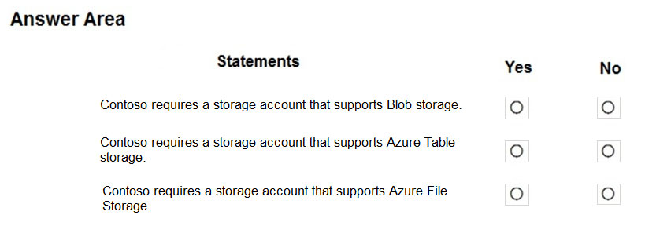

**Correct Answer:** 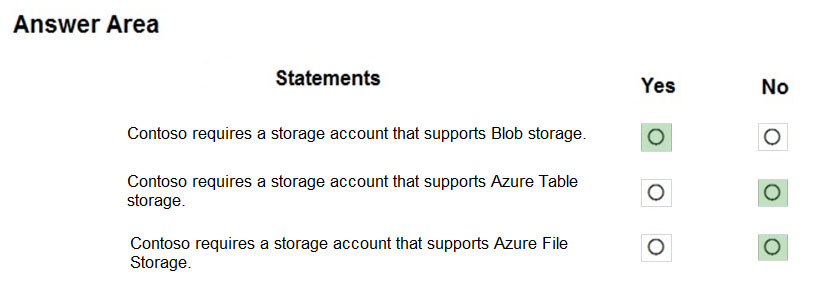

_Explanation:_
Box 1: Yes -
Contoso is moving the existing product blueprint files to Azure Blob storage.
Use unmanaged standard storage for the hard disks of the virtual machines. We use Page Blobs for these.
Box 2: No -
Box 3: No

---

### Question 594: Question #1 Topic 11

Introductory Info
Case study -
This is a case study. Case studies are not timed separately. You can use as much exam time as you would like to complete each case. However, there may be additional case studies and sections on this exam. You must manage your time to ensure that you are able to complete all questions included on this exam in the time provided.
To answer the questions included in a case study, you will need to reference information that is provided in the case study. Case studies might contain exhibits and other resources that provide more information about the scenario that is described in the case study. Each question is independent of the other questions in this case study.
At the end of this case study, a review screen will appear. This screen allows you to review your answers and to make changes before you move to the next section of the exam. After you begin a new section, you cannot return to this section.
To start the case study -
To display the first question in this case study, click the Next button. Use the buttons in the left pane to explore the content of the case study before you answer the questions. Clicking these buttons displays information such as business requirements, existing environment, and problem statements. If the case study has an All Information tab, note that the information displayed is identical to the information displayed on the subsequent tabs. When you are ready to answer a question, click the Question button to return to the question.
Overview -
General Overview -
Contoso, Ltd. is a consulting company that has a main office in Montreal and branch offices in Seattle and New York.
Environment -
Existing Environment -
Contoso has an Azure subscription named Sub1 that is linked to an Azure Active Directory (Azure AD) tenant. The network contains an on-premises Active
Directory domain that syncs to the Azure AD tenant.
The Azure AD tenant contains the users shown in the following table.
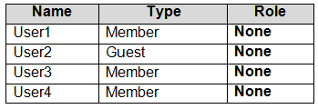
Sub1 contains two resource groups named RG1 and RG2 and the virtual networks shown in the following table.

User1 manages the resources in RG1. User4 manages the resources in RG2.
Sub1 contains virtual machines that run Windows Server 2019 as shown in the following table

No network security groups (NSGs) are associated to the network interfaces or the subnets.
Sub1 contains the storage accounts shown in the following table.
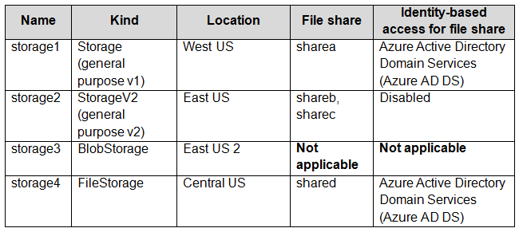
Requirements -
Planned Changes -
Contoso plans to implement the following changes:
Create a blob container named container1 and a file share named share1 that will use the Cool storage tier.
Create a storage account named storage5 and configure storage replication for the Blob service.
Create an NSG named NSG1 that will have the custom inbound security rules shown in the following table.

Associate NSG1 to the network interface of VM1.
Create an NSG named NSG2 that will have the custom outbound security rules shown in the following table.

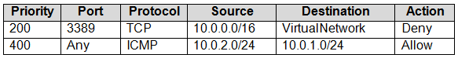
Associate NSG2 to VNET1/Subnet2.
Technical Requirements -
Contoso must meet the following technical requirements:
Create container1 and share1.
Use the principle of least privilege.
Create an Azure AD security group named Group4.
Back up the Azure file shares and virtual machines by using Azure Backup.
Trigger an alert if VM1 or VM2 has less than 20 GB of free space on volume C.
Enable User1 to create Azure policy definitions and User2 to assign Azure policies to RG1.
Create an internal Basic Azure Load Balancer named LB1 and connect the load balancer to VNET1/Subnet1
Enable flow logging for IP traffic from VM5 and retain the flow logs for a period of eight months.
Whenever possible, grant Group4 Azure role-based access control (Azure RBAC) read-only permissions to the Azure file shares.
Question
HOTSPOT -
You need to create container1 and share1.
Which storage accounts should you use for each resource? To answer, select the appropriate options in the answer area.
NOTE: Each correct selection is worth one point.
Hot Area:
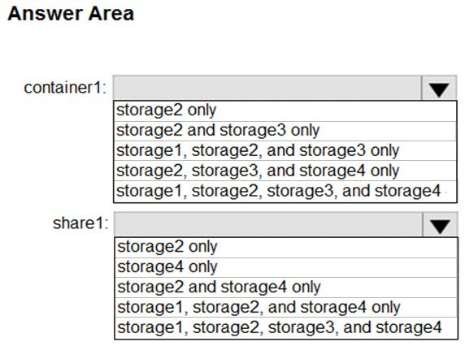

**Correct Answer:** 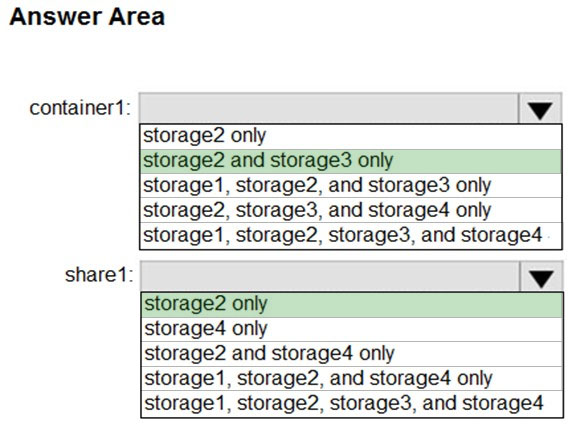

_Explanation:_
Reference:
https://docs.microsoft.com/en-us/azure/storage/blobs/storage-blob-storage-tiers https://docs.microsoft.com/en-us/azure/storage/common/storage-account-overview

---

### Question 595: Question #2 Topic 11

Introductory Info
Case study -
This is a case study. Case studies are not timed separately. You can use as much exam time as you would like to complete each case. However, there may be additional case studies and sections on this exam. You must manage your time to ensure that you are able to complete all questions included on this exam in the time provided.
To answer the questions included in a case study, you will need to reference information that is provided in the case study. Case studies might contain exhibits and other resources that provide more information about the scenario that is described in the case study. Each question is independent of the other questions in this case study.
At the end of this case study, a review screen will appear. This screen allows you to review your answers and to make changes before you move to the next section of the exam. After you begin a new section, you cannot return to this section.
To start the case study -
To display the first question in this case study, click the Next button. Use the buttons in the left pane to explore the content of the case study before you answer the questions. Clicking these buttons displays information such as business requirements, existing environment, and problem statements. If the case study has an All Information tab, note that the information displayed is identical to the information displayed on the subsequent tabs. When you are ready to answer a question, click the Question button to return to the question.
Overview -
General Overview -
Contoso, Ltd. is a consulting company that has a main office in Montreal and branch offices in Seattle and New York.
Environment -
Existing Environment -
Contoso has an Azure subscription named Sub1 that is linked to an Azure Active Directory (Azure AD) tenant. The network contains an on-premises Active
Directory domain that syncs to the Azure AD tenant.
The Azure AD tenant contains the users shown in the following table.

Sub1 contains two resource groups named RG1 and RG2 and the virtual networks shown in the following table.

User1 manages the resources in RG1. User4 manages the resources in RG2.
Sub1 contains virtual machines that run Windows Server 2019 as shown in the following table

No network security groups (NSGs) are associated to the network interfaces or the subnets.
Sub1 contains the storage accounts shown in the following table.

Requirements -
Planned Changes -
Contoso plans to implement the following changes:
Create a blob container named container1 and a file share named share1 that will use the Cool storage tier.
Create a storage account named storage5 and configure storage replication for the Blob service.
Create an NSG named NSG1 that will have the custom inbound security rules shown in the following table.

Associate NSG1 to the network interface of VM1.
Create an NSG named NSG2 that will have the custom outbound security rules shown in the following table.

Associate NSG2 to VNET1/Subnet2.
Technical Requirements -
Contoso must meet the following technical requirements:
Create container1 and share1.
Use the principle of least privilege.
Create an Azure AD security group named Group4.
Back up the Azure file shares and virtual machines by using Azure Backup.
Trigger an alert if VM1 or VM2 has less than 20 GB of free space on volume C.
Enable User1 to create Azure policy definitions and User2 to assign Azure policies to RG1.
Create an internal Basic Azure Load Balancer named LB1 and connect the load balancer to VNET1/Subnet1
Enable flow logging for IP traffic from VM5 and retain the flow logs for a period of eight months.
Whenever possible, grant Group4 Azure role-based access control (Azure RBAC) read-only permissions to the Azure file shares.
Question
HOTSPOT -
You need to create storage5. The solution must support the planned changes.
Which type of storage account should you use, and which account should you configure as the destination storage account? To answer, select the appropriate options in the answer area.
NOTE: Each correct selection is worth one point.
Hot Area:
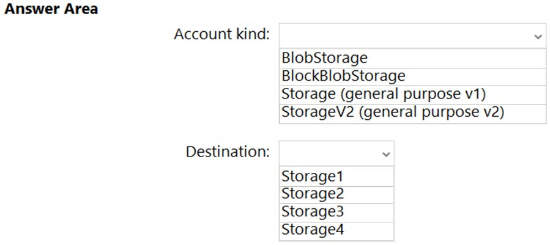

**Correct Answer:** 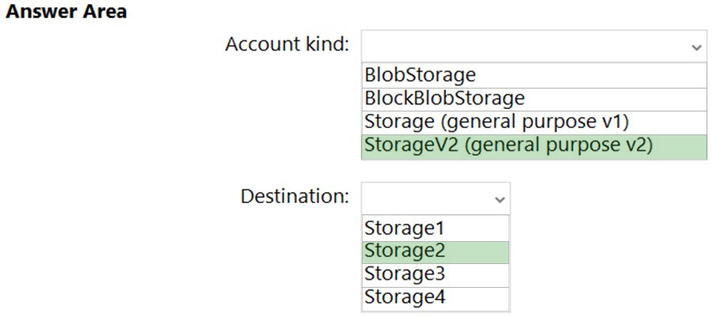

_Explanation:_
Reference:
https://docs.microsoft.com/en-us/azure/storage/blobs/object-replication-configure?tabs=portal

---

### Question 596: Question #3 Topic 11

Introductory Info
Case study -
This is a case study. Case studies are not timed separately. You can use as much exam time as you would like to complete each case. However, there may be additional case studies and sections on this exam. You must manage your time to ensure that you are able to complete all questions included on this exam in the time provided.
To answer the questions included in a case study, you will need to reference information that is provided in the case study. Case studies might contain exhibits and other resources that provide more information about the scenario that is described in the case study. Each question is independent of the other questions in this case study.
At the end of this case study, a review screen will appear. This screen allows you to review your answers and to make changes before you move to the next section of the exam. After you begin a new section, you cannot return to this section.
To start the case study -
To display the first question in this case study, click the Next button. Use the buttons in the left pane to explore the content of the case study before you answer the questions. Clicking these buttons displays information such as business requirements, existing environment, and problem statements. If the case study has an All Information tab, note that the information displayed is identical to the information displayed on the subsequent tabs. When you are ready to answer a question, click the Question button to return to the question.
Overview -
General Overview -
Contoso, Ltd. is a consulting company that has a main office in Montreal and branch offices in Seattle and New York.
Environment -
Existing Environment -
Contoso has an Azure subscription named Sub1 that is linked to an Azure Active Directory (Azure AD) tenant. The network contains an on-premises Active
Directory domain that syncs to the Azure AD tenant.
The Azure AD tenant contains the users shown in the following table.

Sub1 contains two resource groups named RG1 and RG2 and the virtual networks shown in the following table.

User1 manages the resources in RG1. User4 manages the resources in RG2.
Sub1 contains virtual machines that run Windows Server 2019 as shown in the following table

No network security groups (NSGs) are associated to the network interfaces or the subnets.
Sub1 contains the storage accounts shown in the following table.

Requirements -
Planned Changes -
Contoso plans to implement the following changes:
Create a blob container named container1 and a file share named share1 that will use the Cool storage tier.
Create a storage account named storage5 and configure storage replication for the Blob service.
Create an NSG named NSG1 that will have the custom inbound security rules shown in the following table.

Associate NSG1 to the network interface of VM1.
Create an NSG named NSG2 that will have the custom outbound security rules shown in the following table.

Associate NSG2 to VNET1/Subnet2.
Technical Requirements -
Contoso must meet the following technical requirements:
Create container1 and share1.
Use the principle of least privilege.
Create an Azure AD security group named Group4.
Back up the Azure file shares and virtual machines by using Azure Backup.
Trigger an alert if VM1 or VM2 has less than 20 GB of free space on volume C.
Enable User1 to create Azure policy definitions and User2 to assign Azure policies to RG1.
Create an internal Basic Azure Load Balancer named LB1 and connect the load balancer to VNET1/Subnet1
Enable flow logging for IP traffic from VM5 and retain the flow logs for a period of eight months.
Whenever possible, grant Group4 Azure role-based access control (Azure RBAC) read-only permissions to the Azure file shares.
Question
You need to identify which storage account to use for the flow logging of IP traffic from VM5. The solution must meet the retention requirements.
Which storage account should you identify?

- A. storage1
- B. storage2
- C. storage3
- D. storage4

**Correct Answer:** B

---

### Question 597: Question #1 Topic 12

Introductory Info
Case study -
This is a case study. Case studies are not timed separately. You can use as much exam time as you would like to complete each case. However, there may be additional case studies and sections on this exam. You must manage your time to ensure that you are able to complete all questions included on this exam in the time provided.
To answer the questions included in a case study, you will need to reference information that is provided in the case study. Case studies might contain exhibits and other resources that provide more information about the scenario that is described in the case study. Each question is independent of the other questions in this case study.
At the end of this case study, a review screen will appear. This screen allows you to review your answers and to make changes before you move to the next section of the exam. After you begin a new section, you cannot return to this section.
To start the case study -
To display the first question in this case study, click the Next button. Use the buttons in the left pane to explore the content of the case study before you answer the questions. Clicking these buttons displays information such as business requirements, existing environment, and problem statements. If the case study has an All Information tab, note that the information displayed is identical to the information displayed on the subsequent tabs. When you are ready to answer a question, click the Question button to return to the question.
Overview -
Litware, Inc. is a consulting company that has a main office in Montreal and two branch offices in Seattle and New York.
The Montreal office has 2,000 employees. The Seattle office has 1,000 employees. The New York office has 200 employees.
All the resources used by Litware are hosted on-premises.
Litware creates a new Azure subscription. The Azure Active Directory (Azure AD) tenant uses a domain named litware.onmicrosoft.com. The tenant uses the
Premium P1 pricing tier.
Existing Environment -
The network contains an Active Directory forest named litware.com. All domain controllers are configured as DNS servers and host the litware.com DNS zone.
Litware has finance, human resources, sales, research, and information technology departments. Each department has an organizational unit (OU) that contains all the accounts of that respective department. All the user accounts have the department attribute set to their respective department. New users are added frequently.
Litware.com contains a user named User1.
All the offices connect by using private connections.
Litware has data centers in the Montreal and Seattle offices. Each office has a firewall that can be configured as a VPN device.
All infrastructure servers are virtualized. The virtualization environment contains the servers in the following table.

Litware uses two web applications named App1 and App2. Each instance on each web application requires 1 GB of memory.
The Azure subscription contains the resources in the following table.

The network security team implements several network security groups (NSGs)
Requirements -
Planned Changes -
Litware plans to implement the following changes:
Deploy Azure ExpressRoute to the Montreal office.
Migrate the virtual machines hosted on Server1 and Server2 to Azure.
Synchronize on-premises Active Directory to Azure Active Directory (Azure AD).
Migrate App1 and App2 to two Azure web apps named WebApp1 and WebApp2.
Technical Requirements -
Litware must meet the following technical requirements:
Ensure that WebApp1 can adjust the number of instances automatically based on the load and can scale up to five instances.

Ensure that VM3 can establish outbound connections over TCP port 8080 to the applications servers in the Montreal office.
Ensure that routing information is exchanged automatically between Azure and the routers in the Montreal office.
Enable Azure Multi-Factor Authentication (MFA) for the users in the finance department only.
Ensure that webapp2.azurewebsites.net can be accessed by using the name app2.litware.com.
Connect the New York office to VNet1 over the Internet by using an encrypted connection.
Create a workflow to send an email message when the settings of VM4 are modified.
Create a custom Azure role named Role1 that is based on the Reader role.
Minimize costs whenever possible.
Question
You discover that VM3 does NOT meet the technical requirements.
You need to verify whether the issue relates to the NSGs.
What should you use?

- A. Diagram in VNet1
- B. Diagnostic settings in Azure Monitor
- C. Diagnose and solve problems in Traffic Manager profiles
- D. The security recommendations in Azure Advisor
- E. IP flow verify in Azure Network Watcher

**Correct Answer:** E

---

### Question 598: Question #1 Topic 13

Introductory Info
Case study -
This is a case study. Case studies are not timed separately. You can use as much exam time as you would like to complete each case. However, there may be additional case studies and sections on this exam. You must manage your time to ensure that you are able to complete all questions included on this exam in the time provided.
To answer the questions included in a case study, you will need to reference information that is provided in the case study. Case studies might contain exhibits and other resources that provide more information about the scenario that is described in the case study. Each question is independent of the other questions in this case study.
At the end of this case study, a review screen will appear. This screen allows you to review your answers and to make changes before you move to the next section of the exam. After you begin a new section, you cannot return to this section.
To start the case study -
To display the first question in this case study, click the Next button. Use the buttons in the left pane to explore the content of the case study before you answer the questions. Clicking these buttons displays information such as business requirements, existing environment, and problem statements. If the case study has an All Information tab, note that the information displayed is identical to the information displayed on the subsequent tabs. When you are ready to answer a question, click the Question button to return to the question.
Overview -
Litware, Inc. is a consulting company that has a main office in Montreal and two branch offices in Seattle and New York.
The Montreal office has 2,000 employees. The Seattle office has 1,000 employees. The New York office has 200 employees.
All the resources used by Litware are hosted on-premises.
Litware creates a new Azure subscription. The Azure Active Directory (Azure AD) tenant uses a domain named litware.onmicrosoft.com. The tenant uses the
Premium P1 pricing tier.
Existing Environment -
The network contains an Active Directory forest named litware.com. All domain controllers are configured as DNS servers and host the litware.com DNS zone.
Litware has finance, human resources, sales, research, and information technology departments. Each department has an organizational unit (OU) that contains all the accounts of that respective department. All the user accounts have the department attribute set to their respective department. New users are added frequently.
Litware.com contains a user named User1.
All the offices connect by using private connections.
Litware has data centers in the Montreal and Seattle offices. Each office has a firewall that can be configured as a VPN device.
All infrastructure servers are virtualized. The virtualization environment contains the servers in the following table.

Litware uses two web applications named App1 and App2. Each instance on each web application requires 1 GB of memory.
The Azure subscription contains the resources in the following table.

The network security team implements several network security groups (NSGs)
Requirements -
Planned Changes -
Litware plans to implement the following changes:
Deploy Azure ExpressRoute to the Montreal office.
Migrate the virtual machines hosted on Server1 and Server2 to Azure.
Synchronize on-premises Active Directory to Azure Active Directory (Azure AD).
Migrate App1 and App2 to two Azure web apps named WebApp1 and WebApp2.
Technical Requirements -
Litware must meet the following technical requirements:
Ensure that WebApp1 can adjust the number of instances automatically based on the load and can scale up to five instances.

Ensure that VM3 can establish outbound connections over TCP port 8080 to the applications servers in the Montreal office.
Ensure that routing information is exchanged automatically between Azure and the routers in the Montreal office.
Enable Azure Multi-Factor Authentication (MFA) for the users in the finance department only.
Ensure that webapp2.azurewebsites.net can be accessed by using the name app2.litware.com.
Connect the New York office to VNet1 over the Internet by using an encrypted connection.
Create a workflow to send an email message when the settings of VM4 are modified.
Create a custom Azure role named Role1 that is based on the Reader role.
Minimize costs whenever possible.
Question
You need to ensure that VM1 can communicate with VM4. The solution must minimize the administrative effort.
What should you do?

- A. Create an NSG and associate the NSG to VM1 and VM4.
- B. Establish peering between VNET1 and VNET3.
- C. Assign VM4 an IP address of 10.0.1.5/24.
- D. Create a user-defined route from VNET1 to VNET3.

**Correct Answer:** B

---

### Question 599: Question #2 Topic 13

Introductory Info
Case study -
This is a case study. Case studies are not timed separately. You can use as much exam time as you would like to complete each case. However, there may be additional case studies and sections on this exam. You must manage your time to ensure that you are able to complete all questions included on this exam in the time provided.
To answer the questions included in a case study, you will need to reference information that is provided in the case study. Case studies might contain exhibits and other resources that provide more information about the scenario that is described in the case study. Each question is independent of the other questions in this case study.
At the end of this case study, a review screen will appear. This screen allows you to review your answers and to make changes before you move to the next section of the exam. After you begin a new section, you cannot return to this section.
To start the case study -
To display the first question in this case study, click the Next button. Use the buttons in the left pane to explore the content of the case study before you answer the questions. Clicking these buttons displays information such as business requirements, existing environment, and problem statements. If the case study has an All Information tab, note that the information displayed is identical to the information displayed on the subsequent tabs. When you are ready to answer a question, click the Question button to return to the question.
Overview -
Litware, Inc. is a consulting company that has a main office in Montreal and two branch offices in Seattle and New York.
The Montreal office has 2,000 employees. The Seattle office has 1,000 employees. The New York office has 200 employees.
All the resources used by Litware are hosted on-premises.
Litware creates a new Azure subscription. The Azure Active Directory (Azure AD) tenant uses a domain named litware.onmicrosoft.com. The tenant uses the
Premium P1 pricing tier.
Existing Environment -
The network contains an Active Directory forest named litware.com. All domain controllers are configured as DNS servers and host the litware.com DNS zone.
Litware has finance, human resources, sales, research, and information technology departments. Each department has an organizational unit (OU) that contains all the accounts of that respective department. All the user accounts have the department attribute set to their respective department. New users are added frequently.
Litware.com contains a user named User1.
All the offices connect by using private connections.
Litware has data centers in the Montreal and Seattle offices. Each office has a firewall that can be configured as a VPN device.
All infrastructure servers are virtualized. The virtualization environment contains the servers in the following table.

Litware uses two web applications named App1 and App2. Each instance on each web application requires 1 GB of memory.
The Azure subscription contains the resources in the following table.

The network security team implements several network security groups (NSGs)
Requirements -
Planned Changes -
Litware plans to implement the following changes:
Deploy Azure ExpressRoute to the Montreal office.
Migrate the virtual machines hosted on Server1 and Server2 to Azure.
Synchronize on-premises Active Directory to Azure Active Directory (Azure AD).
Migrate App1 and App2 to two Azure web apps named WebApp1 and WebApp2.
Technical Requirements -
Litware must meet the following technical requirements:
Ensure that WebApp1 can adjust the number of instances automatically based on the load and can scale up to five instances.

Ensure that VM3 can establish outbound connections over TCP port 8080 to the applications servers in the Montreal office.
Ensure that routing information is exchanged automatically between Azure and the routers in the Montreal office.
Enable Azure Multi-Factor Authentication (MFA) for the users in the finance department only.
Ensure that webapp2.azurewebsites.net can be accessed by using the name app2.litware.com.
Connect the New York office to VNet1 over the Internet by using an encrypted connection.
Create a workflow to send an email message when the settings of VM4 are modified.
Create a custom Azure role named Role1 that is based on the Reader role.
Minimize costs whenever possible.
Question
HOTSPOT -
You need to meet the connection requirements for the New York office.
What should you do? To answer, select the appropriate options in the answer area.
NOTE: Each correct selection is worth one point.
Hot Area:
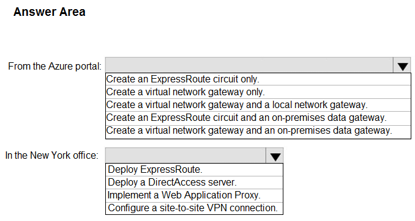

**Correct Answer:** 

_Explanation:_
Box 1: Create a virtual network gateway and a local network gateway.
Azure VPN gateway. The VPN gateway service enables you to connect the VNet to the on-premises network through a VPN appliance. For more information, see
Connect an on-premises network to a Microsoft Azure virtual network. The VPN gateway includes the following elements:
✑ Virtual network gateway. A resource that provides a virtual VPN appliance for the VNet. It is responsible for routing traffic from the on-premises network to the
VNet.
✑ Local network gateway. An abstraction of the on-premises VPN appliance. Network traffic from the cloud application to the on-premises network is routed through this gateway.
✑ Connection. The connection has properties that specify the connection type (IPSec) and the key shared with the on-premises VPN appliance to encrypt traffic.
✑ Gateway subnet. The virtual network gateway is held in its own subnet, which is subject to various requirements, described in the Recommendations section below.
Box 2: Configure a site-to-site VPN connection
On premises create a site-to-site connection for the virtual network gateway and the local network gateway.
Scenario: Connect the New York office to VNet1 over the Internet by using an encrypted connection.
Incorrect Answers:
Azure ExpressRoute: Established between your network and Azure, through an ExpressRoute partner. This connection is private. Traffic does not go over the internet.
Reference:
https://docs.microsoft.com/en-us/azure/architecture/reference-architectures/hybrid-networking/vpn

---

### Question 600: Question #1 Topic 14

Introductory Info
Case study -
This is a case study. Case studies are not timed separately. You can use as much exam time as you would like to complete each case. However, there may be additional case studies and sections on this exam. You must manage your time to ensure that you are able to complete all questions included on this exam in the time provided.
To answer the questions included in a case study, you will need to reference information that is provided in the case study. Case studies might contain exhibits and other resources that provide more information about the scenario that is described in the case study. Each question is independent of the other questions in this case study.
At the end of this case study, a review screen will appear. This screen allows you to review your answers and to make changes before you move to the next section of the exam. After you begin a new section, you cannot return to this section.
To start the case study -
To display the first question in this case study, click the Next button. Use the buttons in the left pane to explore the content of the case study before you answer the questions. Clicking these buttons displays information such as business requirements, existing environment, and problem statements. If the case study has an All Information tab, note that the information displayed is identical to the information displayed on the subsequent tabs. When you are ready to answer a question, click the Question button to return to the question.
Overview -
Contoso, Ltd. is a manufacturing company that has offices worldwide. Contoso works with partner organizations to bring products to market.
Contoso products are manufactured by using blueprint files that the company authors and maintains.
Existing Environment -
Currently, Contoso uses multiple types of servers for business operations, including the following:
File servers
Domain controllers
Microsoft SQL Server servers
Your network contains an Active Directory forest named contoso.com. All servers and client computers are joined to Active Directory.
You have a public-facing application named App1. App1 is comprised of the following three tiers:
A SQL database
A web front end
A processing middle tier -

Each tier is comprised of five virtual machines. Users access the web front end by using HTTPS only.
Requirements -
Planned Changes -
Contoso plans to implement the following changes to the infrastructure:
Move all the tiers of App1 to Azure.
Move the existing product blueprint files to Azure Blob storage.
Create a hybrid directory to support an upcoming Microsoft 365 migration project.
Technical Requirements -
Contoso must meet the following technical requirements:
Move all the virtual machines for App1 to Azure.
Minimize the number of open ports between the App1 tiers.
Ensure that all the virtual machines for App1 are protected by backups.
Copy the blueprint files to Azure over the Internet.
Ensure that the blueprint files are stored in the archive storage tier.
Ensure that partner access to the blueprint files is secured and temporary.
Prevent user passwords or hashes of passwords from being stored in Azure.
Use unmanaged standard storage for the hard disks of the virtual machines.
Ensure that when users join devices to Azure Active Directory (Azure AD), the users use a mobile phone to verify their identity.
Minimize administrative effort whenever possible.
User Requirements -
Contoso identifies the following requirements for users:
Ensure that only users who are part of a group named Pilot can join devices to Azure AD.
Designate a new user named Admin1 as the service admin for the Azure subscription.
Admin1 must receive email alerts regarding service outages.
Ensure that a new user named User3 can create network objects for the Azure subscription.
Question
HOTSPOT -
You need to recommend a solution for App1. The solution must meet the technical requirements.
What should you include in the recommendation? To answer, select the appropriate options in the answer area.
NOTE: Each correct selection is worth one point.
Hot Area:
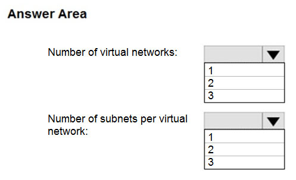

**Correct Answer:** 

_Explanation:_
This reference architecture shows how to deploy VMs and a virtual network configured for an N-tier application, using SQL Server on Windows for the data tier.
Scenario: You have a public-facing application named App1. App1 is comprised of the following three tiers:
✑ A SQL database
✑ A web front end
✑ A processing middle tier
Each tier is comprised of five virtual machines. Users access the web front end by using HTTPS only.
Technical requirements include:
✑ Move all the virtual machines for App1 to Azure.
✑ Minimize the number of open ports between the App1 tiers.
Reference:
https://docs.microsoft.com/en-us/azure/architecture/reference-architectures/n-tier/n-tier-sql-server

---

### Question 601: Question #2 Topic 14

Introductory Info
Case study -
This is a case study. Case studies are not timed separately. You can use as much exam time as you would like to complete each case. However, there may be additional case studies and sections on this exam. You must manage your time to ensure that you are able to complete all questions included on this exam in the time provided.
To answer the questions included in a case study, you will need to reference information that is provided in the case study. Case studies might contain exhibits and other resources that provide more information about the scenario that is described in the case study. Each question is independent of the other questions in this case study.
At the end of this case study, a review screen will appear. This screen allows you to review your answers and to make changes before you move to the next section of the exam. After you begin a new section, you cannot return to this section.
To start the case study -
To display the first question in this case study, click the Next button. Use the buttons in the left pane to explore the content of the case study before you answer the questions. Clicking these buttons displays information such as business requirements, existing environment, and problem statements. If the case study has an All Information tab, note that the information displayed is identical to the information displayed on the subsequent tabs. When you are ready to answer a question, click the Question button to return to the question.
Overview -
Contoso, Ltd. is a manufacturing company that has offices worldwide. Contoso works with partner organizations to bring products to market.
Contoso products are manufactured by using blueprint files that the company authors and maintains.
Existing Environment -
Currently, Contoso uses multiple types of servers for business operations, including the following:
File servers
Domain controllers
Microsoft SQL Server servers
Your network contains an Active Directory forest named contoso.com. All servers and client computers are joined to Active Directory.
You have a public-facing application named App1. App1 is comprised of the following three tiers:
A SQL database
A web front end
A processing middle tier -

Each tier is comprised of five virtual machines. Users access the web front end by using HTTPS only.
Requirements -
Planned Changes -
Contoso plans to implement the following changes to the infrastructure:
Move all the tiers of App1 to Azure.
Move the existing product blueprint files to Azure Blob storage.
Create a hybrid directory to support an upcoming Microsoft 365 migration project.
Technical Requirements -
Contoso must meet the following technical requirements:
Move all the virtual machines for App1 to Azure.
Minimize the number of open ports between the App1 tiers.
Ensure that all the virtual machines for App1 are protected by backups.
Copy the blueprint files to Azure over the Internet.
Ensure that the blueprint files are stored in the archive storage tier.
Ensure that partner access to the blueprint files is secured and temporary.
Prevent user passwords or hashes of passwords from being stored in Azure.
Use unmanaged standard storage for the hard disks of the virtual machines.
Ensure that when users join devices to Azure Active Directory (Azure AD), the users use a mobile phone to verify their identity.
Minimize administrative effort whenever possible.
User Requirements -
Contoso identifies the following requirements for users:
Ensure that only users who are part of a group named Pilot can join devices to Azure AD.
Designate a new user named Admin1 as the service admin for the Azure subscription.
Admin1 must receive email alerts regarding service outages.
Ensure that a new user named User3 can create network objects for the Azure subscription.
Question
You are planning the move of App1 to Azure.
You create a network security group (NSG).
You need to recommend a solution to provide users with access to App1.
What should you recommend?

- A. Create an incoming security rule for port 443 from the Internet. Associate the NSG to the subnet that contains the web servers.
- B. Create an outgoing security rule for port 443 from the Internet. Associate the NSG to the subnet that contains the web servers.
- C. Create an incoming security rule for port 443 from the Internet. Associate the NSG to all the subnets.
- D. Create an outgoing security rule for port 443 from the Internet. Associate the NSG to all the subnets.

**Correct Answer:** A

---

### Question 602: Question #1 Topic 15

Introductory Info
Case study -
This is a case study. Case studies are not timed separately. You can use as much exam time as you would like to complete each case. However, there may be additional case studies and sections on this exam. You must manage your time to ensure that you are able to complete all questions included on this exam in the time provided.
To answer the questions included in a case study, you will need to reference information that is provided in the case study. Case studies might contain exhibits and other resources that provide more information about the scenario that is described in the case study. Each question is independent of the other questions in this case study.
At the end of this case study, a review screen will appear. This screen allows you to review your answers and to make changes before you move to the next section of the exam. After you begin a new section, you cannot return to this section.
To start the case study -
To display the first question in this case study, click the Next button. Use the buttons in the left pane to explore the content of the case study before you answer the questions. Clicking these buttons displays information such as business requirements, existing environment, and problem statements. If the case study has an All Information tab, note that the information displayed is identical to the information displayed on the subsequent tabs. When you are ready to answer a question, click the Question button to return to the question.
Overview -
General Overview -
Contoso, Ltd. is a consulting company that has a main office in Montreal and branch offices in Seattle and New York.
Environment -
Existing Environment -
Contoso has an Azure subscription named Sub1 that is linked to an Azure Active Directory (Azure AD) tenant. The network contains an on-premises Active
Directory domain that syncs to the Azure AD tenant.
The Azure AD tenant contains the users shown in the following table.

Sub1 contains two resource groups named RG1 and RG2 and the virtual networks shown in the following table.

User1 manages the resources in RG1. User4 manages the resources in RG2.
Sub1 contains virtual machines that run Windows Server 2019 as shown in the following table

No network security groups (NSGs) are associated to the network interfaces or the subnets.
Sub1 contains the storage accounts shown in the following table.

Requirements -
Planned Changes -
Contoso plans to implement the following changes:
Create a blob container named container1 and a file share named share1 that will use the Cool storage tier.
Create a storage account named storage5 and configure storage replication for the Blob service.
Create an NSG named NSG1 that will have the custom inbound security rules shown in the following table.

Associate NSG1 to the network interface of VM1.
Create an NSG named NSG2 that will have the custom outbound security rules shown in the following table.

Associate NSG2 to VNET1/Subnet2.
Technical Requirements -
Contoso must meet the following technical requirements:
Create container1 and share1.
Use the principle of least privilege.
Create an Azure AD security group named Group4.
Back up the Azure file shares and virtual machines by using Azure Backup.
Trigger an alert if VM1 or VM2 has less than 20 GB of free space on volume C.
Enable User1 to create Azure policy definitions and User2 to assign Azure policies to RG1.
Create an internal Basic Azure Load Balancer named LB1 and connect the load balancer to VNET1/Subnet1
Enable flow logging for IP traffic from VM5 and retain the flow logs for a period of eight months.
Whenever possible, grant Group4 Azure role-based access control (Azure RBAC) read-only permissions to the Azure file shares.
Question
HOTSPOT -
You implement the planned changes for NSG1 and NSG2.
For each of the following statements, select Yes if the statement is true. Otherwise, select No.
NOTE: Each correct selection is worth one point.
Hot Area:
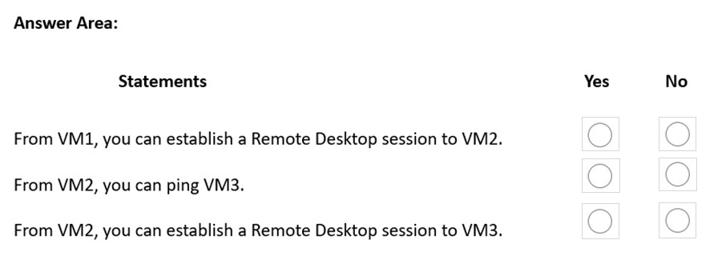

**Correct Answer:** 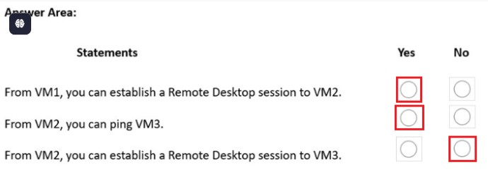

_Explanation:_
Box 1: No -
NSG2 blocks RDP to VM2 -
Box 2: Yes -
ICMP is not blocked -
Box 3: No -
NSG2 blocks RDP from VM2 -
Reference:
https://docs.microsoft.com/en-us/azure/virtual-network/network-security-group-how-it-works

---

### Question 603: Question #2 Topic 15

Introductory Info
Case study -
This is a case study. Case studies are not timed separately. You can use as much exam time as you would like to complete each case. However, there may be additional case studies and sections on this exam. You must manage your time to ensure that you are able to complete all questions included on this exam in the time provided.
To answer the questions included in a case study, you will need to reference information that is provided in the case study. Case studies might contain exhibits and other resources that provide more information about the scenario that is described in the case study. Each question is independent of the other questions in this case study.
At the end of this case study, a review screen will appear. This screen allows you to review your answers and to make changes before you move to the next section of the exam. After you begin a new section, you cannot return to this section.
To start the case study -
To display the first question in this case study, click the Next button. Use the buttons in the left pane to explore the content of the case study before you answer the questions. Clicking these buttons displays information such as business requirements, existing environment, and problem statements. If the case study has an All Information tab, note that the information displayed is identical to the information displayed on the subsequent tabs. When you are ready to answer a question, click the Question button to return to the question.
Overview -
General Overview -
Contoso, Ltd. is a consulting company that has a main office in Montreal and branch offices in Seattle and New York.
Environment -
Existing Environment -
Contoso has an Azure subscription named Sub1 that is linked to an Azure Active Directory (Azure AD) tenant. The network contains an on-premises Active
Directory domain that syncs to the Azure AD tenant.
The Azure AD tenant contains the users shown in the following table.

Sub1 contains two resource groups named RG1 and RG2 and the virtual networks shown in the following table.

User1 manages the resources in RG1. User4 manages the resources in RG2.
Sub1 contains virtual machines that run Windows Server 2019 as shown in the following table

No network security groups (NSGs) are associated to the network interfaces or the subnets.
Sub1 contains the storage accounts shown in the following table.

Requirements -
Planned Changes -
Contoso plans to implement the following changes:
Create a blob container named container1 and a file share named share1 that will use the Cool storage tier.
Create a storage account named storage5 and configure storage replication for the Blob service.
Create an NSG named NSG1 that will have the custom inbound security rules shown in the following table.

Associate NSG1 to the network interface of VM1.
Create an NSG named NSG2 that will have the custom outbound security rules shown in the following table.

Associate NSG2 to VNET1/Subnet2.
Technical Requirements -
Contoso must meet the following technical requirements:
Create container1 and share1.
Use the principle of least privilege.
Create an Azure AD security group named Group4.
Back up the Azure file shares and virtual machines by using Azure Backup.
Trigger an alert if VM1 or VM2 has less than 20 GB of free space on volume C.
Enable User1 to create Azure policy definitions and User2 to assign Azure policies to RG1.
Create an internal Basic Azure Load Balancer named LB1 and connect the load balancer to VNET1/Subnet1
Enable flow logging for IP traffic from VM5 and retain the flow logs for a period of eight months.
Whenever possible, grant Group4 Azure role-based access control (Azure RBAC) read-only permissions to the Azure file shares.
Question
You need to add VM1 and VM2 to the backend pool of LB1.
What should you do first?

- A. Connect VM2 to VNET1/Subnet1.
- B. Redeploy VM1 and VM2 to the same availability zone.
- C. Redeploy VM1 and VM2 to the same availability set.
- D. Create a new NSG and associate the NSG to VNET1/Subnet1.

**Correct Answer:** C

---

### Question 604: Question #3 Topic 15

You need to ensure that VM1 can communicate with VM4. The solution must minimize administrative effort.
What should you do?

- A. Create a user-defined route from VNET1 to VNET3.
- B. Create an NSG and associate the NSG to VM1 and VM4.
- C. Assign VM4 an IP address of 10.0.1.5/24.
- D. Establish peering between VNET1 and VNET3.

**Correct Answer:** D

---

### Question 605: Question #1 Topic 16

Introductory Info
Case study -
This is a case study. Case studies are not timed separately. You can use as much exam time as you would like to complete each case. However, there may be additional case studies and sections on this exam. You must manage your time to ensure that you are able to complete all questions included on this exam in the time provided.
To answer the questions included in a case study, you will need to reference information that is provided in the case study. Case studies might contain exhibits and other resources that provide more information about the scenario that is described in the case study. Each question is independent of the other questions in this case study.
At the end of this case study, a review screen will appear. This screen allows you to review your answers and to make changes before you move to the next section of the exam. After you begin a new section, you cannot return to this section.
To start the case study -
To display the first question in this case study, click the Next button. Use the buttons in the left pane to explore the content of the case study before you answer the questions. Clicking these buttons displays information such as business requirements, existing environment, and problem statements. If the case study has an All Information tab, note that the information displayed is identical to the information displayed on the subsequent tabs. When you are ready to answer a question, click the Question button to return to the question.
Overview -
Litware, Inc. is a consulting company that has a main office in Montreal and two branch offices in Seattle and New York.
The Montreal office has 2,000 employees. The Seattle office has 1,000 employees. The New York office has 200 employees.
All the resources used by Litware are hosted on-premises.
Litware creates a new Azure subscription. The Azure Active Directory (Azure AD) tenant uses a domain named litware.onmicrosoft.com. The tenant uses the
Premium P1 pricing tier.
Existing Environment -
The network contains an Active Directory forest named litware.com. All domain controllers are configured as DNS servers and host the litware.com DNS zone.
Litware has finance, human resources, sales, research, and information technology departments. Each department has an organizational unit (OU) that contains all the accounts of that respective department. All the user accounts have the department attribute set to their respective department. New users are added frequently.
Litware.com contains a user named User1.
All the offices connect by using private connections.
Litware has data centers in the Montreal and Seattle offices. Each office has a firewall that can be configured as a VPN device.
All infrastructure servers are virtualized. The virtualization environment contains the servers in the following table.
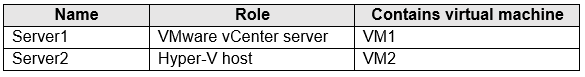
Litware uses two web applications named App1 and App2. Each instance on each web application requires 1 GB of memory.
The Azure subscription contains the resources in the following table.

The network security team implements several network security groups (NSGs)
Requirements -
Planned Changes -
Litware plans to implement the following changes:
Deploy Azure ExpressRoute to the Montreal office.
Migrate the virtual machines hosted on Server1 and Server2 to Azure.
Synchronize on-premises Active Directory to Azure Active Directory (Azure AD).
Migrate App1 and App2 to two Azure web apps named WebApp1 and WebApp2.
Technical Requirements -
Litware must meet the following technical requirements:
Ensure that WebApp1 can adjust the number of instances automatically based on the load and can scale up to five instances.

Ensure that VM3 can establish outbound connections over TCP port 8080 to the applications servers in the Montreal office.
Ensure that routing information is exchanged automatically between Azure and the routers in the Montreal office.
Enable Azure Multi-Factor Authentication (MFA) for the users in the finance department only.
Ensure that webapp2.azurewebsites.net can be accessed by using the name app2.litware.com.
Connect the New York office to VNet1 over the Internet by using an encrypted connection.
Create a workflow to send an email message when the settings of VM4 are modified.
Create a custom Azure role named Role1 that is based on the Reader role.
Minimize costs whenever possible.
Question
HOTSPOT -
You need to implement Role1.
Which command should you run before you create Role1? To answer, select the appropriate options in the answer area.
NOTE: Each correct selection is worth one point.
Hot Area:
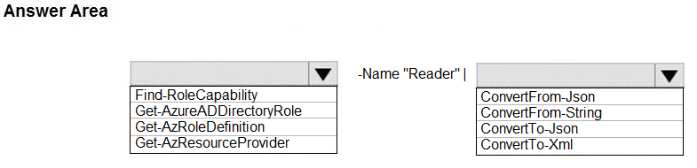

**Correct Answer:** 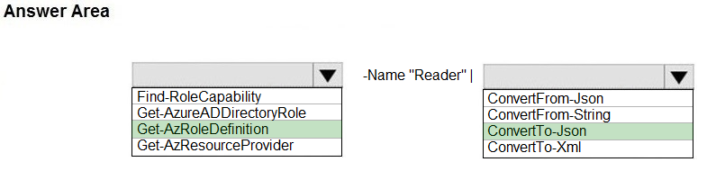

---

### Question 606: Question #2 Topic 16

Introductory Info
Case study -
This is a case study. Case studies are not timed separately. You can use as much exam time as you would like to complete each case. However, there may be additional case studies and sections on this exam. You must manage your time to ensure that you are able to complete all questions included on this exam in the time provided.
To answer the questions included in a case study, you will need to reference information that is provided in the case study. Case studies might contain exhibits and other resources that provide more information about the scenario that is described in the case study. Each question is independent of the other questions in this case study.
At the end of this case study, a review screen will appear. This screen allows you to review your answers and to make changes before you move to the next section of the exam. After you begin a new section, you cannot return to this section.
To start the case study -
To display the first question in this case study, click the Next button. Use the buttons in the left pane to explore the content of the case study before you answer the questions. Clicking these buttons displays information such as business requirements, existing environment, and problem statements. If the case study has an All Information tab, note that the information displayed is identical to the information displayed on the subsequent tabs. When you are ready to answer a question, click the Question button to return to the question.
Overview -
Litware, Inc. is a consulting company that has a main office in Montreal and two branch offices in Seattle and New York.
The Montreal office has 2,000 employees. The Seattle office has 1,000 employees. The New York office has 200 employees.
All the resources used by Litware are hosted on-premises.
Litware creates a new Azure subscription. The Azure Active Directory (Azure AD) tenant uses a domain named litware.onmicrosoft.com. The tenant uses the
Premium P1 pricing tier.
Existing Environment -
The network contains an Active Directory forest named litware.com. All domain controllers are configured as DNS servers and host the litware.com DNS zone.
Litware has finance, human resources, sales, research, and information technology departments. Each department has an organizational unit (OU) that contains all the accounts of that respective department. All the user accounts have the department attribute set to their respective department. New users are added frequently.
Litware.com contains a user named User1.
All the offices connect by using private connections.
Litware has data centers in the Montreal and Seattle offices. Each office has a firewall that can be configured as a VPN device.
All infrastructure servers are virtualized. The virtualization environment contains the servers in the following table.

Litware uses two web applications named App1 and App2. Each instance on each web application requires 1 GB of memory.
The Azure subscription contains the resources in the following table.

The network security team implements several network security groups (NSGs)
Requirements -
Planned Changes -
Litware plans to implement the following changes:
Deploy Azure ExpressRoute to the Montreal office.
Migrate the virtual machines hosted on Server1 and Server2 to Azure.
Synchronize on-premises Active Directory to Azure Active Directory (Azure AD).
Migrate App1 and App2 to two Azure web apps named WebApp1 and WebApp2.
Technical Requirements -
Litware must meet the following technical requirements:
Ensure that WebApp1 can adjust the number of instances automatically based on the load and can scale up to five instances.

Ensure that VM3 can establish outbound connections over TCP port 8080 to the applications servers in the Montreal office.
Ensure that routing information is exchanged automatically between Azure and the routers in the Montreal office.
Enable Azure Multi-Factor Authentication (MFA) for the users in the finance department only.
Ensure that webapp2.azurewebsites.net can be accessed by using the name app2.litware.com.
Connect the New York office to VNet1 over the Internet by using an encrypted connection.
Create a workflow to send an email message when the settings of VM4 are modified.
Create a custom Azure role named Role1 that is based on the Reader role.
Minimize costs whenever possible.
Question
You need to recommend a solution to automate the configuration for the finance department users. The solution must meet the technical requirements.
What should you include in the recommendation?

- A. Azure AD B2C
- B. dynamic groups and conditional access policies
- C. Azure AD Identity Protection
- D. an Azure logic app and the Microsoft Identity Management (MIM) client

**Correct Answer:** B

---

